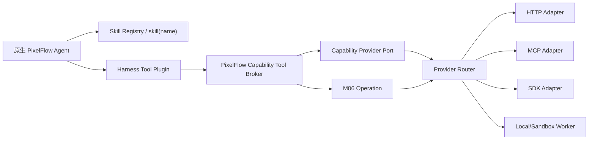
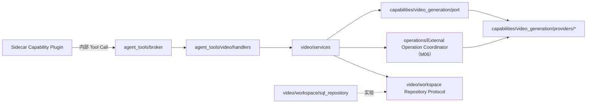

# PixelFlow 原生 Agent 接入 DeepSeek Harness Sidecar 实施方案

> 当前实现覆盖（2026-09-01）：本文早期方案中的图片/视频 Batch、Batch Child、M06
> Operation、Completion Callback 和 Operation Resume 生成编排已删除。当前唯一生成链路为
> `Harness Run → Tool Call → Gateway GenerationJob → Provider Job → Gateway Poll → Workspace 回写`。
> 以下历史章节仅用于追溯设计，不得据此恢复旧 Dispatcher、旧 Operation Repository 或旧恢复 Worker。

> 文档日期：2026-08-22
>
> 当前状态：设计候选，尚未开始编码、发布或生产切换
>
> 适用范围：第一阶段接管已经跑通的 VideoAgent V2，目标运行时可继续增加 PPT、Excel、联网搜索等原生 Agent 能力
>
> 接入方式：方案 B——DeepSeek Harness 作为独立内部 Sidecar 服务部署
>
> 发布原则：旧对话只读归档、运行中任务先排空、付费 Provider 不迁入 Sidecar；同一重构分支删除旧 VideoAgent、旧 LangGraph 任务流、DeerFlow 通用平台 API 和全部 LangChain/LangGraph/DeerFlow 运行依赖
>
> 术语说明：**External Operation Coordinator（外部异步任务协调器，历史代号 M06）** 是 PixelFlow 的外部任务可靠性模块，正式代码目录为 `backend/pixelflow/operations/`。后文简称“External Operation Coordinator（M06）”；`M06` 仅保留为历史实施里程碑、数据库/测试迁移记录的代称，不是第三方框架或业务概念。

## 1. 结论

本次改造不改变 V2 已验证的业务规则，不重写图片、视频、合并、QA、剪映等 Provider Service，也不把 External Operation Coordinator（M06）的 Operation、额度恢复、Workspace revision 或 Snapshot/SSE 迁入 Harness。前端需要同步重构模块边界：保留现有用户旅程和视觉资产，删除 Legacy 页面编排、浏览器 job 轮询和多份业务状态，统一消费 PixelFlow Snapshot/SSE。第一阶段虽然从视频切入，但 Sidecar 对外合同、内部 Engine Port 和前端 Runtime 必须保持通用，后续新增 PPT、Excel、联网搜索等能力时不再创建另一套 Harness 服务或工作台。

功能层只替换 V2 的 Agent 决策内核；工程层同时把业务合同从 `video_agent/agent_runtime/skills` 旧包迁到通用 Tool、领域 Service、控制面、Operation 和 Provider 分层，并删除 LangChain/LangGraph/DeerFlow 底座：

```text
当前：FastAPI -> NativeVideoAgentInvoker -> DeerFlow/LangChain/LangGraph -> VideoToolGateway

目标：FastAPI -> AgentRunBridge -> PixelFlow Agent Harness Sidecar -> Capability Tool Broker
```

当前 Engine 使用 DeepSeek Harness，负责：

1. 接收一次安全的 Agent Run 输入；
2. 调用 DeepSeek 模型；
3. 由同一个原生 PixelFlow Agent 自主加载 Skill、选择 Tool，并执行“观察 -> 决策 -> 工具 -> 观察”的 Agent loop；
4. 生成可回放的 Session/Run 事件；
5. 在等待人工确认、外部 Operation 或用户新输入时停止本轮运行。

PixelFlow 继续负责：

1. 用户、对话、Turn、各领域 Workspace 和 Artifact 的权威存储；
2. 工具参数二次校验、权限、费用、确认和 revision 乐观锁；
3. External Operation Coordinator（M06）的 Operation 幂等、start/poll lease、额度暂停、完成 Outbox 和崩溃恢复；
4. Provider Authorization 的瞬时使用与清理；
5. 对前端发布稳定的 Snapshot/SSE 业务事件；
6. 本地结构化用户偏好、品牌资料、火山引擎 Mem0 长期记忆、上下文预算和安全摘要。

Harness Session 日志是 Agent 决策轨迹，不是 PixelFlow 业务真相源。任何脚本、素材、分镜、PPT、表格分析、生成结果、确认和 Operation 状态都必须先写入 PixelFlow 权威 Repository，Sidecar 只能读取投影或通过 Tool Broker 请求变更。

PixelFlow 不实现固定 WorkflowCoordinator，不按 `VideoAgent/PptAgent/DataAnalysisAgent` 预编排步骤，也不由 Supervisor 决定工具顺序。领域差异由 Skill、Tool、Workspace 和 Capability Service 表达；模型在一个原生 Agent Session 内自主完成跨领域调用。External Operation Coordinator（M06）、Tool Broker、权限和 revision 只是副作用保护，不参与决定下一步业务动作。

## 2. 为什么采用独立 Sidecar

DeepSeek Harness 当前提供 JSON-RPC Runtime、Python SDK、插件化 Tool、Session 事件和 JSONL 持久化等能力，但官方仍将其标记为 developer preview，并明确会发生破坏性兼容变更。因此它必须被隔离在独立部署单元和稳定协议之后，不能让 `backend/pixelflow` 的领域层直接依赖 Cordis、DeepSeek Harness Session DTO 或内部事件类型。

方案 B 的收益：

- Harness 升级、重启和依赖冲突不影响 FastAPI Gateway；
- Sidecar 可以独立限流、扩容、回滚和观测；
- PixelFlow 只依赖自有 HTTP/SSE 合同，将来可以替换成 pi-agent-core；
- 新 Sidecar 可以按部署实例或入口流量灰度，但同一代码版本不再同时维护 LangChain 与 DeepSeek 两套 VideoAgent 内核；
- DeepSeek Harness 故障时通过停止新 Run、排查 Sidecar 或回滚到上一个完整发布版本处理，不在同一 Turn 热切旧内核；
- Sidecar 永远拿不到用户 Authorization、数据库连接和 Provider Client。

## 3. 改造目标与非目标

### 3.1 目标

- [ ] 用 DeepSeek Harness 执行 V2 原生 Agent loop；
- [ ] PixelFlow 后端只依赖稳定 `AgentHarnessPort` 和 Sidecar 网络合同；Sidecar 内部再通过 `AgentEngine` Port 隔离 DeepSeek Harness，未来替换 pi-agent-core 时主要改动 `services/pixelflow-agent-harness/`；
- [ ] 保持现有核心生成流程、`/agent` 主入口、Workspace 和用户交互语义；将前端 API 收敛为通用 Turn/Snapshot/SSE/Interrupt/Workspace Command 合同，将 PowerMem 专属状态替换为通用长期记忆状态并按 API 变更评审；
- [ ] 保持同一 Tool Registry、Pydantic 入参和业务 Tool 实现；
- [ ] 支持模型流式公开回复、工具进度、人工确认和异步 Operation 挂起；
- [ ] 支持 Sidecar 事件断点续传、重复 Run 幂等和进程重启恢复；
- [ ] 将前端改为单一 `AgentWorkspaceState`：业务状态只来自权威 Snapshot 和有序公开 SSE，右侧编辑只通过带 revision 的公共 Workspace Command 提交；
- [ ] 删除 `LegacyWorkspace`、旧 Supervisor/Task API、浏览器阶段 job 轮询、`pending*Job` 和 snake/camel 双业务字段，不把 Harness 私有类型暴露到浏览器；
- [ ] 一旦某个灰度范围被分配到新部署版本，其新视频 Run 只使用 `sidecar` 后端且不在同一 Turn 回退；阶段验收使用真实 Sidecar、真实 DeepSeek Harness/模型、真实 Tool Broker 和隔离测试数据，测试替身只补充故障注入，不在同一代码版本内保留 `langchain/deepseek_shadow` 双后端；
- [ ] 使用 DeepSeek Harness 原生 `$DSH_HOME/skills` 动态发现现有和新增 Skill，并为每个 Run 冻结版本、内容摘要和正文快照；
- [ ] 将 Sidecar 扩展严格拆为 Skill、内置 Harness Plugin 和 PixelFlow 自定义 Plugin，避免把 Python 业务 Service 重写进 TypeScript；
- [ ] 通过隔离实例和入口流量灰度，只接管新视频 Run；应用内不保留双 Harness 路由，只保留启动准入配置 `accept_new_runs` 和独立运行时准入状态；
- [ ] 在同一迁移分支完成 PixelFlow 自有配置、持久化、模型和用户上下文 Port 后，删除旧 VideoAgent、旧 LangGraph 任务 API、DeerFlow Run/Thread/Agent API、`backend/packages/harness/` 及全部 LangChain/LangGraph/DeerFlow 依赖。

### 3.2 非目标

- 不重写图片、PPT、视频分析的领域业务流程；删除这些 Router 对 PowerMem helper 的直接依赖，长期记忆统一走 `LongTermMemoryService`；
- 不把 Provider 轮询迁入 DeepSeek Harness background job；
- 不把用户 Authorization、Provider token 或数据库凭据发给 Sidecar；
- 不让 Sidecar 直接访问 PixelFlow 数据库、火山引擎 Mem0 或 content-app；
- 不开放 Bash、文件编辑、Web、MCP、子 Agent 或通用代码执行工具；
- 不使用静态 `skill-pack.yml` 或人工 `allowed_skills` 列表维护共享官方 Skill 目录；
- 不把 Harness 服务账号的 `$DSH_HOME/skills` 误当作 PixelFlow 最终用户私有 Skill 目录；用户/租户私有 Skill 后续必须使用按 scope 隔离的 Provider；
- 不把 DeepSeek Harness Web UI 作为 PixelFlow 用户工作台；
- 不在本阶段重做品牌视觉、设计系统或更换 React 技术栈；前端重点是状态、协议和模块边界，已验证的展示组件优先迁移复用；
- 不迁移旧对话和运行中 Plan；
- 不保留 `native_invoke.py`、`agent.py`、`tool_adapter.py`、`state.py` 和仅服务旧 VideoAgent 内核的 Middleware 作为兼容层；
- 不保留旧 LangGraph 任务 API、DeerFlow 通用 Run/Thread/Agent/Memory/Skill/MCP/Upload API 或 `langgraph.json` 兼容入口；
- 不保留 DeerFlow `AppConfig`、模型工厂、SQLAlchemy `Base`、数据库引擎、用户 Context、checkpointer、RunManager 或 StreamBridge；这些消费者必须在同一重构分支迁到 PixelFlow 自有实现后统一删除；
- 不再接入 PowerMem；长期用户记忆统一改为火山引擎 Mem0，但它只作为 PixelFlow `LongTermMemoryPort` 的 Provider Adapter，不成为 Harness Session、Skill 或 Plugin；
- 不使用 DeepSeek Harness Session 代替 `VideoWorkspace`、Operation 或 Agent Runtime Repository。

## 4. 当前基线与替换边界

### 4.1 当前全仓 LangChain/LangGraph/DeerFlow 耦合面

必须直接替换或删除的文件：

| 文件 | 当前职责 | 目标处理 |
| --- | --- | --- |
| `backend/pixelflow/video_agent/agent.py` | 装配模型、Prompt、LangChain Tool、Middleware、LangGraph State | 删除；原生 Agent loop 只存在于 Sidecar Engine |
| `backend/pixelflow/video_agent/tool_adapter.py` | `VideoToolSpec` 转 `StructuredTool` | 删除；由稳定 Tool Manifest 和 Sidecar Capability Plugin 取代 |
| `backend/pixelflow/video_agent/state.py` | DeerFlow `ThreadState` 扩展 | 删除；业务状态继续使用 Workspace/Run DTO |
| `backend/pixelflow/video_agent/middleware/` | Workspace、Plan、进度、确认、Loop 和 Tool Gateway Middleware | 删除仅服务旧 Agent loop 的实现；有业务价值的校验先迁到 RunBridge、Tool Broker 或 Sidecar Policy Plugin |
| `backend/pixelflow/video_agent/native_invoke.py` | 调图、流事件解析、确定性命令、failsafe、回复发布 | 删除；分别由框架无关 RunBridge、Event Mapper、Sidecar Client 和 Tool Broker 取代 |
| `backend/pixelflow/video_agent/prompts.py` | 旧 Agent system prompt 和 Tool 路由提示 | 将创作/选 Tool 规则迁入 Skill，将安全硬约束迁入 Policy 后删除原文件 |
| `backend/pixelflow/video_agent/events/native.py`、`events/publisher.py` | 旧 Native Invoker 的领域事件发布包装 | 由统一 `agent_harness/event_mapper.py` 接管后删除，前端稳定事件名不变 |
| `backend/pixelflow/video_agent/runner.py`、`entrypoint.py` | 直接 import `NativeVideoAgentInvoker` | 重写为只依赖 `AgentRunBridge/AgentHarnessPort`；完成后不得保留旧 import |
| `backend/pixelflow/video_agent/native_operation_resume.py` | 把 Operation 完成事件恢复到 Native Invoker | 将框架无关恢复合同合并到 `operation_resume.py` 后删除 |
| `backend/app/gateway/app.py` | 直接装配 LangChain Model 与 Native Invoker | 删除该装配，改为只装配 `AgentHarnessSidecarClient` |
| 旧内核专用测试 | 验证 LangChain Middleware、StructuredTool 和原生 stream 解析 | 删除或改写为稳定 Run/Event/Tool 合同测试，不保留“为了测试而保留”的旧依赖 |
| `backend/langgraph.json`、`pixelflow/graph.py`、`nodes.py`、`state.py` | 旧固定视频 Workflow、interrupt 和 LangGraph Server 注册 | 整体删除，不迁移到新 Harness；仍有价值的纯业务 Service/DTO 保留 |
| `app/gateway/routers/pixelflow_tasks.py` 的旧 task/run 路径 | `/agent/flows` 根任务创建、旧确认、旧 SSE 和资产投影 | 删除旧 task 执行入口；保留其他 v2 分段 Router 的具体 `/agent/flows/intake|planning|image|video|ppt` API |
| `web/src/lib/api.ts` 的 `createTask/getTask/getResult` 与 `LegacyWorkspace` 分支 | 当前前端对旧 `/agent/flows` 根任务 API 的消费者 | 删除调用和旧状态分支；新工作台只走 Conversation/AgentRunBridge 和权威 Workspace/Snapshot |
| `routers/runs.py`、`thread_runs.py`、`threads.py`、`agents.py`、`memory.py`、`skills.py`、`mcp.py`、`uploads.py`、`assistants_compat.py` | DeerFlow/LangGraph Platform 兼容 API | 全部取消注册并删除；不在 PixelFlow 重建一套通用 Agent 平台 |
| `app/gateway/deps.py`、`services.py` | checkpointer、RunManager、StreamBridge、Run/Event Store 和 lead agent factory | 用 PixelFlow Agent Runtime Repository、Sidecar Run/Event Client 替代后删除旧 runtime 装配 |
| `deerflow.models.create_chat_model` 的 intake、planning、scene package、QC、compaction、视频内部 LLM 消费者 | 确定性领域 Service 内部模型调用 | 迁到框架无关 `ChatModelPort` 和 OpenAI-compatible Provider Client，不通过 LangChain Message/Model |
| `deerflow.persistence.base/engine` 的 Agent Runtime、Preference、Task、Auth 消费者 | SQLAlchemy Base、engine、session factory、UserRow | 迁到 PixelFlow 自有 `persistence` 包，保持表名/迁移兼容后删除 DeerFlow persistence |
| `deerflow.config`、`runtime.user_context`、paths/utils | Gateway 配置、模型目录、用户隔离和路径规则 | 迁到 PixelFlow 自有 `config/auth_context/paths`，不保留 DeerFlow DTO |
| `backend/packages/harness/`、`backend/pyproject.toml`、lockfile | DeerFlow workspace package 及 LangChain/LangGraph 传递依赖 | 全仓引用清零后在同一分支删除 workspace member、源码目录、依赖和 lock 条目 |

这不是“先删包再看哪里报错”，而是同一分支内按依赖方向完成替换后一次性交付：

1. 先建立 PixelFlow 自有 Config、Persistence、ChatModel、AuthContext、Run/Event Port；
2. 迁移仍保留的 v2 Router、Agent Runtime、M06、Workspace、Preference、Mem0 和领域 LLM 调用；
3. 删除旧前端 `createTask` 消费者和全部旧 Gateway/Graph/DeerFlow API；
4. 删除 `backend/packages/harness/` 和根依赖，重建 lockfile；
5. 同一重构分支只有在全仓 `rg` 零引用、Gateway 可启动、数据库兼容和 Golden Journey 全绿后才允许合并。

### 4.2 保留业务语义，删除旧目录

以下旧路径不原样保留。应把已经验证的业务语义迁到新的分层目录，完成引用切换后删除整个 `backend/pixelflow/video_agent/`、`backend/pixelflow/agent_runtime/` 和 `backend/pixelflow/agent_workflows/` 物理目录；但不能把 Workspace、Repository、M06 或 Provider 错迁为 Harness Skill/Plugin。

| 当前模块 | 目标模块 | 处理方式 | 分层理由 |
| --- | --- | --- | --- |
| `video_agent/tools/registry.py` | `agent_tools/catalog.py`、`manifest.py` | 迁移通用 Tool 元数据、费用、确认、幂等和 JSON Schema，去掉 `VideoTool*` 命名后删除旧文件 | 这是 Tool 注册合同，类似 Controller mapping，不是 Skill |
| `video_agent/tool_gateway.py` | `agent_tools/broker.py`、`policy.py` | 迁移 owner、revision、确认、参数、幂等和安全结果校验后删除旧文件 | 这是 Tool 调用总入口/Filter，不应放 Sidecar Plugin 之外的业务逻辑 |
| `video_agent/tools/*.py` 的 Pydantic Input、公开摘要和 Tool 名称 | `agent_tools/video/contracts.py`、`handlers.py` | 迁移成框架无关 Tool DTO/Handler；旧目录全部删除 | 这是 Agent 可见 Tool 合同，Sidecar Plugin 只注册并远程调用它 |
| `video_agent/tools/*.py` 的脚本、场景包、分镜、交付业务逻辑 | `video/services/` | 从 Tool 壳中抽为业务 Service；Handler 只校验并委派 | 业务 Service 不能埋在 Skill 或 Harness Plugin 中 |
| `tools/script_skill_pipeline.py`、`seedance_polish.py` 的创作规则/Prompt | `$PIXELFLOW_AGENT_HOME/skills/.../SKILL.md` + `video/services/` | 纯创作指导迁 Skill；模型调用、Workspace 写回和幂等迁业务 Service/`ChatModelPort`，随后删除旧文件 | 只有“如何创作”的文本属于 Skill，执行代码不是 Skill |
| `tools/plan.py` | `agent_tools/video/contracts.py` + `agent_control_plane/plan_service.py` | 删除 `StructuredTool/VideoPlanMiddleware`；保留观察 Plan DTO/Repository 和 `update_plan` Tool Handler | Plan 是权威业务投影，不是 Harness 内部 Todo |
| `video_agent/workspace/` | `video/workspace/` | 原表、revision、Repository、digest 和 owner 语义迁移后删除旧目录 | 这是业务 Repository/聚合根，不能迁到 Harness |
| `video_agent/adapters/` | `video/adapters/operations/`、`capabilities/*/providers/` | M06 Operation 适配和 Provider 防腐逻辑按职责拆分，随后删除旧目录 | 类似 Application Adapter 与 Feign Client，不是 Plugin |
| `agent_runtime/jobs/` | `operations/` | 将 operation identity、lease、quota、recovery、completion Outbox 迁成通用外部任务模块，删除旧目录 | External Operation Coordinator（M06）是后端可靠性基础设施，不由模型调用，也不属于 Tool |
| `agent_runtime/persistence/`、`service.py`、上下文组件 | `agent_control_plane/persistence/`、`service.py`、`context/` | 保留 Turn、Snapshot/SSE、压缩队列和事务语义，改用 PixelFlow Base/Session 后删除旧目录 | 这是 Agent 控制面 Service/Repository，不属于 Harness Engine |
| `agent_workflows/video/planning.py`、`scene_packages.py` | `video/services/script_service.py`、`scene_package_service.py` | 迁移 Plan 权威快照、脚本/场景包校验和版本化语义后删除旧文件 | 这是视频业务用例，不是 Workflow Coordinator 或 Harness Skill |
| `agent_workflows/video/video_generation.py`、`postproduction.py`、`delivery.py` | `video/services/scene_service.py`、`inspection_service.py`、`delivery_service.py` + `video/adapters/operations/` | 迁移分镜生成、QA/后期、合并/剪映交付到领域 Service 和 M06 Adapter 后删除旧文件 | 外部副作用仍由 Capability Provider/M06 承担，不能保留为历史 Workflow 层 |
| `agent_workflows/video/__init__.py` 及隔离对照测试 | 新 `video/` 模块合同测试与 Golden Journey | 用新模块的合同、迁移和回归测试替代后删除 | 生产已隔离的历史候选不应继续作为可 import 的兼容层 |
| 现有 Provider Service | `capabilities/<capability>/providers/` | 按 image/video/ppt/search/edit 分类迁移；稳定 Port 不变，厂商 Adapter 可替换 | Provider 负责真实外部副作用，不能直接放入 Harness Plugin |
| `app/gateway/routers/pixelflow_ppt.py` 与 SmartPPT 调用 | `ppt/` + `capabilities/ppt_generation/`；Router 只保留 HTTP Controller | 大纲、页面、交付用例迁 `ppt/services/`；Agent Tool 上线时再增加 `agent_tools/ppt/` | `ppt/` 本身就是业务模块，不需要再套 `domains/` 分类目录 |
| `preferences/` 与 Mem0 | `preferences/`、`long_term_memory/` | 保留本地权威偏好和长期记忆 Provider，不迁入 Harness | 用户数据属于 PixelFlow 数据层 |
| 前端工作台 | `web/src/features/*` | 删除 Legacy Task/Graph 状态，改消费统一 Snapshot/SSE/Workspace revision | 前端不是 Skill/Tool/Plugin，必须继续只读业务投影 |
| `/agent` 业务 Router | `app/gateway/routers/` | 保留稳定业务 Controller，删除旧通用 DeerFlow/LangGraph Router | 用户 API 与 Sidecar Tool callback 是两种不同入口 |

最终旧路径删除门禁：

```text
backend/pixelflow/video_agent/      -> 不存在
backend/pixelflow/agent_runtime/    -> 不存在
backend/pixelflow/agent_workflows/  -> 不存在
```

保留的是数据库表、DTO 语义、业务规则、幂等身份和测试证据，不是旧 Python 包名。

### 4.3 Skill、Tool 与 Plugin 的判定规则

迁移前必须先按职责分类，禁止根据现有目录名里的 `skill` 字样机械迁移：

| 判定问题 | 目标形态 | Java 类比 | 示例 |
| --- | --- | --- | --- |
| 只描述“如何判断、如何创作、如何检查”，没有数据库/API/副作用 | DeepSeek Harness `SKILL.md` | 规则文件、模板、策略说明 | Seedance 镜头规则、剧本写作规范、视频 QC 标准 |
| 执行 API、读写 Workspace、创建 Operation、上传或合并产物 | PixelFlow Python Tool/Service，保持不动 | Application Service / Client | `generate_scenes`、`compose_or_export_video`、Borgrise/Jianying/FFmpeg Skill 类 |
| 把稳定 Tool Manifest 暴露给 Harness 模型 | Sidecar Tool Plugin | Feign Client Adapter / SPI Adapter | `pixelflow-capability-tools` |
| 拦截 Agent step、限制工具、处理挂起、注入上下文或映射事件 | Sidecar Policy/Event Plugin | Filter / Interceptor | suspension、loop limit、event bridge |
| 提供本地、远程或动态 Skill 目录 | Harness 内置 Skill Provider；只有出现新来源时才写自定义 Provider Plugin | Repository SPI | P0 使用 `dsh-skill-filesystem`，不自研远程 Provider |

安全、权限、确认、费用、幂等、revision 和数据脱敏不能只写在 `SKILL.md` 中，必须由 PixelFlow Tool Broker 或 Sidecar Policy Plugin 代码强制执行。Skill 只能改善模型决策，不能成为安全边界。

## 5. 目标架构

```mermaid
flowchart LR
    USER["用户与前端"] --> GW["PixelFlow FastAPI Gateway"]
    GW --> RT["AgentRuntimeService\nTurn / Snapshot / SSE"]
    RT --> BRIDGE["AgentRunBridge\n只管理 Run 与事件"]
    BRIDGE --> PORT["AgentHarnessPort"]
    PORT --> CLIENT["AgentHarnessSidecarClient"]
    CLIENT -->|"内部 HTTP + SSE"| SIDE["pixelflow-agent-harness Sidecar"]
    SIDE --> ENGINE["AgentEngine Port"]
    ENGINE --> SDK["DeepSeek Harness Engine"]
    SDK --> PLUGIN["PixelFlow Capability Tool Plugin"]
    PLUGIN -->|"服务身份 + Tool Call"| BROKER["/agent/internal/agent-tools/calls"]
    BROKER --> GATE["Capability Tool Gateway"]
    GATE --> WS["Video/PPT/Spreadsheet Workspace Repository"]
    GATE --> EOC["External Operation Coordinator（M06）"]
    EOC --> PROVIDER["图片/视频/PPT/搜索/剪辑 Provider 或 Worker"]
    SIDE --> EVENTS["Sidecar Run Event Store"]
    EVENTS -->|"断点事件流"| BRIDGE
    BRIDGE --> RT
```



### 5.1 部署拓扑

`pixelflow-agent-harness` 是独立内部 Sidecar 服务，不和 Gateway 运行在同一进程，也不要求与 Gateway 位于同一个 Pod。初期使用单实例加持久卷进行灰度；达到全量门禁前必须补充多实例租约或完成单实例故障恢复演练。

Sidecar 容器内部包含：

1. 一个只暴露内部 HTTP/SSE 的 Sidecar API；
2. 稳定的 `AgentEngine` Port 和当前 DeepSeek Harness Engine Adapter；
3. 固定版本且完全匹配的 DeepSeek Harness SDK/Runtime；
4. 遵循 Harness 原生 Profile/Bundle/Preset 结构的 Cordis composition；
5. PixelFlow Capability Tool Plugin；
6. Sidecar Run/Event Repository；
7. DeepSeek Harness Session 日志目录。

推荐使用 Python API 外壳驱动官方 JSON-RPC Runtime。自定义 Cordis Tool Plugin 使用 TypeScript 构建并随 Sidecar 镜像交付。Sidecar 外部协议由 PixelFlow 自己定义，不直接暴露 DeepSeek Harness JSON-RPC、Cordis Event、Preset 路径或 Session DTO。未来接入 pi-agent-core 时实现新的 Engine Adapter，PixelFlow Gateway、Tool Broker、Workspace、M06 和 Provider 不随之重写。

## 6. 核心架构决策

### 6.1 每个触发事件创建独立 Harness Session

沿用当前 `NativeVideoAgentInvoker` 的隔离原则：每个用户 Turn 或 Operation 完成事件创建独立 Harness Session，同一 Session 内允许多轮模型/工具循环，但不同 PixelFlow Turn 不共享 Harness 对话状态。

```text
用户 Turn            -> 一个 Harness Session / Run
人工确认恢复         -> 一个新的 Harness Session / Run
Operation 完成事件   -> 一个新的 Harness Session / Run
额度恢复动作         -> 一个新的 Harness Session / Run
```

这样可以避免：

- DeepSeek Harness 历史与 PixelFlow Conversation 历史形成双真相源；
- 旧 Session 的 Checkpoint 污染新 Turn；
- DeepSeek Harness 内置压缩与 PixelFlow 统一上下文预算互相覆盖；
- Sidecar Session 丢失导致业务状态无法恢复。

每次 Run 的模型上下文由 PixelFlow `ContextBudgetPolicyProvider` 和 Context Assembler 重新组装，至少包含：

- 当前用户请求或安全内部恢复指令；
- 当前 `VideoWorkspace` 的安全投影与 revision；
- 当前 Plan/Confirmation/Operation 摘要；
- 最近消息与权威压缩摘要；
- 本地 `UserPreferenceStore` 的结构化偏好与负向规则；
- 当前对话或用户范围内已确认的品牌/产品 Profile；
- 火山引擎 Mem0 返回并经 PixelFlow 清洗、去重和预算裁剪的长期记忆摘要；
- 当前允许的 Tool Manifest 版本；
- 输出预算、Loop 上限和公开进度策略。

### 6.2 不使用 Harness background job 承载 Provider

DeepSeek Harness 支持 background job，但 PixelFlow 不使用它承载图片、视频、合并、QA 或剪映任务。原因是 External Operation Coordinator（M06）已经提供成熟的业务幂等、租约、额度暂停、完成 Outbox 和恢复机制。

工具启动外部任务时只返回：

```json
{
  "status": "pending_operation",
  "operation_job_id": "operation-...",
  "public_summary": "已启动分镜视频生成"
}
```

Sidecar 的 suspension policy 看到 `pending_operation` 后必须关闭本轮 Agent Run，禁止模型继续启动其他付费任务。External Operation Coordinator（M06）完成事件到达后，PixelFlow 使用 `completion_event_id` 创建新的恢复 Run，并注入最新 Workspace 结果。

因此，视频生成的分钟级等待时间不计入 Sidecar `deadline_seconds`：`generate_video` Tool 只负责校验、创建或回读 External Operation Coordinator（M06）的 Operation、返回 `pending_operation`，通常应在秒级完成；External Operation Coordinator（M06）Worker 在 Sidecar 之外按 Provider 轮询策略持续查询。完成、失败、额度暂停或超时后，External Operation Coordinator（M06）以持久化事件创建新的短 Agent Run，让模型基于最新 Workspace 决定审片、修订、重生成或交付。

“导演式多步决策”也不等于在一个 Run 中连续启动多个计费批次。单个 Run 可以使用多个只读、规划和编辑 Tool，并启动一个计费批次 Tool Call；视频批次可包含多个 `scene × variant` 子 Operation。批次终态后才由一个新的 `operation_resume` Run 决定是否发起下一批。这样既支持一键并发生成多个镜头，又避免模型循环无限叠加批次和费用。

### 6.3 确认权仍归 PixelFlow

Tool Broker 在以下情况返回 `awaiting_confirmation`：

- 计费 Tool；
- 删除或覆盖权威素材；
- 最终交付；
- 现有业务规则要求用户确认的脚本、场景包或视频结果。

Sidecar 收到结果后立即挂起，不创建 Provider Operation。用户继续调用现有 `/agent` 确认 API；确认状态落库后由 PixelFlow 创建新的恢复 Run。Sidecar 不保存人工确认的权威状态。

### 6.4 Authorization 只留在 PixelFlow

用户 Authorization 不得进入：

- Sidecar 请求；
- Harness Session 日志；
- Tool 参数；
- Sidecar 环境变量；
- Sidecar Run/Event 数据库。

首个用户 Turn 在 PixelFlow 内创建短生命周期的 `credential_lease_id`，只保存于进程内或受控临时凭据存储，Sidecar 只知道 `run_id`。Tool Broker 根据 `run_id` 回查凭据租约；租约不存在时，计费 Tool 返回 `authorization_required`，由前端要求用户显式继续。不得为恢复方便持久化用户 token。

### 6.5 模型路由必须显式映射

当前 dev/prod profile 的逻辑模型名、实际供应商模型名和 OpenAI 兼容端点并不天然相同，Sidecar 不能照搬 DeepSeek Harness 示例中的 `deepseek-official/deepseek-v4-flash`，也不能取 PixelFlow `models` 列表第一项作为视频模型。

落地时新增显式 `video_agent_model_profile`，例如逻辑名 `deepseek-v4-pro`。PixelFlow 负责验证该档案的上下文窗口、有效期和摘要；Sidecar 在本地只配置一个与该档案对应的 Provider route、实际模型 ID、base URL 和 Secret。两端 profile digest 不一致时 readiness 失败。模型 API key 只存在于 Sidecar Secret，不通过 Run DTO 传递。

### 6.6 原生单 Agent，不使用固定 Workflow

Sidecar 只创建一个逻辑上的 `pixelflow-agent`。视频、图片、PPT、Excel、联网搜索等能力不拆成由 PixelFlow Supervisor 路由的多个领域 Agent，也不使用 WorkflowCoordinator 规定执行顺序。

例如“分析 Excel、搜索行业趋势并生成 PPT”必须由同一个 Agent 在运行时自主完成：

```text
skill(spreadsheet-analysis) -> inspect_workbook -> read_table_range
skill(web-research) -> search_web -> fetch_web_page
skill(ppt-creation) -> create_ppt_workspace -> update_ppt_outline -> export_pptx
```

以上只是可能产生的轨迹，不是预定义流程。Agent 可以改变顺序、补充澄清、跳过不需要的能力或根据 Tool Observation 修正调用。Tool 可以拒绝不满足前置状态的请求，并返回稳定 Observation；它不得替 Agent 自动调用下一工具。

`AgentRunBridge` 只负责 Run 启动、取消、事件断点、挂起和恢复触发，不选择 Tool。M06 只保证已选定的付费副作用幂等执行；外部 Job 完成后，PixelFlow 把完成事件和最新 Workspace 投影交回 Agent，由模型决定下一步。

### 6.7 Harness Engine 可替换边界

Sidecar 内部定义框架无关 `AgentEngine`：

```text
create_run(request) -> handle
stream_events(run_id) -> stable events
cancel_run(run_id)
discover_skills() -> catalog snapshot
register_tools(capability_manifest)
```

确认、Operation、额度和故障恢复都不是恢复原 Harness Session，而是由 PixelFlow 持久化一个新的 trigger，再调用 `create_run(request)` 创建新 Run。DeepSeek Harness 的中断 Turn 只能安全收口，不能从 checkpoint 续跑；因此 Sidecar/Engine 崩溃后必须创建关联原 Run 的 `run_recovery`，避免调用方误把“新恢复 Run”和“原 Run 续跑”混为一谈。

DeepSeek Harness 实现位于 `engines/deepseek/`，负责 JSON-RPC、Cordis Plugin、Session Event、Skill Registry 和稳定事件映射。未来 pi-agent-core 实现位于 `engines/pi_agent_core/`；替换只接管新 Run，已经运行中的 DeepSeek Session 不热迁移。Sidecar 外部 `RunRequest/RunEvent/ToolCall/ToolObservation` 协议不得引用任何 Engine 私有类型。

共享 Skill 根使用 PixelFlow 可移植子集：`name`、`description`、Markdown 正文、`metadata.pixelflow.version`、`disable-model-invocation` 和 `user-invocable`。DeepSeek Adapter 直接映射到原生字段；未来 pi-agent-core Adapter 读取同一目录并转换为其 Skill/Prompt 机制。不得把 Cordis Plugin 名称、DeepSeek Session ID 或 Engine 私有工具协议写进 Skill 正文合同，否则更换 Harness 就不再局限于 Sidecar。

### 6.8 新能力与 Provider 扩展合同

后续新增 PPT、Excel、联网搜索等能力时，不新增固定 Workflow 或领域 Agent Preset。管理员新增对应 Skill，PixelFlow 注册稳定 Capability Tool，同一个 `pixelflow-agent` 自主组合调用：

| 能力 | Skill 示例 | Tool 示例 | 真实执行层 |
| --- | --- | --- | --- |
| PPT | `ppt-creation` | `create_ppt_workspace/update_ppt_outline/export_pptx` | 现有 SmartPPT Service 或新的 `PptGenerationProvider` |
| Excel | `spreadsheet-analysis` | `inspect_workbook/read_table_range/generate_chart` | 隔离 Spreadsheet Worker，禁止宏、外链刷新和任意代码 |
| 联网搜索 | `web-research` | `search_web/fetch_web_page` | 受控 `WebResearchProvider`，实施 SSRF、正文大小和 Prompt Injection 防护 |
| 图片/视频 | `image-generation/video-generation` | `generate_image/generate_video` | content-app 或其他厂商 Provider Adapter，付费异步任务继续经 M06 |

Harness Tool 表达稳定业务动作，不按厂商命名。更换 Borgrise、content-app 下游或剪辑厂商时，新增/替换 Provider Adapter 并更新能力档案；业务语义不变时不修改 Harness Tool。HTTP、SDK、MCP 都只是 Provider Adapter 可选的传输实现：MCP 不自动提供用户确认、计费幂等、Workspace revision、Job 租约、402 恢复或安全摘要，付费异步能力仍必须经过 Tool Broker 和 M06。

Provider Client 负责供应商请求/鉴权/模型名/状态/结果 DTO 的防腐映射；M06 负责 operation 身份、start/poll lease、崩溃恢复和完成 Outbox；Tool Broker 负责 owner、确认、权限、参数和 revision。任何一层都不得替 Agent 决定下一业务 Tool。

### 6.9 Skill、Plugin 与 Provider 三层设计

三者解决不同问题，不能因为都属于“扩展能力”而混在同一层：

| 概念 | 回答的问题 | Java 类比 | 是否允许业务副作用 | 更换时影响范围 |
| --- | --- | --- | --- | --- |
| Skill | Agent 应该如何判断、创作和检查 | 规则文件/模板/知识包 | 否 | 修改 Skill 本身，新 Run 生效 |
| Harness Plugin | Engine 如何注册 Tool、拦截 step、注入上下文和转换事件 | Spring Starter、Filter、SPI Adapter | 只允许调用 Tool Broker，不直接产生领域副作用 | 更换 Harness 时在 Sidecar Engine 内重写 |
| Business Provider Port/Adapter | 稳定业务动作如何落到具体 API、SDK、MCP 或本地 Worker | interface + Feign Client/防腐层 | 是，但必须受 Tool Broker/M06 管理 | 更换厂商时只新增/替换 Adapter |

完整调用关系：



#### 两种 Provider 必须区分

DeepSeek Harness 的 `SkillProvider` 是“Skill 目录 Repository SPI”，负责 `list/get` Skill；当前共享管理员 Skill 使用官方 filesystem Provider，未来用户/租户私有 Skill 才新增 scoped SkillProvider Plugin。

PixelFlow 的 Business Provider 是“外部能力 Client SPI”，例如 `ImageGenerationProvider`、`VideoGenerationProvider`、`PptGenerationProvider`、`WebResearchProvider`。两者名字相同但不属于同一平面：SkillProvider 在 Sidecar Engine 内，Business Provider 在 PixelFlow 后端或隔离 Worker 内。

#### Skill 设计规则

- 只承载方法、领域知识、提示规范、检查清单和 Tool 选择建议；
- 可以引用稳定 Tool 名，不能出现供应商密钥、URL、数据库身份或 Harness 私有协议；
- 不能把“无需确认直接生成”“忽略 revision”等文字当作权限；代码安全规则永远优先；
- 按业务语义命名，普通升级更新同名正文并记录 version/SHA；只有能力需要并存时才新增名称；
- 内容必须能被未来 Engine Adapter 转换，禁止依赖 Cordis 行、DeepSeek Session 或 pi-agent-core 私有对象。

#### Plugin 设计规则

- `pixelflow-capability-tools` 从稳定 Capability Manifest 注册模型 Tool，统一回调 Tool Broker；
- `pixelflow-run-policy` 限制 step/tool、处理 pending/confirmation/authorization 挂起；
- `pixelflow-context-policy` 注入安全投影、预算和 Run 级 Skill 快照；
- `pixelflow-event-bridge` 把 Engine 事件转换为稳定 Sidecar Event；
- Plugin 不持有用户 Authorization、Provider API key、数据库连接，不直接调用 content-app 或厂商；
- Plugin 注册必须是可释放 effect，卸载后不能残留 Tool、监听器、定时器和 HTTP 请求。

#### Business Provider 设计规则

稳定 Port 使用 PixelFlow DTO，不暴露供应商字段：

```text
ImageGenerationProvider.generate(request) -> ImageGenerationResult
VideoGenerationProvider.start(request) -> ProviderJobRef
VideoGenerationProvider.status(job_ref) -> ProviderJobSnapshot
WebResearchProvider.search(request) -> SearchResult
PptGenerationProvider.render(request) -> ProviderJobRef/ArtifactRef
```

Adapter 负责鉴权单次透传、供应商字段/模型名称转换、HTTP/SDK/MCP 调用、连接超时和稳定 DTO/六态映射；它不负责业务级 exactly-once。M06 负责稳定 operation 身份、start/poll lease、恢复和完成 Outbox。Provider Router 根据已确认 creation contract/能力档案选择 Adapter，同一 operation attempt 不得中途切换 Provider；切换厂商必须创建新 attempt 或显式新 stage version，并让 request hash 包含 `provider_id + provider_profile_version`。

换 Borgrise 为其他厂商、HTTP 改 MCP 或 SDK 时，只要 `generate_image/generate_video` 业务语义不变，就保持 Skill、Harness Tool 和 Workspace 合同不变，只新增 Adapter 和能力档案。只有出现用户可感知的新动作，例如数字人口型驱动或视频局部重绘，才新增 Tool 与对应 Skill 指导。

## 7. 仓库目录设计

### 7.1 PixelFlow 后端

```text
backend/pixelflow/agent_harness/
  __init__.py
  contracts.py              # 框架无关 Run、Event、Tool Observation DTO
  port.py                   # AgentHarnessPort
  run_bridge.py             # Run 启动、事件桥接、挂起和终态收口；不决定 Tool 顺序
  context_builder.py        # 构造每 Run 的安全上下文
  sidecar_client.py         # 通用 Sidecar HTTP/SSE Client
  event_mapper.py           # Sidecar Event -> PixelFlow agent.* Event
  errors.py                 # 固定安全错误码

backend/pixelflow/platform/
  config/
    models.py               # PixelFlow 自有配置 DTO，不继承 DeerFlow AppConfig
    loader.py               # dev/prod profile 加载、校验和安全热加载边界
  persistence/
    base.py                 # PixelFlow SQLAlchemy Base
    engine.py               # engine、session factory 和生命周期
    migrations.py           # 既有表兼容检查与迁移入口
  auth_context.py           # 用户/租户 ContextVar 和 owner 解析
  paths.py                  # PixelFlow 数据根、Skill 根和临时目录合同

backend/pixelflow/llm/
  contracts.py              # 框架无关 Message、Request、Response、Usage DTO
  port.py                   # ChatModelPort
  router.py                 # 逻辑模型档案到 Provider Client 的显式路由
  providers/
    openai_compatible.py    # httpx/OpenAI-compatible Client，不返回 LangChain Message
  safety.py                 # 超时、输出解析、错误清洗和 token 预算

backend/app/gateway/routers/internal/
  __init__.py
  agent_tools.py             # Sidecar 内部 RPC Controller：manifest 与 Tool Call

backend/pixelflow/agent_tools/
  contracts.py              # Tool Call/Result DTO
  auth.py                   # Sidecar 服务身份校验
  broker.py                 # owner、revision、幂等与领域 Gateway 调用
  policy.py                 # 费用、确认、Tool 可见性和安全结果策略
  manifest.py               # 图片/视频/PPT/Excel/搜索等 Tool Manifest 生成与校验
  catalog.py                # 框架无关 Tool Registry
  video/
    contracts.py            # 视频 Tool Pydantic Input/Observation DTO
    handlers.py             # Tool Handler，只校验并调用视频 Application Service
  image/                    # 图片 Tool DTO/Handler；迁移图片 Agent 能力时创建
  ppt/                      # PPT Tool DTO/Handler；迁移 PPT 能力时创建
  spreadsheet/              # Excel/CSV Tool DTO/Handler；新增数据分析能力时创建
  web_research/             # 搜索/抓取 Tool DTO/Handler；通过受控 Provider 访问网络

backend/pixelflow/agent_control_plane/
  contracts.py              # Turn、Snapshot、Run、Artifact、Confirmation DTO
  service.py                # Turn 队列、RunBridge 调度、运行时准入、Snapshot/SSE 投影
  plan_service.py           # 观察 Plan 与权威步骤状态
  context/
    assembler.py            # 消息、Workspace、偏好、Mem0 与预算组装
    compaction.py           # 框架无关上下文压缩
  persistence/
    models.py               # 使用 PixelFlow Base 的控制面 ORM
    repositories.py         # Turn/Snapshot/Outbox/压缩队列 Repository

backend/pixelflow/operations/ # External Operation Coordinator（外部异步任务协调器，历史代号 M06）
  identity.py               # External Operation Coordinator（M06）的 operation 身份与规范摘要
  coordinator.py            # start/poll 事务协调
  leases.py                 # start/poll/completion lease
  quota.py                  # 402 暂停与恢复
  recovery.py               # 崩溃恢复 Worker
  completion.py             # 终态与完成 Outbox
  providers.py              # ProviderJobAdapter 稳定六态合同

backend/pixelflow/video/
  contracts.py              # VideoWorkspace、Plan、Scene、Artifact DTO
  workspace/
    models.py               # Workspace/Plan 聚合和值对象
    repository.py           # Repository Protocol
    memory_repository.py    # 内存实现
    sql_repository.py       # SQL 实现，使用 PixelFlow Base/Session
    digest.py               # 安全摘要和 Snapshot 读模型
    ids.py                  # 稳定业务身份
  services/
    script_service.py       # 脚本导入、生成、确认和版本
    scene_package_service.py
    scene_service.py
    delivery_service.py
    inspection_service.py
  adapters/
    operations/             # 视频领域到通用 M06 的 Adapter

backend/pixelflow/ppt/
  contracts.py              # PptWorkspace、Outline、Page、Artifact DTO
  workspace/
    repository.py           # PPT Repository Protocol
    memory_repository.py    # 内存实现
    sql_repository.py       # SQL 实现
  services/
    outline_service.py      # 大纲生成、确认和修订
    page_service.py         # 页面 JSON、页面图和单页重生
    delivery_service.py     # PPTX 生成和交付
  adapters/
    operations/             # PPT 领域到通用 M06/异步 Job 的 Adapter
backend/pixelflow/preferences/       # 本地结构化用户偏好 Repository，始终是字段级权威来源
backend/pixelflow/brand_profiles/    # 可选本地品牌/产品 Profile Repository；跨对话复用时再落表
backend/pixelflow/long_term_memory/
  contracts.py            # 长期记忆查询、写入、删除和安全投影 DTO
  port.py                 # LongTermMemoryPort，隔离具体记忆厂商
  service.py              # owner、预算、冲突合并、fail-open 和删除编排
  repository.py           # 写入 Outbox、外部 event_id/memory_id 与状态映射
  context_projection.py   # Mem0 结果清洗、去重、裁剪和不可信上下文标记
  providers/
    volcengine_mem0/
      client.py           # mem0ai MemoryClient 与任务状态 HTTP 防腐 Client
      adapter.py          # 火山响应映射为稳定 PixelFlow DTO
      config.py           # 连接地址和 Secret 引用；不得出现真实 API key
backend/pixelflow/capabilities/
  image_generation/
    port.py                 # 稳定 ImageGenerationProvider
    router.py               # 按能力档案选择 Provider Adapter
    providers/              # content-app/Ark/其他 HTTP、SDK 或 MCP Adapter
  video_generation/
    port.py                 # 稳定 VideoGenerationProvider start/status 合同
    router.py
    providers/
  video_edit/
    port.py                 # 合并、FFmpeg、剪映草稿等稳定编辑/交付合同
    router.py
    providers/              # Jianying/FFmpeg/其他剪辑 Adapter
  web_research/
    port.py                 # 稳定 WebResearchProvider
    providers/              # 受控 HTTP/MCP 搜索实现
  spreadsheet_analysis/
    port.py                 # Workbook DTO 与隔离 Worker 合同
    worker.py
  ppt_generation/
    port.py                 # SmartPPT/本地 PPTX Provider 合同
    providers/

backend/tests/
  test_agent_harness_contracts.py
  test_agent_run_bridge.py
  test_agent_harness_sidecar_client.py
  test_capability_tool_broker.py
  test_agent_harness_event_mapper.py
  test_agent_context_builder.py
  test_local_preference_projection.py
  test_long_term_memory_service.py
  test_volcengine_mem0_adapter.py
  test_pixelflow_platform_config.py
  test_pixelflow_persistence.py
  test_chat_model_port.py
  test_deerflow_dependency_absence.py
```

三层目录的关系固定为：

| 目录 | 方向 | Java 类比 | 可以依赖 | 禁止承担 |
| --- | --- | --- | --- | --- |
| `agent_tools/` | 北向入口：把 Agent Tool Call 转成业务用例调用 | Controller + 参数 DTO + Filter | `video/services`、`ppt/services`、`agent_control_plane`、Tool policy | 供应商 HTTP、SQL Repository 实现、模型 Prompt 大段正文 |
| `video/`、`ppt/` 等业务包 | 业务核心：Workspace、Plan、Scene、PPT Page 及用例 | 纵向业务模块 + Service + Repository interface | `capabilities/*/port`、`operations` 的稳定合同 | Harness SDK、Sidecar Plugin、厂商 raw DTO |
| `capabilities/` | 南向出口：图片、视频、PPT、搜索、剪辑等外部能力 | Port + Router + Feign Client/Adapter | `platform` HTTP/Secret 基础设施、通用 `operations` | Agent Tool 选择、Workspace 业务状态、前端事件 |

`app/gateway/routers/internal/agent_tools.py` 与 `pixelflow/agent_tools/` 不是重复实现：前者只是 FastAPI 内部 HTTP Adapter，后者才是 Tool Application 层。内部 Router 只允许：

1. 校验 Sidecar mTLS/服务 JWT、协议版本、请求大小和 deadline；
2. `GET /agent/internal/agent-tools/manifest` 返回冻结 Tool Manifest；
3. `POST /agent/internal/agent-tools/calls` 把 Tool Call DTO 委派给 `agent_tools.broker`；
4. 将稳定 Tool Observation 映射为 HTTP 状态和响应 DTO。

它禁止读取用户 Authorization、直接查询业务 Repository、调用 Provider、创建 M06 Operation 或决定 Tool 顺序；这些职责分别属于凭据租约、Broker/Handler、业务 Service 和 Agent。Router 必须 `include_in_schema=False`，只绑定内部网络并使用独立服务身份，不能出现在用户 OpenAPI 或被前端调用。

调用方向：



因此，`agent_tools/video/` 只是第一阶段实际实现的视频 Tool 入站 Adapter。目标结构同时声明 `image/ppt/spreadsheet/web_research` 兄弟模块；没有对应 Tool 时不创建空 Python 包。`capabilities/` 不是另一套 Tool，它是多个业务模块可复用的外部能力出口，例如 `video/` 和 `ppt/` 都可以依赖 `image_generation/port.py`，但都不能直接 import 某个厂商 Adapter。

不设置 `domains/`：`video/`、`ppt/` 本身已经是业务边界，再套一层只会增加路径深度，不增加依赖约束。是否属于业务核心由包内 `contracts/workspace/services/adapters` 的职责和依赖门禁保证，而不是由 `domains` 目录名保证。

同一分支删除以下旧目录/入口，不在目标树保留 `legacy/compat` 副本：

```text
backend/packages/harness/
backend/langgraph.json
backend/pixelflow/graph.py
backend/pixelflow/nodes.py
backend/pixelflow/state.py
backend/pixelflow/video_agent/
backend/pixelflow/agent_runtime/
backend/pixelflow/agent_workflows/
backend/pixelflow/skills/            # 可执行 Python “Skill”迁到 capabilities/providers；部署级 SKILL.md 不在此目录
backend/app/gateway/langgraph_auth.py
backend/app/gateway/routers/runs.py
backend/app/gateway/routers/thread_runs.py
backend/app/gateway/routers/threads.py
backend/app/gateway/routers/agents.py
backend/app/gateway/routers/memory.py
backend/app/gateway/routers/skills.py
backend/app/gateway/routers/mcp.py
backend/app/gateway/routers/uploads.py
backend/app/gateway/routers/assistants_compat.py
```

`models.py` 如果仍服务前端模型选择，则保留路由名但改读 PixelFlow Model Catalog；`suggestions.py` 只有确认仍有产品消费者时才保留，并改用 `ChatModelPort`。`artifacts.py`、Auth 和 Feedback 依据 PixelFlow 当前业务合同保留，但必须移除 DeerFlow Repository/UserContext 引用。

### 7.2 独立 Sidecar 服务

```text
services/pixelflow-agent-harness/
  pyproject.toml
  uv.lock
  package.json
  pnpm-workspace.yaml
  Dockerfile
  README.md
  src/pixelflow_harness_sidecar/
    app.py                   # 内部 HTTP/SSE API
    config.py                # Sidecar 启动配置
    contracts.py             # 稳定网络 DTO
    auth.py                  # PixelFlow 服务身份校验
    run_service.py           # Run 状态机和幂等
    engine.py                # AgentEngine Protocol
    engine_pool.py           # Engine 生命周期管理
    event_store.py           # Run 事件序列与断点读取
    health.py                # live/readiness

  engines/
    deepseek/
      runtime.py             # AgentEngine 的 DeepSeek Harness 实现
      session_adapter.py     # 稳定 Session/Run 与 Harness Session 映射
      event_mapper.py        # notification/session event 转稳定事件
      skill_adapter.py       # 原生 Skill Registry 发现与 Run 快照
      tool_adapter.py        # Capability Manifest 与 Cordis Tool 注册

      profile/pixelflow/
        package.json         # 原生 dsh.profile，声明 Bundle 与外部 Plugin 依赖
        cordis.patch.yml     # Profile 最终覆盖层

      packages/dsh-bundle-pixelflow/
        package.json         # 原生 dsh.bundle.patch 声明
        cordis.patch.yml     # 插入/覆盖 PixelFlow 所需 Cordis 行

      packages/dsh-plugin-capability-tools/
        package.json
        src/index.ts
        src/tool_client.ts

      packages/dsh-plugin-run-policy/
        package.json
        src/index.ts
        src/suspension.ts
        src/limits.ts

      packages/dsh-plugin-context-policy/
        package.json
        src/index.ts
        src/context_projection.ts

      packages/dsh-plugin-event-bridge/
        package.json
        src/index.ts

      packages/dsh-plugin-scoped-skill-provider/  # 未来可选；共享管理员 Skill 不需要
        package.json
        src/index.ts           # 按 PixelFlow tenant/user scope 提供私有 Skill list/get

      packages/dsh-preset-pixelflow-agent/
        package.json
        presets/pixelflow-agent/
          agent.cordis.yml   # 唯一原生 PixelFlow Agent 的作用域组装
          preset.yml         # 仅展示元数据

  tests/
    test_run_api.py
    test_run_idempotency.py
    test_event_replay.py
    test_runtime_restart.py
    test_engine_contract.py
    test_deepseek_engine.py
    test_tool_callback_security.py
    test_suspension.py
    test_skill_catalog.py
    test_skill_run_snapshot.py
    test_plugin_composition.py
```

Sidecar 是独立构建和部署单元，但第一阶段仍放在 PixelFlow monorepo，便于同一 PR 审查稳定协议和 Engine Contract。DeepSeek 专有 Profile、Bundle、Preset 和 Plugin 全部收敛在 `engines/deepseek/`；未来替换 pi-agent-core 时新增或替换 `engines/pi_agent_core/`，不把 Engine 类型扩散到 PixelFlow 后端。

### 7.3 Harness 原生运行目录

Skill 不放在 `services/pixelflow-agent-harness/` 源码树内，也不维护 `sources/generated` 双副本。部署时使用独立持久目录：

```text
$PIXELFLOW_AGENT_HOME/              # DeepSeek Engine 启动时同时作为 DSH_HOME
  profiles/pixelflow/
    package.json
    cordis.patch.yml
    node_modules/                   # Profile 安装的官方 Bundle 与 PixelFlow 外部 Plugin

  .agent-presets/pixelflow-agent/
    agent.cordis.yml
    preset.yml

  skills/
    video-generation/SKILL.md
    image-generation/SKILL.md
    ppt-creation/SKILL.md
    spreadsheet-analysis/SKILL.md
    web-research/SKILL.md

  sessions/
  run-events/
```

DeepSeek Engine 直接使用官方 filesystem Skill Provider 扫描 `$DSH_HOME/skills`。`$DSH_HOME` 的“用户”是 Sidecar 服务账号而非 PixelFlow 终端用户，因此该目录只放管理员维护的部署级共享 Skill。未来用户/品牌/租户私有 Skill 必须由读取 PixelFlow 权威归属的 scoped Provider 提供，不能写入共享根。

管理员可以直接新增或修改 `$PIXELFLOW_AGENT_HOME/skills/<name>/SKILL.md`。文件系统目录就是活动目录，不再使用 `skill-pack.yml`、`allowed_skills` 或提交到 Sidecar 的生成副本。生产发布仍须经过格式、安全、大小和第三方通知检查，并由 Sidecar 自动计算 catalog/content SHA-256；灵活扫描不能取消审计、Run 快照和回滚证据。

## 8. 前端改造方案

### 8.1 当前问题与可复用基础

当前 `web/src/pages/WorkspacePage.tsx` 经过 `VideoAgentWorkspace` 最终仍渲染 `LegacyWorkspace`。旧组件同时承担页面 Shell、对话、表单、API 编排、轮询、业务 Snapshot、本地 pending job、SSE、Artifact 和右侧画布，已经超过合理的单组件职责。`lib/api.ts` 也同时包含 content-app、旧 task、v2 flow、Conversation、PPT、图片和视频 API。

主要问题：

- `LegacyWorkspace` 保存大量 `pending*Job`、`workflowProgress`、Artifact 和业务草稿本地副本，并同时兼容 camelCase/snake_case 字段；
- 前端仍存在 `createTask/getTask/getResult/confirmBrief/confirmStage` 旧 LangGraph Task API 和旧 SSE 消费；
- 图片、Plan、PPT、视频等异步任务由页面自行启动轮询、持久化 pending job 和恢复，和后端 Agent Runtime/M06 形成双调度；
- `VideoAgentWorkspace` 只是旧工作台包装，`features/video-agent` 组件与 `lib/supervisor`、`features/native-video-agent`、Legacy reducer 并存；
- 页面局部状态、Conversation context、消息 Artifact、VideoWorkspace Snapshot 之间存在多份业务真相。

以下已有实现应迁移复用其行为和测试，而不是从零重写：

- `useSupervisorConversation` 的 Snapshot 先加载、SSE cursor/sequence 续传、gap 重载和切换会话取消；
- `lib/supervisor/contracts/reducer/events/workspaceProjection` 的稳定事件与投影校验；
- `features/video-agent/state/` 的 Plan、Confirmation、Quota 和 Workspace revision reducer；
- `AgentConfirmationCard`、`AgentQuotaCard`、`AgentPlanTimeline`、`AgentThinkingStream`、`StoryboardPanel` 等用户界面；
- 附件选择、粘贴、拖拽、上传进度和 content-app 上传 Client。

`supervisor` 命名随旧运行时一起删除：可复用代码迁入通用 `agent-runtime`，不能继续暴露 Supervisor/WorkflowCoordinator 语义。

### 8.2 前端目标目录

```text
web/src/
  api/
    http.ts                    # Authorization、JSON、超时和安全错误映射
    conversations.ts           # 对话列表、详情和消息分页
    agentRuntime.ts            # Turn、Snapshot、SSE、Interrupt 和 Run API
    workspaces.ts              # 公共 Workspace command/query Client
    uploads.ts                 # content-app 上传 Client，保留进度回调

  features/
    agent-runtime/
      contracts.ts             # Snapshot、Event、Turn、Run、Interrupt DTO
      api.ts                   # Agent Runtime transport interface
      eventStream.ts           # fetch SSE、cursor/sequence、重连与 gap 处理
      reducer.ts               # 唯一业务状态 reducer
      snapshotProjector.ts     # Snapshot -> AgentWorkspaceState
      useAgentConversation.ts  # 会话生命周期、AbortController 和命令入口
      errors.ts                # 固定业务错误码到中文提示

    conversations/
      ConversationList.tsx
      ConversationMessages.tsx
      MessageBubble.tsx
      useConversationList.ts

    agent-workspace/
      AgentWorkspace.tsx       # 页面组合根，不保存领域业务副本
      WorkspaceShell.tsx
      Composer.tsx
      AgentTaskBoard.tsx
      AgentPlanTimeline.tsx
      AgentProgress.tsx
      ConnectionNotice.tsx

    agent-interrupts/
      InterruptHost.tsx
      ClarificationCard.tsx
      RequirementFormCard.tsx
      ConfirmationCard.tsx
      QuotaCard.tsx
      AuthorizationCard.tsx

    video/
      state.ts                 # VideoWorkspaceProjection 及只读 selector
      projector.ts             # Snapshot/Artifact -> 视频视图模型
      VideoWorkspacePanel.tsx
      ScriptEditor.tsx
      StoryboardPanel.tsx
      SceneEvidencePanel.tsx
      VideoResultPanel.tsx

    ppt/
      state.ts                 # PptWorkspaceProjection 及 selector
      projector.ts
      PptWorkspacePanel.tsx
      OutlineEditor.tsx
      PagePreviewPanel.tsx
      PptResultPanel.tsx

  pages/
    WorkspacePage.tsx          # 只解析 conversationId 并渲染 AgentWorkspace
```

不存在 `legacy-workspace/`、`native-video-agent/`、`lib/supervisor/` 或单体业务 `lib/api.ts`。现有组件迁移后按职责放入新 feature；没有用户可见行为变化的组件优先移动并保留测试，不为改名重写样式。

前端只调用以下 PixelFlow 用户 API，不连接 Sidecar：

| API | 用途 | 迁移规则 |
| --- | --- | --- |
| `GET /agent/conversations/{id}` | 对话元数据和消息分页入口 | 保留稳定 Conversation 合同，删除旧 `current_task_id/orchestration_*` |
| `GET /agent/conversations/{id}/agent-snapshot` | 唯一权威恢复快照 | 保留路径，DTO 升级为通用 `AgentSnapshotV1` |
| `GET /agent/conversations/{id}/agent-events?cursor=...` | 公开 SSE 增量事件 | 保留路径，只发布 PixelFlow 事件，不透传 Harness 事件 |
| `POST /agent/conversations/{id}/turns/start` | 原子保存用户消息并注册 Turn | 保留路径，以 `client_input_id` 幂等；返回 accepted/queued，不等待 Agent 完成 |
| `POST /agent/conversations/{id}/interrupts/{interrupt_id}/responses` | 所有表单、确认、额度和授权响应 | 新通用入口替代 `video-agent/confirmations` 与 `video-agent/quota` 特例 |
| `POST /agent/conversations/{id}/workspaces/{type}/commands/{command}` | 右侧编辑器的脚本、分镜、PPT 大纲等明确用户命令 | 携带 `expected_revision/client_command_id`，Controller 只调用同一业务 Service |
| `GET /agent/conversations/{id}/workspaces/{type}/materials/{material_id}/preview` | 受控图片缩略预览 | 按 conversation、workspace、owner 和 Material 绑定校验后由 Gateway 代理输出图片字节；不返回 TOS/签名 URL |
| `GET /agent/conversations/{id}/runs/{run_id}` | 人工诊断或页面降级查询 | 不作为正常轮询通道；正常状态只靠 Snapshot/SSE |

`api/agentRuntime.ts` 和 `api/workspaces.ts` 只能依赖由 OpenAPI/schema 生成或合同测试锁定的 DTO。禁止在组件中手拼 URL，也禁止把 `/internal/v1/runs`、`/agent/internal/agent-tools/*`、Cordis Session ID 或 DeepSeek Engine 字段带到浏览器。

### 8.3 页面布局与用户交互

桌面端继续使用“对话 + 创作工作区”布局，不做脱离现有产品习惯的视觉重做：

```text
┌──────────────┬──────────────────────────────┬─────────────────────────┐
│ 对话列表      │ 消息流 / Interrupt            │ 视频、PPT 等领域 Workspace │
│ 新建、搜索    │                              │ 脚本、分镜、页面、产物      │
│ 历史只读标记  │ 里程碑看板（输入框后方）       │                         │
│              │ Composer + 附件 + 发送         │                         │
└──────────────┴──────────────────────────────┴─────────────────────────┘
```

- 顶部只展示对话标题、连接状态和当前可恢复状态，不展示 Harness Engine、Session、step limit 等内部概念；
- 左侧对话列表保留分页、新建、重命名、删除/归档和历史只读标记；切换前若有未提交编辑器 draft，明确提示保留或放弃；
- 中间消息流渲染用户消息、助手回复、Artifact、公开 Tool 进度和 Interrupt 卡片；动态 Plan 是消息区的 Agent 行为解释，不成为固定导航步骤；
- 输入框继续支持选择、粘贴和拖拽附件。Agent 运行中输入框不锁死，新输入显示“已排队”；只有额度/授权等明确阻断条件才禁用对应付费动作；
- `AgentTaskBoard` 位于输入框后方并默认折叠：折叠态只显示当前业务里程碑，输入框覆盖其底边；展开时向上滑出视频/PPT/图片的完整里程碑。它只读 Workspace/Artifact 事实，不在前端推进状态；
- 右侧 `AgentWorkspace` 根据 Snapshot 中已有 Workspace/Artifact 渲染视频、PPT 或后续表格面板；显示哪个面板是投影选择，不是前端 intent 路由或 Workflow；
- 视频面板继续支持脚本、场景包、全局素材、分镜、合并成品和交付；PPT 面板支持大纲、页面预览、单页重生和 PPTX；所有保存/确认都先提交带 revision 的 Command；
- 空状态只显示能力说明和示例输入；加载状态使用 Snapshot 骨架屏；SSE 暂时断开时保留最后权威视图并显示重连提示，不能把面板清空或自动重提任务；
- 窄屏下左侧列表和右侧 Workspace 变为抽屉/全屏页签，中间消息与 Composer 保持主视图；Interrupt 仍在消息流中，不允许被右侧抽屉遮挡；
- 旧对话以只读模式恢复消息、Artifact 和最终 Workspace，Composer 替换为“基于当前产物创建新对话”，避免调用已经删除的旧内核。

### 8.3.1 附件、长期资产与 Turn 的原子链路

附件不是把文件内容塞进 Agent Prompt，而是先落为 content-app 的长期资产，再以不可变引用参与一次 Turn。Composer 的标准链路固定为：

```text
输入框选择/粘贴/拖拽文件
  → 浏览器携带用户 Authorization 直传 content-app /api/upload
  → 上传成功后调用 content-app /api/asset/create 写入长期资产库
  → Composer 展示“参考图 1 / 商品图 2”等附件卡片
  → 用户输入自然语言并点击发送
  → Gateway 原子持久化：用户消息 + materials 引用 + Workspace materials
  → Sidecar/Tool 仅读取安全材料引用和权威 Workspace
  → 视频生成 Tool 解析已授权的 TOS URL，提交 External Operation Coordinator（M06）
```

实现约束：

- `web/src/api/uploads.ts` 是唯一上传 Client。上传请求可使用 content-app 用户 `Authorization`，但 Token 只存在于该次请求内，不进入 React reducer、Snapshot、SSE、localStorage、日志或 Harness。上传进度、失败和取消属于纯 UI 状态。
- `/api/upload` 返回的原始响应先经过前端 DTO 校验；随后 `/api/asset/create` 只提交文件指纹、类型、大小、租户/用户归属和 content-app 资产句柄，不把二进制或供应商凭据发送给 Gateway。资产创建失败时，附件卡片标记为 `upload_failed`，禁止发送引用；必要的孤儿资产清理由 content-app 生命周期任务负责。
- 卡片中的“参考图 1”等是本地展示标签，不是资产身份。发送前将附件转换为不可变 `MaterialRef`（`material_id`、`asset_id`、`kind`、`display_name`、`content_type`、`sha256`、`owner_id`），并为每个引用生成稳定的 `material_ref_id`。不得把 TOS URL 作为用户可编辑字段或直接放入消息正文。
- `POST /agent/conversations/{id}/turns/start` 在同一事务中校验用户/会话归属、资产归属和资产状态，写入用户消息、`materials` 引用、Workspace `materials` 投影以及 `client_input_id` 幂等记录；任一校验失败则整体回滚，不能出现“消息已发送但素材未绑定”。
- Gateway 只向 Sidecar 下发经过安全摘要化的 `MaterialRef` 和 Workspace Snapshot。Sidecar/Agent Tool 不得读取浏览器上传 Token、content-app 数据库或宿主文件系统；需要下游文件时由 Tool Broker/Capability Handler 按 `asset_id` 服务端换取短期、带权限的 TOS URL。
- 视频生成 Tool 只接收经过 Gateway/Broker 校验的 TOS URL 或服务端资产句柄，并将其作为 Provider Client 的输入；URL 不进入公开 SSE、普通日志、Trace 属性或模型可见的长期记忆。TOS URL 过期、归属不匹配或内容类型不允许时，返回结构化 `material_unavailable`，由 Agent 请求用户重新上传，不自动改用本地路径。
- 同一 Turn 的多个素材引用按 `material_ref_id` 去重并保持顺序；重试沿用同一 `client_input_id` 和引用集合，不能因再次点击而创建重复资产绑定、重复消息或重复计费 Operation。
- SSE 只发布安全的 `material.uploaded`、`material.bound`、`material.failed` 和业务进度事件；前端以事件和 Snapshot 重投影附件卡片及生成结果，不自行读取 Provider 原始状态。

### 8.3.2 素材身份、创作语义与授权的分工（已实现基线）

“角色、产品、道具、参考图”等不是上传文件本身的可信身份，而是该素材在当前创作上下文中的**用途语义**。上传成功后的材料入库已经前移到 Workspace：先登记“已有素材”，后续 Agent 只补充用途和创作提示，不得重新生成或复制同一资产。

```text
content-app Asset（文件与长期归属）
  └─ Workspace Material（已有素材、稳定身份、去重）
      └─ MaterialUsage（产品 / 角色 / 道具 / 参考等创作用途，可逐步补充）
          └─ Provider Input（Gateway 按稳定 asset_id 私下换取的短期 TOS URL）
```

| 组件 | 可以做什么 | 不可以做什么 |
| --- | --- | --- |
| Skill | 根据安全摘要建议素材名称、`MaterialUsage` 分类、镜头职责和提示词；说明不确定性并请求澄清 | 直接写资产表、把建议当作已确认事实、解析或授权 URL、访问二进制 |
| Harness Tool | 通过 Tool Broker 请求“材料入库/补充用途”；以 `owner_id + workspace_id + asset_id`（必要时含内容 hash）幂等地原子登记 Workspace Material 和 Usage | 直连数据库、信任模型传入的 URL/owner、绕过 revision/权限校验、调用 Provider |
| Gateway/Tool Broker | 校验 Run binding、owner、Workspace revision、幂等键和材料状态；在同一 Application Service 事务中落库，并在 Provider 调用前按稳定 `asset_id` 私下换取短期 TOS URL | 将 TOS URL、浏览器 Authorization 或完整资产元数据回传给 Sidecar/Skill/前端事件 |

这里的“Harness Tool 写入”是 Harness 经 Tool Broker 调用 Gateway Application Service 的原子业务命令，并非 Sidecar 直连数据库：Gateway 仍是权威状态写入方。材料入库完成后，`MaterialRef` 与 Workspace Material 使用稳定 `material_id/asset_id` 关联；若同一资产再次作为附件出现，返回已有材料记录并可新增引用，不创建第二个业务资产。语义补充使用带 `expected_revision` 的 `classify_material`/`update_material_usage` 类 Tool 或公共 Workspace Command，保留来源（用户确认或 Agent 建议）和版本；Agent 的猜测不得覆盖用户已确认的产品/角色/道具用途。

视频生成时 Tool 只提交已登记材料的稳定身份与允许的用途。Gateway 在 Provider Client 边界校验 owner、状态、内容类型和使用范围后即时解析 TOS URL；Provider 完成、重试或恢复时均重新解析，绝不持久化或复用过期 URL。当前上传即登记已有素材、去重绑定和后续语义补充是已实现基线，后续 Harness 改造必须保留这些合同。

### 8.3.3 Workspace 素材缩略预览（已实现基线）

V2 Snapshot 中的 `artifact:material:…` 只承载稳定的材料/资产身份和安全摘要，**刻意不包含图片 URL**。因此 Workspace 素材卡片不得从 Snapshot 猜测或拼接对象存储地址；它通过以下受控 Gateway 预览入口取得可渲染的缩略图：

```text
浏览器从 Snapshot 取得 material_id
  → GET /agent/conversations/{conversation_id}/workspaces/video/materials/{material_id}/preview
  → Gateway 校验当前用户、会话、Workspace 类型/revision 与 Material → Asset 绑定
  → Gateway 在服务端解析短期 TOS URL 并代理图片字节
  → 浏览器仅收到 image/* 响应，渲染素材卡片缩略图
```

- Controller 以 `conversation_id + workspace_type + material_id` 查找权威 Workspace Material，再校验当前 owner、会话绑定、材料状态和允许的图片内容类型；无权、跨会话、材料不存在或未绑定时统一返回不泄露存在性的 `404`。
- Gateway 可以在受控 Client 边界短暂解析 TOS URL，但 HTTP 响应必须直接流式代理图片字节，禁止 `302` 重定向、JSON 包装、响应 Header、SSE、Trace 或日志泄露该 URL。Sidecar、Skill 和 Provider 无权调用该用户预览 API。
- 响应使用原始安全 `Content-Type`、`Content-Disposition: inline`、大小/像素上限和图片解码校验；`Cache-Control: private`，缓存键至少隔离用户与 `material_id`。需要 ETag 时只使用材料内容 hash 或预览版本，不能用签名 URL。SVG、HTML、未知 MIME 或超限文件拒绝预览，仍可按业务规则作为非预览附件显示。
- `VideoWorkspaceSnapshotPanel`/素材卡片使用该 `/agent` API 的受控图片地址作为 `img.src`，加载中显示骨架，`404`/过期/失败显示“预览不可用”而不阻塞材料本身或重新上传流程。它不将预览二进制、Object URL 或原始 URL 写入 `AgentWorkspaceState`、localStorage、SSE 或遥测。
- 预览是展示能力，不是授权委托：视频生成仍由 Gateway/Tool Broker 在 Provider Client 边界重新按 `asset_id` 换取 TOS URL，不能复用浏览器预览请求或其缓存。

### 8.4 单一权威状态

前端业务状态只来自后端 Snapshot 和有序公开事件：

```text
AgentWorkspaceState
  conversation/messages
  snapshot(contextVersion, cursor, sequence)
  inputQueue/currentRun
  plan/steps
  thinkingStreamsByRun       # 仅保存公开安全思考摘要，不保存模型原始 reasoning
  responseStreamsByMessage   # 最终回答的流式缓冲，completed 后并入消息
  interrupts
  artifacts
  videoWorkspace(revision)
  pptWorkspace(revision)
  connection
```

允许保留的纯 UI 状态只有：面板开关、当前选中分镜/页面、尚未提交的编辑器 draft、上传进度和 composer 草稿。以下内容禁止在 React state、localStorage 或 Conversation context 中维护第二份业务副本：

- Workspace、Plan、Step、Artifact、Confirmation、Quota 和 external job 状态；
- `pendingImageJob/pendingVideoJob/pendingPptJob/pendingPlanJob/...`；
- workflow/task phase、旧 `current_task_id`、旧 task/run ID；
- 已发布脚本、分镜、PPT 大纲和页面的另一个可覆盖副本。

直接 UI 编辑使用公共 Workspace Command API，并携带 `expected_revision` 和 `client_command_id`；后端复用同一业务 Service。前端不能调用 `/agent/internal/agent-tools/*`，该接口只允许 Sidecar 服务身份。命令成功后也以返回的新 Snapshot/revision 或 SSE 投影为准，不能先发布成功消息再等待权威写入。

### 8.5 页面启动、SSE 与会话切换

打开对话固定执行：

1. 分页读取 Conversation 和消息；
2. 读取权威 Agent Snapshot；
3. 严格校验 `conversation_id/context_version/cursor/sequence/workspace revision` 后一次 hydrate reducer；
4. 从 Snapshot cursor/sequence 建立 fetch SSE；
5. 只接收当前 conversation 且 `sequence = previous + 1` 的事件；重复/旧事件丢弃，出现 gap、未知 schema 或 revision 跳跃时重新读取 Snapshot；
6. SSE 重连使用最后已提交 cursor，不从本地 pending job 猜测恢复动作；
7. 切换对话时取消旧 Snapshot、SSE、上传之外的请求和未提交编辑器副作用，旧会话返回的数据不得写入新会话。

允许 Agent 运行时继续输入。新输入生成稳定 `client_input_id`，前端只显示临时 sending/queued 状态；服务端原子保存可见消息和 Turn 后通过事件确认。网络失败时用户使用同一 `client_input_id` 重试，不能另造 ID 导致重复 Turn。

`api/http.ts` 继续复用 content-app 登录态，但 Authorization 只发送给 PixelFlow 的公开 `/agent` API，并只在一次 Turn、Interrupt 或 Workspace Command 请求边界内使用；不得复制进 Agent reducer、Snapshot、SSE、遥测或错误正文。附件上传仍是明确例外：选择、粘贴和拖拽共用 `api/uploads.ts` 直接调用 content-app `/api/upload`，PixelFlow/Sidecar 只接收上传后的材料引用和安全摘要。

### 8.6 公开事件与流式回复

前端只理解 PixelFlow 稳定业务事件，不理解 DeepSeek Harness/Cordis Session 或 Plugin 事件：

| 公开事件 | 前端行为 |
| --- | --- |
| `input.state_changed` | 更新 sending/queued/processing，不阻塞后续输入 |
| `message.upserted` | 按 message ID 幂等插入/替换消息 |
| `agent.plan.*`、`agent.step.*` | 更新动态 Plan Timeline 和公开进度 |
| `agent.tool.*` | 只展示 Tool 中文标题、进度和公开摘要，不显示参数/raw result |
| `agent.thinking.started/delta/completed` | 按 `run_id + thinking_id` 流式展示安全思考摘要；完成后固化为可折叠的过程记录 |
| `agent.response.delta/completed` | 按 message/run 锚点批量追加流式回复并在 completed 固化 |
| `workspace.milestone.updated` | 更新意图相关里程碑看板；由 Workspace/Artifact 完成事实派生，只用于展示，不驱动 Agent |
| `agent.artifact.updated` | 从 Artifact/Workspace revision 重投影右侧面板 |
| `interrupt.*`、`agent.confirmation.requested` | 打开/关闭统一 Interrupt 卡片 |
| `external_job.*`、`agent.operation.updated` | 更新后端 Operation 投影，不启动浏览器轮询 |
| `context.compression.*` | 展示安全 Notice；压缩期间输入继续进入服务端队列 |
| `error.raised` | 映射固定错误码和恢复动作，不显示异常正文 |

前端必须同时承载两条相互独立的流：

1. **安全思考摘要流**：展示“正在理解需求”“正在核对素材一致性”“已选择生成视频，等待确认”等对用户有帮助的阶段解释；
2. **最终回答流**：展示可进入 Conversation Message 的正式回复、结论和下一步操作。

二者不得共用字符串缓冲或 completed 事件。安全思考流使用 `run_id + thinking_id + ordinal` 定位，最终回答流使用 `run_id + message_id + ordinal` 定位；重复 delta 幂等丢弃，ordinal gap 触发 Snapshot 重载。回答完成不能自动关闭仍在等待 Operation/Interrupt 的思考状态，Run 终态也不能把思考摘要拼进正式消息。

`AgentThinkingStream` 默认展示当前一条安全摘要，历史摘要折叠；用户可展开查看本 Run 已公开的过程，但刷新后只能恢复 Snapshot 中持久化的公开摘要。组件使用 `aria-live="polite"`，不能让屏幕阅读器逐 token 高频播报；用户开启“减少动态效果”时改为按完整摘要更新。

安全思考摘要不是模型原始思维链。允许的来源只有：

- PixelFlow 根据 Plan/Tool/Operation/Interrupt 状态确定性生成的中文进度摘要；
- 模型显式输出到独立 `public_reasoning_summary` 通道、经 Sidecar schema 校验和 PixelFlow 安全过滤后的短摘要。

禁止把隐藏 reasoning/chain-of-thought、系统 Prompt、Harness Session 日志、候选 Tool 参数、Provider raw、用户身份或内部错误正文转换成 delta 发给浏览器。若摘要不能确认安全，就只发布确定性模板；摘要过滤失败不得影响最终回答和业务 Operation。

两类 delta 都在 transport 层按事件顺序接收，在 UI 层按 `requestAnimationFrame` 或 50–100ms 批量刷新；每次只更新对应 Run/Message selector，避免逐 token 重渲染消息列表和整个 Workspace。浏览器积压超过上限时合并相邻 delta，不得丢弃 completed、Interrupt、Artifact 或错误事件。

### 8.7 人工确认和中断

所有中断由 `InterruptHost` 根据 Snapshot 渲染，刷新后必须恢复同一张卡：

- 澄清问题与需求表单；
- 脚本、场景包、PPT 大纲等内容确认；
- 付费、删除、覆盖和最终交付确认；
- Provider 额度不足；
- Authorization 过期或恢复任务缺少瞬时凭据。

响应必须携带 `interrupt_id + client_response_id + expected_revision/context_version`。按钮提交后进入 `submitting`，服务端确认 `interrupt.responded/closed` 前不得乐观关闭；重复点击使用同一 response ID。409 stale revision 时自动刷新 Snapshot、保留未提交文本 draft，并提示用户基于最新版本重新确认，不能静默覆盖。

表单右上角 `X` 仍表示明确取消，调用 interrupt response 写入 `form_cancelled`，随后由 Snapshot 清空 pending form；不能只隐藏本地弹窗。

### 8.8 任务看板、Plan 与业务 Workspace

前端同时展示两种不同信息，禁止混成固定 Workflow：

- `AgentPlanTimeline`：当前 Run 的动态 Plan/Step，由 Agent 决策轨迹投影；步骤可增删、跳过或改变顺序；
- `AgentTaskBoard`：视频/PPT/图片用户可理解的业务里程碑，由 Workspace/Artifact 完成事实投影，仅用于展示。

里程碑名称保持产品稳定，但状态只能由后端投影：

| 能力 | 固定展示里程碑 |
| --- | --- |
| 视频 | 需求收集 / 创意规划 / 创作规划 / 执行规划 / 素材生成 / 视频生成 / 导出交付 |
| PPT | 需求收集 / 内容规划 / 大纲规划 / 页面生成 / PPT生成 / 导出交付 |
| 图片 | 需求收集 / 创意规划 / 执行规划 / 图片生成 / 导出交付 |

直接图片编辑时“创意规划、执行规划”投影为“已跳过”。意图未知、尚未识别或 `video_analysis` 时不展示任务看板；这只是 UI 可见性规则，不能反向决定 Agent 调用哪个 Tool。

视频的需求收集、脚本、场景包、素材、分镜视频、合并交付等看板状态来自同一 VideoWorkspace revision；PPT 的大纲、页面和 PPTX 来自同一 PptWorkspace revision。右侧编辑器、对话 Artifact 和看板必须使用相同 selector，不能各自解析一份 payload。

下载完成仍通过后端 command 记录到对应 Artifact；浏览器触发下载成功不等于业务状态已经完成，只有返回的新 revision/SSE 才能完成“导出交付”。

### 8.9 旧前端删除清单

同一重构分支最终删除：

```text
web/src/features/legacy-workspace/
web/src/features/native-video-agent/
web/src/lib/supervisor/
web/src/hooks/useSupervisorConversation.ts
```

同时删除或迁移：

- `api.ts` 中 `TaskResponse/CreateTaskBody/TaskEvent/SessionContextResponse` 和 `createTask/getTask/getResult/listAssets/confirmBrief/confirmStage/subscribeTaskEvents`；
- `Conversation.current_task_id`、`orchestration_mode`、`orchestration_version` 旧双运行字段；
- 所有 pending job 本地持久化、页面轮询、snake/camel 双字段和 `legacyAdapter`；
- 旧 LangGraph thread/run/assistant 类型、API Client 和 UI 入口；
- 旧 Task phase 驱动的画布状态和本地 workflow progress 写回。

保留旧对话只读查看：消息、Artifact 和最终 Workspace Snapshot 可展示；发送框显示“旧对话仅供查看，请基于产物创建新对话”。前端不能对旧 conversation 偷偷创建新 Harness Run。

### 8.10 前端实施阶段

| 阶段 | 工作 | 验收 |
| --- | --- | --- |
| F0 合同冻结 | 从现有 reducer 提取 Snapshot/Event/Workspace fixtures，冻结新 DTO 和公开事件 | 同一 fixture 在旧投影与新 reducer 产生等价用户可见结果 |
| F1 新 Runtime | 建立 `api/`、`agent-runtime/`、新 Workspace Shell 和 Conversation 生命周期 | Snapshot + SSE + gap/reconnect + conversation switch 通过，不接真实付费 Tool |
| F2 领域面板 | 迁移视频组件，新增 PPT projector/面板，统一 revision selector | 刷新、乱序事件和 409 不覆盖最新脚本/分镜/PPT |
| F3 Interrupt/Operation | 接通表单、确认、额度、授权、异步 Operation 和输入队列 | 重复点击/重连不重复确认或 Provider start，前端无业务轮询 |
| F4 切换删除 | `WorkspacePage` 切到 `AgentWorkspace`，删除 Legacy/Supervisor/旧 Task API | 构建产物和源码均无旧模块/API/字段，完整旅程通过 |

前端切换与后端 M1–M5 在同一不可发布重构分支推进；F4 必须在 Sidecar 非计费旅程、确认和 M06 恢复全部通过后才合并。不能先删除 LegacyWorkspace 后临时让生产页面不可用。

## 9. 稳定网络协议

所有协议都带 `protocol_version="v1"`，JSON DTO 使用 `extra=forbid` 或 TypeScript 严格 schema。Sidecar 和 PixelFlow 任一方不认识版本时必须 fail-closed。

### 9.1 PixelFlow 调 Sidecar

#### 创建 Run

```http
POST /internal/v1/runs
Authorization: Bearer <短期服务凭据>
Idempotency-Key: <run_request_key>
Content-Type: application/json
```

```json
{
  "protocol_version": "v1",
  "run_request_key": "sha256:...",
  "request_digest": "sha256:...",
  "session_id": "pfh_...",
  "trigger": {
    "type": "user_turn",
    "trigger_id": "turn-..."
  },
  "binding": {
    "conversation_ref": "opaque:...",
    "workspace_ref": "opaque:...",
    "workspace_revision": 18,
    "context_digest": "sha256:..."
  },
  "model": {
    "profile_name": "deepseek-v4-pro",
    "profile_digest": "sha256:...",
    "max_output_tokens": 32768
  },
  "context_budget": {
    "effective_context_k": 896,
    "output_reserve_k": 32,
    "safety_reserve_k": 32,
    "require_verified_model_profile": true,
    "policy_digest": "sha256:..."
  },
  "limits": {
    "profile": "video_interactive_v1",
    "max_model_steps": 12,
    "max_business_tools": 6,
    "max_billable_batch_starts": 1,
    "deadline_seconds": 180
  },
  "toolset": {
    "version": "agent-tools-v1",
    "manifest_digest": "sha256:..."
  },
  "context": {
    "system_instruction": "由 PixelFlow 组装的安全指令",
    "user_input": "用户输入或内部恢复指令",
    "workspace_projection": {},
    "conversation_projection": {},
    "preference_projection": {},
    "brand_profile_projection": {},
    "long_term_memory_projection": []
  }
}
```

要求：

- `conversation_ref`、`workspace_ref` 是 Sidecar 不可反推用户身份的内部引用；
- 不发送 Authorization、用户名、Provider 原始 URL 查询串和数据库主键；
- PixelFlow 只发送已验证模型档案名和摘要，Sidecar 只能映射到启动时配置的唯一 Provider route，不能接受请求临时指定 base URL、API key 或任意模型；
- `run_request_key` 只由环境、trigger 身份和协议版本计算，不包含 revision、上下文或配置等可变内容；`request_digest` 则由规范化后的 binding、模型档案、预算、限制、Tool Manifest 和 context 计算；
- 相同 `run_request_key` 且 `request_digest` 相同必须回读同一 Run；相同 `run_request_key` 但 `request_digest` 不同必须返回冲突；
- PixelFlow 必须在首次发送前持久化冻结 Snapshot 引用、revision、各项摘要和重建同一安全投影所需的权威版本；网络未知结果重试只能从这些冻结版本重建同一规范请求，不能拿最新 Workspace 重新计算同一个 trigger，也不能在 Harness 映射表重复保存用户正文；状态已经变化时必须创建新的业务 trigger；Sidecar 必须重新计算摘要并校验 Header、Body 和规范请求一致；
- Sidecar 接受 Run 时从原生 Skill 根创建不可变目录/正文快照，自动计算 `skill_catalog_digest`；PixelFlow 不发送 Skill 白名单或人工版本；
- Sidecar 返回 `202 Accepted`、稳定 `run_id`、`engine_id`、`engine_version` 和 `skill_catalog_digest`，不要求 HTTP 请求等待模型完成。

#### 查询 Run

```http
GET /internal/v1/runs/{run_id}
```

返回状态枚举：

```text
accepted
running
suspended_operation
suspended_confirmation
suspended_authorization
completed
failed
cancelled
```

查询结果还必须返回独立的 `termination_reason`。Run 未终止时该字段为 `null`；终止后只允许 `completed/max_output_tokens/max_model_steps/max_business_tools/deadline_exceeded/engine_error/cancelled/suspended_operation/suspended_confirmation/suspended_authorization`。达到 token、step、Tool 或 deadline 上限时，`status=failed` 并返回对应固定原因；不得把这些情况混成无法区分的通用 `failed`，也不得回显 Engine 异常正文。

#### 读取事件

```http
GET /internal/v1/runs/{run_id}/events?after_sequence=128
Accept: text/event-stream
```

每个事件必须包含：

```json
{
  "protocol_version": "v1",
  "run_id": "hrun_...",
  "event_id": "hevt_...",
  "sequence": 129,
  "type": "tool.completed",
  "occurred_at": "2026-08-21T10:00:00Z",
  "payload": {}
}
```

`sequence` 在同一 Run 内从 1 单调递增。PixelFlow 持久化最后消费序号，断线后按 `after_sequence` 恢复；重复事件按 `event_id` 幂等忽略。

#### 取消 Run

```http
POST /internal/v1/runs/{run_id}/cancel
Idempotency-Key: <cancel_request_key>
```

取消只终止模型流和未提交的 Tool HTTP。已经由 M06 创建的 Provider Operation 不随 Agent Run 取消；是否取消 Provider 必须走现有业务动作。

### 9.2 Sidecar 回调 PixelFlow Tool Broker

所有新 Python Gateway 接口继续满足 `/agent` 前缀要求：

```http
POST /agent/internal/agent-tools/calls
Authorization: Bearer <Sidecar 服务凭据>
Idempotency-Key: <tool_call_key>
```

请求：

```json
{
  "protocol_version": "v1",
  "run_id": "hrun_...",
  "session_id": "pfh_...",
  "tool_call_id": "call-...",
  "tool_name": "generate_scenes",
  "arguments": {},
  "expected_workspace_revision": 18,
  "context_digest": "sha256:...",
  "toolset_version": "agent-tools-v1"
}
```

响应：

```json
{
  "protocol_version": "v1",
  "status": "pending_operation",
  "public_summary": "已启动分镜视频生成",
  "model_observation": {
    "code": "scene_generation_started",
    "workspace_revision": 19,
    "artifact_refs": [],
    "operation_job_ids": ["operation-..."]
  },
  "suspension": {
    "required": true,
    "reason": "pending_operation"
  }
}
```

`status` 只允许：

```text
completed
pending_operation
awaiting_confirmation
authorization_required
rejected
failed
```

Tool Broker 必须完成：

1. 通过 `run_id` 回查用户、对话、Workspace 和 Plan，不能相信 Sidecar 传入 owner；
2. 校验 Tool 已在该 Run 冻结的 manifest 中；
3. 校验参数 DTO、隐藏字段和规范摘要；
4. 校验 `expected_workspace_revision`；
5. 使用 `run_id + tool_call_id` 计算稳定 Tool Call 身份，另以协议版本、Session、Tool 名、规范参数、expected revision、上下文摘要和 toolset 计算请求摘要；相同身份和摘要只回读一次，相同身份但摘要不同必须失败关闭；
6. 第一阶段调用迁移后的 `agent_tools.broker` 和 `agent_tools.video.handlers`，后续按 Tool category 路由到 PPT、表格、搜索等 Capability Service；
7. 只返回稳定 observation，不返回 Provider raw、异常正文或凭据；
8. 在 Workspace/Operation/Confirmation 已提交后才返回成功状态。

### 9.3 Tool Manifest

新增只读接口：

```http
GET /agent/internal/agent-tools/manifest
```

Manifest 包含工具名、中文业务说明、参数 JSON Schema、费用等级、确认要求、幂等模式、恢复模式和允许修改的 Workspace 根字段。PixelFlow 的 `agent_tools.manifest` 是唯一生成源：发布流程从它生成 Sidecar 镜像内的冻结副本，PixelFlow 只读接口返回当前 live 副本。Sidecar 启动 readiness 比较冻结副本和 live digest；不一致时不接流量。运行中的 Run 使用接受时记录的 `tool_manifest_digest`，不得被后续发布热切换。

JSON 不允许注释，因此 manifest 中每个字段必须具有 schema `description`，并在同目录中文说明文档建立逐项映射，满足仓库中文配置规范。

## 10. Run 与业务状态映射

### 10.1 身份

```text
harness_session_id = UUIDv5(environment + trigger_type + trigger_id)
harness_run_request_key = SHA-256(environment + trigger_type + trigger_id + protocol_version)
harness_run_request_digest = SHA-256(binding_digest + model_profile_digest + context_budget_digest + run_limits_digest + toolset_version + tool_manifest_digest + harness_config_version)
tool_call_key = SHA-256(run_id + tool_call_id)
tool_call_request_digest = SHA-256(protocol_version + session_id + tool_name + canonical_arguments_hash + expected_workspace_revision + context_digest + toolset_version)
```

同一个用户 Turn 或 `completion_event_id` 重试必须使用同一个稳定身份并回读同一个 Sidecar Run。Run 身份相同但上下文、revision、模型、预算、限制、工具版本或 Manifest 摘要不同，以及 Tool Call 身份相同但 Session、工具名、参数、expected revision、上下文或 toolset 摘要不同，都必须返回 `409 conflict`，不得创建第二个 Run、执行第二次业务写入或触发第二次 Provider start。数据库必须分别对 `(trigger_type, trigger_id)` 和 `(run_id, tool_call_id)` 建唯一约束，不能只依赖包含可变摘要的哈希键去重；网络重试必须回放首次持久化的冻结请求，而不是用当前状态重建原身份请求。

### 10.2 权威关系

| 数据 | 权威来源 | Sidecar 是否可写 |
| --- | --- | --- |
| Conversation / Turn | PixelFlow Task Store / Runtime Repository | 否 |
| Video/PPT/Spreadsheet Workspace / revision | 对应领域 Repository | 只能经 Tool Broker 请求 |
| AgentPlan / Step | PixelFlow Agent Runtime Repository | 只能经 Tool Broker/RunBridge 请求 |
| Confirmation / quota interrupt | PixelFlow Repository | 否 |
| Provider Operation | M06 Repository | 否 |
| Artifact | PixelFlow Repository / content-app | 否 |
| Harness Run 状态 | Sidecar Run Repository | 是 |
| Harness Session 轨迹 | DeepSeek Harness Session Store | 是，仅用于决策回放 |
| Engine id/version、Skill catalog/content digest | Sidecar Run Repository | 是，Run 接受时冻结 |
| 前端 SSE cursor | PixelFlow Runtime Repository | 否 |

### 10.3 事件映射

Sidecar 不向前端透传原始 `session/event`、`agent/*` 或模型 reasoning。映射器只产生现有或新增稳定业务事件：

| Sidecar 稳定事件 | PixelFlow 事件/动作 |
| --- | --- |
| `run.accepted` | Turn 保持 `running`，不单独展示内部信息 |
| `public_summary.started` | 发布 `agent.thinking.started`，建立独立安全摘要流 |
| `public_summary.delta` | 经过 schema、长度、敏感字段和内容过滤后发布 `agent.thinking.delta`；不合格时改发确定性进度模板 |
| `public_summary.completed` | 发布 `agent.thinking.completed`，固化公开摘要但不写入正式 Assistant Message |
| `response.delta` | 节流后发布安全 `agent.response.delta` |
| `tool.started` | `agent.step.started` 或 `agent.step.progressed` |
| `tool.progress` | `agent.step.progressed` |
| `tool.completed` | `agent.step.completed`，只带公开摘要和 Artifact ref |
| `run.suspended.operation` | Plan/Turn 投影为等待外部任务 |
| `run.suspended.confirmation` | 发布现有确认卡事件 |
| `run.suspended.authorization` | 发布额度/授权继续动作 |
| `response.completed` | 发布安全最终回复 |
| `run.failed` | 固定公开错误码，不暴露 Harness 异常正文 |

Sidecar Event Bridge 必须在类型层区分 `public_summary.*` 与内部 reasoning notification。内部 reasoning 事件在 Sidecar 内即丢弃，不进入稳定 Event Store、PixelFlow Event Outbox、Snapshot 或日志；不能先传到 PixelFlow 再要求前端隐藏。

公开摘要只允许短文本、公开阶段枚举和可选的安全 Artifact ref，不允许 Markdown 链接、HTML、代码块、身份字段、参数对象或任意 metadata。PixelFlow 再执行长度、敏感词、URL、凭据模式和 Provider 字段过滤；无法安全发布时转换为固定业务进度，例如“正在核对当前工作区和可执行步骤”。

## 11. Sidecar Cordis Composition

生产 composition 只装载：

- JSON-RPC Server；
- Agent core/loop；
- DeepSeek Model Adapter；
- Session persistence；
- Harness Skill Registry、隔离配置的 filesystem Provider 和 `skill` loader Tool；
- PixelFlow Capability Tool Plugin；
- PixelFlow suspension policy；
- PixelFlow event bridge；
- 受控上下文注入；
- 必要的模型请求和 token 统计插件。

明确禁止装载：

- Bash、Shell、PTY；
- 文件 read/write/edit；
- Web Search/Fetch；
- MCP；
- Subagent；
- 通用 Task/Todo/Goal 工具；
- Harness Web UI；
- danger-full-access Policy；
- 任何可直接访问 PixelFlow 数据库或 content-app 的插件。

这里禁止的是第一阶段未经审计的通用能力。filesystem Skill Provider 只从受控 `$DSH_HOME/skills` 读取指令，不授予模型任意路径读取能力；后续联网搜索通过受控 `search_web/fetch_web_page` Capability Tool 和独立安全门禁接入，不直接打开 Harness 的任意网络访问。

Tool Plugin 使用 DeepSeek Harness `defineTool()` 注册独立工具，参数和 canonical result 都必须是结构化 JSON。`execute()` 只调用 PixelFlow Tool Broker，遵守 abort signal 和 deadline；不得在 Sidecar 内重试未知是否成功的计费 Tool。

`pending_operation`、`awaiting_confirmation` 和 `authorization_required` 返回后，suspension policy 必须阻止下一次模型请求并结束本 Run。该能力归属 M5，是计费 Provider 接线和生产灰度的硬门禁；M0 只验证最小只读 Tool loop，不把它作为 M0 完成条件。

### 11.1 DeepSeek Harness 原生 Skill 组装

生产 composition 使用官方 `dsh-skill`、`dsh-skill-filesystem` 和 `dsh-tool-skill`，直接扫描 `$DSH_HOME/skills`，不维护 `skill-pack.yml`、生成目录或人工 Skill 白名单。管理员新增/修改/删除 `SKILL.md` 后，由原生 watcher 使 catalog 失效；后续新 Run 自动看到新目录。

部署必须把 Sidecar 的 `HOME`、`DSH_HOME`、cwd 和挂载卷隔离，避免意外扫描宿主开发者的 `~/.agents/skills` 或项目 Skill。这里不通过配置列举每个 Skill，但仍要控制“可写这个共享根的人”。所有生产 Skill 显式声明调用策略；未实现 PixelFlow 用户 `/skill-name` 合同前默认 `user-invocable: false`。

DeepSeek filesystem Provider 默认在每次 `get()` 时重新读取正文，因此 Engine Adapter 必须在 Run 接受时读取当前 winning catalog 和完整正文，生成不可变 `SkillCatalogSnapshot`。同一 Run 的后续 `skill({name})` 只读取该快照；目录在 Run 中途变化只影响新 Run。快照至少保存：

```text
skill name
metadata.pixelflow.version（可选人类版本）
description
invocation policy
content_sha256
catalog_digest
冻结正文或可按 digest 回读的不可变内容地址
```

模型只先看到名称和简短描述，需要时调用 Harness 原生 `skill({name})` 加载正文。生产不开放通用文件读取 Tool，因此核心规则必须位于受预算控制的 `SKILL.md` 正文中；大型 references 继续留给 PixelFlow 内部 Tool 使用，不能假设模型可以任意读取本地文件。

### 11.2 现有 Skill 迁移映射

| 当前来源 | P0 处理 | 原生 Skill 根目标 | 说明 |
| --- | --- | --- | --- |
| `backend/skills/public/.../skills/seedance2.0-prompt/SKILL.md` | 迁入管理员共享根并保持单一正文 | `$DSH_HOME/skills/seedance2.0-prompt/SKILL.md` | 保留镜头时长、素材引用、声音和一致性规则；模型按需加载 |
| `backend/skills/public/.../skills/bgrs-sd25-skill/SKILL.md` | 经模型能力档案审核后迁入 | `$DSH_HOME/skills/bgrs-sd25-skill/SKILL.md` | Skill 规则不能覆盖当前模型实时能力档案 |
| `backend/skills/public/.../skills/sedance-video-prompts-skill/SKILL.md` | 先拆分/裁剪过长正文，再迁入共享根 | `$DSH_HOME/skills/video-script-authoring/SKILL.md` | references 继续供 Python Tool 内部按需加载 |
| `backend/skills/public/.../templates/plan_video.md`、`industry_profile.md` | 保留为 Tool 模板或整理进对应 Skill 正文 | 对应共享 Skill | 不把模板变成可执行 Plugin |
| `backend/pixelflow/video_agent/prompts.py` | 拆分 | `pixelflow-video-orchestration` + Sidecar system instruction + Policy Plugin | Tool 选择建议迁 Skill；安全、确认、费用和禁止项由代码强制 |
| `backend/pixelflow/video_agent/skills/catalog.py` | 删除 | DeepSeek 侧改用 `ctx.skills` | 当前只有 Gateway 装配和专用测试使用，随旧 VideoAgent 内核一起删除 |
| `backend/pixelflow/video_agent/tools/plan.py` | 重写 | 稳定 `update_video_plan` Capability Handler | 移除 `StructuredTool` 和 `VideoPlanMiddleware`；观察 Plan DTO/Repository 归 PixelFlow，Agent 只决定是否调用 |
| `backend/pixelflow/video_agent/skills/bgrs_episode_guidance.py` | 拆分后删除旧文件 | 创作规则进入共享 Skill；运行期引用装配进入 `video/services/guidance_service.py` | 不保留 `video_agent/skills` Python 包 |
| `backend/pixelflow/video_agent/tools/script_skill_pipeline.py` | 拆分后删除旧文件 | Pydantic Tool DTO 进 `agent_tools/video`；业务/Workspace 写入进 `video/services/script_service.py`；模型调用进 `ChatModelPort` | Agent 通过创作 Skill 判断何时调用稳定 Tool |
| `backend/pixelflow/video_agent/tools/seedance_polish.py` | 拆分后删除旧文件 | 规则进 Seedance Skill；执行和 Workspace 写回进 `video/services/scene_service.py` | Skill 不直接执行写回、幂等或进度发布 |
| `backend/pixelflow/skills/borgrise`、`jianying`、`ffmpeg` 等可执行 Python Skill | 改名迁移后删除旧 `skills` Python 包 | 分别进入 `capabilities/image_generation|video_generation|video_edit/providers/` | 这些虽名为 Skill，但实际是 Provider Client/Service；不迁成 Harness Skill 或 Plugin |

### 11.3 Skill 动态发布与版本

管理员可以直接修改同名 Skill，不需要为普通升级创建 `ppt-creation-v2`。名称表达能力语义，版本表达内容演进：

```yaml
---
name: ppt-creation
description: 生成结构完整、适合商务汇报的 PPT 内容与页面方案
disable-model-invocation: false
user-invocable: false
metadata:
  pixelflow:
    version: "1.3.0"
---
```

人类可读 `version` 可选，系统必须自动计算 `content_sha256`。错别字、规则优化和输出合同升级都更新同名 Skill 并递增 patch/minor/major；只有两种语义能力需要同时被模型选择时才新增名称，例如 `ppt-creation` 与 `ppt-financial-report`，禁止用 `-v1/-v2` 堆积历史版本污染 catalog。

每次管理员发布按以下流程执行：

1. 在临时目录完成 `SKILL.md` 写入，校验 kebab-case、描述、调用策略、正文预算、真实凭据、危险指令、路径、外链和第三方通知；
2. 自动计算内容 SHA-256 和新的 catalog digest；
3. 使用同文件系统原子 rename 发布到 `$DSH_HOME/skills/<name>/SKILL.md`，禁止让 watcher 读到半文件；
4. 保存旧内容到 Git 或管理员版本库，活动 Skill 根只保留当前逻辑版本；
5. watcher 使目录失效，新 Run 冻结新快照，运行中 Run 继续使用旧快照；
6. 隔离评测记录 Skill 选择、加载次数、Tool 选择和 Token 增量；
7. 回滚时把历史正文原子重新发布到同名目录，不把多个历史版本同时暴露给模型。

Skill 更新是 Agent 行为发布，但不要求重新构建 Sidecar 镜像。Sidecar Run Store 必须保存 Engine、catalog digest 和已加载 Skill 的 version/content digest，确保动态扫描仍可审计、回放和比较。

### 11.4 Plugin 迁移映射

自定义 Plugin 只承担 Harness 扩展，不复制 Python 领域实现：

| Sidecar Plugin | 来源职责 | 允许做什么 | 禁止做什么 |
| --- | --- | --- | --- |
| `pixelflow-capability-tools` | `tool_adapter.py` 的框架适配部分 | 从冻结 manifest 注册视频及后续 PPT/Excel/搜索 Tool、校验公开参数、调用 Tool Broker | 直接 import/重写 Python Tool、访问数据库、调用 Provider、保存 Authorization |
| `pixelflow-run-policy` | `loop_limit.py`、`tool_commitment.py` 的运行策略部分 | 限制 step/tool、裁决 Tool 可见性、处理三类 suspension | 决定业务确认结果、创建 Operation、修改 Workspace |
| `pixelflow-context-policy` | `workspace_context.py` 的模型注入部分 | 注入安全投影、预算快照、Skill catalog snapshot 和 opaque 引用 | 查询 PixelFlow Repository、直接调用 Mem0、绕过 Context Builder 读取用户资料、放入用户身份和凭据 |
| `pixelflow-event-bridge` | `progress.py` 和 `native_invoke.py` 的 Harness 事件解析部分 | 转换为 Sidecar 稳定事件、节流公开 delta | 透传 reasoning、Prompt、完整参数或 Provider raw |

`middleware/plan.py`、Workspace 提交、Confirmation Repository、M06、Operation projector 和 Provider Adapter 不迁入 Plugin。它们继续由 `AgentRunBridge`、Tool Broker 和现有 Python Service 管理；其中 RunBridge 不决定业务 Tool 顺序。

M0 可以先把四项能力放在一个实验包内验证 Cordis 生命周期；进入 M3 前必须按上表拆分注册与测试，使每个 Plugin 能独立卸载，并保证 effect dispose 后不残留 Tool、监听器、定时器或进行中的 HTTP 请求。

### 11.5 全仓单内核切换与删除顺序

迁移分支不实现 `LangChainHarnessAdapter`，也不维护两份人工编辑的 Skill 正文。`$PIXELFLOW_AGENT_HOME/skills` 是新 Agent 唯一活动 Skill 来源；旧实现只保留在 Git 历史和切换前发布版本中，不作为新代码的运行时 fallback。

删除顺序固定为：

1. M0 先跑通真实 `Gateway -> AgentHarnessSidecarClient -> DeepSeek Harness -> DeepSeek 模型 -> Skill -> Tool Broker -> 隔离 Workspace Repository` 纵向链路，并由实际流量冻结 `AgentHarnessPort`、Run/Event/Tool 合同；
2. 建立 PixelFlow 自有 Config/Persistence/AuthContext/ChatModel Port，并迁移 v2 Router、Agent Runtime、M06、Preference、Mem0 和全部领域 LLM 消费者；
3. 把 `runner.py`、`entrypoint.py`、Operation resume 和 Gateway 装配直接切到 `AgentRunBridge/AgentHarnessPort` 的真实 `AgentHarnessSidecarClient`；生产代码禁止装配 Fake/Test Double，M2 继续加固协议与恢复；
4. 将仍有价值的 Workspace、确认、进度和安全规则分别迁到 Tool Broker、RunBridge 或 Sidecar Policy Plugin，并用合同测试锁定；
5. 删除前端 `createTask/getTask/getResult` 旧分支，以及 Gateway 的旧 `/agent/flows` 根任务、Run/Thread/Agent/Memory/Skill/MCP/Upload 兼容 Router；
6. 将 `agent_workflows/video` 中剩余的 planning、scene package、video generation、postproduction、delivery 业务语义迁入 `video/services`、`video/adapters/operations`；随后删除整个 `agent_workflows/` 和仅引用它的隔离对照测试；
7. 删除 `agent.py`、`native_invoke.py`、`tool_adapter.py`、`state.py`、旧 SkillCatalog、专用 Middleware、`langgraph.json`、`pixelflow/graph.py/nodes.py/state.py` 和对应测试；
8. 删除 `backend/packages/harness/`、`deerflow-harness`、`langgraph-sdk`、LangChain/LangGraph 直接依赖和 workspace member，重建 lockfile；
9. 使用 `rg`、依赖树、Gateway import/启动和全量测试确认全仓零引用。Python Provider Client、Workspace、M06 和业务 Tool 不因 Harness 切换而删除。

Fake/Mock/Test Double 只允许出现在测试源码中，用于精确制造重复包、乱序、超时前后、非法 JSON、租约竞争和无法稳定由外部系统触发的异常。它们不能成为 Gateway 启动 profile、Sidecar Engine 配置、阶段验收报告、Golden Journey 或发布准入证据；所有替身测试必须与真实链路测试分组报告，不能用替身通过率稀释真实失败。

切换前必须排空或人工终止旧 VideoAgent 运行中任务。旧对话保留消息、Workspace 和 Artifact 只读访问，但不继续使用已删除的 Agent 内核；若需要继续创作，由用户基于旧产物创建新对话/新 Run。紧急回滚采用重新部署上一个完整版本，不能在同一版本、同一 Turn 内热切另一套 Harness。

## 12. 上下文、Memory 与压缩

### 12.1 上下文唯一预算

PixelFlow 的 `ContextBudgetPolicyProvider` 继续是唯一预算来源：

- `effective_context_k=896`；
- `output_reserve_k=32`；
- `safety_reserve_k=32`；
- `require_verified_model_profile=true`。

Sidecar 每次 Run 必须接收已经验证的 `context_budget` 快照、`policy_digest` 和 `context_digest`。`effective_context_k/output_reserve_k/safety_reserve_k/require_verified_model_profile` 必须与 PixelFlow 当前策略一致，且都进入 `request_digest`；Sidecar 的 Model Adapter 只能使用该快照中的输出上限。模型档案缺失、未验证、过期，或者 Sidecar 发现预算与本地模型路由能力不兼容时，PixelFlow 不创建 Run，或由 Sidecar 失败关闭。

### 12.2 初期关闭 Harness 自动压缩

由于每个触发事件使用独立 Harness Session，P0 关闭 DeepSeek Harness 自动压缩，避免和 PixelFlow 压缩形成双重摘要。每次 Run 使用 Gateway 冻结的 `run_limit_profile`：视频互动默认最多 12 个模型 step、6 个业务 Tool、180 秒；Operation/确认恢复和安全恢复使用各自更小的 profile。达到上限直接收口为安全失败或询问用户，但已经由 M06 接管的 Provider 任务继续在 Sidecar 之外轮询。

如果未来需要跨 Turn 共享 Harness Session，必须先实现与 `ContextBudgetPolicyProvider` 对齐的自定义压缩插件，并完成附件完整、恢复专用 Plan 快照不重复入模、失败 30 秒退避等现有合同测试；不能直接开启默认 compaction。

### 12.3 移除 PowerMem，接入火山引擎 Mem0 长期记忆

本阶段删除 PowerMem，但保留真正有价值的“用户跨对话长期记忆”，改由火山引擎记忆库 Mem0 提供。官方 Python 接入使用 `mem0ai` 的 `MemoryClient`，支持 `add/get_all/search/get/history/update/delete/delete_all`；异步 `add` 返回 `event_id`，任务状态通过 `/v1/job/{event_id}/` 查询。该能力属于 PixelFlow 数据基础设施，不属于 DeepSeek Harness Session、Skill 或 Plugin。

稳定边界固定为：

```text
AgentRunBridge / Context Builder
  -> LongTermMemoryService
  -> LongTermMemoryPort
  -> VolcengineMem0Adapter
  -> mem0ai MemoryClient / 任务状态 HTTP
```

Sidecar 不直接访问 Mem0，也拿不到连接地址、API key、真实 `user_id` 或完整历史消息；它只接收 PixelFlow 已经清洗和预算裁剪的 `long_term_memory_projection`。

#### 记忆内容范围

| 内容 | 权威来源 | 是否写 Mem0 | 规则 |
| --- | --- | --- | --- |
| 用户风格偏好、默认参数、负向要求 | 本地 `UserPreferenceStore` | 是 | 本地事务先提交，再异步写语义记忆；发生冲突时本地结构化字段优先 |
| 用户明确反馈和跨对话可复用选择 | 本地 Preference/Feedback 记录 | 是 | 只发送最小化、脱敏后的事实句，不发送整段对话 |
| 品牌/产品长期事实 | Conversation/Workspace Artifact；未来可选 `BrandProfileRepository` | 可选 | 只有 owner/scope 明确且用户允许跨对话复用时写入，默认不把一次性 Brief 当长期事实 |
| 当前对话消息、附件、脚本和素材 | Conversation/Workspace | 否 | 只属于当前业务上下文，不复制到长期记忆 |
| Run、Operation、Provider 成败流水 | 审计与可观测性存储 | 否 | 不再写 `experience`，避免运行噪声污染召回 |
| 自动生成的“Skill 经验” | 管理员 Skill 仓库 | 否 | 删除 `experience -> skill` 自动复制；可复用规则只进入版本化 `SKILL.md` |

#### 用户隔离与标识

- Mem0 `user_id` 使用 `HMAC-SHA256(environment + tenant_id + PixelFlow user_id)` 生成稳定不可逆标识，不发送数据库原始用户 ID；
- HMAC Secret 只来自 Secret Manager，轮换要使用带版本的映射，避免旧记忆永久失联；
- `agent_id` 固定为带环境后缀的 PixelFlow 标识，只用于产品级隔离，检索仍必须同时限定当前伪匿名 `user_id`；
- 所有 search/get/update/delete 都先校验本地 owner binding，不能相信前端或 Sidecar 传入的 memory ID；
- 账户删除、用户撤回长期记忆授权时调用 `delete_all(user_id=...)`，并保存不含内容的删除审计记录。

#### 读取路径

1. Context Builder 先读取本地 `UserPreferenceStore`、品牌 Profile、当前 Conversation/Workspace；
2. 使用当前用户需求构造最长 4,000 字符的安全 query，通过 `LongTermMemoryService.search()` 查询 Mem0；
3. 检索必须携带伪匿名 `user_id`，P0 `top_k=5`，不能只按全局 `agent_id` 搜索；
4. Mem0 结果视为不可信外部数据，递归移除身份、URL 查询串、Prompt 注入文本和未知 metadata；
5. 与本地结构化偏好冲突时丢弃 Mem0 冲突项，去重后最多注入 5 条、合计 900 字；
6. search 使用短超时和 fail-open；不可用时只使用本地偏好与当前 Workspace，不阻断 Agent Run。

#### 写入与任务轮询

1. 只在用户明确表达长期偏好、默认规则、负向要求或跨对话品牌事实时创建记忆写入；
2. 以 `user_scope + source_event_id + category + canonical_content_hash` 计算稳定 `memory_write_key`；
3. 本地业务事务提交后写入 `LongTermMemoryWriteOutbox`，后台 Worker 调用 `MemoryClient.add(..., async_mode=True)`；
4. 保存火山返回的 `event_id`，使用固定任务状态 Client 查询 `/v1/job/{event_id}/`，不得重复提交未知结果的 `add`；
5. 写入失败不回滚用户已保存的本地偏好；按固定退避重试，超过上限进入安全失败状态等待人工重放；
6. 记忆写入不是用户可见媒体 Operation，不复用 M06 的视频计费状态机，但必须具有独立 Outbox、幂等键、租约和崩溃恢复；
7. 保存外部 `memory_id` 时只保存 owner binding、category、内容摘要哈希和状态，不保存原始偏好正文副本。

#### PowerMem 移除与历史数据

1. 删除 `backend/pixelflow/memory/`、`backend/app/gateway/pixelflow_memory.py` 和 Gateway 中的 `PowerMemService` 生命周期装配；
2. 删除各 Router、Agent Runtime Context Assembler 的 PowerMem search/record/inject，改为调用通用 `LongTermMemoryService`；
3. 删除全部 `semantic_memory_*`、`powermem_*` 配置、环境变量映射和专用测试；对外状态改为通用 `long_term_memory` DTO；
4. `experience` 和自动生成的 `skill` 历史不迁移；`brand` 以当前权威 Conversation/Workspace 中仍可恢复的数据为准；
5. 只有“用户明确表达、仍有效、能够证明 owner”的 PowerMem `preference` 才允许先归一化写入本地 `UserPreferenceStore`，再经新 Outbox 写入 Mem0；
6. 迁移完成抽样校验后立即关闭 PowerMem 读写，不做 PowerMem/Mem0 长期双写；
7. 删除 PowerMem 明文凭据并在部署侧吊销/轮换，任何迁移日志都不得记录旧密钥或记忆正文。

用户提供的火山连接地址作为环境级敏感配置处理，不写入仓库 YAML；由 `PIXELFLOW_VOLCENGINE_MEM0_BASE_URL` 注入。API key 只能通过 `PIXELFLOW_VOLCENGINE_MEM0_API_KEY` Secret 注入。由于本次对话中已经暴露过现有 key，实施前必须先在火山控制台删除该 key 并创建新 key，禁止继续使用原值。

## 13. 安全设计

### 13.1 服务身份

- PixelFlow -> Sidecar、Sidecar -> PixelFlow 均使用内部 mTLS 或短期服务 JWT；
- JWT 必须包含固定 `issuer`、`audience`、过期时间和实例身份；
- 开发环境可以使用本地固定测试凭据，生产凭据只能由 Secret Manager 注入；
- 配置和文档不得出现真实 token；
- Sidecar 请求只能访问内部 DNS，不通过公网入口；
- Tool Broker Router 不进入公开 OpenAPI 文档。

### 13.2 最小数据暴露

Sidecar 只能收到：

- 不可反推用户身份的 opaque 引用；
- 经过安全清洗的用户输入、附件摘要和 Workspace 投影；
- Artifact 内部引用；
- Tool schema；
- 固定业务错误码。

禁止发送：

- 用户 Authorization；
- Provider API key/token；
- 数据库连接；
- 带签名查询串的 URL；
- Provider raw 响应；
- 火山 Mem0 连接地址、API key、真实用户 ID、外部 memory/event ID；
- 已退役服务或其他内部系统的密钥；
- 本地真实部署路径；
- 原始异常堆栈。

### 13.3 Tool 防护

- Tool 名称必须来自启动时冻结的 Registry；
- Sidecar manifest 和 PixelFlow live manifest digest 必须一致；
- 参数在 Sidecar 和 PixelFlow 两侧分别校验；
- 隐藏上下文字段绝不进入模型 schema；
- 所有 Workspace 写入使用 `expected_revision`；
- 所有计费动作使用 M06 Operation 幂等身份；
- Sidecar 超时后不得自动重发未知是否成功的 Tool；
- Tool Broker 根据持久化 run binding 解析 owner，不信任请求体身份字段。

## 14. 配置设计

以下配置由 PixelFlow 自有 `platform/config` 加载，不再经过 DeerFlow `AppConfig`。建议在 `pixelflow.agent_runtime` 下新增以下合同，并在 dev/prod YAML 为每个叶子项添加紧邻中文注释：

```yaml
agent_harness:
  # 用途：设置 Gateway 启动后是否默认接受新的 Agent Run；设为 false 时只停止新 Run，不取消已创建的 Provider Operation，修改配置后需重启；运行时故障熔断使用独立 admission 状态，不改写本配置。
  accept_new_runs: false
  # 用途：声明 Sidecar 当前 Engine，用于 readiness 和审计；更换实现需要发布新 Sidecar 镜像并只影响新 Run。
  engine_id: "deepseek-harness"
  # 用途：选择首期视频 Run 的已验证模型档案；档案失效时停止创建新 Run，修改后需重启。
  video_agent_model_profile: "deepseek-v4-pro"
  # 用途：Sidecar 内部服务地址；修改后需重启，只能指向受信内部网络。
  sidecar_base_url: "http://pixelflow-agent-harness:8090"
  # 用途：建立 Sidecar 连接的秒级预算；超时只表示未建连，不代表可重放已接受 Run。
  connect_timeout_seconds: 3
  # 用途：检测事件流无进展的秒级预算；触发诊断但不取消已经创建的 Provider Operation。
  event_idle_timeout_seconds: 30
  run_limit_profiles:
    video_interactive_v1:
      # 用途：限制用户输入后的视频导演/规划 Agent Run 总秒数；默认 180 秒，到期只终止模型循环，不等待或取消已创建的 Provider Operation；修改后需重启，只影响新 Run。
      deadline_seconds: 180
      # 用途：限制视频导演/规划 Run 的模型决策轮次；默认 12，允许 1-64，达到上限后安全收口；修改后需重启，只影响新 Run。
      max_model_steps: 12
      # 用途：限制视频导演/规划 Run 的业务 Tool 调用次数；默认 6，允许 0-32，包含读取、规划和编辑 Tool，不等于可启动的视频任务数；修改后需重启，只影响新 Run。
      max_business_tools: 6
      # 用途：限制单个视频导演/规划 Run 可启动的计费批次 Tool Call 数；固定为 1，一个视频批次可含多个受 M06 调度的镜头子 Operation；修改后需重启，只影响新 Run，超限必须等待批次终态后由新的恢复 Run 决策。
      max_billable_batch_starts: 1
    operation_resume_v1:
      # 用途：限制外部图片/视频/剪辑任务完成后恢复的 Agent Run 总秒数；默认 150 秒，只允许读取结果、审片和决定下一动作，不等待下游轮询；修改后需重启，只影响新 Run。
      deadline_seconds: 150
      # 用途：限制 Operation 完成恢复 Run 的模型决策轮次；默认 10，允许 1-64，达到上限后安全收口；修改后需重启，只影响新 Run。
      max_model_steps: 10
      # 用途：限制 Operation 完成恢复 Run 的业务 Tool 次数；默认 5，允许 0-32，支持审片、更新 Workspace 和一次后续动作选择；修改后需重启，只影响新 Run。
      max_business_tools: 5
      # 用途：限制 Operation 完成恢复 Run 可启动的下一计费批次 Tool Call 数；固定为 1，避免完成事件触发连续批次计费循环；修改后需重启，只影响新 Run。
      max_billable_batch_starts: 1
    confirmation_resume_v1:
      # 用途：限制用户确认脚本、场景包、计费或交付后恢复的 Agent Run 总秒数；默认 150 秒，只允许依据最新确认事实决定并启动一个后续动作，不等待下游轮询；修改后需重启，只影响新 Run。
      deadline_seconds: 150
      # 用途：限制确认恢复 Run 的模型决策轮次；默认 10，允许 1-64，达到上限后安全收口；修改后需重启，只影响新 Run。
      max_model_steps: 10
      # 用途：限制确认恢复 Run 的业务 Tool 调用次数；默认 5，允许 0-32，支持读取确认结果、更新 Workspace 和一次后续动作选择；修改后需重启，只影响新 Run。
      max_business_tools: 5
      # 用途：限制确认恢复 Run 可启动的计费批次 Tool Call 数；固定为 1，避免一次确认触发多个付费批次；修改后需重启，只影响新 Run。
      max_billable_batch_starts: 1
    run_recovery_v1:
      # 用途：限制 Sidecar 或 Gateway 中断后的安全恢复 Run 总秒数；默认 90 秒，只用于核对权威 Workspace 与说明恢复状态；修改后需重启，只影响新 Run。
      deadline_seconds: 90
      # 用途：限制安全恢复 Run 的模型决策轮次；默认 6，允许 1-64，达到上限后安全收口；修改后需重启，只影响新 Run。
      max_model_steps: 6
      # 用途：限制安全恢复 Run 的业务 Tool 调用次数；默认 3，允许 0-32，只允许只读或明确安全的核对 Tool；修改后需重启，只影响新 Run。
      max_business_tools: 3
      # 用途：禁止安全恢复 Run 自动启动新的计费批次 Tool Call；固定为 0，需由用户新输入或明确后续恢复事件重新决策；修改后需重启，只影响新 Run。
      max_billable_batch_starts: 0
  # 用途：冻结 Capability Manifest 合同版本；不一致时 readiness 失败，升级需两端同时发布。
  toolset_version: "agent-tools-v1"

external_operations:
  video_generation:
    # 用途：限制向视频 Provider 提交单次 start 请求的秒级网络预算；默认 45 秒，超时只进入未知提交保护，不将视频生成总时长算入该值；修改后需重启，只影响新 Operation。
    start_request_timeout_seconds: 45
    # 用途：限制一个视频 Provider Job 从成功提交到允许自动轮询的总秒数；默认 1800 秒，允许 60-7200，超过后由 M06 写入 timeout 终态并等待用户重试新 attempt；修改后需重启，只影响新 Operation。
    provider_job_timeout_seconds: 1800
    # 用途：设置视频 Job 首次轮询的秒级间隔；默认 5 秒，允许 1-60，过小会增加 Provider 压力；修改后需重启，只影响新 Operation。
    poll_initial_interval_seconds: 5
    # 用途：设置视频 Job 指数退避后的最大轮询间隔；默认 30 秒，允许 5-300，达到后保持该间隔直到终态或超时；修改后需重启，只影响新 Operation。
    poll_max_interval_seconds: 30
    # 用途：限制一次视频批次可包含的镜头版本子 Operation 数；默认 6，允许 1-20，按 scene_id × variant_index 计数，超过时要求 Agent 拆分为后续批次并重新确认费用；修改后需重启，只影响新批次。
    max_child_operations_per_batch: 6
    # 用途：限制同一视频批次内同时向 Provider 提交或处于 polling 的子 Operation 数；默认 6，允许 1-10，达到上限的子 Operation 留在 M06 队列等待，不占用 Sidecar Run；修改后需重启，只影响新批次。
    max_concurrent_child_operations_per_batch: 6
    # 用途：限制同一用户同时活跃的视频生成批次数；默认 1，允许 1-3，防止用户或模型并行创建多个高费用批次；修改后需重启，只影响新批次。
    max_active_video_batches_per_user: 1

long_term_memory:
  # 用途：控制是否读取和异步写入跨对话长期记忆；默认关闭，开启后只影响新请求，关闭不删除既有远端记忆，修改后需重启。
  enabled: false
  # 用途：选择长期记忆 Provider；P0 只允许 volcengine_mem0，其他值启动失败，修改后需重启。
  provider: "volcengine_mem0"
  # 用途：限制同步检索的总秒数；默认 3 秒，超时按 fail-open 只使用本地上下文，修改后需重启。
  search_timeout_seconds: 3
  # 用途：限制单次检索候选条数；默认 5，允许 1-20，值越大 Token 和隐私暴露面越大，只影响新请求。
  search_top_k: 5
  # 用途：限制注入模型的长期记忆总字符数；默认 900，超过后按相关性裁剪，只影响新 Run。
  projection_max_chars: 900
  # 用途：限制异步写入任务的总秒数；默认 60 秒，超时进入本地重试队列，不回滚已保存偏好，修改后需重启。
  write_deadline_seconds: 60
  # 用途：控制 Mem0 不可用时是否继续主流程；true 表示只降级长期记忆，false 表示拒绝新 Run，生产默认 true。
  fail_open: true
```

配置语义：

- `accept_new_runs`：启动时的新 Run 准入默认值；关闭后返回固定维护状态，不回退旧内核。运行期间另由 `agent_control_plane` 持久化的 `runtime_admission_state` 强制关闭准入，所有 Gateway 实例读取同一 revision；故障恢复后必须经人工或受控健康策略重新开启；
- `engine_id`：Sidecar 当前 Engine 身份；第一阶段为 `deepseek-harness`，未来可发布 `pi-agent-core` 实现；
- `video_agent_model_profile`：V2 专用逻辑模型档案；必须通过共享验证策略并与 Sidecar route digest 一致；
- `sidecar_base_url`：内部地址；修改后需重启；
- `connect_timeout_seconds`：建连预算，不包含模型运行；
- `event_idle_timeout_seconds`：事件无进展检测，不等于取消 Provider；
- `run_limit_profiles`：按稳定 Run 类型选择的决策预算；Gateway 在创建 Run 前确定 profile 并把 profile 名称、四项限制和 limits digest 冻结进请求，Sidecar 不接受模型自行提高限制；
- `video_interactive_v1`：用户输入触发的视频导演/规划 Run，默认 `180 秒 / 12 step / 6 Tool / 1 计费批次`；一个 `generate_scenes(scene_ids=[...])` 批次可以包含最多 6 个镜头版本子 Operation，6 个 Tool 是给读取分镜、加载 Skill、审片、编辑与启动这一批次的空间；
- `operation_resume_v1`、`confirmation_resume_v1`：M06 批次终态或用户确认触发的恢复 Run，默认均为 `150 秒 / 10 step / 5 Tool / 1 计费批次`；如果模型决定继续生成，仍只能启动一个下一阶段批次，随后立即挂起；
- `run_recovery_v1`：进程中断后的安全恢复 Run，默认 `90 秒 / 6 step / 3 Tool / 0 计费 Operation`；它不能因恢复而自动重新扣费；
- `deadline_seconds`：只覆盖 Sidecar 内模型和尚未提交的 Tool HTTP 总时间，不包含 M06 start 后的 Provider 排队、生成、轮询、合并或剪映任务时间；
- `max_model_steps`、`max_business_tools`：只防止模型空转和异常循环，不替代业务级确认、revision、Operation 幂等或 Provider 并发策略；
- `max_billable_batch_starts`：由 PixelFlow Tool Broker/M06 强制，而不是靠 Prompt 或 Sidecar 计数；它限制本 Run 的计费批次 Tool Call 数，不限制同一批次内已确认的子 Operation 数；达到上限后返回固定安全 Observation 并结束或挂起当前 Run；
- `toolset_version`：必须与 Sidecar manifest 相同；
- `external_operations.video_generation`：M06 对真实视频 Provider 的独立异步预算；`start_request_timeout_seconds` 只保护单次 HTTP/SDK 提交，`provider_job_timeout_seconds` 才是分钟级视频生成总时限，两个值都不延长 Sidecar Run；不同厂商/模型如有可靠能力档案，可在 Provider Profile 覆盖默认值，但覆盖值必须进入 Operation request hash 和审计快照；
- `poll_initial_interval_seconds/poll_max_interval_seconds`：由 M06 lease Worker 使用的退避轮询预算，Sidecar、前端和 Skill 均不得自行轮询 Provider；
- `max_child_operations_per_batch`：一次批量生成可包含的最大 `scene × variant` 子任务数；视频 6 镜头各生成 1 版时正好为 6，超过时由 Tool Broker 拒绝或显式拆分成后续批次并重新确认；
- `max_concurrent_child_operations_per_batch`：批次内部的 Provider 并发上限；设为 6 时允许六个视频生成子任务同时执行，实际并发仍受 Provider 能力档案、租户额度和全局限流收紧；
- `max_active_video_batches_per_user`：用户级批次并发与费用保护，不能由 Agent 通过增加 Tool 次数绕过；
- `long_term_memory`：PixelFlow 数据层配置，不传给 Harness；本地结构化偏好始终可用，Mem0 只提供语义召回补充。

不再提供 `backend=langchain`、`deepseek_shadow`、`primary_rollout_percent` 或 `fail_open_to_langchain`。试运行、灰度和回滚由隔离环境、入口流量、部署版本、启动准入配置及运行时准入状态控制，避免把已经删除的旧内核重新变成生产依赖。

敏感配置只通过环境变量/Secret Manager 注入：

```text
PIXELFLOW_HARNESS_SERVICE_TOKEN
HARNESS_PIXELFLOW_SERVICE_TOKEN
DEEPSEEK_API_KEY
HARNESS_DATABASE_URL
PIXELFLOW_AGENT_HOME
PIXELFLOW_VOLCENGINE_MEM0_BASE_URL
PIXELFLOW_VOLCENGINE_MEM0_API_KEY
PIXELFLOW_MEMORY_USER_ID_HMAC_SECRET
```

`PIXELFLOW_AGENT_HOME` 指向 Sidecar 独立持久根；DeepSeek Engine 启动时把同一路径传给 `DSH_HOME`。Skill 列表、名称和版本不进入 YAML 配置，直接由 `$PIXELFLOW_AGENT_HOME/skills` 动态目录决定。

`PIXELFLOW_VOLCENGINE_MEM0_BASE_URL` 保存环境专属 HTTPS 连接地址；`PIXELFLOW_VOLCENGINE_MEM0_API_KEY` 保存新生成的火山 API key；`PIXELFLOW_MEMORY_USER_ID_HMAC_SECRET` 用于生成不可逆外部用户标识。三者都必须来自 Secret Manager，不能写入 YAML、`.env.example` 的真实值、日志或 Harness Run DTO。

同时从 dev/prod profile 和环境变量映射删除全部旧 `semantic_memory_*`、`powermem_*` 配置；这些键没有兼容保留期。配置中如果曾出现明文 PowerMem 凭据，合并前必须删除并由部署负责人完成吊销/轮换，门禁只检查“无明文和无旧键”，不记录密钥内容。

官方示例使用 `mem0ai==0.1.118`。M1 必须先用新轮换的测试 key 验证该版本对“完整 HTTPS 地址 + 443 端口”的兼容性，再把确认版本写入 `backend/pyproject.toml` 和 lockfile；不得把 SDK 示例中的 `:8000` 机械追加到已经包含协议和端口的连接地址。

Sidecar 自身配置文件的每个叶子项同样必须有中文说明；JSON 格式使用 schema `description` 和同目录中文配置文档一一映射。

## 15. 实施阶段

### 阶段测试原则：真实链路是准入证据，测试替身只补边界

本方案中的“真实测试”至少满足：真实进程和网络边界、真实 DeepSeek Harness Runtime、真实模型请求、真实最小 Skill、真实 Tool Plugin、真实 PixelFlow Tool Broker/Service/Repository，以及该阶段声明的真实持久化/事件边界。只调用类方法、返回内存常量、硬编码 Tool 选择或绕过服务鉴权均不算真实纵向测试。动态 Skill 发布治理和完整 Snapshot/SSE 不是 M0 前置条件，分别由 M4、M2 交付。

测试分三层，报告和门禁必须分开：

| 层级 | 实现 | 用途 | 能否作为阶段准入证据 |
| --- | --- | --- | --- |
| 单元/合同 | Test Double、固定 fixture | DTO、哈希、非法事件、精确超时点、过滤器和罕见错误 | 不能单独作为准入证据，但必须通过 |
| 真实非计费纵向 | 真实 Sidecar/模型/Skill/Broker/Repository，使用隔离测试数据和只读/非计费 Tool | M0–M4 主功能、流式事件、挂起、重启和前端恢复 | 是，M0/M1/M2/M4 必须提供 |
| 真实付费纵向 | 真实 Provider 测试账号、M06、真实 job/产物，带预算和人工确认 | 生图、生视频、合并、额度和恢复 | 是，M5/灰度前必须提供 |

测试替身的价值是可重复制造外部系统很难稳定触发的边界，并非降低真实性。真实测试和替身测试任一失败都必须阻断对应阶段；替身全绿不能掩盖真实链路失败，真实 Happy Path 全绿也不能跳过幂等、安全与故障注入。

### 能力归属校正

| 能力 | 唯一交付阶段 | M0 的边界 |
| --- | --- | --- |
| Skill 按需正文、Run 快照、管理员版本隔离、step/tool/deadline 限制 | M4 | 只验证一个最小 Skill 能被真实模型使用 |
| Run 查询、取消、幂等、SSE 完整协议与负向合同 | M2 | 只验证最小 Run 可创建且 Gateway 能收到一个公开结果事件 |
| `pending_operation`、`awaiting_confirmation` 及其恢复 | M5 | 不注入 pending/confirmation，不验证恢复语义 |
| 火山 Mem0 SDK、完整 HTTPS 地址、异步 `event_id` 任务 | M1 | 不初始化 Mem0 Client，不使用 Mem0 凭据或测试数据 |

### M0：兼容性 Spike 与版本冻结

目标：用真实最小纵向链路证明当前 DeepSeek Harness 版本可以被 PixelFlow Sidecar 驱动。测试必须实际启动 PixelFlow 测试 Gateway、Sidecar、固定版本 DeepSeek Harness Runtime，调用真实 DeepSeek 模型、一个最小 Skill、真实内部 Tool Broker，并读取隔离测试数据库中的真实 VideoWorkspace。M0 不调用付费媒体 Provider，也不接入火山 Mem0；Skill 发布治理、完整 Run 协议、人工/Operation 挂起和 Mem0 均由后续阶段交付。

### 涉及文件

- ✅ 新建 `services/pixelflow-agent-harness/` 最小项目和框架无关 `AgentEngine` Contract；
- 按 DeepSeek 原生 Profile/Bundle/外部 Plugin Package 结构新建最小 composition；当前已验证安全 `cordis.yml`，Profile/Bundle/Plugin 拆分仍待后续 M0 项；
- 当前已有 `inspect_video_workspace` 测试替身，只能保留为 schema 单元测试夹具，不计入 M0 完成状态；
- ✅ 新建 Sidecar 的最小真实 `POST /internal/v1/runs` 和 `AgentHarnessSidecarClient`；独立 Uvicorn 进程已通过 Client 服务鉴权、SQLite 持久化、官方 Harness Runtime、当前部署模型及 Capability Plugin→Tool Broker 调用验证。模型端点与模型 ID 由部署配置和真实验证决定。`/live`、`/ready`、Run 查询、取消、幂等和 SSE 完整协议归属 M2；
- ✅ 新建 Gateway 内部 `/agent/internal/agent-tools/manifest` 与 `/calls`、服务身份、最小 Run binding 及只读 `inspect_video_workspace` Broker；`GatewayHarnessRunBridge` 先使 Sidecar 接受 Run、按返回 `run_id` 保存最小 binding、再用服务 JWT 激活模型，未绑定 Run 不会调用 Tool；真实 loopback HTTP、隔离 SQLite、真实 VideoWorkspace Repository、owner/revision/Manifest 校验和 Plugin 调用已验证。完整 Tool Call 幂等 ledger 归属 M3，完整 Run 幂等归属 M2；
- ✅ Gateway→Sidecar 与 Sidecar→Tool Broker 均升级为短期服务 JWT 校验，固定各自 `issuer/audience` 并要求 `exp`、`iat`、`service_instance_id`；真实模型纵向用例已验证两段鉴权，生产密钥仍待 Secret Manager 装配；
- ✅ 新建真实 `inspect_video_workspace` Tool：Sidecar 经实际内部 HTTP、服务身份、Tool Broker、owner binding、Handler 和 Repository 读取隔离测试用户的真实 Workspace；
- ✅ 提前实现最小真实 `POST /internal/v1/runs` 和 `AgentHarnessSidecarClient`，M0 通过 `GatewayHarnessRunBridge` 从 PixelFlow Gateway 发起 Run，不直接调用 Engine 类冒充全链路；公共 Turn API 接线仍待后续阶段；完整事件 SSE、查询、取消和幂等收敛到 M2；
- ✅ 新建最小 `SKILL.md`、官方 filesystem Skill Provider 和 `skill` loader 装配验证；M0 只验证最小 Skill 可被模型使用。按需正文、Run 快照、管理员版本隔离和 step/tool/deadline 限制归属 M4；
- ✅ 新建版本锁定和许可证记录；
- ✅ 新建 `docs/deepseek-harness-compatibility.md`。

### 必须验证

- ✅ 从 PixelFlow 公共 Turn API 发起真实请求，经过真实 Gateway、Sidecar HTTP、DeepSeek Harness Runtime 和 DeepSeek 模型后返回至少一个公开结果事件；公开入口先持久化用户消息和 Gateway binding，再激活 Sidecar，真实 content-app 登录态、隔离 SQLite 和模型自主 Tool 调用已验证。Event Outbox、Snapshot 投影、SSE 回放/断点和浏览器恢复的完整合同归属 M2；
- ✅ 模型实际发现并加载 `$DSH_HOME/skills` 中的真实 Skill，然后自主选择真实 `inspect_video_workspace` Tool；真实纵向 Case 不预先硬编码 Tool 顺序；
- ✅ Tool Call 实际经过 Sidecar Plugin、双向服务鉴权、PixelFlow Tool Broker、owner/revision 校验和真实隔离 Repository，Observation 来自预置数据库记录而非内存常量；
- 真实最小 Run 能产生至少一个可由 Gateway 接收的公开结果事件；完整最终回答/安全思考双流、Event Store/Outbox/Snapshot/SSE、断线续传、进程重启恢复归属 M2/M4；
- ✅ Python SDK 能启动固定版本 JSON-RPC Runtime；
- ✅ 自定义 Tool Plugin 能进入 composition；
- ✅ 内置 Skill Registry、filesystem Provider 和 `skill({name})` loader 能进入最小 composition；
- ✅ 设置隔离 `DSH_HOME` 后最小 Skill 可被发现，且不会读取宿主开发者 Skill；完整动态扫描、按需正文、管理员版本隔离、目录摘要漂移和发布失败关闭归属 M4；
- ✅ Tool args 和 canonical output 能严格校验；
- ✅ `on_notification` 或 Session 事件可由真实模型 Turn 产生；事件顺序、稳定状态/termination reason、Run 查询、取消、重复请求幂等、完整 SSE 和负向合同归属 M2；
- Tool 返回 `pending_operation` 或 `awaiting_confirmation` 后停止下一次模型调用、持久化 interrupt/Operation 并创建恢复 Run，归属 M5；
- ✅ 不装载 Bash/文件/Web/Subagent 后 Agent 仍可正常运行；已由安全 Composition 下真实模型 Turn 验证；
- Sidecar 重启后的持久化事件恢复、`recovery_event_id`、`run_recovery` 和 Tool Ledger 安全收口归属 M2；与外部 Operation/确认的恢复语义归属 M5；
- ✅ 已将 M00 本地门禁迁为 `scripts/agentization/m00_local_gate.py`，覆盖 `services/pixelflow-agent-harness/` 的中文 commit 语义、人工注释/docstring、Sidecar/Profile/Bundle 配置叶子项说明、ARM64/Linux 原生 Runtime 的 Ruff、官方安全 Composition 与 Capability Plugin 构建；未配置远端 CI，状态保持 `automation_local_ready`。

M0 真实测试使用专用测试租户、测试数据库和最小权限服务凭据；数据在每个 Case 前创建、Case 后按 owner 清理。DeepSeek 模型调用会产生实际模型费用，必须设置单 Case token 上限和测试总预算并记录 usage，但不得把 API key 或用户正文写入测试报告。只有模型、Harness、最小内部 HTTP、Tool Broker、Repository 全部为真实实现的纵向 Case 才计入 Go/No-Go。

### Go/No-Go

以下任一项不满足则停止迁移分支并保持当前已发布版本，不把未完成的新分支部署到生产：

- 自定义 Tool 无法使用固定 schema；
- 运行时必须开放 Shell/文件权限；
- SDK 和 Runtime 版本无法精确锁定；
- 新 Sidecar 目录无法纳入现有中文本地门禁；
- 真实纵向 Case 只能在绕过 Gateway、绕过 HTTP/SSE、硬编码 Tool 选择或返回内存常量时通过；
- 真实纵向 Case 的公开事件、Workspace Observation 或回复无法从持久化记录核对来源。

### M1：建立 PixelFlow 自有底座并完成全仓旧内核清除

目标：在 M0 已验证的真实 Sidecar 纵向链路上替换 DeerFlow 提供的共享底座，同一迁移分支删除旧 Agent、旧 LangGraph 任务流、通用平台 API、PowerMem 和全部 LangChain/LangGraph/DeerFlow 依赖。M1 每个切片都必须以真实 Sidecar/模型/Tool Broker/Repository 回归，不允许先接 Fake、等 M2 再换真实实现。

### 实施内容

- [x] ✅ 新建 `agent_harness/contracts.py` 和 `agent_harness/port.py`；已由 `test_agent_harness_port.py` 覆盖稳定 Port 合同。
- [x] ✅ 定义 `HarnessRunRequest/Handle/Event/Result`；DTO 已冻结为严格 Pydantic 合同，Sidecar Client、投影和恢复路径均从该合同导入。
- [x] ✅ 将 M0 的真实 `AgentHarnessSidecarClient` 提升为唯一运行时 `AgentHarnessPort` 实现并纳入 Gateway 生命周期、超时和服务身份；Linux Sidecar 部署模板、离线官方 Runtime wheel、`/live`/`/ready` 和真实 Gateway→Sidecar→模型→SQLite/SSE 非计费链路均已在服务器验证。
- [ ] 可在 `backend/tests/doubles/` 建立最小 `AgentHarnessPort` Test Double，只用于单元测试的确定性错误注入；生产源码、配置和依赖注入容器不得引用；
- [x] ✅ 冻结 `AgentSnapshotV1/PublicAgentEventV1/TurnStart/InterruptResponse/WorkspaceCommand` 的 Python 与 TypeScript schema，建立共享 fixture 和 schema drift 门禁；共享 Harness fixture 同时由 Python DTO 与前端合同测试验证。
- [x] ✅ 新建 `web/src/api/` 与 `features/agent-runtime/` 骨架；Authorization、固定错误码、Conversation/Turn/Snapshot Client、单一 Snapshot 投影、SSE sequence 去重、gap 重载、断线退避重连及会话切换取消已迁入通用边界，不再调用旧 Task 浏览器轮询。
- [x] ✅ 新建 PixelFlow `platform/config`，迁移 profile YAML、日志级别和启动校验，不再导入 DeerFlow `AppConfig`；两份 profile 已删除 DeerFlow、Sandbox、旧模型和旧 Skill 存储配置。
- [x] ✅ 新建 PixelFlow `platform/persistence` 的 SQLAlchemy `Base`、engine、session factory 和生命周期，保持现有表名及迁移兼容；已由 `test_platform_persistence.py` 和既有 Repository 回归覆盖。
- [x] ✅ 新建 PixelFlow `auth_context/paths`，迁移用户隔离、服务身份和受控目录；旧 DeerFlow Router、用户上下文与路径迁移脚本已删除。
- [x] ✅ 新建 `ChatModelPort` 与 OpenAI-compatible Provider Client；旧 intake、planning、scene package、QC、suggestions 和视频内部 LLM 路径已按下线授权物理删除，不再保留 DeerFlow 模型创建。
- [x] ✅ 旧 Agent Runtime compaction 与其 LangChain/DeerFlow DTO 已随旧内核删除；新 Harness Context 只使用 PixelFlow 自有投影。
- [x] ✅ 新建不参与业务决策的 `AgentRunBridge`；Gateway 仅通过它创建、绑定、投影及取消 Harness Run，Router 不感知 Sidecar 调用顺序。
- [x] ✅ 新建 `runtime_admission_state` Repository 和 revision 乐观锁；配置只决定启动默认值，所有 Gateway 实例通过共享状态即时停收新 Run；当前实现为 `SQLHarnessAdmissionRepository`，已由 `test_harness_admission.py` 覆盖开启、关闭与 CAS 冲突。
- [x] ✅ `VideoAgentRunner` 已下线，不再保留旧 Runner 兼容层。
- [x] ✅ 把 `NativeOperationResumeHandler` 的完成事件恢复语义迁入统一 `operation_resume` 合同；M06 完成事件和额度恢复编排已收敛到 `operations/resume.py`，旧 Native Invoker 与 Handler 均已删除。
- [x] ✅ `VideoAgentEntrypoint` 已下线，Gateway 只通过 `AgentRunBridge` 装配 Harness。
- [x] ✅ Gateway 直接装配真实 `AgentHarnessSidecarClient`，不再创建 LangChain Model/checkpointer/Native Invoker；Sidecar 不可用时 readiness/准入失败，不回退 Test Double 或旧内核。旧 Runtime、旧 `/turns/start` 分支及 Native 装配已物理删除，Harness 公开 Run 和 Tool Broker 可独立运行。
- [ ] 将旧 Middleware 中仍有效的 owner、revision、确认、进度、安全收口规则迁入对应新边界并补合同测试；
- [x] ✅ 通用 `agent_tools` Manifest、Broker 与 Policy 已成为唯一入口；旧 `tool_gateway.py` 已删除。
- [ ] 将视频 Tool DTO/公开合同迁到 `agent_tools/video/`，把其业务实现抽到 `video/services/`；已迁移脚本导入/创意/分阶段生成与审核、Seedance 分镜润色、工作区检查、参考视频分析、交付与分镜编辑/生成 Tool 的 DTO/Handler，生产字段规则已迁入 `video/services/production_fields.py`，并删除 `video_agent/tools/` 旧目录；业务 Service 与 `ChatModelPort` 迁移尚未完全完成，保留未完成。
- [x] ✅ 将 `video_agent/workspace/`、`adapters/` 分别迁到 `video/workspace/` 和 `video/adapters/operations/`；Video 合同、内存/SQL Repository、稳定 ID、公开摘要、场景生成完成投影、全部 M06 Adapter、领域 Client 与场景包/参考图进程内 Job Service 已迁移，`video_agent/contracts/`、`video_agent/workspace/` 与 `video_agent/adapters/` 均已物理删除。
- [x] ✅ 原 `agent_workflows/video` 已按下线授权物理删除；未保留旧规划、付费生成、后期或交付兼容实现，后续只允许以 Harness Tool + M06 重建。
- [x] ✅ 只服务历史 `agent_workflows` 的测试已删除；保留的新 `video/` Repository、M06 投影与 Harness 合同测试继续覆盖当前边界。
- [x] ✅ 将 `agent_runtime/jobs/` 迁到通用 `operations/jobs/`，将 contracts 与持久化迁到 `agent_control_plane/contracts`、`agent_control_plane/persistence`；Gateway、Harness 模型注册、M06 Workflow 与测试均已切换为新路径，旧 `agent_runtime/` 已物理删除，并完成全仓 Ruff、生产模块导入扫描与 M06 相关回归验证。
- [x] ✅ 旧可执行 Python Skill 与旧 PPT Router 已按下线授权删除；活动 Harness Skill 仅从 `$PIXELFLOW_AGENT_HOME/skills` 加载，恢复能力须走新 Provider Port。
- [x] ✅ 旧 `tools/plan.py` 与 `StructuredTool/VideoPlanMiddleware` 已删除；计划能力未以旧 Agent 兼容层保留。
- [ ] 删除 `prompts.py` 前先把创作/Tool 选择规则迁成首批管理员 Skill 候选，把安全硬约束固化为 Policy 合同和测试；已补齐受控的 `skills/public/borgrise-creative-assistant-v2/skills/seedance-prompt/SKILL.md`，包含分镜、素材职责、关键帧和声音规则，且不执行自动安装、更新或视频生成命令；首批管理员发布与 Harness Run 冻结仍待完成。
- [x] ✅ 删除 `agent.py`、`native_invoke.py`、`tool_adapter.py`、`state.py`、`prompts.py`、旧 Native Event Publisher、旧 SkillCatalog、仅服务旧内核的 Middleware 和专用测试；相关能力仅保留在新 Tool、领域 Service、RunBridge 或 Sidecar 边界。
- [x] ✅ 删除 `native_operation_resume.py`，并将保留的 M06 完成/额度投影统一收敛到 `operations/resume.py`；后续由 Harness `operation_resume` Run 消费权威投影，不再恢复 Native Session。
- [x] ✅ 删除 `runner.py`、`entrypoint.py`、`native_operation_resume.py`、Native Invoker、旧 Prompt、Middleware 与专用测试；`video_agent/` 已物理删除。
- [x] ✅ 通过 `rg`、依赖锁文件、Gateway import smoke test 与全量新架构 pytest 完成 LangChain/LangGraph/DeerFlow 引用清零验证；
- [x] ✅ 删除 `backend/pixelflow/memory/`、`app/gateway/pixelflow_memory.py` 及 Gateway 生命周期装配；
- [x] ✅ 清理各 Router 和 Context Assembler 的 PowerMem search/record/inject，移除后台 `experience -> skill` 自动复制；
- [x] ✅ 新建 `LongTermMemoryPort/Service/WriteOutbox` 和 `VolcengineMem0Adapter`；Gateway 将安全记忆投影注入 Harness Context。
- [x] ✅ 使用隔离测试凭据和完整 HTTPS `PIXELFLOW_VOLCENGINE_MEM0_BASE_URL` 验证火山 Mem0 v1 HTTP 协议；测试环境未提供 SDK v3 路径，因此 Adapter 不再触发无效 v3 回退，也不把连接地址写入 YAML。
- [x] ✅ 验证 `add` 返回可持久化 `event_id`，Worker 使用同一匿名主体与 `memory_write_key` 确认最终记录；`search/get/history/update/delete/delete_all` 均映射为稳定 DTO。
- [x] ✅ 验证 add 前后未知提交边界、`memory_write_key` 幂等、Outbox 租约恢复、指数退避、最大轮询次数和测试数据清理；未知 add 结果或达到上限进入 `manual_review`，只能由 owner 显式重放。
- [ ] 让 Context Builder 合并本地 `UserPreferenceStore`、当前 `product_creative_profile`、Workspace/Artifact 和清洗后的 Mem0 projection；
- [x] ✅ 删除全部 PowerMem 配置、环境变量映射、API 状态字段和专用测试，新增通用 `long_term_memory` 配置和测试；
- [x] ✅ 实现伪匿名 user ID、owner binding、短超时 fail-open、TopK/字符预算；本地结构化偏好先于 Mem0 投影进入 Context。
- [x] ✅ 实现异步 add 的 event_id 持久化、任务轮询、幂等、租约、崩溃恢复、人工重放和 `delete/delete_all`；Gateway 启动会升级旧 SQLite WriteOutbox 状态约束。
- [ ] 确认历史明文凭据已从活动配置删除并完成部署侧吊销/轮换；
- [x] ✅ 删除 `pixelflow_tasks.py` 的旧 LangGraph task/run 路径；新前端入口只调用 Harness Turn、Snapshot 与 SSE，`LegacyWorkspace`、Supervisor、旧 Task API Client 和浏览器轮询已物理删除。
- [x] ✅ `LegacyWorkspace` 与旧页面 Shell 已删除；新 Runtime 只消费 Harness Snapshot/SSE，附件/业务面板将在新架构内单独重建。
- [x] ✅ 从 Gateway 取消注册并删除 DeerFlow `runs/thread_runs/threads/agents/memory/skills/mcp/uploads/assistants_compat` Router；
- [x] ✅ 删除 `backend/langgraph.json`、`pixelflow/graph.py`、`nodes.py`、`state.py`、`langgraph_auth.py` 和相关测试；
- [x] ✅ 删除 `backend/packages/harness/`、`deerflow-harness` workspace member、`langgraph-sdk`、LangChain/LangGraph 依赖并重建 lockfile；
- [x] ✅ 全部调用方已切换并删除 `backend/pixelflow/video_agent/`、`backend/pixelflow/agent_runtime/`、`backend/pixelflow/agent_workflows/` 和旧可执行 `backend/pixelflow/skills/`；不保留 re-export、隔离候选或兼容包。

### 验收

- 真实 Sidecar 下的 V2 Turn、Run、Skill、Tool、事件、挂起和恢复纵向合同通过；
- Workspace、Operation、Provider、结构化偏好和非 Agent API 的业务测试继续通过；
- `runner.py`、`entrypoint.py`、Operation resume 不再 import `NativeVideoAgentInvoker`；
- 全仓 Python/配置/测试不再 import 或引用 LangChain、LangGraph、DeerFlow、`langgraph.json` 和 `backend/packages/harness`；
- `backend/pixelflow/video_agent/`、`backend/pixelflow/agent_runtime/`、`backend/pixelflow/agent_workflows/`、旧可执行 `backend/pixelflow/skills/` 物理目录不存在，稳定合同只从新模块导入；
- 生产源码、测试、脚本和配置对 `pixelflow.agent_workflows` 的引用为零；原有规划、场景包、分镜生成、后期和交付的 Golden Journey 仅经新 `video/` 模块通过；
- `backend/pyproject.toml`、workspace 和 lockfile 不再包含 `deerflow-harness`、`langgraph-sdk`、LangChain/LangGraph 包；
- Gateway 不再创建 checkpointer、RunManager、StreamBridge 或 lead agent，旧通用平台 API 不再出现在 OpenAPI；
- 当前前端不再调用 `/agent/flows` 根 task API、`/agent/runs` 或 `/agent/threads/*/runs`；
- Python/TypeScript 的 Snapshot、Event、Interrupt 和 Workspace Command schema/fixture 通过同一合同测试；新前端 Runtime 还必须连接真实 Gateway Snapshot/SSE 完成 hydrate、流式输出、重连和 gap reload；
- v2 intake/planning/image/video/PPT、Conversation、Preference、Agent Runtime、M06 和 Provider API 继续通过回归测试；
- PixelFlow 自有配置、数据库、AuthContext 和 ChatModel Port 完成 Gateway import/启动、SQLite/MySQL 和模型合同测试；
- 全仓不存在 PowerMem Service、helper、配置键、状态字段或运行时调用，长期记忆只经 `LongTermMemoryService`；
- 本地 preference、品牌 Profile 和 Mem0 projection 有 owner 隔离、预算裁剪、冲突合并和确定性测试；
- 本地偏好保存永远不依赖 Mem0；当 `long_term_memory.fail_open=true` 时，Mem0 不可用、超时或异步写入失败不会阻断 Agent 主流程，当其为 `false` 时按配置拒绝新 Run，并返回固定错误；
- Sidecar 请求、Session 和日志不包含 Mem0 地址、API key、外部 memory/event ID 或真实 user ID；
- 真实 Volcengine Mem0 SDK 能使用完整 HTTPS 地址连接；异步 add 的 `event_id` 可持久化并由同一 Worker 任务收敛，所有读写/删除 API 均通过稳定 DTO、owner 隔离和脱敏测试；
- Mem0 连接地址、API key、真实 user ID 和记忆正文均不进入 YAML、日志、Sidecar、测试报告或前端事件；M1 结束后清理测试记忆和测试 key；
- Gateway 在 `accept_new_runs=false` 或运行时准入状态关闭时明确拒绝新 Run，不尝试旧内核；
- 多 Gateway 实例读取同一运行时准入 revision，故障关闭后不会出现部分实例继续接收新 Run；
- M1 验收报告必须分别列出真实纵向 Case 与 Test Double 故障注入 Case；缺少真实证据、真实链路失败或只能靠 Test Double 通过时 M1 不得完成；
- 迁移分支仍标记为不可发布，直到 M4 生产 composition 非计费真实 Harness 旅程和 M5 真实付费 Provider 旅程通过。

### M2：Sidecar 稳定协议、持久化与真实故障演练

目标：在 M0/M1 已连接真实 DeepSeek Harness 的前提下，冻结完整 PixelFlow 自有协议并加固持久化、幂等、断点和恢复。M2 不承担“从 Fake 切真实”的动作。

### 实施内容

- [x] ✅ 完善 Sidecar Run API、状态机和 Event Store；已持久化 accepted/running/completed/failed/cancelled 状态及公开事件，重启遗留 Run 安全收口。
- [x] ✅ 将 M0 最小 Run API、Event Store 和 `AgentHarnessSidecarClient` 扩展为完整稳定协议，运行时只装配真实 DeepSeek `AgentEngine`；Gateway 仅通过 Client/RunBridge 调用 Sidecar。
- [ ] Sidecar 内部 `AgentEngine` Test Double 只放测试目录，用于非法事件、精确超时点和摘要污染等负向合同测试，不得进入启动配置；
- [x] ✅ 实现 `POST /internal/v1/runs` 幂等；相同 Run 请求返回同一 `run_id`，同键摘要漂移返回稳定冲突。
- [x] ✅ 实现 Run 查询、取消和 SSE 断点读取；已提供查询、取消和 `after_sequence` 回放，未知 Run/cursor 均返回固定错误码。
- [x] ✅ 实现协议版本、请求摘要和冲突检查；请求 DTO、协议版本、Idempotency-Key 与 request digest 均在 Sidecar 边界校验。
- [ ] 为 Run 创建、查询、取消、事件 SSE 和重试补齐完整负向合同：非法 DTO、未知 Run/cursor、相同幂等键不同摘要、取消与 Tool 提交竞争、Sidecar 5xx、网络中断和事件乱序；
- [x] ✅ 实现 Sidecar `/live`、`/ready`；云端容器健康检查已验证。
- [x] ✅ 用真实 Harness/模型事件验证 PixelFlow Event Bridge；真实公共 Run 已完成 `Gateway → Sidecar → 模型 → Event Store → Gateway 投影 → Snapshot/SSE` 链路，Gateway SSE cursor 回放精确返回后缀且无重复。
- [ ] 完成 `useAgentConversation`、新 `AgentWorkspace` Shell、会话切换取消和连接状态提示；
- [ ] 使用真实 Gateway/Sidecar 验证 Snapshot 首屏、SSE 续传、输入排队和进程重启；乱序、非法 JSON、摘要污染等难以由真实组件精确制造的负向 Case 才使用 Test Double，并单独标记；
- [ ] 验证稳定协议中不存在 Cordis、DeepSeek Session、Plugin 或 Preset 私有类型；
- [ ] 所有日志只记录 run_id、event_id、状态、耗时和固定错误码。

### 验收

- 重复 Run 返回同一 `run_id`；
- 相同幂等键不同摘要返回 409；
- SSE 断线后从最后 sequence 恢复；
- Sidecar 5xx 不触发 PixelFlow 自动重发同一未知状态 Run；
- Run 查询、取消、幂等、SSE cursor/replay 和全部负向合同都由真实 Gateway/Sidecar 协议测试覆盖；M0 的最小 Run 探针不再作为这些能力的验收证据；
- PixelFlow 事件重复消费不产生重复前端消息；
- 浏览器刷新或切换对话后不读取本地 pending job 恢复业务状态，旧会话延迟响应不能污染当前会话；
- `kill -9` Sidecar、短时网络阻断、SSE 客户端断线和 Gateway 重启均使用真实进程完成，恢复结果可以从数据库/Event Store 审计；
- 真实链路与 Test Double 负向合同必须分别全绿；任一组失败都阻断 M2，且任何一组的通过结果不能覆盖另一组失败。

### M3：Tool Manifest 与内部 Tool Broker

目标：让 Sidecar 只能通过 PixelFlow 的安全业务 Tool 边界执行动作。

### 实施内容

- [x] ✅ 从迁移后的 `agent_tools.catalog/manifest` 生成 versioned manifest；Sidecar 在每个 Run 启动前校验冻结版本与 digest。
- [x] ✅ 新建 `/agent/internal/agent-tools/manifest`；仅接受 Sidecar 服务身份读取。
- [x] ✅ 新建 `/agent/internal/agent-tools/calls`；请求经稳定 Tool Call DTO、Run binding 与幂等键校验后进入 Broker。
- [x] ✅ 实现 Sidecar 服务鉴权；Gateway→Sidecar 与 Sidecar→Tool Broker 均使用短期服务 JWT、固定 issuer/audience 与实例身份。
- [x] ✅ 建立 Run binding Repository；Gateway 是绑定与业务状态的权威写入方。
- [x] ✅ Tool Broker 回查 owner、conversation、workspace、plan；Tool 无法绕过用户、会话、revision 与 Run binding。
- [x] ✅ 实现 Tool Call 幂等与参数摘要冲突；并发重复 Call 只允许一个实际执行，摘要漂移失败关闭。
- [x] ✅ 使用迁移后的 `agent_tools.broker`、`agent_tools.video.handlers` 和 `video/services` 执行业务工具；Workspace 修改复用同一 Application Service。
- [x] ✅ 过滤 Provider raw、异常正文和 URL 查询参数；公开 Tool Observation 只保留受控摘要与模型观察字段。
- [x] ✅ Sidecar Tool Plugin 根据冻结 manifest 注册独立 Tool；第一阶段 Manifest 只从 PixelFlow `agent_tools.manifest` 生成。
- [x] ✅ 拆分 `pixelflow-capability-tools`、`pixelflow-run-policy`、`pixelflow-context-policy` 和 `pixelflow-event-bridge`；均已纳入安全 Cordis composition。
- [x] ✅ 每个 Plugin 的注册、卸载、取消和资源释放都有独立生命周期测试；四个 Plugin 的构建与生命周期测试已通过。
- [x] ✅ 建立通用公共 Workspace Command Controller，把脚本保存、脚本确认等前端特例迁到 `video/services`，并保持 Tool Handler 与 UI Command 共用同一 Application Service。

### 验收

- 模型 schema 中不存在 `user_id/authorization/credential/revision/runtime`；
- 未注册 Tool、旧 toolset、不匹配 digest 全部失败关闭；
- 并发重复 Tool Call 只执行一次；
- 相同 Tool Call ID 不同参数失败关闭；
- stale revision 不覆盖最新 Workspace；
- Sidecar 无法直接调用 Provider 或 Repository；
- 前端 Workspace Command 与 Sidecar Tool Call 对同一 revision 产生一致结果，二者都不能绕过 owner、确认和乐观锁。

阶段状态：上述 M3 实施项、后端/合同测试和四个 Plugin 生命周期测试已完成。Linux Sidecar 镜像构建、`/live`、`/ready` 与容器健康检查已通过；真实 HTTP/SSE 模型纵向验收仍被 Provider `INVALID_REQUEST/400` 阻断，当前归类为模型路由参数合同差异，未将 M3 整体标记为完成。

### M4：原生动态 Skill、真实 Harness Loop、事件桥接与安全回复

目标：在 M0 真实最小纵向链路上装配生产级 Profile/Bundle/Plugin、完整动态 Skill、安全双流事件和视频非计费领域 Tool；M4 不是第一次连接真实 Harness，而是把已经真实验证的最小 loop 扩展为可发布候选。

### 实施内容

- [x] 接入固定 DeepSeek Harness SDK/Runtime；
- [x] 挂载生产最小 Cordis composition；
- [x] 审核首批视频 Skill，并发布到 `$PIXELFLOW_AGENT_HOME/skills`；该目录直接成为唯一活动 Skill 来源；
- [x] 管理员仅通过受控运维脚本发布活动 Skill：临时文件校验 frontmatter/大小后原子 rename 为 `SKILL.md`；不提供 Skill API、版本历史或回滚。第三方内容不进入公共候选库，随 Skill 源码在引入时完成许可审查；
- [x] 使用官方 filesystem Skill Provider 动态发现共享 Skill 根；
- [x] 实现 Run 开始时的 catalog/content 快照、正文预算和 digest 门禁；
- [x] 接入并校验 V2 显式 `deepseek-v4-pro` 逻辑档案及 Sidecar 本地 Provider route；
- [x] 实现 PixelFlow Context Builder；
- [x] 实现 Harness Session/notification 到稳定事件的映射；
- [x] 在 Sidecar 类型层丢弃内部 reasoning notification，实现独立 `public_summary.*` 与 `response.*` 稳定流；
- [x] 实现安全思考摘要的 schema、短文本预算、敏感内容过滤和确定性模板降级；摘要失败不得阻断最终回答；
- [x] 分别实现 thinking delta 和 response delta 的序号、持久化、节流、断点恢复与 completed 收口；
- [x] 屏蔽 reasoning、系统 Prompt 和伪 Tool markup；
- [x] 实现 `run_limit_profiles` 选择与 request/limits digest 冻结；`user_turn` 选用 `video_interactive_v1`，`run_recovery` 选用 `run_recovery_v1`，M5 新增的 `operation_resume/confirmation_resume` 分别选用 `operation_resume_v1/confirmation_resume_v1`；
- [x] 删除 `agent_harness/sidecar.py`、`agent_harness/recovery.py`、`pixelflow_conversations.py` 中写死的 `90 秒 / 8 step / 3 Tool`；所有 Run Request 必须由同一 Limit Profile Resolver 创建，测试夹具只可显式声明目标 profile；
- [x] 将 Gateway/Sidecar `RunLimits` DTO 扩展为 `profile + max_model_steps + max_business_tools + max_billable_batch_starts + deadline_seconds`，拒绝未知 profile、缺项、越界值或 Gateway/Sidecar limits digest 不一致；
- [x] 新建 `backend/pixelflow/agent_harness/limits.py` 的 `LimitProfileResolver`：从 PixelFlow profile 的 `harness.run_limit_profiles` 读取，按可信 `trigger_type` 选择 profile，规范序列化后计算 `run_limits_digest`；Router、Recovery 和 Sidecar Client 均不得手写限制数值；
- [x] Gateway 把完整 `RunLimits` 冻结进 `HarnessRunRequest` 和 Sidecar HTTP `limits` 字段；Sidecar 校验 profile/数值/digest 与允许上限一致，禁止模型、Skill 或 Tool 参数提高预算；
- [ ] 在 Sidecar Run Policy 实现模型 step、业务 Tool 和 Run deadline；deadline 只作用于模型循环和未提交 Tool HTTP，不计入外部 Provider 异步等待；
- [x] 验证只有一个逻辑 `pixelflow-agent`，每个 trigger 创建独立原生 Session/Run，且 PixelFlow 没有 WorkflowCoordinator 或领域 Agent 路由决定 Tool 顺序；
- [x] 完成只读 `inspect_workspace/inspect_scene` 与脚本、计划非计费 Tool 旅程；
- [x] 将视频脚本、计划、分镜和证据面板迁入新 `features/video/` projector，以同一 Snapshot/revision 渲染聊天 Artifact、看板和右侧 Workspace；
- [x] 将公开 thinking/response delta、Plan/Step、Tool 摘要和压缩 Notice 接入新 reducer，`AgentThinkingStream` 只显示安全摘要且不写入正式消息；

阶段状态：M4 实现与隔离 Linux x86_64 真实验收已完成。验收使用真实 DeepSeek 模型、官方 Harness Runtime、独立 Gateway/Sidecar 进程、动态 Skill、Tool Broker、SQLite Workspace/Plan、公开双流事件、SSE 断线续传与 Gateway 重启；真实多 Tool 旅程在提高最终回复预算后通过。现网容器配置收口与 M5 可并行进行。

### 验收

- Agent 可以根据 Tool Observation 再决定下一步；
- Agent 从 Run 冻结的原生目录按需调用 `skill` Tool，运行中管理员修改不会替换已冻结正文；
- Skill version、content SHA 和 catalog digest 可审计，正文超限不会进入模型；
- 每个 Run 只能使用 Gateway 冻结的限制 profile；视频互动 Run 达到 `12 step / 6 Tool / 180 秒 / 1 计费批次` 时安全收口，恢复 Run 使用更小的安全预算；
- `LimitProfileResolver` 是唯一预算来源：删除的三处旧硬编码、测试生产装配和恢复入口均无法绕过它；同一 `trigger_id` 使用不同 limits/profile 重试返回 409，不会创建第二个 Run；
- Sidecar 不能将 deadline 用作 Provider Job 超时或取消信号；Provider Job 时限、轮询间隔、并发与恢复仍由 M06/Provider Adapter 独立控制；
- 前端只看到业务进度和安全回复；
- 安全思考摘要与最终回答可以独立流式展示、断线续传和刷新恢复，任一流结束或失败不会错误收口另一条流；
- Sidecar Event Store、PixelFlow Outbox、Snapshot、SSE 和浏览器均不存在模型隐藏 reasoning/chain-of-thought；
- Sidecar Session 日志中不包含用户 Authorization 和 Provider secret；
- Sidecar 崩溃不会污染 Workspace；
- PixelFlow 上下文预算验证失败时不创建 Sidecar Run；
- 刷新、SSE 重连、事件重复/乱序和 409 revision 冲突后，聊天、任务看板与视频 Workspace 仍投影到同一 revision。

### M5：确认、External Operation Coordinator（M06）、额度和恢复

目标：接回 V2 真正的付费链路，同时保持 External Operation Coordinator（M06）为唯一外部异步任务协调器。

### 实施内容

- [ ] Tool Broker 返回 `awaiting_confirmation` 并落库 interrupt；
- [ ] suspension policy 收到确认状态后终止 Run；
- [ ] 扩展稳定 trigger 类型为 `operation_resume/confirmation_resume`，并在用户确认后创建冻结 `confirmation_resume_v1` 限制的新 Run；
- [ ] 计费批次 Tool 复用 M06 创建/回读 `OperationBatch`，并为每个 `scene_id × variant_index` 创建稳定子 Operation；批次身份和每个子 Operation 身份均需独立幂等；
- [ ] `generate_scenes` 等批次 Tool 支持至多 6 个子 Operation，M06 Dispatcher 按 `max_concurrent_child_operations_per_batch` 并发 start/poll；未取得并发槽位的子 Operation 保持队列状态，不在 Agent Run 内等待；
- [ ] Tool Broker 按冻结 `max_billable_batch_starts` 统计当前 Run 已成功创建或回读的计费批次；视频互动和 Operation 恢复 Run 每次最多 1 个批次，安全恢复 Run 固定为 0；
- [ ] `pending_operation` 后终止 Run；
- [ ] 全部子 Operation 进入终态后，批次完成 Outbox 才创建一个 `operation_resume` Run；单个子 Operation 完成只更新对应分镜与批次进度，不重复唤醒 Agent；
- [ ] `completion_event_id` 使用批次终态事件作为恢复幂等身份；
- [ ] status 402 保持现有额度中断；
- [ ] start 402 不创建伪 Provider job；
- [ ] 恢复无 Authorization 时返回 `authorization_required`；
- [ ] 用户继续后只借用新的瞬时 Authorization；
- [ ] 冻结 `ImageGenerationProvider/VideoGenerationProvider` 等首批 Port 和 Provider Contract Test；
- [ ] 验证 HTTP/SDK/MCP Adapter 都通过同一稳定 DTO 接入，`provider_id/profile_version` 进入请求摘要；
- [ ] 验证 Provider Test Double 与真实 HTTP/SDK/MCP Adapter 均不修改 Harness Tool 名称、Skill、Workspace 和 M06 身份规则；Test Double 只服务 Port 合同负向测试；
- [ ] 使用测试租户、真实 Provider 测试凭据和明确费用预算，至少完成一次真实生图、真实视频 start/poll、真实产物回写和真实合并/交付旅程；
- [ ] 验证视频 Provider Job 在 Sidecar Run `pending_operation` 挂起后仍可跨越 180 秒继续由 M06 轮询，并在 `provider_job_timeout_seconds` 内完成或稳定 timeout；完成事件只能创建新的 `operation_resume_v1` Run；
- [ ] 真实付费旅程记录内部 operation/provider job/Artifact 的稳定身份、usage/费用摘要和最终 Workspace revision，但不记录凭据、签名 URL 或 Provider raw；
- [ ] 用统一 `InterruptHost` 替换视频确认/额度特例，接通澄清、需求表单、计费确认、额度和授权恢复；
- [ ] 前端删除所有 Provider job 轮询与 `pending*Job` 持久化，只消费 `external_job.*`、`agent.operation.updated` 和 Snapshot；
- [ ] 响应中断使用 `interrupt_id/client_response_id/expected_revision/context_version`，重复点击、网络重试和刷新不得重复确认；

### 验收

- 同一 Operation 不因 Sidecar retry/restart 重复 start；
- Provider 轮询不在 Sidecar 执行；
- 6 个镜头各生成 1 版时，一个 `generate_scenes` 批次可创建 6 个独立且可并发的子 Operation；单个失败不覆盖其他镜头，前端显示 `completed/total/failed` 批次进度；
- 子 Operation 完成事件重复投递不重复更新分镜；批次完成事件重复投递只创建一个恢复 Run；
- 确认前不调用计费 Provider；
- 取消 Agent Run 不伪造 Provider 取消；
- 402 充值恢复查询原 provider job；
- 404/expired 仍要求新 attempt；
- Provider Router 切换不会改变 Tool/Skill 合同，同一 attempt 不会中途换厂商；
- 单个导演 Run 可以完成多次只读/规划/编辑 Tool 调用并启动一个最多 6 子任务的计费视频批次，但无法连续创建第二个计费批次；超限不会重复扣费，必须等待当前批次终态并由新恢复 Run 或用户新 Turn 决策；
- Provider Test Double 合同测试不能替代真实供应商旅程；没有真实媒体产物、真实 Provider job 和可核对 Operation 记录时 M5 不得验收；
- 表单关闭会持久化 `form_cancelled`；按钮在服务端关闭事件前保持 submitting，409 时刷新 Snapshot 并保留未提交文本。

### M6：隔离评测

目标：不产生业务副作用，使用冻结 Golden Case、历史脱敏输入和人工标注答案评估 DeepSeek Harness，不依赖已经删除的 LangChain 实现在线陪跑。

### 评测边界

- 评测环境默认调用真实只读 Tool、真实 Tool Broker 和隔离测试 Repository，例如 inspect workspace/workbook、受控联网搜索和读取 PPT Workspace；
- mutation/billable/destructive Tool 走真实 Manifest、Agent 选择、Sidecar Plugin、Tool Broker、owner/revision/确认策略，到副作用提交边界由正式 Broker 的 `evaluation_only` Policy 返回 `evaluation_blocked`，不是替换成 Fake Broker；
- 评测输出不写用户消息、不更新 Workspace、不创建 Operation；
- 评测结果写隔离评测表，禁止进入用户 SSE；
- 同一 Case 固定 Context Projection、Tool Manifest、Skill digest 和预期 Tool/停止条件；
- 需要对比旧行为时使用迁移前已冻结的脱敏事件夹具，不运行旧 LangChain Agent；
- Test Double 只用于注入真实外部系统难以精确复现的协议故障，其指标与真实评测分开，不计入 Tool/Skill 准确率、延迟或 Golden Case 通过率。

### 指标

- 首个 Tool 选择命中率；
- 首个 Skill 选择准确率；
- Skill 加载后 Tool 选择准确率；
- 单 Run Skill 加载次数、正文 Token 和重复加载率；
- 需要澄清时的正确停止率；
- 无效 Tool/参数率；
- 空转回复率；
- Tool 重复调用率；
- 平均模型 step 和 token；
- 受影响镜头选择准确率；
- pending/confirmation 后继续调用率，目标必须为 0；
- 延迟 P50/P95/P99；
- Sidecar Run 失败率。

### 准入门槛

- Golden Case 通过率达到产品负责人批准的绝对阈值，关键付费/删除动作场景必须 100% 满足安全断言；
- 无效 Tool/参数率不高于 0.5%；
- pending/confirmation 后违规继续调用为 0；
- 付费 Tool 评测副作用为 0；
- 公开回复不泄露 reasoning/Prompt/Provider raw；
- P95 延迟在批准预算内。

### M7：新版本灰度

只让符合灰度条件的新 Conversation/Agent Run 进入新部署版本：

```text
内部白名单 -> 1% -> 5% -> 10% -> 25% -> 50% -> 100%
```

每一级至少观察完整业务周期和一次故障演练。灰度由网关入口、实例组或发布平台按稳定用户/租户范围分流，不由应用内双 Harness 配置实现。同一范围一旦被分配到新部署版本，其新视频 Run 只走 Sidecar，失败时不回退旧内核；未命中灰度范围的用户仍由迁移前完整发布版本服务，这属于两个发布版本的流量切分，不是在同一代码版本保留双内核。

旧 Conversation 不跨版本迁移：进入新部署范围后只读恢复旧消息、Workspace 和 Artifact，如需继续创作则基于旧产物创建新 Conversation；旧发布版本中的运行中任务保持版本粘滞并先排空或人工终止。达到 100% 前必须停止旧版本接受新的 Agent Run，确认旧运行中任务已排空，再把全部新 Run 切到 Sidecar。

灰度前必须完成：

- [ ] Sidecar readiness 和 manifest digest 门禁；
- [ ] Engine version、Skill catalog/content digest、Run 快照和第三方通知门禁；
- [ ] 单实例重启恢复演练；
- [ ] Sidecar 网络分区演练；
- [ ] PixelFlow 重启演练；
- [ ] SSE 断点恢复演练；
- [ ] 重复 Tool Call/Operation 完成事件演练；
- [ ] 额度暂停和人工确认演练；
- [ ] 中文本地门禁和独立 reviewer 检查；
- [ ] 发布负责人明确批准每一级流量。
- [ ] `WorkspacePage` 已切到新 `AgentWorkspace`，`LegacyWorkspace`、`native-video-agent`、`lib/supervisor`、旧 Task API 和 pending job 类型物理删除；
- [ ] 新旧发布版本分别完成浏览器端资源缓存失效验证，避免旧 JavaScript 调用已经删除的 API；

## 16. 数据库与持久化

建议新增以下 PixelFlow 控制面表；迁移只允许新增，不修改旧表。把 ORM 从 `deerflow.persistence.Base` 切到 PixelFlow 自有 `Base` 只是代码归属变化，现有表名、列、索引和数据必须保持兼容，禁止通过 drop/recreate 完成迁移：

### `pixelflow_agent_harness_bindings`

- `conversation_id`；
- `user_id`；
- `engine_id/engine_version`；
- `protocol_version/toolset_version`；
- `created_at`。

用途：记录新 Run 所属 Sidecar Engine 和稳定协议身份；不保存已删除的旧 backend 选项。

### `pixelflow_agent_harness_admission`

- `scope_key`；
- `state`；
- `reason_code`；
- `revision`；
- `updated_at/updated_by`。

用途：保存所有 Gateway 实例共享的运行时新 Run 准入状态。`state` 只允许 `open/closed`；故障请求只能写固定 `reason_code`，不得保存异常正文。更新使用 revision 乐观锁，关闭可以由故障策略触发，重新开启必须经过人工或受控健康策略。P0 单 Gateway 测试可以使用内存 Repository，但生产和多实例环境必须使用共享持久化实现。

### `pixelflow_agent_harness_runs`

- `run_id`；
- `run_request_key`；
- `request_digest`；
- `trigger_type/trigger_id`；
- `parent_run_id/recovery_event_id`；
- `conversation_id/workspace_id/plan_id/context_snapshot_id`；
- `workspace_revision/context_digest/context_budget_digest/run_limits_digest/toolset_version/tool_manifest_digest`；
- `engine_id/engine_version`；
- `skill_catalog_digest`；
- `loaded_skill_digests`；
- `sidecar_run_id`；
- `status/termination_reason/error_code`；
- `last_event_sequence`；
- `created_at/updated_at/completed_at`。

用途：保存 PixelFlow 与 Sidecar Run 的稳定映射、冻结 Snapshot 引用和事件消费游标，不保存模型原文或凭据。必须对 `(trigger_type, trigger_id)` 建唯一约束；`run_request_key` 只表示稳定 trigger 身份，`request_digest` 用于发现相同身份下的输入漂移。网络重试从 `context_snapshot_id` 指向的权威不可变 Snapshot 重建同一安全投影；恢复 Run 通过 `parent_run_id/recovery_event_id` 关联原失败 Run，不覆盖原 Run 的冻结 revision、预算或上下文。

### `pixelflow_agent_tool_calls`

- `tool_call_key`；
- `run_id/tool_call_id/tool_name`；
- `arguments_hash/request_digest`；
- `status`；
- `workspace_revision_before/after`；
- `operation_batch_id/interrupt_id`；
- `result_hash`；
- `created_at/updated_at`。

用途：保证 Sidecar 重试和并发回调只执行一次业务 Tool。必须对 `(run_id, tool_call_id)` 建唯一约束；`tool_call_key` 只由该稳定身份生成，`request_digest` 用于发现相同身份下工具名或参数变化。真实参数、Authorization 和 Provider raw 不落库。

### `pixelflow_operation_batches`

- `batch_id`；
- `user_id/conversation_id/workspace_id/plan_id/run_id/tool_call_id`；
- `batch_request_hash/idempotency_key`；
- `operation_kind/provider_profile_version`；
- `expected_child_count/max_concurrent_children`；
- `status/completed_child_count/failed_child_count`；
- `completion_event_id/resume_run_id`；
- `created_at/updated_at/completed_at`。

用途：表示一次用户已确认的批量计费动作，例如“6 个镜头各生成 1 个视频”。`batch_id` 必须由 `run_id + tool_call_id + canonical(scene_id, variant_index)` 稳定派生；同一批次重试回读同一批次，不能新建第二批。每个子 Operation 额外保存 `batch_id + child_key`，并仍保持自己的 M06 identity、Provider job、lease、状态和独立完成投影。

批次只在所有子 Operation 进入稳定终态后写一个 `batch.completed` Outbox 事件，作为唯一 `operation_resume` trigger；单个子任务终态只更新对应镜头和批次计数。这样 6 个视频可以并发执行，却不会让 Agent 被唤醒 6 次或把任一子任务失败误写成全批覆盖。

### `pixelflow_long_term_memory_writes`

- `memory_write_key`；
- `user_id/source_type/source_id/source_revision`；
- `category/content_hash`；
- `provider/provider_event_id/status`；
- `lease_owner/lease_expires_at/next_retry_at/attempt_count`；
- `hmac_key_version`；
- `created_at/updated_at/completed_at`。

用途：持久化 Mem0 异步写入 Outbox、任务轮询和重试租约。表中不保存 API key、真实外部 user ID 或记忆正文；Worker 按 `source_type/source_id/source_revision` 回读本地权威记录并重新生成同一份最小化事实，摘要不一致时失败关闭。

### `pixelflow_long_term_memory_bindings`

- `provider/provider_memory_id`；
- `user_id/external_user_digest/hmac_key_version`；
- `category/source_type/source_id/source_revision/content_hash`；
- `state`；
- `created_at/updated_at/deleted_at`。

用途：在 get/update/delete 前校验远端 memory 的本地 owner，并支持用户撤回、账户删除和 HMAC key 版本轮换。`provider_memory_id/provider_event_id` 只允许保存在受控数据库字段中，不进入前端、Sidecar 或普通日志。

Sidecar 自己的 Run/Event Repository 保存网络协议事件和终态；DeepSeek Harness JSONL 只用于轨迹调试和短期回放。日志保留周期、脱敏和清理策略必须在生产发布前明确。

## 17. 故障处理与回滚

### 17.1 Sidecar 未接受 Run

如果建连失败且能够证明 Sidecar 没有接受请求：

- 返回固定 `harness_unavailable_retryable`；
- 不创建新的 Run binding、Tool Call 或 Provider Operation；
- 根据故障级别把运行时 `runtime_admission_state` 置为关闭，停止接收后续新 Run；不在故障请求路径改写需要重启才能生效的 `accept_new_runs` 配置；
- 不在同一 Turn 或同一部署版本内切换到 LangChain。

### 17.2 Sidecar 已接受但结果未知

- 使用相同 `run_request_key` 查询或重试创建；
- Sidecar 返回同一 `run_id`；
- 不创建新 run key；
- 不切换到其他 Harness；
- Tool Broker 和 M06 幂等继续保护 Provider。

### 17.3 Sidecar 运行中崩溃

- PixelFlow 保留 Run binding 和最后事件 sequence；
- Sidecar 重启后回读 Run/Event Repository；
- DeepSeek Harness 进程中断后，原 Run 不从 Session、JSONL 或 Engine checkpoint 续跑；Sidecar 把可读取的持久事件作为审计线索，原 Run 写为 `status=failed`、`termination_reason=engine_error`、`error_code=harness_run_recovery_required`；
- PixelFlow 先持久化唯一 `recovery_event_id`，核对原 Run 已提交的 Tool Call、Workspace revision、Confirmation 和 Operation ledger，再以 `trigger_type=run_recovery` 创建关联 `parent_run_id` 的新 Session/Run；该恢复 Run 使用最新 Workspace、已提交 Tool ledger 投影和新的 `request_digest`；
- 恢复 Run 重试必须回读同一个 `recovery_event_id` 对应 Run；已完成 Tool Call 通过 ledger 投影进入上下文，M06 Operation 继续按稳定 operation 身份回读，不重复 Provider start；
- 无法证明 Tool 提交边界或无法安全构造恢复上下文时保持 `harness_run_recovery_required`，等待人工核对，不自动重新执行模型或业务 Tool。

### 17.4 停流与版本回滚

第一步只停止尚未创建的新 Run：

```text
runtime_admission_state = closed
```

计划性发布也可以提前把 `accept_new_runs=false` 写入配置并重启，但故障请求路径和即时停流只操作运行时准入状态。

已接受 Run 继续完成、暂停或人工终止，不跨 Harness 热迁移。若必须恢复旧实现，只能重新部署迁移前的完整发布版本，并先核对新版本创建的 Run/Tool/Operation；同一未完成 Tool/Operation 不能在旧版本再次执行。

由于旧代码已经从新版本删除，回滚代价高于应用内开关，但边界更干净。上线前必须把“停止新 Run -> 等待/终止 Agent Run -> 保留 M06 外部任务恢复 -> 部署上一版本 -> 校验数据库向后兼容”做成发布手册并演练。若数据库存在只向前兼容迁移，上一个版本不能安全读取新表，则禁止自动回滚，只能停流修复 Sidecar。

### 17.5 火山 Mem0 故障

- search 超时、5xx、非法 JSON 或返回越权 owner 时丢弃远端结果；当 `long_term_memory.fail_open=true` 时使用本地偏好和当前 Workspace 继续，当其为 `false` 时拒绝新 Run，并返回固定安全错误；本地偏好保存不受该开关影响；
- add 已返回 `event_id` 后发生超时或进程退出，只恢复查询同一个任务，不再次 add；
- add 在获得 `event_id` 前连接失败时，只有能够证明请求未被服务端接受才允许按同一 `memory_write_key` 重试；否则进入 `memory_write_unknown` 等待人工核对；
- 401/403 立即停止新记忆写入并告警，不自动轮换或尝试其他 key，也不影响本地偏好保存；
- delete/delete_all 未得到稳定成功前不得向用户宣称远端数据已删除，删除 Outbox 必须持续恢复或升级人工处理；
- 召回数据中出现跨用户标识、未知字段或非法内容时 fail-closed 丢弃该结果，并记录不含正文的安全计数。

## 18. 测试矩阵

### 18.1 合同测试

- 协议版本；
- DTO extra forbid；
- canonical hash，以及 Run/Tool“稳定身份键 + 独立请求摘要”的拆分；
- Run/Tool 幂等冲突；
- `run_limit_profiles` 到 Run trigger 的固定映射、limits digest 冻结、同一触发身份不同限制 409，以及 Sidecar 不接受模型提高限制；
- 视频互动 Run 的 `12 step / 6 Tool / 180 秒 / 1 计费批次`、Operation/确认恢复 Run 和安全恢复 Run 的边界合同；
- 一个 `generate_scenes` 批次的 `batch_id` 幂等、6 个 `scene × variant` 子 Operation 身份、批次内并发上限、部分成功/失败投影与仅在全部终态后恢复一次 Agent 的合同；
- `(trigger_type, trigger_id)`、`(run_id, tool_call_id)` 唯一约束和同身份不同摘要 409；
- Sidecar/Python/TypeScript Tool schema 一致；
- Skill catalog/content SHA、frontmatter version、调用策略、正文预算和第三方通知；
- Run 开始时 Skill 快照冻结，动态修改只影响新 Run；
- `AgentEngine` Contract 在测试替身、真实 DeepSeek 和未来替代实现间保持一致；真实 DeepSeek Case 是准入证据；
- Business Provider Port 在测试替身、真实 HTTP、SDK 和 MCP Adapter 间保持稳定 DTO/六态合同；
- SkillProvider 与 Business Provider 的注册、作用域和凭据边界不会混用；
- Plugin 注册/dispose、重复装配和中断取消；
- 配置每个叶子项中文说明；
- PowerMem 配置键、环境变量映射、Service/helper 和旧 `semantic_memory` API 字段均不存在；
- `LongTermMemoryPort` 在测试替身与真实 Volcengine Mem0 Adapter 间保持稳定 DTO；
- 本地偏好、品牌 Profile 和长期记忆投影的 owner、revision、冲突优先级、预算和确定性；
- Mem0 `event_id/memory_id` 映射、异步任务终态、write key 幂等与重复投递；
- 全仓源码、测试、脚本和配置无 LangChain/LangGraph/DeerFlow import、模块路径或 workspace 引用；
- PixelFlow Config、Persistence、AuthContext、ChatModel Port 与迁移前保留业务合同一致；
- Python/TypeScript 的 `AgentSnapshotV1/PublicAgentEventV1/Interrupt/WorkspaceCommand` schema、枚举、extra-field 策略和 fixture 一致；
- 通用 Interrupt 与 Workspace Command API 替代视频特例后，owner、revision、幂等和错误码合同保持一致；
- 旧 Run/Thread/Agent/Memory/Skill/MCP/Upload 和旧 `/agent/flows` task API 不在 OpenAPI，v2 业务 API 仍完整存在；
- 包依赖门禁保证 `agent_tools -> video/ppt services -> capabilities port` 单向调用：`agent_tools` 不 import Provider/SQL，实现业务包不 import Harness，`capabilities` 不反向 import Agent Tool；
- 事件 sequence 和 event_id 去重。

### 18.2 安全测试

- Sidecar 请求不包含 Authorization；
- Tool schema 不暴露隐藏上下文字段；
- 浏览器只能访问 PixelFlow 公开 `/agent` API，不能访问 Sidecar `/internal/v1/*` 或 `/agent/internal/agent-tools/*`；
- 前端 Authorization 不进入 reducer、Snapshot、SSE、遥测、错误正文或浏览器持久化的业务状态；
- 服务 JWT issuer/audience/expiry；
- 跨用户 run_id/tool_call_id 拒绝；
- stale revision；
- Provider raw、URL query、异常正文清理；
- 原始 reasoning/chain-of-thought 在 Sidecar 内丢弃，使用伪造内部 reasoning 事件也不能进入稳定 Event Store、PixelFlow Outbox、Snapshot 或 SSE；
- `public_reasoning_summary` 必须通过 Sidecar schema 和 PixelFlow 二次过滤，含 Prompt、凭据、URL、HTML、代码块、Tool 参数或身份字段时降级为固定模板；
- 日志凭据扫描；
- 未注册 Tool 和 toolset drift 失败关闭；
- 隔离的 `DSH_HOME` 不会读取宿主开发者或非受控项目 Skill；
- 只有管理员/发布服务可写共享 Skill 根，PixelFlow 用户不能越权注入全局 Skill；
- Skill 正文中的文本不能绕过 Tool Broker 的确认、费用、权限和 revision 校验；
- Mem0 使用伪匿名 user ID，跨用户 search/get/update/delete/delete_all 全部拒绝；
- Mem0 召回内容中的 Prompt Injection、恶意 URL、身份字段和未知 metadata 被清洗；
- Mem0 地址、API key、HMAC Secret、真实 user ID、外部 memory/event ID 不进入 Sidecar 或公开日志；

### 18.3 可靠性测试

- 重复 Turn；
- 重复 Sidecar Run；
- 重复 Tool Call；
- Tool Call 响应丢失；
- Sidecar 在模型调用前/后崩溃；
- Harness 进程中断后原 Run 安全失败，并由唯一 `recovery_event_id` 创建新的 `run_recovery`；不得从 checkpoint 或 Session 原位续跑；
- Sidecar 在 Tool Broker 提交前/后崩溃；
- PixelFlow 在 Operation start 前/后崩溃；
- SSE 断开和事件重放；
- 多 Gateway 实例观察同一 `runtime_admission_state` revision，关闭后均不再接受新 Run；
- completion event 重复；
- 402、404/expired、timeout；
- 取消和 shutdown；
- 视频 Provider 处于分钟级 `polling` 时 Sidecar Run 已终止，M06 仍按 lease 继续轮询；Provider 完成后只创建新的 `operation_resume` Run，不延长或复用旧 Run deadline；
- 同一 Run 在读取/规划/编辑 Tool 后启动一个最多 6 子任务的计费批次成功，第二次计费批次被 Tool Broker 拒绝且不产生新的 Provider 请求；
- Skill 目录可以在生产动态变更，但运行中 Run 不发生正文热切换，新 Run 使用新 digest；
- Plugin 卸载后不残留 Tool、事件监听器、定时器和 Tool Broker HTTP 请求；
- Provider Router 切换只影响新 attempt；运行中 operation 不换厂商、不重复 start；
- Mem0 search 超时/5xx/非法 JSON 时 fail-open，本地偏好和 Agent 主流程继续；
- Mem0 add 返回后进程崩溃、任务轮询中断和 Worker lease 过期时不重复提交；
- 用户撤回授权或账户删除后 `delete_all` 可恢复执行并留下无正文审计。

### 18.4 前端专项测试

- reducer 单元测试：Snapshot hydrate、重复事件幂等、sequence gap、旧 cursor、未知 schema、context version 和 Workspace revision 跳跃；
- transport 合同测试：401/403、409、422、429、503、SSE 断线、空响应、非法 JSON 和固定错误码中文映射；
- 会话生命周期测试：快速切换 A/B 对话、旧请求延迟返回、SSE 重连、页面卸载、重复提交同一 `client_input_id`；
- 附件链路测试：`/api/upload` → `/api/asset/create` 成功后才能发送；上传失败、资产归属错误、TOS URL 过期和取消上传均不得写入 `materials`；同一 `client_input_id` 重试不重复绑定资产或创建 Turn；真实生成 Tool 只能收到服务端换取的授权 TOS URL；
- 素材语义合同测试：同一 `asset_id` 重传返回既有 Workspace Material 而不生成重复资产；Skill 的产品/角色/道具建议只能经带 revision 的 Tool/Command 落库；用户已确认用途不能被 Agent 猜测覆盖；Sidecar 直连 Repository、向模型暴露 TOS URL 或以 URL 作为资产身份必须失败；
- 素材预览合同测试：Snapshot 的 `artifact:material:…` 不含 URL；同一用户只能预览当前会话/Workspace 已绑定图片，跨用户、跨会话、未绑定和非图片统一返回 `404`；预览响应代理图片字节且不含重定向、TOS/签名 URL；缓存隔离用户与材料，预览失败不影响后续 Provider 重新授权和生成；
- Interrupt 组件测试：刷新恢复、重复点击、提交中禁用、409 保留 draft、表单 `X -> form_cancelled`、额度和授权恢复；
- Workspace 组件测试：脚本/分镜/PPT 大纲编辑携带正确 revision，Artifact、看板和右侧面板使用同一 selector；
- 双流 reducer 测试：thinking 与 response 使用独立锚点/ordinal，交错、重复、乱序、任一流先完成或 Run 挂起时都不会串流或错误收口；
- 流式渲染测试：thinking/response delta 按帧或时间片合并，completed 分别固化，刷新恢复公开摘要和正式消息，不展示隐藏 reasoning、Prompt、Tool 参数或 Provider raw；
- 安全摘要测试：确定性模板、显式 `public_reasoning_summary`、超长文本、URL、HTML、代码块、凭据模式、身份字段、Prompt 泄露和过滤失败降级；原始 reasoning 事件不得到达 PixelFlow Event Store；
- 流控测试：大量 delta 积压时可以合并相邻文本，但 completed、Interrupt、Artifact、Operation 和错误事件不丢失；
- 无轮询断言：正常 Agent 旅程不调用旧 `/jobs/{id}`、`getTask/getResult` 或 v2 阶段 job status；诊断 Run 查询只有显式降级入口可以调用；
- 浏览器 E2E：新建对话、连续输入、刷新恢复、切换对话、断网重连、脚本编辑、确认、额度暂停、Operation 完成、最终下载；
- 兼容缓存 E2E：旧静态资源访问新 Gateway 时得到明确升级提示，不因 404/DTO 漂移无限重试；
- 可访问性：中断卡片焦点锁定/回退、键盘操作、屏幕阅读器状态、错误提示和低动态效果；
- 思考流可访问性：`aria-live` 不逐 token 播报，折叠/展开可键盘操作，“减少动态效果”下按完整摘要更新；
- 性能预算：长对话和 100 个分镜事件下不整页逐 token 重渲染，首屏 Snapshot、SSE 首事件和交互延迟进入发布门禁；
- 源码门禁：不存在 Legacy/Supervisor/旧 Task API、`pending*Job` 业务状态、Sidecar 内部 URL 和 Harness 私有类型。

### 18.5 Golden Journey

至少覆盖：

1. 自由创意生成脚本；
2. 直接粘贴成稿；
3. 参考视频拆解后创作；
4. 脚本确认；
5. 场景包确认；
6. 场景资产生成；
7. 多镜头视频生成和部分失败；
8. 同一脚本选择 6 个镜头批量生成：一个计费批次、6 个独立子 Operation 并发、部分失败不覆盖成功镜头、全部终态后只恢复一次 Agent；
9. 单镜头自然语言修订并定向重生；
10. 合并、QA 和修改循环；
11. 最终确认与剪映交付；
12. 额度不足、充值后恢复；
13. 刷新、切换对话、SSE 重连和进程重启；
14. 管理员更新同名 Skill 后新 Run 生效、旧 Run 继续使用旧快照并可回滚；
15. 使用真实隔离数据的 `inspect_workbook/search_web/create_ppt_workspace` 证明同一原生 Agent 可自主跨能力调用，PixelFlow 没有固定 WorkflowCoordinator；付费 PPT 产物在 M5 真实预算旅程单独验证；
16. 用户在对话 A 明确偏好后，对话 B 能召回安全摘要；关闭 Mem0 或制造超时后仍由本地偏好完成同一请求；
17. 用户修改或撤回偏好后，本地权威值立即生效，Mem0 异步更新/删除不能把旧值重新覆盖回来；
18. 当前工作台完整旅程不调用旧 `createTask/getTask/getResult`、LangGraph Run/Thread 或 DeerFlow API；
19. SQLite/MySQL 既有 PixelFlow 表在迁移到自有 Base/engine 后可原样读取、写入和升级。

### 18.6 建议门禁命令

编码阶段根据实际新增包补充脚本，最终至少执行：

```bash
cd backend
PYTHONPATH=. uv run pytest -q
uv run ruff check app pixelflow tests
bash scripts/check_removed_dependencies.sh

cd ../services/pixelflow-agent-harness
uv run pytest -q
pnpm test
pnpm lint
pnpm build

cd ../../web
npm test
npm run lint
npm run build-dev

cd ..
git diff --check
```

新增本地门禁必须检查：

- commit/PR/状态和测试结论包含中文语义；
- 新增/修改注释和 docstring 为中文；
- 配置叶子项逐项中文说明；
- JSON manifest/config 的 schema description 一一映射；
- 机器指令例外只使用最小白名单；
- `scripts/check_removed_dependencies.sh` 检查全仓禁止 LangChain/LangGraph/DeerFlow 引用、`pixelflow.agent_workflows`/旧目录、旧 Router、workspace member 和 lock 依赖，发现任一项即失败。
- 本地架构门禁检查 `agent_tools -> video/ppt -> capabilities port` 依赖方向，禁止业务包 import Sidecar/Harness，禁止 Agent Tool 直接 import 厂商 Provider 或 SQL Repository 实现。

## 19. 可观测性

### 19.1 追踪：业务账本与分布式 Trace 分层

追踪不是新的权威状态来源。`Run/Event/Workspace/External Operation Coordinator（外部异步任务协调器，历史代号 M06）` 的持久化账本负责**可恢复、幂等、审计和面向用户的状态投影**；OpenTelemetry Trace 负责**诊断一次调用跨进程、跨网络和跨异步任务的耗时、错误与因果关系**。任何 Trace 丢失、采样或过期，都不得影响业务恢复。

采用 OpenTelemetry SDK 和 OTLP Collector，统一使用 W3C Trace Context 的 `traceparent`/`tracestate` 传播。Gateway 的 `/agent` Controller 从入站请求提取上下文；若没有可信上游上下文则创建新 Trace。它通过 HTTP Header 传递到 Sidecar、Tool Broker 和受控 Provider Client，禁止将这些 Header 交给模型、写入 Skill 正文或拼入 Tool 参数。

业务身份和追踪身份必须同时存在，但语义严格分离：

| 类别 | 字段 | 用途 |
| --- | --- | --- |
| 业务账本 | `conversation_id`、`turn_id`、`run_id`、`event_id`、`tool_call_id`、`workspace_revision` | 权威查询、幂等、回放和用户状态投影 |
| 异步操作 | `operation_batch_id`、`operation_id`、`provider_job_id` | 批次/子操作恢复；Provider 标识只留在受控业务库，不作为前端或普通遥测标签 |
| 诊断关联 | `trace_id`、`span_id`、`causation_traceparent` | 仅关联 Trace；不能替代任一业务主键，也不能据此授权 |

推荐 Span 链路如下（括号内为主要归属）：

```text
HTTP /agent (Gateway Controller)
  └─ conversation.turn / run.create (控制面 Service)
      └─ POST /internal/v1/runs (Sidecar Client)
          └─ agent.run / model.step / skill.load / tool.call (Sidecar Harness)
              └─ POST /agent/internal/capability-tool-calls (Tool Broker)
                  └─ policy.check / handler.execute / workspace.commit
                      └─ operation_batch.start / provider.submit (External Operation Coordinator)
                          └─ provider.poll（独立短 Span，直到终态）
                              └─ batch.complete → operation_resume（新 Run）
```

模型执行循环应创建 `agent.run`、`model.step`、`skill.load`、`tool.call` 等手工 Span；HTTP 自动埋点只作为补充。Span 属性只记录白名单中的枚举、计数和稳定业务 ID，例如 `run_id`、`tool_name`、`engine_id`、`trigger_type`、`workspace_revision`、`operation_batch_id`、`idempotency_outcome`、`deadline_budget_ms`，不得记录 prompt、对话正文、模型 reasoning、Skill 正文、完整 Tool args、媒体 URL、密钥或 Provider 原始响应。

外部视频任务可能持续数分钟，不能维持一个超长 Span：

- `provider.submit` 在创建外部任务后结束；轮询、回调、恢复各自创建短 Span。
- Outbox、`pixelflow_operation_batches` 和恢复任务保存受控的 `causation_traceparent`（或等价的 trace context），与事件 ID 一同作为诊断元数据；不得用它做幂等键或权限判断。
- `operation_resume`、回调和故障恢复开启新的 Trace，并对最初的 `operation_batch.start` 创建 `SpanLink`。这样能看见因果关系，又不会让分钟级任务占用一条未关闭 Trace。
- 重试或幂等回放创建新的诊断 Span，并标记 `idempotency_outcome=replay`/`retry`；业务侧仍只依据 `event_id`、幂等键和操作状态决定是否再次提交 Provider。

前端只消费 Snapshot/SSE 业务事件，不消费原始 Span、prompt 或推理轨迹。管理员诊断页可通过 `run_id` 查询脱敏的 Trace 摘要（阶段、耗时、错误码、关联 Trace ID）；用户报错只展示业务错误码和 `run_id`，不展示内部 `trace_id`。安全思考摘要仍沿用独立的受控业务事件通道，而不是从 Trace 自动生成。

采样采用受控尾采样：付费操作、批次、恢复、超时、错误和策略拒绝必须保留；成功的非计费短 Run 可按环境采样。Collector 与 Trace 后端必须执行同样的字段白名单和脱敏策略，Trace 保存期短于业务账本，访问按管理员角色隔离。

最低合同测试包括：Gateway 到 Sidecar/Broker 的上下文透传；同一 Run 的跨进程 Span 关联；异步回调与 `operation_resume` 的 `SpanLink`；幂等回放不产生第二次 Provider 提交；以及对 Span 属性、日志、SSE 的正文/密钥/Provider 原始异常泄漏扫描。

### 19.2 指标

- `harness_run_total{engine_id,status,trigger}`；
- `harness_engine_run_total{engine_id,engine_version,status}`；
- `harness_run_duration_seconds`；
- `harness_model_step_total`；
- `harness_tool_call_total{tool,status,cost_level}`；
- `harness_tool_duplicate_total`；
- `harness_run_suspended_total{reason}`；
- `harness_event_bridge_lag_seconds`；
- `harness_event_replay_total`；
- `harness_sidecar_restart_total`；
- `harness_manifest_mismatch_total`；
- `harness_skill_catalog_mismatch_total`；
- `harness_skill_load_total{skill,status}`；
- `harness_skill_body_tokens{skill}`；
- `harness_skill_repeated_load_total{skill}`；
- `harness_skill_catalog_changed_total`；
- `harness_skill_snapshot_total{status}`；
- `harness_plugin_lifecycle_error_total{plugin,phase}`；
- `harness_public_response_empty_total`；
- `harness_forbidden_payload_total`；
- `long_term_memory_search_total{provider,status}`；
- `long_term_memory_search_duration_seconds{provider}`；
- `long_term_memory_projection_items`；
- `long_term_memory_write_total{provider,status}`；
- `long_term_memory_job_poll_total{status}`；
- `long_term_memory_fail_open_total{operation}`；
- `long_term_memory_delete_total{scope,status}`；
- `frontend_agent_snapshot_load_total{status}`；
- `frontend_agent_sse_connection_total{status}`；
- `frontend_agent_sse_reconnect_total{reason}`；
- `frontend_agent_event_gap_total`；
- `frontend_agent_stale_event_dropped_total{reason}`；
- `frontend_workspace_revision_conflict_total{workspace_type}`；
- `frontend_interrupt_response_total{interrupt_type,status}`；
- `frontend_agent_projection_error_total{schema_version}`；
- `frontend_agent_delta_batch_size{stream_type}`；
- `agent_public_summary_total{source,status}`；
- `agent_public_summary_filter_total{reason}`；
- `agent_public_summary_fallback_total{template}`；
- `agent_stream_gap_total{stream_type}`。

前端指标通过受控遥测批量上报，不得包含消息正文、附件 URL、编辑器 draft、Authorization、完整 conversation ID 或 Tool 参数；用户/会话维度如确有诊断需要，只允许使用短期、不可逆、按环境隔离的采样标识。

### 19.3 日志字段

只允许：

```text
trace_id
run_id
event_id
trigger_type
engine_id
engine_version
skill_catalog_digest
tool_name
status
error_code
duration_ms
workspace_revision
```

禁止记录用户正文、模型 reasoning、完整 Tool args、Provider raw、Authorization 和完整异常堆栈。需要调试的 Agent 轨迹在受控 Session Store 中按管理员权限查看。

## 20. 交付拆分建议

| 里程碑 | 建议周期 | 交付结果 |
| --- | --- | --- |
| M0 | 3-5 天 | 真实 Gateway/Sidecar/DeepSeek/Skill/Tool Broker/Repository 纵向可行性与版本冻结 |
| M1 | 10-15 天 | PixelFlow Config/Persistence/AuthContext/ChatModel 底座、真实 Sidecar Client、旧平台与全仓依赖清除、Mem0 接线 |
| M2 | 3-5 天 | Sidecar 稳定协议、持久化事件回放、真实进程/网络故障演练和补充负向测试 |
| M3 | 5-6 天 | Tool Manifest/Broker、四类 Sidecar Plugin 与双向服务安全 |
| M4 | 6-8 天 | 原生动态 Skill、Run 快照、真实 DeepSeek Agent loop 和非计费旅程 |
| M5 | 5-8 天 | 确认、M06、额度、异步恢复和预算受控的真实媒体 Provider 旅程 |
| F0-F4 | 与 M1-M5 并行 12-18 天 | 新 Agent Runtime 前端、视频/PPT 投影、统一 Interrupt、无轮询切换和旧工作台删除 |
| M6 | 3-5 天观察 | 冻结 Case 隔离评测和差异修复 |
| M7 | 分级观察 | 新版本入口灰度与故障演练 |

总工期建议按 8-10 周评估，其中前端 F0-F4 与后端 M1-M5 并行，但 F4 删除和入口切换必须等待 M4/M5 真实旅程通过。M1 在同一重构分支完成 PixelFlow 自有底座、旧 VideoAgent/旧 LangGraph/DeerFlow 平台 API、PowerMem 和全仓依赖清除，同时接入 Mem0 稳定 Port；该分支要到 M4/M5 与 F4 门禁完成后才具备发布资格，不存在上线后再做的依赖退役阶段。

## 21. 完成定义

本改造只有同时满足以下条件才能标记完成：

- Sidecar 当前 DeepSeek Engine 只承担 Agent loop，不拥有 PixelFlow 业务真相；
- PixelFlow 后端只依赖稳定 `AgentHarnessPort` 和 Run/Event/Tool 网络合同；`AgentEngine` 只存在于 Sidecar 内部，DeepSeek 私有类型不越过 Sidecar；
- 一个原生 `pixelflow-agent` 自主加载 Skill 和调用跨领域 Tool，不存在决定 Tool 顺序的 WorkflowCoordinator/Supervisor；
- Sidecar 不持有用户 Authorization、数据库连接和 Provider Client；
- 所有业务 Tool 经 PixelFlow Tool Broker 和现有 Gateway 执行；
- 生产 Skill 由管理员在原生 `$PIXELFLOW_AGENT_HOME/skills` 动态维护；同名更新保留 version/content SHA，Run 冻结快照且可回滚；
- Skill 只承载可复用指令，权限、费用、确认、幂等和 Workspace revision 均由代码强制；
- Sidecar Plugin 不复制 Python 领域 Service，卸载后不残留运行时 effect；
- Harness SkillProvider 只负责 Skill `list/get`，Business Provider Adapter 只负责外部能力防腐；HTTP/SDK/MCP 变化不要求修改 Harness Tool；
- 所有图片、视频、PPT、剪辑等用户可见或计费外部任务继续由 M06 Operation 协调；Mem0 记忆写入使用独立低优先级 Outbox，不冒充媒体 Operation；
- PowerMem Service、配置、后台 search/record 和 `experience -> skill` 自动沉淀已经删除；
- 用户结构化偏好以本地 `UserPreferenceStore` 为权威，品牌/产品上下文来自权威 Conversation/Workspace Artifact，运行经验只进入审计和观测；
- 长期语义记忆只经 `LongTermMemoryService -> LongTermMemoryPort -> VolcengineMem0Adapter` 访问，Sidecar 不直接访问 Mem0；
- Mem0 只保存允许跨对话复用的最小化偏好/品牌事实，不保存完整对话、运行 experience 或自动 Skill 经验；
- Mem0 使用伪匿名用户标识、短检索预算、fail-open、异步写入 Outbox、任务租约和用户删除合同；
- 火山连接地址、API key 和 HMAC Secret 只由 Secret Manager 注入；对话中暴露的旧 key 已吊销并完成轮换；
- pending/confirmation/authorization 状态之后不会继续模型或 Tool 调用；
- Sidecar/PixelFlow 重启和事件重放不产生重复计费；
- 新代码只存在 Sidecar Agent 内核，不包含 LangChain runtime fallback；旧对话只读，运行中旧任务已排空或人工终止；
- 前端业务状态只来自 `AgentSnapshotV1 + PublicAgentEventV1`；Artifact、任务看板和右侧领域面板使用同一 Workspace revision/selector；
- Snapshot 首屏、SSE cursor/sequence 续传、gap reload、快速切换会话、压缩期输入排队和刷新恢复全部通过；
- M0/M1/M2/M4 均有可审计的真实 Gateway/Sidecar/DeepSeek/Skill/Tool Broker/Repository 纵向测试记录，阶段完成状态不来自 Fake/Test Double；
- M5 至少有一次预算受控的真实图片与真实视频 Provider 旅程，能够核对真实 provider job、M06 Operation、Artifact 和最终 Workspace revision；
- Test Double 只存在于测试目录和隔离评测入口，不进入生产依赖注入、启动 profile 或 Golden Journey；真实链路与负向替身测试分别报告并全部通过；
- 前端不连接 Sidecar、不调用内部 Tool Broker、不理解 Harness/Cordis 私有类型，也不显示模型 reasoning、系统 Prompt、完整 Tool 参数或 Provider raw；
- 前端能独立流式展示安全思考摘要和最终回答；两条流有独立身份、序号、持久化和终态，断线、刷新、交错事件和积压合并不会串流；
- 安全思考摘要只来自确定性业务进度或经过两层过滤的显式公开摘要通道；模型隐藏 reasoning 在 Sidecar 内丢弃，从未进入 PixelFlow Event Store/Snapshot/SSE；
- 正常旅程不存在 Provider/阶段 job 浏览器轮询和 `pending*Job` 业务副本，Operation、Interrupt 和 Run 状态只由 Snapshot/SSE 投影；
- `LegacyWorkspace`、`native-video-agent`、`lib/supervisor`、`useSupervisorConversation`、单体业务 `lib/api.ts` 和 snake/camel 双字段适配已经删除；
- 所有用户编辑命令携带 `expected_revision/client_command_id`，所有中断响应携带 `interrupt_id/client_response_id`，重复提交、409 和断网恢复不会覆盖新状态或重复付费；
- Golden Journey、故障注入、安全和中文本地门禁全部通过；
- 生产灰度和回滚演练完成并得到明确发布批准；
- `agent.py`、`native_invoke.py`、`tool_adapter.py`、`state.py` 和旧 VideoAgent 专用 Middleware/测试已删除；
- `backend/pixelflow/video_agent/`、`backend/pixelflow/agent_runtime/`、`backend/pixelflow/agent_workflows/` 与旧可执行 `backend/pixelflow/skills/` 目录整体删除；Tool 合同位于 `agent_tools`，视频/PPT 业务分别位于 `video`、`ppt`，控制面位于 `agent_control_plane`，M06 位于 `operations`，外部 Client 位于 `capabilities/*/providers`；
- `langgraph.json`、旧 `pixelflow/graph.py/nodes.py/state.py`、旧 `/agent/flows` task/run 和 DeerFlow Run/Thread/Agent/Memory/Skill/MCP/Upload API 已删除；
- 当前前端不再包含 `createTask/getTask/getResult` 旧任务流、LangGraph Run/Thread 消费代码和旧 `/agent/flows/*/jobs` 阶段编排调用；
- Config、Persistence、AuthContext、ChatModel、Run/Event 均由 PixelFlow 自有 Port/Service 提供，不引用 DeerFlow 类型；
- `backend/packages/harness/`、workspace member、`deerflow-harness`、`langgraph-sdk`、LangChain/LangGraph 依赖和 lock 条目已经删除；
- 全仓源码、测试、脚本和配置执行零引用门禁，Gateway 可启动且保留业务 API、数据库和 Provider 回归全部通过。

## 22. 官方能力依据与版本策略

设计依据：

- DeepSeek Harness 官方说明其模型、工具、Skill、Session、Storage、Loop 和调度均采用插件化组合，并将项目标记为 developer preview：<https://deepseek.com/harness/en/>；
- DeepSeek Harness Capability Seam 采用 Service Definition、Service Provider、Consumer 三角色；本方案用同一原则隔离 Harness Plugin，同时把 PixelFlow Business Provider 保持在 Sidecar 之外：<https://github.com/deepseek-ai/deepseek-harness/blob/master/docs/capability-seams.zh.md>；
- 原生 Skill 子系统由 `ctx.skills` 注册表、filesystem Provider 和面向模型的 `skill` Tool 组成，支持项目/用户/自定义/内置来源、调用策略和按 scope 合并：<https://github.com/deepseek-ai/deepseek-harness/blob/master/docs/subsystems/skills.zh.md>；
- Profile 位于 `$DSH_HOME/profiles/<name>`，通过 `package.json` 的 `dsh.profile.bundles` 叠加 Bundle；Bundle 通过 `dsh.bundle.patch` 暴露 `cordis.patch.yml`，PixelFlow Engine 目录遵循这一原生扩展方式：<https://github.com/deepseek-ai/deepseek-harness/blob/master/packages/boot/app-boot/README.md>；
- filesystem Skill Provider 支持 `<name>/SKILL.md` 和平铺 Markdown、kebab-case 名称、调用控制和 watcher，但不递归发现任意深度 Skill：<https://github.com/deepseek-ai/deepseek-harness/blob/master/packages/skill/skill-filesystem/README.zh.md>；
- `dsh-tool-skill` 先发布名称/描述目录，再通过 `skill({name})` 按需加载正文；完整正文当前没有内置大小上限，因此本方案增加 Run 快照和运行时预算门禁：<https://github.com/deepseek-ai/deepseek-harness/blob/master/packages/skill/tool-skill/README.zh.md>；
- Python SDK 通过 JSON-RPC stdio 驱动捆绑 Runtime，支持固定 Session、RunResult、events、notifications 和自定义 Cordis composition：<https://github.com/deepseek-ai/deepseek-harness/tree/master/python/sdk>；
- 官方 JSON-RPC Agent 示例使用 JSONL Session 持久化和自动上下文压缩：<https://github.com/deepseek-ai/deepseek-harness/tree/master/examples/jsonrpc-agent>；
- 自定义 Tool 使用 `defineTool()` 注册结构化参数和 canonical output：<https://deepseek-harness.github.io/deepseek-harness/en/develop/basic/tool>；
- Tool 扩展支持参数校验、执行身份、policy hook、结果观察和 background job，但本方案不使用 background job 替代 M06：<https://deepseek-harness.github.io/deepseek-harness/en/reference/cookbook/adding-a-tool>；
- Durable `turn/*`、`step/*`、`tool/call`、`tool/result` 通过 `session/event` 观察，适合作为 Sidecar 内部轨迹来源：<https://deepseek-harness.github.io/deepseek-harness/en/develop/framework/events>；
- 火山引擎 Mem0 官方 SDK 示例使用 `mem0ai==0.1.118` 和 `MemoryClient(host, api_key)`，展示异步 add、任务查询、search/get/history/update/delete/delete_all：<https://docs.volcengine.com/docs/86722/1962141?lang=zh>；
- 火山引擎 Mem0 长期记忆检索要求记忆内容和用户 ID/Agent ID 至少一项身份条件，支持 TopK、策略和时间过滤；TopK 默认 10、范围 1-1000，本方案进一步收紧为 5：<https://docs.volcengine.com/docs/86722/2307021?lang=zh>；
- 火山引擎功能列表包含长期记忆提取策略、API Key、连接、监控、检索和记忆删除能力：<https://docs.volcengine.com/docs/86722/1974188?lang=zh>。

由于 DeepSeek Harness 仍处于快速演进期，落地时必须：

1. 当前冻结 Python 发行组合为 `deepseek-harness-sdk==0.1.1rc1` 与 `deepseek-harness-runtime-bin==0.1.1rc1`；只安装 SDK，由其自动解析完全匹配的 Runtime。开发机 macOS ARM64 使用 `macosx_14_0_arm64` wheel，未来 Linux 服务器使用同版本的原生 manylinux wheel，禁止复制或混用跨平台 Runtime 二进制；
2. 固定 SDK、Runtime、npm 包和源码 commit；
3. 保存许可证与第三方通知；
4. 在 M0 生成兼容性报告和 protocol snapshot；
5. 升级必须先跑 Sidecar 合同测试和 Golden Journey；
6. 禁止在生产使用 floating version、`latest` tag 或未审计的新 Cordis composition；
7. `mem0ai` 同样固定精确版本；升级前重跑 add/job/search/update/delete 合同、脱敏和 owner 隔离测试。
# 当前生成链路覆盖说明（2026-09-01）

> 本文早期章节保留为历史设计记录；涉及图片/视频 `OperationBatch`、Batch Child、M06
> Operation、Completion Callback 和 Operation Resume 的生成链路，均已由当前版本覆盖，
> 不再作为实现依据。

当前图片与视频生成只使用以下链路：

```text
Harness Run → Tool Call → Gateway GenerationJob → Provider Job → Gateway Poll → Workspace 回写
```

每个图片资产或视频分镜对应一个 Gateway `GenerationJob`。Gateway 负责创建、启动、轮询、
失败原因码和 Workspace 终态投影；Sidecar 只能通过 Tool Broker 调用 Tool。当前 Gateway 不再
装配图片/视频 Batch Dispatcher、Batch Child Worker、M06 Operation Recovery、Completion
Callback 或 Operation Resume Worker。旧数据库表不用于伪造 `ready`，历史记录也不会被自动重放。

后续阅读本文时，以上覆盖说明优先于历史章节中的旧生成编排描述。
