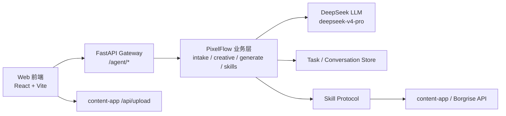
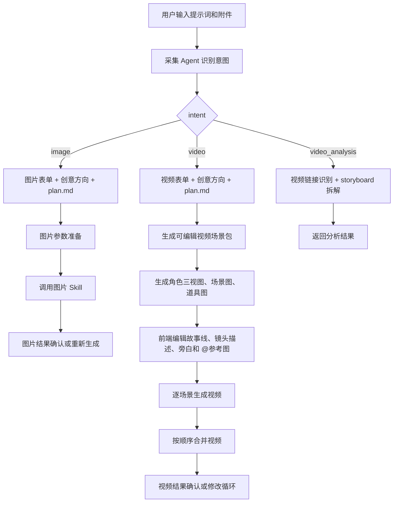

# PixelFlow

PixelFlow 是一个面向电商内容创作的 AI Agent 工作台，支持从自然语言和素材附件出发，完成图片生成、短视频生成和视频分析拆解。

当前项目仍在快速迭代中，但主流程已经从早期 LangGraph-only 任务流演进为前端工作台驱动的 v2 分段工作流：采集意图、补全表单、生成创意方向、填充 plan.md、人工审核，再分别进入图片、视频或视频分析链路。

详细 Agent/Skill 流程见：

- `docs/pixelflow-agent-skill-flow-latest-design.md`
- `AGENTS.md`

## 当前能力

| 能力 | 状态 | 说明 |
| --- | --- | --- |
| 对话工作台 | 可用 | 支持新建对话、历史对话、分页加载、恢复上下文 |
| 采集 Agent | 可用 | 使用 `deepseek-v4-pro` 识别图片/视频/视频分析意图，抽取主体、行业、目标和生成数量 |
| 表单补全 | 可用 | 图片和视频分别有表单 schema，最多 3 轮补充 |
| 垂类 Skill | 可用 | 命中预制行业画像时使用模板，未知行业用 LLM 生成通用画像 |
| 创意方向 | 可用 | 基于表单、行业画像和素材生成 3 个方向 |
| plan.md 策划 | 可用 | 使用项目内模板填充 plan.md，并返回前端审核 |
| 图片生成 | 可用 | 支持文生图、图片编辑、参考图生成、多图融合和多张循环生成 |
| 视频分析 | 可用 | 支持单视频拆解和多视频批量拆解 |
| 视频生成 | 可用 | 按 plan.md 生成场景包、角色三视图、场景图、道具图、逐段视频并合并 |
| 视频修改循环 | 可用 | 支持穿帮分析、按受影响场景重生并重新合并 |
| 额度不足暂停恢复 | 可用 | content-app/Borgrise 返回额度不足时暂停，用户充值后可回同一对话继续 |
| 旧 LangGraph 任务流 | 保留 | `/agent/flows` 旧任务、SSE、资产接口仍存在，用于兼容 |

## 架构概览



代码结构：

```text
pixelflow/
├── backend/
│   ├── app/gateway/                 # FastAPI 网关、/agent Controller、鉴权、配置加载
│   ├── pixelflow/                   # PixelFlow 业务逻辑
│   │   ├── intake/                  # 意图识别、表单、垂类画像、采集上下文
│   │   ├── creative/                # plan.md 填充、Brief/策划逻辑
│   │   ├── generate/                # 图片参数准备、视频场景包
│   │   ├── skills/                  # Skill Protocol + Borgrise/FFmpeg/剪映适配
│   │   ├── tasks/                   # 任务、会话、消息、资产持久化
│   │   └── preferences/             # 用户偏好
│   ├── packages/harness/deerflow/   # DeerFlow 基础设施
│   ├── skills/public/               # Borgrise creative assistant skill 与模板
│   └── tests/                       # 后端测试
├── web/
│   ├── src/pages/WorkspacePage.tsx  # 前端主流程编排
│   ├── src/lib/api.ts               # /agent API client
│   └── src/components/canvas/       # plan、图片结果、视频分镜、结果展示
├── docs/
│   └── pixelflow-agent-skill-flow-latest-design.md
├── AGENTS.md
└── README.md
```

## 主流程



## 关键约束

- 新增 Python 网关接口必须以 `/agent` 开头。
- 前端上传附件直接调用 content-app `/api/upload`，上传结果作为 `materials` 交给 Agent。
- 所有 `/agent` 请求必须携带 content-app `Authorization: Bearer <token>`。
- Skill 调用 content-app/Borgrise 计费接口时必须透传入口请求的 Authorization。
- 不允许把用户 token、用户名、密码写死到配置、代码或测试脚本里。
- content-app 返回额度不足、余额不足、HTTP 402 等信息时，当前生成必须立即暂停并保存可恢复上下文。
- 前端展示 Agent 进度时只能展示业务摘要，不能暴露原始 prompt、思维链、供应商密钥或完整内部堆栈。

## 核心 API

前端 `web/src/lib/api.ts` 使用 `AGENT_API_PREFIX="/agent"`，下表展示最终路径。

| 模块 | 方法 | 路径 | 说明 |
| --- | --- | --- | --- |
| 采集 | POST | `/agent/flows/intake/analyze` | LLM 意图识别 |
| 采集 | GET | `/agent/flows/intake/forms/{intent}` | 表单 schema |
| 采集 | POST | `/agent/flows/intake/validate` | 表单完整性校验 |
| 采集 | POST | `/agent/flows/intake/directions` | 生成 3 个创意方向 |
| 策划 | POST | `/agent/flows/planning/plan` | 填充 plan.md |
| 图片 | POST | `/agent/flows/image/prepare` | 选择图片接口并生成参数 |
| 图片 | POST | `/agent/flows/image/generate` | 生成图片 |
| 视频 | POST | `/agent/flows/video/analyze-storyboards` | 视频分析拆解 |
| 视频 | POST | `/agent/flows/video/prepare-scene-packages` | 生成视频场景包 |
| 视频 | POST | `/agent/flows/video/generate-scene-assets` | 生成场景参考图 |
| 视频 | POST | `/agent/flows/video/generate-scenes/start` | 启动场景视频异步生成 |
| 视频 | GET | `/agent/flows/video/generate-scenes/jobs/{job_id}` | 查询场景视频生成结果 |
| 视频 | POST | `/agent/flows/video/generate-direct/start` | 启动直接视频异步生成 |
| 视频 | GET | `/agent/flows/video/generate-direct/jobs/{job_id}` | 查询直接视频生成结果 |
| 视频 | POST | `/agent/flows/video/merge` | 合并场景视频 |
| 视频 | POST | `/agent/flows/video/analyze-flaws` | 视频穿帮分析 |
| 对话 | POST | `/agent/conversations` | 新建对话 |
| 对话 | GET | `/agent/conversations?page_size=5` | 最近对话分页 |
| 对话 | GET | `/agent/conversations/{conversation_id}` | 对话详情 |
| 对话 | POST | `/agent/conversations/{conversation_id}/messages` | 保存对话消息 |
| 用户偏好 | GET/PUT | `/agent/users/{user_id}/preferences` | 用户偏好 |

旧 LangGraph 任务流仍保留在 `/agent/flows`、`/agent/flows/{task_id}/events`、`/agent/flows/{task_id}/assets` 等接口中。

## content-app/Borgrise 接口

图片：

| PixelFlow Skill | content-app/Borgrise 接口 |
| --- | --- |
| 文生图 | `/api/picture/text_to_image` |
| 图片编辑 | `/api/picture/image_edit` |
| 参考图生成 | `/api/picture/multi_reference_image_generation` |
| 多图融合 | `/api/picture/multi_image_fusion` |

视频：

| PixelFlow Skill | content-app/Borgrise 接口 |
| --- | --- |
| 文生视频 | `/api/video/text-to-video` |
| 首帧图生视频 | `/api/video/image-to-video` |
| 首尾帧生视频 | `/api/video/two-image-to-video` |
| 全能参考模式 | `/api/video/reference-mode-video` |
| 编辑视频 | `/api/video/edit-video` |
| 延伸视频 | `/api/video/extend-video` |
| 合并视频 | `/api/video/merge` |

视频理解：

| PixelFlow Skill | content-app/Borgrise 接口 |
| --- | --- |
| 文本抽取媒体链接 | `/api/creative/extractMediaLinks` |
| 单视频拆解 | `/api/creative/decompose_video_to_storyboard` |
| 多视频拆解 | `/api/creative/batch_decompose_video_to_storyboard` |
| 视频穿帮分析 | `/api/creative/analyze_video_flaws` |

## 视频场景包规则

视频生成主流程固定为：plan.md -> 多个视频场景片段 -> 每段生成视频 -> 按顺序合并。

- 每个场景片段最少 4 秒，最多 15 秒。
- 全局固定资产是 `characters`、`scenes`、`props`、`visual_style`。
- `characters` 只能是人物角色，每个角色必须是同一个人物的正面、侧面、背面三视图。
- 产品、商品、包装、工具、书包、球、床垫等非人物主体放到 `props`。
- `shot_description.text` 是一整段镜头描述，不能拆成时间、地点、角色、景别等多个字段。
- 用户在前端镜头描述框输入 `@` 后，可以选择角色、场景、道具图片；前端保存 `mentions`，后端生成视频时提取对应图片 URL 作为参考图。
- 每个视频场景片段最多 9 张参考图。

## 本地启动

### 后端

要求：Python 3.12、uv。

```bash
cd backend
uv sync
make dev
```

默认读取 `backend/config.dev.yml`，监听 `0.0.0.0:8001`。

常用命令：

```bash
cd backend
make gateway                              # 非 reload 模式
PIXELFLOW_CONFIG_ENV=prod make gateway    # 使用 config.prod.yml
make test
make lint
```

### 前端

要求：Node.js。仓库有 `pnpm-lock.yaml`，推荐用 corepack 调 pnpm，避免依赖版本漂移。

```bash
cd web
corepack enable
corepack pnpm install
corepack pnpm dev
```

打包：

```bash
cd web
corepack pnpm build
```

如果本机没有 corepack 或 pnpm，也可以临时使用：

```bash
cd web
npm install
npm run build
```

不要直接运行裸 `tsc -b && vite build`，本机没有全局 `tsc` 或 `vite` 时会报 `command not found`。应通过 `pnpm build`、`corepack pnpm build` 或 `npm run build` 触发 `package.json` 脚本。

## 鉴权与调试

PixelFlow 不提供自己的登录体系。登录统一由 content-app 完成，前端或第三方调用 PixelFlow 时必须携带：

```http
Authorization: Bearer <content-app 登录 token>
```

后端处理：

1. `AuthMiddleware` 读取 `Authorization`。
2. `content_app_auth.py` 从 JWT payload 读取 `sub` 作为用户名。
3. 后端调用 content-app `/api/auth/verify` 做实时校验。
4. 当前用户名用于任务、会话、资产、偏好隔离。
5. Borgrise Skill 调用生成接口时透传同一个 Authorization。

本地单独调试前端时，可以打开：

```text
http://localhost:5273/auth-token
```

把 content-app token 保存到 `localStorage.Authorization`。正式集成优先由 content-app 宿主注入 `window.__CONTENT_APP_AUTHORIZATION__`。

## 配置

后端主配置：

| 文件 | 说明 |
| --- | --- |
| `backend/config.dev.yml` | 开发环境，Swagger/OpenAPI 默认开启 |
| `backend/config.prod.yml` | 生产环境，Swagger/OpenAPI 默认关闭 |

关键配置：

| 配置段 | 说明 |
| --- | --- |
| `gateway.*` | FastAPI host、port、docs、CORS |
| `pixelflow.*` | MySQL、media_skill、edit_skill、输出目录 |
| `borgrise.*` | content-app/Borgrise base_url、auth verify、轮询超时、重试次数 |
| `models` | LLM 配置，当前主模型是 `deepseek-v4-pro` |
| `database` | DeerFlow checkpointer 和平台持久化 |
| `skills` | DeerFlow skills 路径 |

轮询默认值：

- 图片：10 分钟。
- 视频：1 小时。
- 视频分析：15 分钟。
- content-app `/api/auth/verify`：10 秒。

## 测试与验证

后端核心测试：

```bash
cd backend
uv run pytest tests/test_intake_llm.py tests/test_intake_forms.py tests/test_industry_profile.py -q
uv run pytest tests/test_creative_plan_markdown.py tests/test_image_prepare.py -q
uv run pytest tests/test_pixelflow_image_router.py tests/test_video_scene_packages.py tests/test_pixelflow_video_router.py -q
uv run pytest tests/test_borgrise_poll.py tests/test_borgrise_authorization_passthrough.py tests/test_borgrise_quota_detection.py -q
uv run ruff check .
```

前端核心测试：

```bash
cd web
corepack pnpm test:scene-packages
corepack pnpm test:scene-mentions
corepack pnpm test:conversation-routing
corepack pnpm build
```

文档变更至少跑：

```bash
git diff --check
```

## 文档维护

以下变更必须同步更新 `docs/pixelflow-agent-skill-flow-latest-design.md`、`AGENTS.md` 和本 README：

- Agent 流程变化。
- Skill Protocol 或 Borgrise/content-app 接口变化。
- 前端确认、倒计时、重试、恢复逻辑变化。
- 对话隔离、历史记录、上下文恢复变化。
- 鉴权、额度不足、错误处理策略变化。
- 核心运行命令或配置变化。

## License

见 `LICENSE` 与 `NOTICE`。
