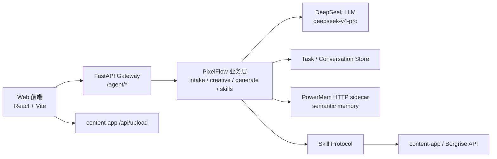
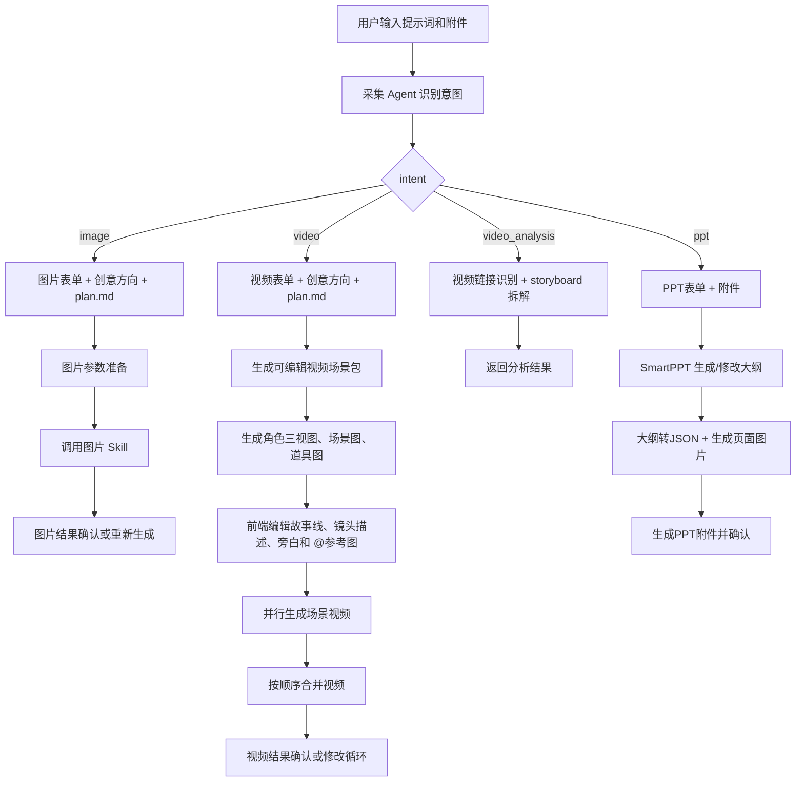

# PixelFlow

PixelFlow 是一个面向电商内容创作的 AI Agent 工作台，支持从自然语言和素材附件出发，完成图片生成、短视频生成、视频分析拆解和 PPT 制作。

当前项目仍在快速迭代中，但主流程已经从早期 LangGraph-only 任务流演进为前端工作台驱动的 v2 分段工作流：采集意图、补全表单、生成创意方向、填充 plan.md、人工审核，再分别进入图片、视频、视频分析或 PPT 制作链路。

详细 Agent/Skill 流程见：

- `docs/pixelflow-agent-skill-flow-latest-design.md`
- `AGENTS.md`

## 当前能力

| 能力 | 状态 | 说明 |
| --- | --- | --- |
| 对话工作台 | 可用 | 支持新建对话、历史对话、分页加载、恢复上下文 |
| 采集 Agent | 可用 | 使用 `deepseek-v4-pro` 识别图片/视频/PPT/视频分析意图，抽取主体、行业、目标和生成数量 |
| 表单补全 | 可用 | 图片、视频和PPT分别有表单 schema，最多 3 轮补充 |
| 垂类 Skill | 可用 | 命中预制行业画像时使用模板，未知行业用 LLM 生成通用画像 |
| 创意方向 | 可用 | 基于表单、行业画像和素材生成 3 个方向 |
| plan.md 策划 | 可用 | 使用项目内模板填充 plan.md，并返回前端审核 |
| 图片生成 | 可用 | 支持文生图、图片编辑、参考图生成、多图融合和多张循环生成 |
| 视频分析 | 可用 | 支持单视频拆解和多视频批量拆解 |
| 视频生成 | 可用 | 按 plan.md 生成场景包、角色三视图、场景图、道具图、逐段视频并合并 |
| 视频修改循环 | 可用 | 支持综合质检、按受影响场景重生并重新合并 |
| PPT 制作 | 可用 | 支持 PPT 表单、大纲确认/修改、页面图片生成、PPT 文件生成和重新生成附件 |
| PowerMem 语义记忆 | 可用 | 通过 HTTP sidecar 读取用户/品牌长期偏好，并记录 Agent 经验/Skill 沉淀 |
| 额度不足暂停恢复 | 可用 | content-app/Borgrise 返回额度不足时暂停，用户充值后可回同一对话继续 |
| 旧 LangGraph 任务流 | 保留 | `/agent/flows` 旧任务、SSE、资产接口仍存在，用于兼容 |

## 架构概览



代码结构：

```text
pixelflow/
├── backend/
│   ├── app/gateway/                 # FastAPI 网关、/agent Controller、鉴权、配置加载
│   ├── pixelflow/                   # PixelFlow 业务逻辑
│   │   ├── intake/                  # 意图识别、表单、垂类画像、采集上下文
│   │   ├── creative/                # plan.md 填充、Brief/策划逻辑
│   │   ├── generate/                # 图片参数准备、视频场景包
│   │   ├── memory/                  # PowerMemService、语义记忆上下文注入
│   │   ├── skills/                  # Skill Protocol + Borgrise/FFmpeg/剪映适配
│   │   ├── tasks/                   # 任务、会话、消息、资产持久化
│   │   └── preferences/             # 用户偏好
│   ├── packages/harness/deerflow/   # DeerFlow 基础设施
│   ├── skills/public/               # Borgrise creative assistant skill 与模板
│   └── tests/                       # 后端测试
├── web/
│   ├── src/pages/WorkspacePage.tsx  # 前端主流程编排
│   ├── src/lib/api.ts               # /agent API client
│   └── src/components/canvas/       # plan、图片结果、视频分镜、结果展示
├── docs/
│   └── pixelflow-agent-skill-flow-latest-design.md
├── AGENTS.md
└── README.md
```

## 主流程



## 关键约束

- 新增 Python 网关接口必须以 `/agent` 开头。
- 前端上传附件直接调用 content-app `/api/upload`，上传结果作为 `materials` 交给 Agent。
- 所有 `/agent` 请求必须携带 content-app `Authorization: Bearer <token>`。
- Skill 调用 content-app/Borgrise 计费接口时必须透传入口请求的 Authorization。
- 不允许把用户 token、用户名、密码写死到配置、代码或测试脚本里。
- PowerMem 只保存业务摘要、偏好、品牌上下文和 Agent 经验，不写入用户 token、供应商密钥、原始异常堆栈或本地部署目录。
- content-app 返回额度不足、余额不足、HTTP 402 等信息时，当前生成必须立即暂停并保存可恢复上下文。
- 前端展示 Agent 进度时只能展示业务摘要，不能暴露原始 prompt、思维链、供应商密钥或完整内部堆栈。

## 核心 API

前端 `web/src/lib/api.ts` 使用 `AGENT_API_PREFIX="/agent"`，下表展示最终路径。

| 模块 | 方法 | 路径 | 说明 |
| --- | --- | --- | --- |
| 采集 | POST | `/agent/flows/intake/analyze` | LLM 意图识别 |
| 采集 | GET | `/agent/flows/intake/forms/{intent}` | 表单 schema |
| 采集 | POST | `/agent/flows/intake/validate` | 表单完整性校验 |
| 采集 | POST | `/agent/flows/intake/directions` | 生成 3 个创意方向 |
| 策划 | POST | `/agent/flows/planning/plan` | 填充 plan.md |
| 图片 | POST | `/agent/flows/image/prepare` | 选择图片接口并生成参数 |
| 图片 | POST | `/agent/flows/image/generate` | 同步生成图片，兼容旧调用 |
| 图片 | POST | `/agent/flows/image/generate/start` | 启动可恢复图片生成 job |
| 图片 | GET | `/agent/flows/image/generate/jobs/{job_id}` | 查询图片生成 job |
| 图片 | POST | `/agent/flows/image/edit-asset` | 同步编辑视频场景包全局素材图片，兼容旧调用 |
| 图片 | POST | `/agent/flows/image/edit-asset/start` | 启动可恢复全局素材图片编辑 job |
| 图片 | GET | `/agent/flows/image/edit-asset/jobs/{job_id}` | 查询全局素材图片编辑 job |
| 视频 | POST | `/agent/flows/video/analyze-storyboards` | 视频分析拆解 |
| 视频 | POST | `/agent/flows/video/prepare-scene-packages` | 生成视频场景包 |
| 视频 | POST | `/agent/flows/video/prepare-scene-packages/start` | 启动可恢复场景包+参考图生成 job |
| 视频 | GET | `/agent/flows/video/prepare-scene-packages/jobs/{job_id}` | 查询场景包+参考图生成 job |
| 视频 | POST | `/agent/flows/video/generate-scene-assets` | 生成场景参考图 |
| 视频 | POST | `/agent/flows/video/generate-scene-assets/start` | 启动可恢复场景参考图生成 job |
| 视频 | GET | `/agent/flows/video/generate-scene-assets/jobs/{job_id}` | 查询场景参考图生成 job |
| 视频 | POST | `/agent/flows/video/generate-scenes/start` | 启动场景视频异步生成 |
| 视频 | GET | `/agent/flows/video/generate-scenes/jobs/{job_id}` | 查询场景视频生成结果 |
| 视频 | POST | `/agent/flows/video/generate-direct/start` | 启动直接视频异步生成 |
| 视频 | GET | `/agent/flows/video/generate-direct/jobs/{job_id}` | 查询直接视频生成结果 |
| 视频 | POST | `/agent/flows/video/merge` | 合并场景视频 |
| 视频 | POST | `/agent/flows/video/quality-review` | 视频综合质检，覆盖方案一致性、分镜覆盖、产品一致性/穿帮、播放稳定性和手机端需求 |
| 视频 | POST | `/agent/flows/video/analyze-flaws` | 兼容旧前端的视频穿帮分析入口，内部转调综合质检并只返回产品一致性问题 |
| PPT | POST | `/agent/flows/ppt/summary/start` | 启动 SmartPPT 大纲生成 |
| PPT | POST | `/agent/flows/ppt/summary/update/start` | 启动 SmartPPT 大纲更新 |
| PPT | POST | `/agent/flows/ppt/content-json/start` | 启动大纲转页面 JSON |
| PPT | POST | `/agent/flows/ppt/images/start` | 启动 PPT 页面图片生成 |
| PPT | POST | `/agent/flows/ppt/images/regenerate/start` | 重新生成单页 PPT 图片 |
| PPT | POST | `/agent/flows/ppt/file/start` | 启动 PPT 文件生成 |
| PPT | GET | `/agent/flows/ppt/jobs/{job_id}` | 查询 PPT 阶段异步 job |
| 对话 | POST | `/agent/conversations` | 新建对话 |
| 对话 | GET | `/agent/conversations?page_size=5` | 最近对话分页 |
| 对话 | GET | `/agent/conversations/{conversation_id}` | 对话详情 |
| 对话 | POST | `/agent/conversations/{conversation_id}/messages` | 保存对话消息 |
| 对话 | GET | `/agent/conversations/{conversation_id}/trace` | 内部调试专用：查看该对话的 LLM/供应商调用 trace，需要 content-app `ROLE_ADMIN` |
| 用户偏好 | GET/PUT | `/agent/users/{user_id}/preferences` | 用户偏好 |

旧 LangGraph 任务流仍保留在 `/agent/flows`、`/agent/flows/{task_id}/events`、`/agent/flows/{task_id}/assets` 等接口中。

## PowerMem 语义记忆

PixelFlow 第一版 PowerMem 集成同时覆盖两类能力：

| 类型 | 记录来源 | 使用位置 |
| --- | --- | --- |
| 用户/品牌长期偏好 MVP | `/agent/users/{user_id}/preferences`、偏好反馈、Brief 修订、采集到的产品/行业上下文 | 采集分析、创意方向、plan.md、图片 prepare、视频场景包、PPT 大纲 |
| Agent 经验/Skill 沉淀 | 图片、视频、视频分析、PPT、旧 LangGraph 任务流的阶段完成/失败摘要 | 后续 Agent 检索 `preference`、`brand`、`skill`、`experience` 分类记忆作为上下文 |

接入边界：

- 统一入口是 `backend/pixelflow/memory/PowerMemService`，路由侧只通过 `app.gateway.pixelflow_memory` helper 读写。
- 测试环境 `backend/config.dev.yml` 的 `pixelflow.powermem_base_url` 走 nginx：`https://test-video.borgrise.com/powermem`。
- 生产环境 `backend/config.prod.yml` 的 `pixelflow.powermem_base_url` 走本机 sidecar：`http://127.0.0.1:18848`。
- PowerMem 不替代 `pixelflow_user_preferences` 结构化偏好表；结构化默认值、负向规则仍在业务 Store，PowerMem 负责语义检索和跨 Agent 经验复用。
- 图片/视频/PPT 等 Skill 调用类经验会自动双写 `experience` 与 `skill`，便于后续流程复用接口选择和失败处理经验。
- 后续新增或修改 Agent/流程时，必须复用 `PowerMemService`：进入决策前先检索相关记忆，阶段完成/失败后写入业务摘要。

## content-app/Borgrise 接口

图片：

| PixelFlow Skill | content-app/Borgrise 接口 |
| --- | --- |
| 文生图 | `/api/picture/text_to_image` |
| 图片编辑 | `/api/picture/image_edit` |
| 参考图生成 | `/api/picture/multi_reference_image_generation` |
| 多图融合 | `/api/picture/multi_image_fusion` |
| 图片模型参数配置 | `/api/modelParamConfig/listByCategory/image_generate` |

视频：

| PixelFlow Skill | content-app/Borgrise 接口 |
| --- | --- |
| 文生视频 | `/api/video/text-to-video` |
| 首帧图生视频 | `/api/video/image-to-video` |
| 首尾帧生视频 | `/api/video/two-image-to-video` |
| 全能参考模式 | `/api/video/reference-mode-video` |
| 编辑视频 | `/api/video/edit-video` |
| 延伸视频 | `/api/video/extend-video` |
| 合并视频 | `/api/video/merge` |

视频理解：

| PixelFlow Skill | content-app/Borgrise 接口 |
| --- | --- |
| 文本抽取媒体链接 | `/api/creative/extractMediaLinks` |
| 单视频拆解 | `/api/creative/decompose_video_to_storyboard` |
| 多视频拆解 | `/api/creative/batch_decompose_video_to_storyboard` |
| 视频综合质检 / 旧穿帮分析 | `/api/creative/analyze_video_flaws` |

SmartPPT：

| PixelFlow Skill | content-app/Borgrise 接口 |
| --- | --- |
| 生成 PPT 大纲 | `/api/picture/smart-ppt/generatePptSummary` |
| 更新 PPT 大纲 | `/api/picture/smart-ppt/updatePptSummary` |
| 大纲转页面 JSON | `/api/picture/smart-ppt/generatePptContentToJson` |
| 生成 PPT 页面图片 | `/api/picture/smart-ppt/generatePptImage` |
| 生成 PPT 文件 | `/api/picture/smart-ppt/generatePptFile` |

SmartPPT 每一步都是异步任务，PixelFlow 通过 `/api/task/{taskId}/status` 轮询，默认超时 2 小时。

## 视频场景包规则

视频生成主流程固定为：plan.md -> 多个视频场景片段 -> 每段生成视频 -> 按顺序合并。

- 每个场景片段最少 4 秒，最多 15 秒。
- 全局固定资产是 `characters`、`scenes`、`props`、`visual_style`。
- `characters` 只能是人物角色，每个角色必须是同一个人物的正面、侧面、背面三视图。
- 产品、商品、包装、工具、书包、球、床垫等非人物主体放到 `props`。
- `shot_description.text` 是一整段镜头描述，不能拆成时间、地点、角色、景别等多个字段。
- `shot_description.text` 的时间范围必须使用秒级表达，例如 `0-10秒`，不要使用 `ms`、`毫秒` 或 `00:00.000`。
- 用户在前端镜头描述框输入 `@` 后，可以选择角色、场景、道具图片；前端保存 `mentions`，后端生成视频时提取对应图片 URL 作为参考图。
- 每个视频场景片段最多 9 张参考图。
- 场景包确认页支持点击全局素材图片预览、引用到左侧对话输入框并发送编辑指令；前端调用 `/agent/flows/image/edit-asset/start` 启动可恢复图片编辑 job，后端复用 `/api/picture/image_edit`，成功后直接替换原 `global_assets` 图片，并同步相关 `shot_description.mentions` 的 `image_url`。编辑结果卡片点击“重新生成”后，下一条用户输入继续走全局素材图片编辑，不重新进入采集 Agent。
- 全局素材预览也支持“删除素材”：点击后只预填左侧固定删除文案和素材 chip，用户发送后在当前场景包内原地删除该素材引用，清空 `global_assets` 中该素材图片 URL 作为占位符，不新增场景包确认卡片。
- 普通图片流程里，如果采集 Agent 识别到用户是在编辑上传图片，前端会跳过普通图片表单、创意方向和 plan.md。缺原图时会把等待上传状态写入对话，用户上传图片后可继续；有原图时先调用 `/api/modelParamConfig/listByCategory/image_generate` 展示图片编辑模型、尺寸和清晰度确认卡，默认选 `gpt-image-2`，确认后再复用 `/agent/flows/image/prepare` + `/agent/flows/image/generate/start` 调用 `/api/picture/image_edit`。用户确认过的模型、尺寸和清晰度会写入对话 context，切换对话或刷新后仍能恢复展示。图片编辑成功后同样展示“满意，结束 / 重新生成”，60 秒未操作默认满意并结束。
- 图片 plan.md 同意、图片修改重生成、直接图片编辑和全局素材图片编辑都会先拿到 Python `job_id`，并把 `pendingImageJob` / `pending_image_job` 写入 conversation context。用户切到历史对话、创作页、iframe 外或刷新后，只继续查询 `/agent/flows/image/generate/jobs/{job_id}` 或 `/agent/flows/image/edit-asset/jobs/{job_id}`，不会重复启动生成；网关重启导致 job 404 时只提示手动重试，不自动重启，避免重复计费。
- 图片编辑分支会让 LLM 抽取用户指定的尺寸和清晰度；如果所选模型不支持这些参数，前端提示并自动落到当前模型可用参数，用户可以重新选择可用尺寸和清晰度后继续提交。如果用户没有明确指定，前端按所选模型自动选择一组可用尺寸和清晰度。模型、尺寸和清晰度的可选项以 content-app `/api/modelParamConfig/listByCategory/image_generate` 实时配置为准，Python 侧不再用硬编码模型白名单拦截用户已确认的参数。content-app 图片编辑请求里 `size` 表示比例，`imageSize` 表示清晰度，网关会保持两者分离。图片编辑失败后，重新生成会先回到模型、尺寸和清晰度确认卡，避免继续复用失败参数。
- 对话里可能保留多个历史视频场景包卡片，但只有最后一个 `video_scene_packages` 卡片显示“查看分镜”和“确认并生成视频”操作；旧卡片只作为历史预览，避免误用过期场景包生成视频。
- 场景视频和合并视频生成完成后，`video_result` 卡片只展示“无意见，结束 / 提出修改意见”。生成结果会同步回填到原 `video_scene_packages` 卡片；用户继续点击原来的“查看分镜”时，右侧 `StoryboardPanel` 的镜头预览优先展示已生成的分镜视频。用户只修改某几个分镜后再次确认生成时，仅重生成这些已修改分镜，未修改分镜复用旧视频，再按分镜顺序重新合并并回填原场景包。
- 场景视频生成 job 内部会并行生成分镜视频，当前最多 100 个分镜同时调用 content-app；所有分镜都结束后再统一判断。全部成功时按 `scene_index` 合并；如果只有 1 个分镜，PixelFlow 直接把该分镜视频作为最终视频返回，不调用 content-app `/api/video/merge`；部分异常时返回 `failed_scenes` 和每个失败原因，重试只提交失败分镜；部分额度不足时整批只提示一次额度不足，充值后同样只重试额度暂停或异常分镜。
- 视频 plan.md 同意后，前端调用 `/agent/flows/video/prepare-scene-packages/start`，后端 job 连续完成“生成可编辑场景包”和“生成角色三视图、场景图、道具图”。前端拿到 `job_id` 后立即把 `pendingScenePackageJob` / `pending_scene_package_job` 写入 conversation context；用户切到历史对话、创作页、iframe 外或刷新后，只继续查询 `/jobs/{job_id}`，不会重复启动生成。参考图失败或额度不足时，job 返回已生成场景包和 `sceneAssetFailures`，前端展示可继续的场景包卡片。
- 场景包卡片上的“继续生成参考图/重新生成参考图”调用 `/agent/flows/video/generate-scene-assets/start`，同样保存 `pendingScenePackageJob` 并恢复轮询；网关重启导致 job 404 时只提示手动重试，不自动重启，避免重复计费。
- 场景视频生成和视频修改重生成会先调用 `/agent/flows/video/generate-scenes/start` 取得 `job_id`，并把 `pendingVideoJob` / `pending_video_job` 写入当前 conversation context；用户离开再返回同一对话时，前端只继续查询 `/jobs/{job_id}`，不会重复启动生成。
- 图片、视频、PPT 的需求表单弹出后，用户点击右上角 `X` 视为取消当前流程，前端会清空 pending 表单上下文并保存 `form_cancelled`。
- PPT 表单的 `PPT风格` 支持“自定义”，选中后显示文本框，最终把用户输入的风格词作为 `ppt_style` 提交给 SmartPPT。
- 当前对话中任意阶段正在生成或处理时，历史 artifact 按钮统一禁用；阶段结束后只保留最新可操作 artifact 的按钮，失败或额度暂停时只保留当前可恢复点的重试入口。

### PPT 页面图片交互

- 页面图片生成阶段先展示每一页小格子为“图片生成中...”，省略号动态循环。
- 小格子处于生成中时不显示重新生成按钮；已生成或失败后才显示。
- 点击单页重新生成时，只把当前小格子原位切回生成中并更新该页结果，不追加新的整组 PPT 图片卡片。
- 只要还有页面处于生成中或失败，隐藏“开始生成PPT附件”；所有页面都有图片且无失败时才展示该按钮。

## 本地启动

### 后端

要求：Python 3.12、uv。

```bash
cd backend
uv sync
make dev
```

默认读取 `backend/config.dev.yml`，监听 `0.0.0.0:8001`。

常用命令：

```bash
cd backend
make gateway                              # 非 reload 模式
PIXELFLOW_CONFIG_ENV=prod make gateway    # 使用 config.prod.yml
make test
make lint
```

### 前端

要求：Node.js。仓库有 `pnpm-lock.yaml`，推荐用 corepack 调 pnpm，避免依赖版本漂移。

```bash
cd web
corepack enable
corepack pnpm install
corepack pnpm dev
```

本地联调 content_frontend + PixelFlow 本地后端时，使用 test 模式：

```bash
cd backend
make dev

cd web
corepack pnpm dev:test -- --host 0.0.0.0 --port 5273

cd ../../content_frontend
yarn test -- --host 0.0.0.0 --port 5174
```

这条链路是：content_frontend test 环境 `http://localhost:5174/home/agent` 嵌入 PixelFlow `http://localhost:5273/agentfrontend/`，PixelFlow 前端再把 `/agent` 代理到本地后端 `http://127.0.0.1:8001`。

打包：

```bash
cd web
corepack pnpm build-prod   # 使用 web/.env.production，产物到 web/dist/
corepack pnpm build-dev    # 使用 web/.env.development，联调测试环境时使用
corepack pnpm build-test   # 使用 web/.env.test，本地后端联调构建
```

如果本机没有 corepack 或 pnpm，也可以临时使用：

```bash
cd web
npm install
npm run build-prod
```

不要直接运行裸 `tsc -b && vite build`，本机没有全局 `tsc` 或 `vite` 时会报 `command not found`。应通过 `pnpm build-prod`、`corepack pnpm build-prod` 或 `npm run build-prod` 触发 `package.json` 脚本。

前端环境变量文件在 `web/` 目录下，`web/vite.config.ts` 会从该目录读取：

| 文件 | 当前目标 | 用途 |
| --- | --- | --- |
| `web/.env.development` | `https://test-video.borgrise.com` | `pnpm dev`、`pnpm build-dev`，测试环境联调 |
| `web/.env.test` | `http://127.0.0.1:8001` | `pnpm dev:test`、`pnpm build-test`，content_frontend test + PixelFlow 本地后端联调 |
| `web/.env.production` | `https://video.borgrise.com` | `pnpm prod`、`pnpm build-prod`，生产环境 |

变量含义：

- `VITE_API_TARGET`：Vite dev server 将 `/agent` 代理到的目标。development/production 分别指向测试/正式 content-app 域名；test 固定指向本机后端 `http://127.0.0.1:8001`。
- `VITE_CONTENT_APP_TARGET`：Vite dev server 将 `/api/upload` 代理到的 content-app 目标，通常应与当前环境的 content-app 域名一致。

## 鉴权与调试

PixelFlow 不提供自己的登录体系。登录统一由 content-app 完成，前端或第三方调用 PixelFlow 时必须携带：

```http
Authorization: Bearer <content-app 登录 token>
```

后端处理：

1. `AuthMiddleware` 读取 `Authorization`。
2. `content_app_auth.py` 从 JWT payload 读取 `sub` 作为用户名。
3. 后端调用 content-app `/api/auth/verify` 做实时校验。
4. 当前用户名用于任务、会话、资产、偏好隔离。
5. Borgrise Skill 调用生成接口时透传同一个 Authorization。

本地单独调试前端时，可以打开：

```text
http://localhost:5273/auth-token
```

把 content-app token 保存到 `localStorage.Authorization`。正式集成优先由 content-app 宿主注入 `window.__CONTENT_APP_AUTHORIZATION__`。

### 对话 Trace（内部调试专用）

当前主用的 v2 对话工作流（intake/creative/image/video/ppt）会把每次 LLM 调用（`pixelflow/intake/llm.py`）和每次 content-app/Borgrise 供应商调用（`run_generation.make_request`）记一条 trace 事件，按 `conversation_id` 关联，存在 `pixelflow_conversation_trace_events` 表：

- 前端在调用生成类接口时，通过 `web/src/lib/api.ts` 的 `setActiveConversationId` 让后续请求自动带上 `X-Conversation-Id` 请求头；`AuthMiddleware` 读取该请求头写入 ContextVar，业务代码只在这个 ContextVar 存在时才记录 trace，不影响没有 conversation_id 的旧流程。
- 查看入口是 `GET /agent/conversations/{conversation_id}/trace`，前端页面在 `http://localhost:5273/agentfrontend/#/trace/<对话ID>`（hash 路由，`web/src/pages/TracePage.tsx`）；对话 ID 可以从工作台地址栏 `#/c/<对话ID>` 里复制。
- 这个接口和页面只服务内部排查，会展示原始 prompt、供应商请求/响应；调用方必须是 content-app `ROLE_ADMIN`（`content_app_auth.is_admin_user` 实时调用 content-app `GET /api/user/me` 校验角色），非管理员会收到 403。旧 LangGraph 任务流的 `pixelflow_task_events`/`run_events` 是完全独立的另一套 trace，不受这个功能影响。

## 配置

后端主配置：

| 文件 | 说明 |
| --- | --- |
| `backend/config.dev.yml` | 开发环境，Swagger/OpenAPI 默认开启 |
| `backend/config.prod.yml` | 生产环境，Swagger/OpenAPI 默认关闭 |

关键配置：

| 配置段 | 说明 |
| --- | --- |
| `gateway.*` | FastAPI host、port、docs、CORS |
| `pixelflow.*` | MySQL、media_skill、edit_skill、输出目录 |
| `pixelflow.semantic_memory_*` / `pixelflow.powermem_*` | PowerMem 语义记忆开关、base_url、API key、search 超时（`powermem_timeout_seconds`）、record 专用超时（`powermem_record_timeout_seconds`）、检索数量、失败开放策略 |
| `borgrise.*` | content-app/Borgrise base_url、auth verify、轮询超时、重试次数 |
| `models` | LLM 配置，当前主模型是 `deepseek-v4-pro` |
| `database` | DeerFlow checkpointer 和平台持久化 |
| `skills` | DeerFlow skills 路径 |

轮询默认值：

- 图片：10 分钟。
- 视频：1 小时。
- 视频分析：15 分钟。
- content-app `/api/auth/verify`：10 秒。

`/api/task/{taskId}/status` 状态查询如果出现短暂 SSL EOF、握手超时等可恢复网络错误，会在单次请求重试后继续轮询最多 3 次；401、402、额度不足和非重试业务错误仍会立即返回。

## 测试与验证

后端核心测试：

```bash
cd backend
uv run pytest tests/test_intake_llm.py tests/test_intake_forms.py tests/test_industry_profile.py -q
uv run pytest tests/test_creative_plan_markdown.py tests/test_image_prepare.py -q
uv run pytest tests/test_pixelflow_image_router.py tests/test_video_scene_packages.py tests/test_pixelflow_video_router.py -q
uv run pytest tests/test_powermem_service.py tests/test_pixelflow_preferences.py -q
uv run pytest tests/test_borgrise_poll.py tests/test_borgrise_authorization_passthrough.py tests/test_borgrise_quota_detection.py -q
uv run ruff check .
```

前端核心测试：

```bash
cd web
corepack pnpm test:scene-packages
corepack pnpm test:scene-mentions
corepack pnpm test:conversation-routing
corepack pnpm build-prod
```

文档变更至少跑：

```bash
git diff --check
```

## 文档维护

以下变更必须同步更新 `docs/pixelflow-agent-skill-flow-latest-design.md`、`AGENTS.md` 和本 README：

- Agent 流程变化。
- Skill Protocol 或 Borgrise/content-app 接口变化。
- 前端确认、倒计时、重试、恢复逻辑变化。
- 对话隔离、历史记录、上下文恢复变化。
- 鉴权、额度不足、错误处理策略变化。
- 核心运行命令或配置变化。

## License

见 `LICENSE` 与 `NOTICE`。
