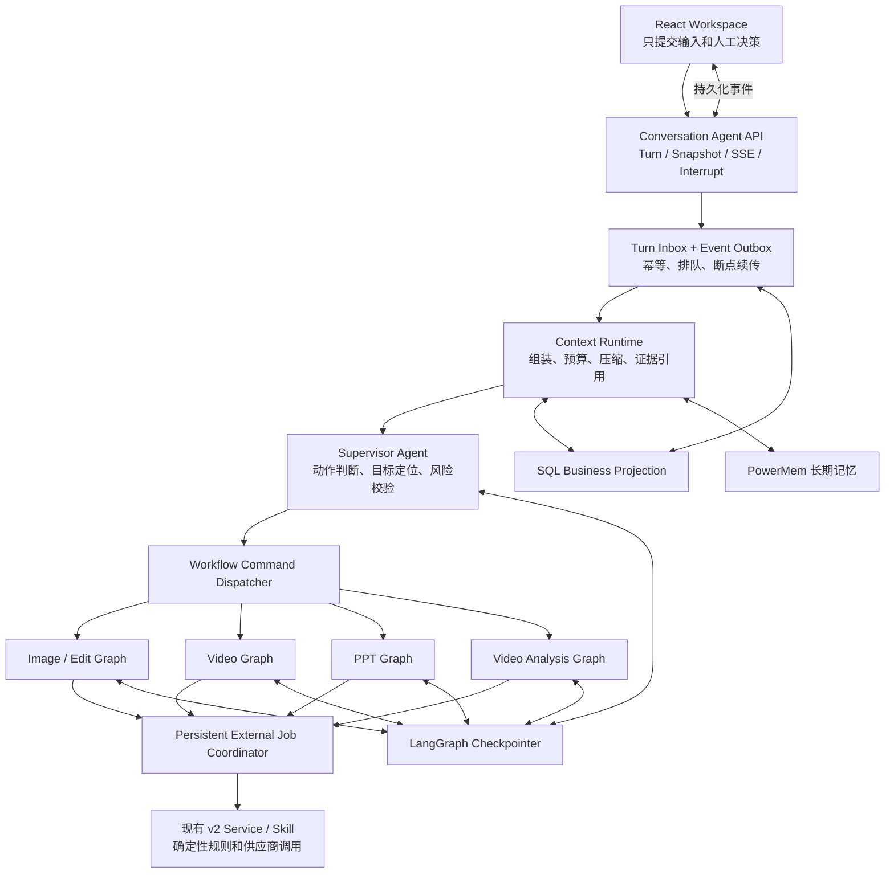
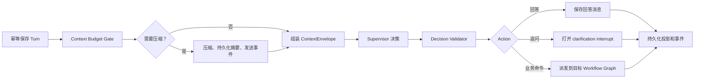

# PixelFlow 会话级完整 Agent 化总体设计

> 状态：待两名开发者共同评审。
>
> 设计基线：`feature/dev_0.8.4_boguan` 与 `feature/agent_0.8.4_boguan`，提交 `02493711e8c9b74ec5f8e54cfadac3881297754c`。
>
> 本文回答“为什么改、最终架构是什么、各层如何协作”。具体 DTO/API 见 [contracts-v1.md](contracts-v1.md)，模块和 1–3 小时任务见 [work-breakdown.md](work-breakdown.md)。

## 1. 最终结论

PixelFlow 只采用一种目标方案：

**后端会话级 Supervisor Agent 负责理解每次用户输入，LangGraph 负责可持久化、可暂停恢复的状态编排，现有图片、图片编辑、视频、PPT、视频分析能力改造成受控 Workflow 子图/适配器；确定性业务规则、人工确认、计费幂等和供应商调用继续由 Service/Skill 执行。**

系统不是取消工作流，而是把工作流放回它擅长的位置：保证确定性、审核和恢复；把“用户这句话到底要干什么”交给 Supervisor Agent。

用 Java 类比：

| Agent 架构 | Java 类比 | 职责 |
| --- | --- | --- |
| Conversation API | Controller | 鉴权、接收输入、返回 snapshot/SSE |
| Supervisor Agent | 会推理的 Application Service | 理解动作、定位任务、选择下一步 |
| LangGraph | 可持久化流程状态机 | 节点编排、interrupt、恢复、错误位置 |
| Workflow Adapter | Domain/Application Service | 图片、视频、PPT、分析的合法状态转换 |
| Skill | Client/策略 Service | 调用 content-app/Borgrise 等能力 |
| Checkpointer | 流程执行日志 | 保存图执行位置和中断点 |
| SQL Projection | Repository/业务表 | 幂等、查询、任务列表、前端恢复 |
| Context Runtime | Filter/Interceptor | 每次 LLM 调用前组装、计量和压缩上下文 |

## 2. 为什么当前感觉像固定工作流

当前分支的问题不是“没有使用 LLM”，而是会话级编排权分散：

- `WorkspacePage.tsx` 超过 8,000 行，同时承担会话状态、意图入口、pending job、轮询恢复、artifact 行为和下一阶段选择。
- 后端图片、视频、PPT 等 Router 同时承担 Controller、Service、内存 Job Registry、PowerMem 和供应商调用。
- 旧 `backend/pixelflow/graph.py` 只覆盖旧 Brief 视频任务，不等于当前五条业务流程的会话大脑。
- 同一对话内的任务、Plan 版本、图片、PPT 页面和视频分镜没有统一的目标解析层。
- 长对话的完整消息、工具输出、Plan、storyboard 容易被一次性塞给模型，没有全流程统一预算和压缩。

因此用户输入“继续”“把第三张改一下”“按这个风格再做一个视频”时，页面代码往往只能按当前阶段继续，而不能稳定判断：

- 是回答问题还是改变业务状态；
- 是修改当前任务还是新建任务；
- 是继续、重试、重生成还是恢复历史版本；
- 目标是哪个 workflow、artifact、PPT 页或视频分镜。

## 3. 目标架构



### 3.1 Agent 负责什么

- 识别 `answer_only/continue/modify/regenerate/retry/start/switch/cancel/clarify`。
- 从回复消息、选中 artifact、`@scene`、当前任务索引和上下文中定位目标。
- 理解自然语言修改意见。
- 在多个合法动作中选择下一条 Workflow Command。
- 目标不唯一或可能误计费时主动追问。

### 3.2 代码必须控制什么

- DTO 校验、时长、比例和模型能力。
- 创意方向、Plan、场景包、视频最终结果等人工确认。
- 供应商 start 幂等、轮询、超时、额度不足和恢复。
- Plan、创作合同、场景蓝图和资产清单的权威继承。
- artifact 版本、下载完成、用户隔离和日志安全。

不能把现有供应商 API 全部作为自由工具交给 ReAct Agent，否则可能跳过审核或重复计费。

## 4. Supervisor 如何理解用户输入

每次输入按以下顺序处理：

1. 使用 `interrupt_id`、`reply_to_message_id`、artifact 引用和 `@mention` 查找确定目标。
2. 识别“继续、修改、重新生成、重试、取消、另做一个”等显式动作。
3. 读取候选 workflow 的状态和 `allowed_actions`。
4. Context Runtime 只组装与候选目标相关的上下文。
5. LLM 输出冻结的结构化 `ActionDecision`。
6. `DecisionValidator` 校验目标存在、版本未过期、状态转换合法和计费风险。
7. 不确定时返回 `clarify`，不能先调用供应商再询问。

建议置信度策略：

- `>=0.82` 且校验通过：可执行明确动作。
- `0.55–0.82`：非计费、目标唯一时才继续，其余追问。
- `<0.55`：追问。
- 任何计费动作目标不唯一：无论分数多少都追问。

示例：

| 用户输入 | Supervisor 决策 |
| --- | --- |
| “为什么给我选这个模型？” | `answer_only`，不改变流程 |
| “把刚才第三张图背景换成白色” | 定位第三张 artifact，`modify_workflow` |
| “继续” | 只有一个 open interrupt 时继续，否则追问目标 |
| “再生成一次” | 目标唯一时 `regenerate_stage`，否则追问 |
| “按这个风格再做一个 30 秒视频” | `start_workflow(video)`，复用允许继承的风格 |
| “恢复上一版 Plan” | 调用 Plan restore，不生成新方向或新 Plan |

Supervisor 只保存公开的 `reason_code` 和决策摘要，不保存模型思维链。

## 5. 会话图和 Workflow 图



一个对话可能先生成图片，再创建 PPT，同时还有视频在后台运行。因此不能把所有任务长期挤在一个图状态里：

- Supervisor thread 保存会话级判断和任务索引。
- 每个 workflow 使用独立 thread 保存该业务任务的执行位置。
- SQL 保存可查询的 workflow、turn、operation、summary、event，以及只用于协调的 conversation compaction lease。
- Event Outbox 将多个 workflow 的事件汇聚成一条 conversation SSE。

建议命名：

- `pf:conversation:{conversation_id}:supervisor:v1`
- `pf:conversation:{conversation_id}:workflow:{workflow_id}:v1`

## 6. 业务子图

### 6.1 图片与图片编辑

- 普通图片：采集 → 表单 → 方向 → Plan → prepare → generate → 审核 → 下载。
- 直接编辑：识别 edit → 检查原图 → 参数确认 → prepare → generate → 审核。

保留多图数量、图片结果 60 秒默认满意、实时模型配置、`size/imageSize` 分离和失败后重新确认参数。

### 6.2 PPT

表单 → 行业上下文 → 大纲 → 大纲确认/更新 → 页面 JSON → 页面图片 → 单页重生成 → PPT 文件 → 下载。

“第三页换成数据图”必须定位当前 PPT 的第三页，只重生成目标页。

### 6.3 视频分析

媒体定位 → 单/多视频判断 → storyboard 分析 → artifact 保存。完整分析结果外置，Supervisor 默认只读取摘要和证据引用。

### 6.4 视频生成

采集/表单 → 方向 → Plan → 场景包 → 全局资产图 → 分镜视频 → 合并 → QA/QC → 修改循环 → 最终确认 → 剪映草稿/下载。

视频是最后迁移的高风险模块。Plan、`creation_contract`、`scene_blueprints`、`asset_manifest` 是权威数据，子图和摘要都不能重新猜测。单分镜继续限制 4–15 秒；剪映草稿只使用当前版本全部成功的分镜视频。

## 7. 外部异步任务必须持久化

当前部分图片、视频、PPT job registry 存在进程内，进程重启可能丢失。新 Agent Runtime 使用持久化 Operation/Job Coordinator：

1. 图节点先按幂等键 claim Operation。
2. 只有首次 claim 的执行者启动供应商任务。
3. provider job ID 落库后，由数据库 lease 领取轮询任务。
4. 完成后写 Event Outbox，并恢复对应 workflow graph。
5. worker 退出后，其他 worker 在 lease 过期后接管。

必须覆盖“供应商已成功，但 checkpoint 还没写入时进程崩溃”的窗口。只依赖 LangGraph checkpoint 不能保证不重复计费。

## 8. 全局 Context Runtime

### 8.1 三种记忆

| 类型 | 范围 | 权威存储 | 用途 |
| --- | --- | --- | --- |
| 短期执行状态 | 当前 workflow/run | LangGraph checkpointer | 恢复节点和 interrupt |
| 对话事实与摘要 | 当前 conversation | SQL messages + versioned summaries | 本轮理解和压缩 |
| 长期语义记忆 | 跨 conversation | PowerMem | 用户偏好、品牌、经验和 Skill |

图状态分为三条通道：

- `business`：表单、Plan、合同、资产清单、pending action、operation，永不摘要。
- `messages`：可压缩的对话消息。
- `semantic_memory`：本轮 PowerMem 检索出的临时相关片段，不反写业务合同。

### 8.2 模型上下文预算

上下文窗口由实际调用模型决定，不是 LangGraph 自己提供固定窗口：

```text
effective_context = min(模型已验证的 max_context_tokens, context_budget.effective_context_k × 1024)
usable_input = effective_context - max_output_tokens - safety_reserve_tokens
utilization = estimated_input_tokens / usable_input
```

| 适用范围 | 统一有效窗口 | 输出预留 | 安全预留 | 可用输入 |
| --- | ---: | ---: | ---: | ---: |
| 全部当前 Agent/节点、摘要节点、未来新增 Agent 和流程 | 896K（917,504） | 32K（32,768） | 32K（32,768） | 832K（851,968） |

`K` 按 `1024 tokens` 计算。唯一预算来源是 dev/prod profile 的 `pixelflow.agent_runtime.context_budget`；`ContextBudgetPolicyProvider` 对任意非空节点名返回同一策略，所以 R2、R3、R4 新增或修改流程时不得复制窗口常量。修改配置并重启即可统一改变新进程预算。

当前 `deepseek-v4-pro` 的 `models[].context_profile.max_context_tokens=1000000`，统一有效窗口低于物理上限 `82,496 tokens`。实际 Runtime 保持 `require_verified_model_profile=true`，档案缺失、未验证或过期时启动失败；128K 只保留为底层兼容工具和显式非严格测试能力，不得成为 PixelFlow 业务流程兜底。

### 8.3 四级压缩策略

| 利用率 | 动作 |
| ---: | --- |
| 60% | 大型 tool/artifact 输出外置，只保留引用和必要片段 |
| 72% | 标准增量压缩，旧消息进入结构化摘要 |
| 85% | workflow 摘要再汇总为会话级摘要 |
| 92% | LLM 调用前硬闸门；压缩失败则最小安全上下文或暂停 |

成功压缩目标是回落到 45% 以下。原始 SQL 消息、权威 Plan 和 artifact 不删除。

压缩流程：发送 started 事件 → 取得 conversation 锁 → 生成结构化摘要 → 校验目标/否定约束/合同/ID/未决问题 → 原子保存 → 发送 completed → 按顺序处理排队输入。失败时原子写 `retry_required + retry_not_before`，当前默认退避 30 秒；Snapshot/SSE/Run 读取在到期前不得创建恢复任务，到期后只唤醒一次。

SQL 为每个进入 Turn 路径的 conversation 建立永久协调行，状态为 `idle`、`active` 或 `retry_required`；普通 Turn 与压缩专用入口都先锁该行，再用短事务租约和随机 fencing token 协调，压缩期间不占用长事务或数据库连接。成功收尾时原子切回 `idle`、清空租约字段并只把最早 Turn 从 `queued` 迁移为 `processing`；异常或 `paused` 时切为 `retry_required` 恢复标记，通用 Turn 领取仍被阻塞，新 worker 可立即用新 token 接管，陈旧 worker 不能改写新锁或消费队列。

当前仓库的 `DeerFlowSummarizationMiddleware` 可复用 token 计数、摘要和 Skill 内容保护思路，但它没有完整覆盖持久化摘要、输入队列、多进程锁和前端事件。因此它作为最后防溢出保护，主流程使用 PixelFlow `ContextCompactionCoordinator`。

## 9. 前端交互

新前端 runtime 放在独立目录，不在 `WorkspacePage.tsx` 继续增加 Supervisor switch：

```text
web/src/lib/supervisor/
├─ contracts.ts
├─ events.ts
├─ reducer.ts
├─ api.ts
└─ legacyAdapter.ts
web/src/hooks/useSupervisorConversation.ts
web/src/components/chat/ConversationRuntimeNotice.tsx
```

前端分别维护：

- connection：连接、重连、fatal；
- run：运行、等待用户、暂停、失败、完成；
- compression：空闲、压缩、阻塞；
- input queue：发送中、已排队、处理中、已接受、失败。

压缩期间：

- 显示“正在整理上下文”；
- 输入框仍可编辑、上传和发送；
- 新输入先持久化并显示排队位置；
- artifact 决策按钮暂时禁用，避免回复旧 interrupt；
- 压缩完成显示“正在继续处理”；
- 后端消费队列，前端绝不自动重发；
- 刷新后从 snapshot 恢复压缩和队列状态。

## 10. 渐进迁移

每个对话创建后固定编排模式：

- `frontend_v2`：历史对话继续由现有前端编排。
- `supervisor_v1`：新对话由后端 Agent Runtime 编排。

这只是迁移期兼容，不是两套最终架构。迁移规则：

- 有任何旧 pending job 的对话禁止在线切换 owner。
- `supervisor_v1` 对话的前端不能调用图片、视频、PPT `/start` 推进阶段。
- 旧对话继续按原 job ID 查询，不能为了迁移重新启动任务。
- 所有新实现都受 feature flag 保护，默认 `off`。
- R1（第 4 个工作日）：先上线 `assist` 模式的统一 Turn/SSE、自动上下文压缩、排队和刷新恢复，让业务可见压缩开始/完成提示；不改变现有阶段工作流的推进权。
- R2（累计第 9 个工作日）：只让新视频对话进入 `primary`，交付会话 Supervisor、视频 Workflow Graph 和继续/修改/重生成/重试/新建/切换/取消等交互。
- R3（累计第 13 个工作日）：把图片/图片编辑、PPT、视频分析接入同一 Supervisor 与 Context Runtime。
- R4（累计第 16–18 个工作日）：在 `primary + 四类 intent + 100%` 不再扩围的前提下，完成全流程 E2E、Shadow、回滚和新对话全面接管验收。

每一阶段的模块范围、配置、检查点和上线门禁以[四阶段上线计划](phased-rollout-plan.md)为准。

建议模式：

```yaml
pixelflow:
  agent_runtime:
    mode: off  # off | shadow | assist | primary
    enabled_intents: []
    new_conversation_rollout_percent: 0
    context_compaction_enabled: false
```

- `off`：行为等同当前 v2。
- `shadow`：只比较决策和标准 DTO，不调用付费供应商、不写 PowerMem 经验。
- `assist`：Conversation Runtime 接管新对话的消息入口、Turn、SSE、上下文预算、压缩、排队和恢复；业务下一步仍由现有阶段工作流决定，Adapter 调用现有 Service。可以理解为“换了会话管家，但没有换业务司机”。
- `primary`：在 `assist` 的会话基础设施之上，Supervisor 负责理解当前输入并决定继续、修改、重生成、重试、新建、切换、取消或追问，再把动作路由给 `enabled_intents` 对应的 Workflow Graph。可以理解为“会话管家和业务司机都由 Agent 接管”。

`mode` 控制谁拥有会话/决策权，`enabled_intents` 控制 `primary` 可以接管哪些业务，`new_conversation_rollout_percent` 控制多少新对话进入新 Runtime。当前无真实外部用户，因此 R1–R4 获批后比例固定为100%，不实现随机10%/30%/50%灰度或用户白名单：R1 是 `assist + [] + 100%`，R2 是 `primary + [video] + 100%`，R3/R4 是 `primary + [video,image,ppt,video_analysis] + 100%`。历史对话和运行中任务始终保持原 owner。

配置示例表示某个发布批次获批后的目标值，不是 M13.x 切片通过后自动写入生产。M13.x 负责证明候选可上线并停在 `awaiting_release_approval`；唯一发布负责人再给出一次精确到批次、模式和 intent 范围的明确授权，Codex/受控流水线才执行生产配置、部署、验证和异常回滚。所谓人工批准不要求负责人亲自编辑 YAML，但生产平台强制的二次认证或审批按钮仍需人工完成；完整话术以[执行手册第9节](branch-and-codex-runbook.md#codex-prompts)为准。

回滚只停止新对话进入 Supervisor；运行中的 `supervisor_v1` 对话继续安全排空或人工处理，不能强切回前端 v2。

## 11. 并发、幂等与安全

### 并发

- conversation 维度使用 Turn Inbox 顺序消费。
- workflow 维度使用 version + lease；不同 workflow 外部 job 可以并行。
- 压缩使用 conversation lock；锁期间新输入入队，不拒绝。
- 写请求携带 `expected_context_version`，冲突时重新读取和判断。

### 幂等

- turn：`conversation_id + client_input_id`。
- interrupt response：`interrupt_id + client_response_id`。
- provider start：`workflow_id + stage + stage_version + attempt`。
- event：conversation 内单调 sequence + 全局 event ID。

### 安全

- Authorization、API key、完整供应商 URL 查询参数不进入 checkpoint、summary、event、PowerMem 或日志。
- SSE、snapshot、turn、interrupt、operation 全部校验 conversation 用户归属。
- Supervisor 可用命令白名单由 workflow 当前状态生成。
- Context CAS 或 Operation 幂等失败必须 fail-closed；PowerMem/摘要非关键读取可按规则 fail-open。

### 中文工程交付与配置可读性（硬性）

Agent 化改造的工程产物必须让组内开发者可以直接阅读和接手，中文规范是所有模块的发布前置条件，不是文档建议：

- 所有人工编写的 commit 标题/正文、PR或合并说明、状态/交接/测试/发布记录使用中文；自动集成 commit 也使用中文模板。`Agent`、`API`、类名、配置键、模块号和命令可以作为技术标识保留。
- 所有新增或修改的解释性代码注释、docstring、JSDoc 和脚本说明使用中文。代码标识符、DTO字段和外部协议字段继续遵循 Python、TypeScript 和第三方合同，不做中文化改名。
- 每个新增或修改的叶子配置项都必须紧邻中文注释，至少解释用途和运行影响；适用时补充类型、单位、默认值、合法范围、重启要求、生效对象、回滚方式和敏感值来源。注释只能说明获取方式，不能写真实凭据。
- JSON 等不支持注释的格式必须通过 schema `description` 或同目录中文说明文档逐键补齐，并能从配置键追踪到说明。
- M00 提供本地检查脚本；当前每个切片在 commit/push 前人工触发，未来部署远端 CI 后再接入同一门禁。机器指令类注释允许进入最小例外清单，其他自动检查无法判断的内容由独立 reviewer 逐项确认。任一项不符合时不得 push、不得进入阶段集成候选。

采用“设计规范 + Codex 执行协议 + 自动门禁”三层约束。只写文档无法防止遗漏，只做自动扫描又无法准确理解注释质量；三层共同保证后续模块和未来新增业务都继承同一规则。

## 12. 双长期分支与自动同步

`feature/dev_0.8.4_boguan` 是日常 Bug/业务需求的权威分支；`feature/agent_0.8.4_boguan` 是 Agent 化集成分支。开发期间只允许 `dev → agent`，避免双向自动合并形成循环历史。

同步安全不依赖人工临场拼接命令；触发方式由自动化状态决定：

- 每个模块开工前，自动检查 Agent 是否包含远端最新 dev；不包含时先构建同步候选并运行门禁。
- 普通模块到达四阶段计划明确列出的中间检查点时写入 `ready_for_phase_integration`；模块最后一个切片完成后写入 `ready_for_integration`。单槽集成都按“最新 agent + 最新 dev + 模块检查点 commit”重建增量候选并验证；绿色后进入 Agent，失败时分别写 `phase_integration_blocked` 或 `integration_blocked` 并保持 Agent 主干不变。
- 当前状态为 `automation_local_ready`：开发者在模块开工、阶段检查点和最终集成前使用执行手册第 9 节话术人工触发仓库 PowerShell 脚本；脚本仍执行相同的祖先、单槽、门禁和失败不写 Agent 规则。
- 只有未来实际部署并验收远端 CI、保护分支、Webhook、失败路径和定时调度后，状态才可提升为 `automation_active`，届时由远端流水线自动触发单槽集成和每天北京时间 02:00 漂移检查。Codex 对话结束后不会自行定时唤醒。
- 最终集成门禁在合并瞬间再次验证最新 dev SHA 是候选 HEAD 的祖先；无论人工触发还是未来远端触发，dev 在测试期间前进都会使候选失效。

M13 按 R1–R4 增量执行阶段门禁；所有 Agent 模块最终完成后，再执行最后一次 dev→agent 和 M13 全量收口，最后才把 Agent 整体合回 dev。阶段检查点已经合入不代表模块完成，后续切片继续使用原模块分支并只集成新增 commit。

远端是 Gitee，但当前只作为 Git 仓库使用，没有 Jenkins 或其他远端 CI。M00 负责落地仓库内 PowerShell 分支脚本和可重复的本地单槽门禁，不新增无法运行的 `Jenkinsfile`；未来部署 CI 时再把同一脚本接入保护分支、Webhook 和定时调度。完整脚本、分支名、人工触发方式和失败处理见执行手册；可直接复制给 Codex 的话术**唯一以[执行手册第9节](branch-and-codex-runbook.md#codex-prompts)为准**，本设计文档不复制第二套话术。

## 13. 两人并行开发边界

开发者 A 负责 Agent Platform：M01–M06，并在 M00 主笔 Python 合同与 Git 自动化，包括 Store、CAS、LangGraph、Context、压缩、Supervisor 和 Job Coordinator。

开发者 B 负责 Workflow/UI：M07–M12，并在 M00 主笔 TypeScript 镜像合同与前端测试入口，包括前端事件 Runtime、图片、PPT、视频分析、视频 Adapter 和 Workspace 迁移。

M13 共同集成，但每次只有一个集成人写共享文件。

模块通过 M00 冻结合同和 fake Port 并行：B 不必等待 A 的真实 Job Coordinator 才开发图片/PPT Adapter；先对 fake 做合同测试，真实联调在模块合并闸门进行。M00 同时交付自动分支/同步门禁，后续模块不得各自手写一套 Git 合并逻辑。

M00 自身采用一次受控的双分支并行：已经评审通过的 `contracts-v1.md` 是共同设计基线，A、B 从同一个最新 Agent SHA 分别创建 `codex/agent-0.8.4-m00-a`、`codex/agent-0.8.4-m00-b`。A 在自己的分支串行完成保护测试、Python 合同/Port/fake 和 Git 自动化；B 在自己的分支串行完成 TypeScript 镜像合同和前端测试入口。B 不改写 Python 权威 DTO/fixture，A 不写前端镜像合同。两条线完成后，开发者手动启动一次 M00 集成切片，在临时 `codex/integrate-m00-YYYYMMDD-HHMM` 候选中按“最新 Agent + 最新 dev + M00-A + M00 定向测试 + M00-B + M00 范围全量门禁”收口。该范围不运行 M02 定向集合，也不运行只属于 M13 的后端仓库全量。

共享热点设置单一 owner：

| 文件/路径 | Owner |
| --- | --- |
| `backend/pixelflow/tasks/store.py`、ORM/migration | A |
| `backend/app/gateway/app.py`、config | A |
| `backend/pixelflow/agent_runtime/**` | A |
| 现有 v2 Router 的 Service 提取 | B |
| `backend/pixelflow/agent_workflows/**` | B |
| `WorkspacePage.tsx`、`api.ts`、Supervisor 前端目录 | B |
| 总看板和根合并日志 | 当周集成人 |

详细波次、文件和 65 个切片见 [work-breakdown.md](work-breakdown.md)。

并行只发生在模块之间，不发生在模块内部。一个模块只有一个模块分支、一个 worktree 和一个当前写入者；模块内所有切片严格串行，每个切片由开发者单独启动一个 1–3 小时 Codex 任务，完成测试、审核、状态记录、commit 和 push 后停止，等待开发者再发出“继续下一个未完成切片”。同一个人可并行启动 2–3 个依赖已满足且文件所有权不重叠的模块，例如 M00 完成后 A 可并行 M01/M03，B 可并行 M07/M08/M09。

## 14. 验收指标

| 指标 | 门槛 |
| --- | ---: |
| Supervisor action 黄金集准确率 | ≥92% |
| 目标 workflow/artifact 准确率 | ≥95% |
| 歧义追问召回率 | ≥95% |
| 计费动作误执行 | 0 |
| 关键合同、ID、否定约束保留 | 100% |
| 一般摘要事实保留 | ≥98% |
| 重复供应商 start | 0 |
| 跨用户/跨会话污染 | 0 |
| turn accepted 事件 P95 | ≤300ms |
| 确定性 interrupt 路由 P95 | ≤500ms |
| LLM 动作判断 P95 目标 | ≤5s |

所有模块和全流程闸门见 [test-matrix.md](test-matrix.md)。

## 15. 工作量与模型模式

- 14 个模块、65 个 1–3 小时切片。
- 净开发估算约 155 人时。
- 加 20% 合并、联调、分支自动化和外部环境缓冲约 186 人时。
- 两人预计 15–19 个工作日，约 3–4 周。
- 第 4 个工作日：自动上下文压缩可感知版。
- 第 9 个工作日：视频会话 Agent MVP。
- 第 13 个工作日：图片/编辑、PPT、视频分析接入同一 Agent Runtime。
- 第 16–18 个工作日：全流程稳定化与新对话全面接管验收；第 19 个工作日作为外部环境缓冲，不预先承诺新能力。

GPT-5.6-sol 高思考足以完成大多数切片。以下高风险模块建议使用极高思考进行设计复核或 code review：M00 合同、M04 压缩事实保护、M05 Supervisor、M06 crash window、M11 视频合同、M13 全量发布与回滚。

## 16. 开工前评审门槛

两名开发者确认以下内容后才能执行 M00：

- 接受会话级 Supervisor + Workflow Graph 的单一目标架构。
- 接受 `frontend_v2/supervisor_v1` 只作为迁移策略。
- `contracts-v1.md` 的 action、事件、API、状态和幂等键无歧义。
- 认可共享文件单一 owner 和 14 模块依赖关系。
- 认可 M00 只保留 M00-A/M00-B 两条开发分支，各自内部串行；M00 首次集成由开发者手动启动一次临时集成切片。
- 认可模型窗口由配置和已验证档案共同决定；当前统一 896K/32K/32K 与 DeepSeek V4 Pro 1,000,000 tokens 档案是 R1–R4 事实，后续调整必须改 profile、重启并重新验证。
- 认可业务合同永不摘要、原始消息不删除、压缩期间输入可排队。
- 认可每个 Codex 对话只领取一个切片，完成状态写入模块文档。
- 认可 R1–R4 分阶段上线和明确的 `release checkpoint`；阶段检查点通过单槽候选进入 Agent，生产运行模式、`enabled_intents` 与 Feature Flag 变化仍需人工批准；当前各阶段新对话比例固定100%。
- 认可脚本化的 `dev → agent` 安全同步和单槽集成列车；共享 feature 分支不允许普通切片 Codex 直接 push。当前由开发者人工触发，未来实际部署远端 CI 后再启用保护分支和自动触发。
- 认可所有模块内部切片一律串行，不设计 `parallel_safe` 切片、切片子分支或切片 worktree；多个 Codex 不得同时写同一模块分支/worktree。
- 认可开发者需要手动启动每个切片和可并行模块；切片内部 Git/测试/审核/状态/commit/push 自动完成，明确阶段检查点和普通模块最后一片后再由开发者手动启动单槽集成，不会自动开始下一切片或自动发布生产。
- 认可提交说明、工程记录和新增/修改解释性注释使用中文；新增/修改配置必须逐项提供详细中文说明，并在 M00 后由本地脚本和独立审核阻止不合规 push/集成；未来远端 CI 只能复用同一规则。

评审通过后，先为 M00 生成逐文件、测试先行的实施计划，再由 Codex 按执行手册自动同步 dev、创建 M00 worktree/分支。M00 合同与分支自动化合并前，两条开发线不能各自编写不兼容的真实 Runtime/Adapter。
