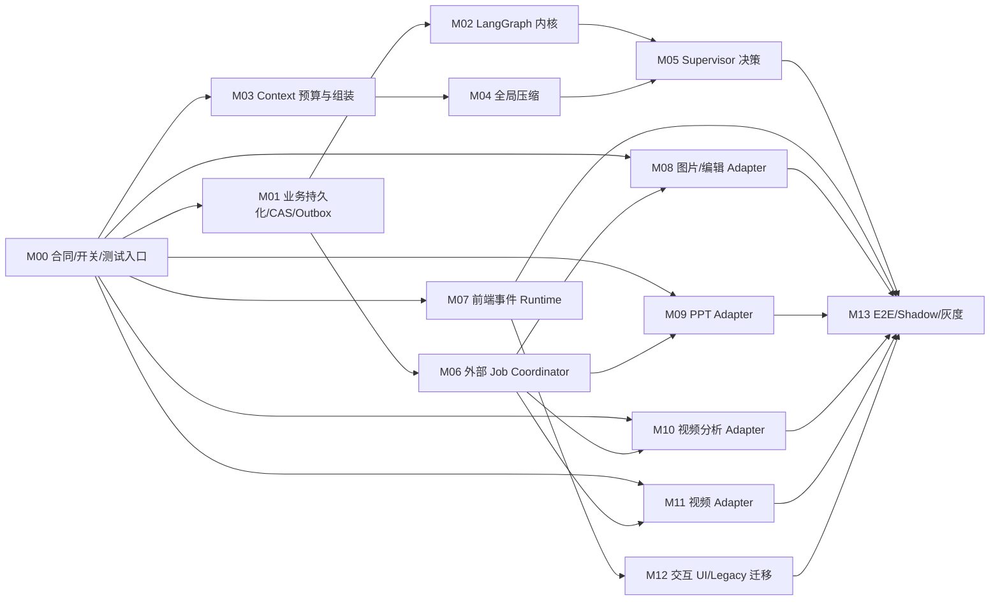

# PixelFlow Agent 化：两人并行模块与 65 个开发切片

> 基线提交：`02493711e8c9b74ec5f8e54cfadac3881297754c`；日常业务分支 `feature/dev_0.8.4_boguan`，Agent 集成分支 `feature/agent_0.8.4_boguan`。
>
> 规则：每个切片 1–3 小时，必须产生一个可检查的产物和一条验证记录。模块之间通过 M00 冻结合同或 fake Port 并行，不通过互相复制 DTO 并行。

## 1. 两条开发线

| 开发线 | 主责 | 模块 | 独占热点 |
| --- | --- | --- | --- |
| A：Agent Platform | 持久化、LangGraph Runtime、上下文、压缩、Supervisor、外部 job | M01–M06；M00-A.1–M00-A.3 | `tasks/store.py`、ORM/migration、`app.py`、config、新 Agent Router/Runtime |
| B：Workflow & UI | 前端 runtime、四类 workflow adapter、五条流程 UI 迁移 | M07–M12；M00-B.1 | 现有 v2 routers/service 提取、`WorkspacePage.tsx`、`api.ts`、新 supervisor 前端目录 |
| A+B | M00/M13 集成、shadow、灰度、回滚 | M00-I.1、M13 | 共同评审，但每次只有一个集成人写共享候选、文档和发布配置 |

M00 不是 M01–M12 的父编号，而是两条开发线共同依赖的启动模块。M01–M06 属于 A 线，M07–M12 属于 B 线。M00-A、M00-B 从同一个已评审设计/Agent 基线创建两条开发分支并行，各线内部严格串行；A/B 完成后由开发者手动启动一次 M00-I.1 收口。M00 合入并启用自动化后，两条线可使用测试 fake 并行开发不同模块，不需要等待对方真实实现。

## 2. 依赖图与开发波次



开发时 M08–M11 只依赖 M00 的 `OperationPort` fake；合并/真实联调才依赖 M06。因此它们可以和 A 线同时开发。

建议波次：

| 波次 | A 线 | B 线 | 合并检查点 |
| --- | --- | --- | --- |
| W0 | M00-A.1 → A.2 → A.3 串行 | M00-B.1 | M00-I.1 手动启动一次；双分支、跨端合同、自动化和 flag-off 回归 |
| W1 | M01、M03 模块并行 | M07、M08、M09 模块并行 | 各模块内部切片串行；谁先完成谁进入单槽集成队列 |
| W2 | M02（M01 后）、M04（M01+M03 后） | M10、M11；M12 在 M07 后 | fake 合同开发与独立模块门禁 |
| W3 | M06（M01+M02 后）、M05（M02–M04 后） | M08–M11 真实联调 | 持久化 job、Supervisor 和复杂流程联调 |
| W7 | M13，共同 | M13，共同 | 全量、shadow、灰度、回滚 |

## 3. 模块清单

### M00：合同、分支自动化、feature flag 与测试入口

- Owner：A 主笔后端，B 主笔前端；共同签字。
- 依赖：无。
- 目标：冻结 action/state/event/API/Port，并交付 dev→agent 自动同步、模块分支/worktree、普通模块自动集成、每日漂移检查和测试入口，确保后续 Codex 不依赖人工记忆执行 Git 流程。
- 分支拓扑：
  - `codex/agent-0.8.4-m00-a`：A 串行完成 M00-A.1–M00-A.3。
  - `codex/agent-0.8.4-m00-b`：B 完成 M00-B.1，可与 A 线并行。
  - `codex/integrate-m00-YYYYMMDD-HHMM`：M00-I.1 按需创建的一次性集成候选，不作为第三条长期开发分支。
- 并行状态所有权：A 只更新 `status/M00-A-status.md`，B 只更新 `status/M00-B-status.md`；汇总 `status/M00-status.md` 在 M00-I.1 由唯一集成人更新。
- 主要文件：
  - 新建 `backend/pixelflow/agent_runtime/contracts/**`
  - 新建 `backend/pixelflow/agent_runtime/ports.py`
  - 新建 `web/src/lib/supervisor/contracts.ts`
  - 新建 `backend/tests/fixtures/agent_runtime/*.json`
  - 新建 `web/tests/fixtures/agent-runtime/*.json`（如前端测试必须本地读取，只能由 M00-A.2 规范 fixture 生成并校验 hash，不允许手工形成第二权威源）
  - 新建 `scripts/agentization/*.ps1`
  - 新建 `scripts/agentization/tests/*.Tests.ps1`
  - 修改 `.gitignore`，跟踪本设计目录并忽略项目内 `.worktrees/`
  - 修改 `web/package.json`（单一 owner：B）

| 切片 | 时长 | Owner | 执行分支 | 产物 | 验证/并行条件 |
| --- | ---: | --- | --- | --- | --- |
| M00-A.1 | 2h | A | `m00-a` | characterization tests，锁定旧人工确认、pending job、额度暂停、下载完成等不变量 | 旧定向测试保持绿；A 线串行前置 |
| M00-A.2 | 3h | A | `m00-a` | Python action/workflow/turn/event/context DTO、Ports、fake 与规范 JSON fixture | Python 合同和 fake Port 测试；依赖 A.1 |
| M00-A.3 | 3h | A | `m00-a` | dev→agent、模块分支/worktree、普通模块自动集成和每日漂移检查 PowerShell 脚本 | Pester/临时仓库验证；依赖 A.2；不实现切片子分支 |
| M00-B.1 | 2.5h | B | `m00-b` | TypeScript 镜像合同、wire event 校验、web 测试入口；不得改写 Python DTO/fixture | Node 合同测试；与 A 线并行，设计源为已评审 `contracts-v1.md` |
| M00-I.1 | 3h | A+B 评审、单一集成人写入 | 临时 `integrate-m00-*` | 顺序纳入 A/B，接入 Gitee/Jenkins 门禁、跨平台测试聚合、完整 A/B 逐切片话术和自动化状态验收 | 跨端 fixture、dev-sync guard、`build-prod`、ready 自动集成与 02:00 调度；由开发者手动启动一次 |

M00-I.1 在临时候选内执行固定顺序：`最新 Agent + 最新 dev → m00-a → 定向测试 → m00-b → 跨端/全量/flag-off/自动化门禁`。如果 A/B 不是从同一设计/Agent 基线创建，或者任一分支修改了对方锁定路径，必须 fail-closed，不允许靠现场手工挑选字段解决。

模块闸门：Python/TS 对同一 fixture 解析一致；开关默认 `off`；现有接口 OpenAPI 无删除或改名；模块开始/合并脚本都能证明最新 dev SHA 是候选祖先；冲突/失败时 Agent 主干不变；未配置远端流水线时不能标记 `automation_active`。

### M01：业务持久化、CAS、Turn Inbox 与 Event Outbox

- Owner：A。
- 依赖：M00。
- 目标：把 Agent 运行需要的业务投影、输入排队、事件和幂等从进程内状态移到 SQL/Memory Store。
- 独占文件：`backend/pixelflow/tasks/store.py`、相关 ORM/model/migration、新 `agent_runtime/persistence/**`。

| 切片 | 时长 | 产物 | 验证 |
| --- | ---: | --- | --- |
| M01.1 | 2.5h | Workflow/Turn/Summary/Event/Operation 数据模型与 additive migration | migration upgrade/downgrade 结构测试 |
| M01.2 | 3h | SQL/Memory Repository Port 实现，按 user_id 隔离 | 双实现合同测试 |
| M01.3 | 2.5h | conversation `revision`、行锁/CAS 和服务端保留 namespace，防止前端 context 全量覆盖 | 并发更新/剪映 context 回归 |
| M01.4 | 2h | Turn Inbox 幂等与按 conversation 顺序领取 | 相同 `client_input_id` 不重复；并发顺序测试 |
| M01.5 | 2h | Event Outbox 单调 sequence、cursor 查询和 claim | 重复投递、gap、跨用户 404 测试 |

模块闸门：关闭 Agent 开关时旧 Store 测试全绿；并发 context 保存不覆盖 `__agent_runtime` 和剪映状态。

### M02：LangGraph 会话/Workflow 内核

- Owner：A。
- 依赖：M00、M01。
- 目标：建立独立新 graph ID、checkpointer namespace、interrupt/resume 和投影骨架，不修改旧 `pixelflow` graph。
- 主要文件：`backend/pixelflow/agent_runtime/graph/**`、`backend/app/gateway/pixelflow_agent_runtime.py`、`backend/langgraph.json`。

| 切片 | 时长 | 产物 | 验证 |
| --- | ---: | --- | --- |
| M02.1 | 2h | SupervisorState reducer、thread/checkpoint namespace 生成器 | state/reducer/namespace 单测 |
| M02.2 | 2.5h | fake workflow registry + command dispatcher | 多 workflow 定位与隔离测试 |
| M02.3 | 2.5h | interrupt/resume、Command 转换、projection 顺序 | 重启后从原 interrupt 恢复测试 |
| M02.4 | 2h | 新 runtime composition、graph ID、lifespan cleanup | gateway runtime 与旧 graph 回归 |

模块闸门：旧 `/agent/flows` 不变；新图可用 Memory/SQLite checkpointer 从中断点恢复；跨 conversation 不串状态。

### M03：模型档案、Token 预算与 ContextEnvelope

- Owner：A。
- 依赖：M00；可与 M01/M02 并行开发，最终接 Store。
- 目标：任何 Agent/节点都通过同一 Context Runtime 获取输入，模型窗口未知时保守降级。
- 主要文件：`backend/pixelflow/agent_runtime/context/profiles.py`、`token_meter.py`、`assembler.py`、`externalizer.py`。

| 切片 | 时长 | 产物 | 验证 |
| --- | ---: | --- | --- |
| M03.1 | 2h | `ModelContextProfile`、过期/未验证降级和配置解析 | 256K/384K/512K/128K 档案测试 |
| M03.2 | 2.5h | TokenMeter 与 usable budget 计算，输出 safety/output reserve | 边界百分比测试 |
| M03.3 | 2.5h | ContextEnvelope assembler：当前输入、目标 workflow、最近消息、摘要、PowerMem、artifact 引用 | 相关性、顺序、用户隔离测试 |
| M03.4 | 2h | 大 tool/artifact 输出外置和最小片段提取 | business contract hash 不变；prompt 大小下降测试 |

模块闸门：未经验证模型绝不使用放大窗口；当前用户输入和目标任务权威字段不能被裁剪。

### M04：全流程上下文压缩 Runtime

- Owner：A。
- 依赖：M01、M03。
- 目标：实现 60/72/85/92 四级策略、结构化摘要、压缩锁、输入排队和前端可感知事件。
- 主要文件：`backend/pixelflow/agent_runtime/context/compaction.py`、`summaries.py`、`verification.py`。

| 切片 | 时长 | 产物 | 验证 |
| --- | ---: | --- | --- |
| M04.1 | 2h | StructuredSummary schema、版本链、覆盖范围和证据引用 Repository | round-trip 与证据有效性测试 |
| M04.2 | 3h | 增量 SummaryBuilder，复用 DeerFlow token/summary 能力并保持业务 context 分离 | 旧摘要 + 新消息增量测试 |
| M04.3 | 2.5h | 60/72/85/92 Coordinator、45% 回落目标、分块/层级压缩 | 四阈值和超大输入测试 |
| M04.4 | 2h | conversation 压缩锁、turn queued/processing 迁移、失败恢复 | 并发输入不丢失/不重发测试 |
| M04.5 | 2.5h | started/progress/completed/failed outbox 事件与 SummaryVerifier | 关键事实 100% 保留专项测试 |

模块闸门：原消息未删除；Plan/合同/资产清单/pending job hash 不变；压缩失败不会继续超窗或触发计费动作。

### M05：Supervisor 决策与目标解析

- Owner：A。
- 依赖：M02、M03、M04。
- 目标：理解回答/继续/修改/重生成/重试/新建/切换/取消/追问，并安全派发。
- 主要文件：`backend/pixelflow/agent_runtime/supervisor/**`、`backend/tests/fixtures/supervisor_golden_cases.json`。

| 切片 | 时长 | 产物 | 验证 |
| --- | ---: | --- | --- |
| M05.1 | 2.5h | 显式按钮、reply、artifact、@mention、动词的 deterministic resolver | 纯规则单测 |
| M05.2 | 3h | LLM structured classifier/prompt，输出冻结 ActionDecision | 模型 fake、解析修复和失败测试 |
| M05.3 | 2.5h | DecisionValidator、allowed-actions、context version 和计费风险闸门 | 非法转换/低置信度/歧义测试 |
| M05.4 | 2h | clarification、answer-only 和 workflow command 图路由 | 状态不变/interrupt 测试 |
| M05.5 | 2h | 中文黄金集与离线评估报告 | action/target/clarify/误计费指标达标 |

模块闸门：黄金集 action ≥92%、target ≥95%、歧义追问召回 ≥95%、计费误执行 0。

### M06：持久化 External Job Coordinator

- Owner：A。
- 依赖：M01、M02；对 workflow 提供 M00 Port。
- 目标：统一图片、视频、PPT、分析、剪映长任务的 start claim、lease poll、完成恢复，解决重启丢 job/重复计费。
- 主要文件：`backend/pixelflow/agent_runtime/jobs/**`、runtime lifespan、operation store。

| 切片 | 时长 | 产物 | 验证 |
| --- | ---: | --- | --- |
| M06.1 | 2.5h | operation idempotency key、request hash、状态转换表 | 重复 start claim 测试 |
| M06.2 | 3h | 数据库 lease/heartbeat/next_poll_at 与过期接管 | 两 worker 竞争测试 |
| M06.3 | 2.5h | ProviderJobAdapter 与现有 start/status Service fake | 成功/业务失败/402/超时映射测试 |
| M06.4 | 2.5h | 完成事件、workflow graph resume、终态 claim | crash window 与重复终态测试 |
| M06.5 | 2h | shutdown/restart recovery、job 404/expired 手动恢复语义 | 重启集成测试 |

模块闸门：进程重启继续原 job；并发请求只启动一次供应商任务；Authorization 不落库；额度暂停可恢复。

### M07：前端 Supervisor 事件 Runtime

- Owner：B。
- 依赖：M00；使用 mock server 独立开发。
- 目标：新事件 client/reducer/hook，不把新状态机写进 `WorkspacePage.tsx`。
- 主要文件：`web/src/lib/supervisor/**`、`web/src/hooks/useSupervisorConversation.ts`。

| 切片 | 时长 | 产物 | 验证 |
| --- | ---: | --- | --- |
| M07.1 | 2h | Supervisor API transport：snapshot、turn、interrupt、status | request/abort/auth 测试 |
| M07.2 | 2.5h | SSE cursor reconnect、sequence gap 和 snapshot reload | 重复/乱序/断线测试 |
| M07.3 | 2.5h | 纯 reducer：connection/run/compression/input queue | 状态机表驱动测试 |
| M07.4 | 2h | `useSupervisorConversation` 生命周期和切换对话隔离 | AbortController/旧事件拒绝测试 |
| M07.5 | 2h | legacy snapshot → 新 ViewModel adapter | 所有 pending/artifact 双字段 fixture 测试 |

模块闸门：重复事件幂等、gap 可恢复、切换对话不串消息、前端不自动重发后端已接受 turn。

### M08：图片/图片编辑 Workflow Adapter

- Owner：B。
- 依赖：M00；M06 前使用 fake OperationPort。
- 目标：提取可复用 Image Application Service，旧 Router 与新子图共用，不改变接口。
- 主要文件：`backend/pixelflow/agent_workflows/image/**`、`generate/image_service.py`、`pixelflow_image.py` 兼容改造。

| 切片 | 时长 | 产物 | 验证 |
| --- | ---: | --- | --- |
| M08.1 | 2h | characterization tests + 从 router 提取 ImageStage Service | 旧 router 响应等价测试 |
| M08.2 | 2.5h | 普通图片 intake/direction/Plan/prepare/generate 图转换 | fake provider 图测试 |
| M08.3 | 2.5h | 直接编辑：缺原图、参数确认、size/imageSize、失败重开确认 | 图片编辑专项测试 |
| M08.4 | 2h | 结果审核、重新生成、60 秒默认满意、下载投影 | 恢复和任务看板测试 |

模块闸门：旧图片 API 全绿；刷新不重复生成；多图数量、编辑参数和 60 秒语义不变。

### M09：PPT Workflow Adapter

- Owner：B。
- 依赖：M00；M06 前使用 fake OperationPort。
- 目标：将 PPT 六阶段变成可暂停、可页级修改的子图。
- 主要文件：`backend/pixelflow/agent_workflows/ppt/**`、`pixelflow/ppt/service.py`、`pixelflow_ppt.py`。

| 切片 | 时长 | 产物 | 验证 |
| --- | ---: | --- | --- |
| M09.1 | 2h | 提取 SmartPPT Stage Service，旧 Router 兼容 | router/skill 等价测试 |
| M09.2 | 2.5h | summary/update → content JSON → images → file 子图 | 阶段/interrupt 测试 |
| M09.3 | 2h | 大纲确认、文本修改、单页重生成目标定位 | 页级 artifact 测试 |
| M09.4 | 1.5h | pending job 恢复、额度暂停、下载交付投影 | 恢复/构建测试 |

模块闸门：旧 PPT API 全绿；单页修改不重启整套 PPT；只有最终 PPT 下载完成交付。

### M10：视频分析 Workflow Adapter

- Owner：B。
- 依赖：M00；M03 Context Port 使用 fake。
- 目标：统一媒体定位、单/多视频分析和大结果外置。
- 主要文件：`backend/pixelflow/agent_workflows/video_analysis/**`、video analysis service 提取。

| 切片 | 时长 | 产物 | 验证 |
| --- | ---: | --- | --- |
| M10.1 | 1.5h | 提取 media link/storyboard Stage Service | 旧 video router 分析合同测试 |
| M10.2 | 2.5h | 单/多视频路由、OperationPort、结果状态 | fake provider/poll 测试 |
| M10.3 | 2h | 完整 storyboard 外置、摘要和 artifact evidence refs | 大结果 Context 预算测试 |
| M10.4 | 2h | “继续分析/换一个/另开流程”语义和失败恢复 | Supervisor command 集成测试 |

模块闸门：单/多视频行为不变；完整分析可查看但不会每轮塞满模型上下文。

### M11：视频生成 Workflow Adapter

- Owner：B。
- 依赖：M00；M06 前使用 fake OperationPort；最终联调依赖 M05/M06。
- 目标：迁移最复杂长流程，并保持创作合同、资产、分镜、QC、剪映全部语义。
- 主要文件：`backend/pixelflow/agent_workflows/video/**`、video Service 提取、现有 video/Jianying Router 兼容。

| 切片 | 时长 | 产物 | 验证 |
| --- | ---: | --- | --- |
| M11.1 | 3h | intake/direction/Plan/Plan revision/restore 和权威快照 | Plan/版本/合同测试 |
| M11.2 | 3h | 场景包和全局资产图，严格继承 Plan/asset manifest | 资产名称、≤9 引用测试 |
| M11.3 | 3h | 分镜生成、部分失败、恢复、修改单镜与重生成 | operation 幂等/场景恢复测试 |
| M11.4 | 3h | merge、QA/QC、额度暂停、修改循环、最终人工结束 | 视频 router/QC 测试 |
| M11.5 | 2h | 剪映草稿、版本幂等、历史入口和最终下载投影 | 剪映前后端专项测试 |

模块闸门：总时长精确、单镜 4–15 秒、Plan→场景包逐字/逐资产继承；视频不自动结束；剪映只用成功分镜。

### M12：交互 UI、双运行时与 Legacy 迁移

- Owner：B。
- 依赖：M07；业务卡片可使用 fixture。
- 目标：让同一文本框能够提交自由输入、artifact 定向命令和压缩期队列，同时保留旧对话。
- 独占热点：`WorkspacePage.tsx`、`ChatPanel.tsx`、`Composer.tsx`、`api.ts`。

| 切片 | 时长 | 产物 | 验证 |
| --- | ---: | --- | --- |
| M12.1 | 2h | `orchestration_mode` 挂载：legacy runner 与 supervisor hook 二选一 | 新旧对话切换测试 |
| M12.2 | 2h | 拆分单一 `busy` 为 composer/artifact/runtime 三类策略 | 交互 enable/disable 测试 |
| M12.3 | 2h | 压缩开始/进度/完成/失败 Notice 与排队 badge | reducer/UI 合同测试 |
| M12.4 | 2.5h | reply/artifact refs/interrupt ID/场景 mention 元数据提交 | 目标定位 fixture 测试 |
| M12.5 | 2.5h | message.upserted、workflow.progressed、历史恢复和 task board 投影 | 全部前端恢复测试 + build-prod |

模块闸门：旧 `frontend_v2` 对话完全不走新 start；`supervisor_v1` 对话完全不从前端启动供应商阶段；切换对话不串流。

### M13：集成、Shadow、灰度、回滚与交付

- Owner：A+B；每次合并只有一个集成人。
- 依赖：M01–M12。
- 目标：证明模块拼起来可运行、可观察、可停用、可恢复。

| 切片 | 时长 | 产物 | 验证 |
| --- | ---: | --- | --- |
| M13.1 | 2.5h | Agent 集成分支累计结果、migration、配置与 OpenAPI 总检查 | 默认 off 全量回归 |
| M13.2 | 3h | Supervisor replay/shadow 比较；禁止 shadow 触发计费和 PowerMem record | 黄金对话和 shadow 指标 |
| M13.3 | 3h | 五主流程 + 直接图片编辑的 mock E2E、重启、断线、并发、402 | `test-matrix.md` 全部非付费项 |
| M13.4 | 2.5h | 内部白名单 → 1% → 5% 灰度与 kill switch/排空回滚演练 | 灰度报告和回滚记录 |
| M13.5 | 2h | 经人工批准的真实供应商冒烟、运行手册、AGENTS/README/最新设计同步 | 真实报告；不泄漏凭据 |

模块闸门：默认关闭无回归；重复计费/跨会话污染/鉴权泄漏/job 丢失为 0；回滚不强切运行中对话。

## 4. 工时估算

| 范围 | 净人时 |
| --- | ---: |
| M00 合同、分支自动化与门禁 | 13.5h |
| M01–M06 Agent Platform | 67h |
| M07–M12 Workflow & UI | 61h |
| M13 集成与发布 | 13h |
| 合计 | 约 155h |
| 加 20% 合并、联调、分支自动化和外部环境缓冲 | 约 186h |

两人每天各 6–7 小时有效开发/验证，考虑 W0/W7 的串行评审和视频真实联调，建议对外承诺 **15–19 个工作日（约 3–4 周）**。其中：

- 第 1 周目标：M00 自动分支/合同门禁、M01/M07、M02/M08 合入，图片 Agent 在 fake 环境贯通。
- 第 2 周目标：持久化 job、上下文/压缩、PPT、视频分析合入。
- 第 3 周目标：Supervisor、视频子图、UI 双运行时、mock E2E。
- 第 4 周缓冲：shadow、真实供应商、灰度和缺陷修复；进展顺利时可提前结束。

不要把约 155h 简单除以两人八小时：合同评审、分支同步门禁、顺序合并、真实长任务和灰度不能完全并行。

## 5. 每个小任务的执行协议

开始前：

1. 在对应模块状态文件写 `in_progress`、base SHA、branch、当前切片、唯一写入者和文件锁。
2. 只有模块第一个切片检查 dev→agent 同步并从最新 Agent SHA 创建模块分支/worktree；中间切片恢复同一模块分支/worktree。
3. 先写或确认失败测试，再写最小实现。

完成后：

1. 运行定向测试和 `git diff --check`。
2. 更新状态文件：已完成、修改文件、测试命令/结果、决策、commit/push 和下一切片第一步。
3. 当前切片完成后 Codex 必须停止，等待开发者手动发送“继续下一个未完成切片”；不得自动连续完成整个模块。
4. 不跨模块顺手修复；发现问题记入模块状态或 `integration/DECISIONS.md`。

模块最后一个切片完成后：

1. 运行模块闸门和 feature flag 关闭回归。
2. 另一位开发者或独立 reviewer 基于最新提交复跑关键测试。
3. 写入 `ready_for_integration` 并 push 后停止；M00 验收后的远端单槽流水线自动按“最新 Agent + 最新 dev + 模块分支”集成并追加 `MERGE_LOG.md`。
4. 集成冲突或测试失败时写 `integration_blocked`，保持 Agent 主干不变；已推送模块分支不得 force-push 改写历史。

### 可直接复制给 Codex 的完整话术

以下话术必须保持可独立使用。即使 Codex 看不到旧聊天，也必须先读 `AGENTS.md` 和仓库状态后再执行。

A 普通模块首次开始（以 M01 为例）：

```text
不要依赖任何旧对话内容。严格先阅读仓库根目录 AGENTS.md、docs/pixelflow-agent-skill-flow-latest-design.md、docs/agentization/README.md、docs/agentization/architecture-design.md、docs/agentization/contracts-v1.md、docs/agentization/work-breakdown.md、docs/agentization/branch-and-codex-runbook.md、docs/agentization/test-matrix.md、docs/agentization/status/BOARD.md 和 docs/agentization/status/M01-status.md。你是 A 开发线 Codex，请全自动执行 M01 的第一个未完成切片。验证依赖后执行 dev→agent 安全预检，创建或恢复 codex/agent-0.8.4-m01-runtime-store 及独立模块 worktree。模块内部所有切片严格串行，本次只完成一个切片；完成 TDD、定向/边界测试、独立审核、状态/测试记录、独立 commit 和 push 后停止并报告下一切片。不得建立切片子分支/worktree，不得自动继续整个模块，不得直接修改两个长期 feature 分支；只有运行手册定义的硬阻塞才询问。
```

A 新开对话继续普通模块：

```text
不要依赖任何旧对话内容。请先阅读仓库根目录 AGENTS.md、全部 docs/agentization 开发入口文档和目标 A 线模块状态文件；检查远端模块分支、最近 commit、worktree、用户改动、上一切片证据和当前唯一写入者，确认安全后只执行 A 线目标模块的下一个未完成切片。自动恢复同一模块分支/worktree，完成 TDD、测试、独立审核、状态记录、独立 commit 和 push 后停止。不得自动进入再下一片，不得创建切片子分支，不得直接修改两个长期 feature 分支。如果这是最后一片，运行模块门禁，绿色后写 ready_for_integration 并 push，然后停止等待远端单槽流水线；只有硬阻塞才询问。
```

B 普通模块首次开始（以 M07 为例）：

```text
不要依赖任何旧对话内容。严格先阅读仓库根目录 AGENTS.md、docs/pixelflow-agent-skill-flow-latest-design.md、docs/agentization/README.md、docs/agentization/architecture-design.md、docs/agentization/contracts-v1.md、docs/agentization/work-breakdown.md、docs/agentization/branch-and-codex-runbook.md、docs/agentization/test-matrix.md、docs/agentization/status/BOARD.md 和 docs/agentization/status/M07-status.md。你是 B 开发线 Codex，请全自动执行 M07 的第一个未完成切片。验证依赖后执行 dev→agent 安全预检，创建或恢复 codex/agent-0.8.4-m07-web-runtime 及独立模块 worktree。模块内部所有切片严格串行，本次只完成一个切片；完成 TDD、定向/边界测试、独立审核、状态/测试记录、独立 commit 和 push 后停止并报告下一切片。不得建立切片子分支/worktree，不得自动继续整个模块，不得直接修改两个长期 feature 分支；只有运行手册定义的硬阻塞才询问。
```

B 新开对话继续普通模块：

```text
不要依赖任何旧对话内容。请先阅读仓库根目录 AGENTS.md、全部 docs/agentization 开发入口文档和目标 B 线模块状态文件；检查远端模块分支、最近 commit、worktree、用户改动、上一切片证据和当前唯一写入者，确认安全后只执行 B 线目标模块的下一个未完成切片。自动恢复同一模块分支/worktree，完成 TDD、测试、独立审核、状态记录、独立 commit 和 push 后停止。不得自动进入再下一片，不得创建切片子分支，不得直接修改两个长期 feature 分支。如果这是最后一片，运行模块门禁，绿色后写 ready_for_integration 并 push，然后停止等待远端单槽流水线；只有硬阻塞才询问。
```

M00-A 首次与继续话术：

```text
不要依赖任何旧对话内容。先完整阅读根目录 AGENTS.md、全部 docs/agentization 开发入口、status/M00-status.md 和 status/M00-A-status.md。你是 A 线 Codex，请执行 M00-A 的第一个或下一个未完成切片；首次时从同步后的共同 Agent 基线创建 codex/agent-0.8.4-m00-a，继续时恢复该分支/worktree。M00-A 内部严格串行，本次只完成一个切片；完成 TDD、测试、独立审核、状态记录、独立 commit 和 push 后停止。不得自动继续下一片，不得修改 M00-B 或两个长期 feature 分支。
```

M00-B 首次与继续话术：

```text
不要依赖任何旧对话内容。先完整阅读根目录 AGENTS.md、全部 docs/agentization 开发入口、status/M00-status.md 和 status/M00-B-status.md。你是 B 线 Codex，请执行 M00-B 的第一个或下一个未完成切片；首次时从与 M00-A 相同的共同 Agent 基线创建 codex/agent-0.8.4-m00-b，继续时恢复该分支/worktree。M00-B 内部严格串行，本次只完成一个切片；严格按 contracts-v1.md 实现前端镜像，Python DTO/fixture 只读。完成 TDD、测试、独立审核、状态记录、独立 commit 和 push 后停止。不得修改 M00-A 或两个长期 feature 分支。
```

普通模块集成不需要开发者另开 Codex：最后一个切片写 `ready_for_integration` 并 push 后，由 M00 交付的 Gitee/Jenkins 单槽流水线自动执行。未达到 `automation_active` 时必须 fail-closed，并报告仍需完成的远端配置。

M00 专用集成话术：

```text
不要依赖任何旧对话内容。请先阅读仓库根目录 AGENTS.md、docs/agentization/branch-and-codex-runbook.md、work-breakdown.md、test-matrix.md、status/M00-status.md、status/M00-A-status.md、status/M00-B-status.md 和 integration/MERGE_LOG.md；严格执行 M00-I.1。确认 M00-A/M00-B 全部完成并已 push 后，创建临时 codex/integrate-m00-YYYYMMDD-HHMM，按“最新 Agent + 最新 dev → m00-a → 定向测试 → m00-b → 跨端/全量/flag-off/自动化门禁”集成。完成独立审核和一次性 Gitee/Jenkins 配置验收；只有全部绿色且远端基线未变化时才更新 feature/agent_0.8.4_boguan、状态和 MERGE_LOG，否则保持长期分支不变并报告证据。不得把未实际配置的远端能力标记为 automation_active。
```

### 多 Codex 对话并行规则

并行单位固定为模块：

- A 可同时开发依赖已满足的 2–3 个 A 模块，B 同理；每个模块使用独立分支/worktree和独立 Codex 任务。
- 同一模块只有一个写入 Codex，所有切片串行；第二个对话只能只读审核，或等待前一片 commit/push 并释放写入权后接续。
- 禁止切片子分支、切片 worktree、`parallel_safe` 和同模块切片合并流程。
- 每个 Codex 开场必须包含开发线、模块 ID、当前切片、状态文件、模块分支、允许/禁止路径和验证要求。
- A 在 M00 后优先并行 M01/M03；B 可并行 M07/M08/M09。其他组合必须先检查依赖和文件所有权。

## 6. Codex 模式建议

- 机械 DTO、Repository 双实现、fixture、简单 reducer：GPT-5.6-sol 高思考。
- M00 合同、M04 摘要事实保护、M05 Supervisor 决策、M06 crash window、M11 视频合同、M13 灰度/回滚：GPT-5.6-sol 极高思考用于方案复核和 code review。
- 每个 Codex 对话只领取一个 1–3h 切片；实现前使用 `superpowers:test-driven-development`，完成前使用 `superpowers:verification-before-completion`。
- 不使用子 agent 同时实现同一模块的不同切片；独立 reviewer 可以只读并行，但写入仍由当前切片唯一 Codex 完成。
