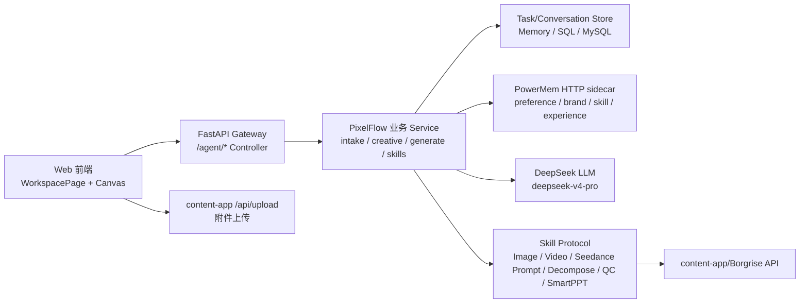
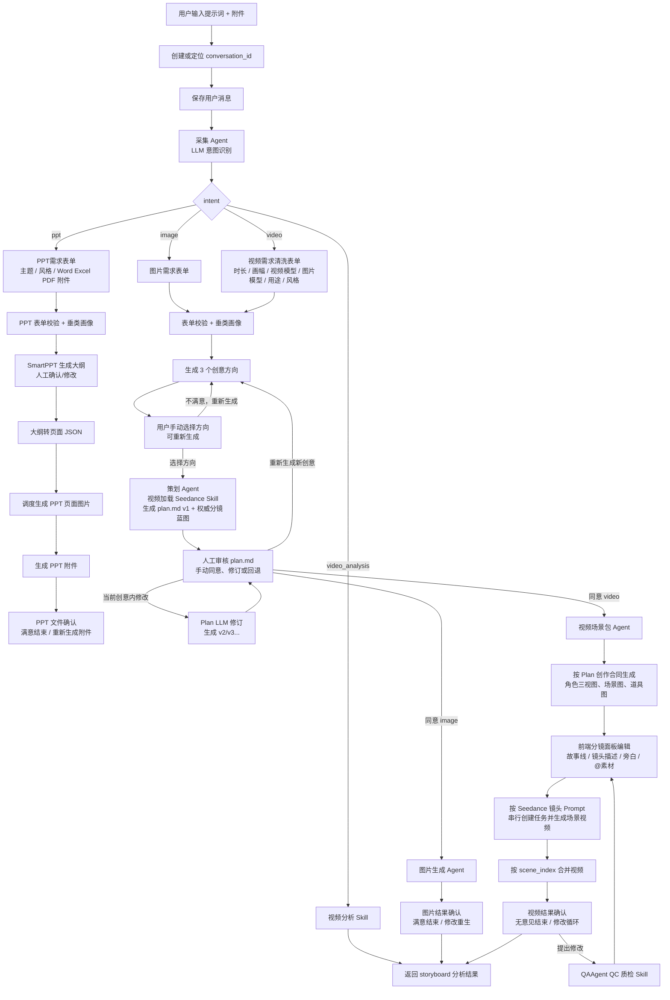
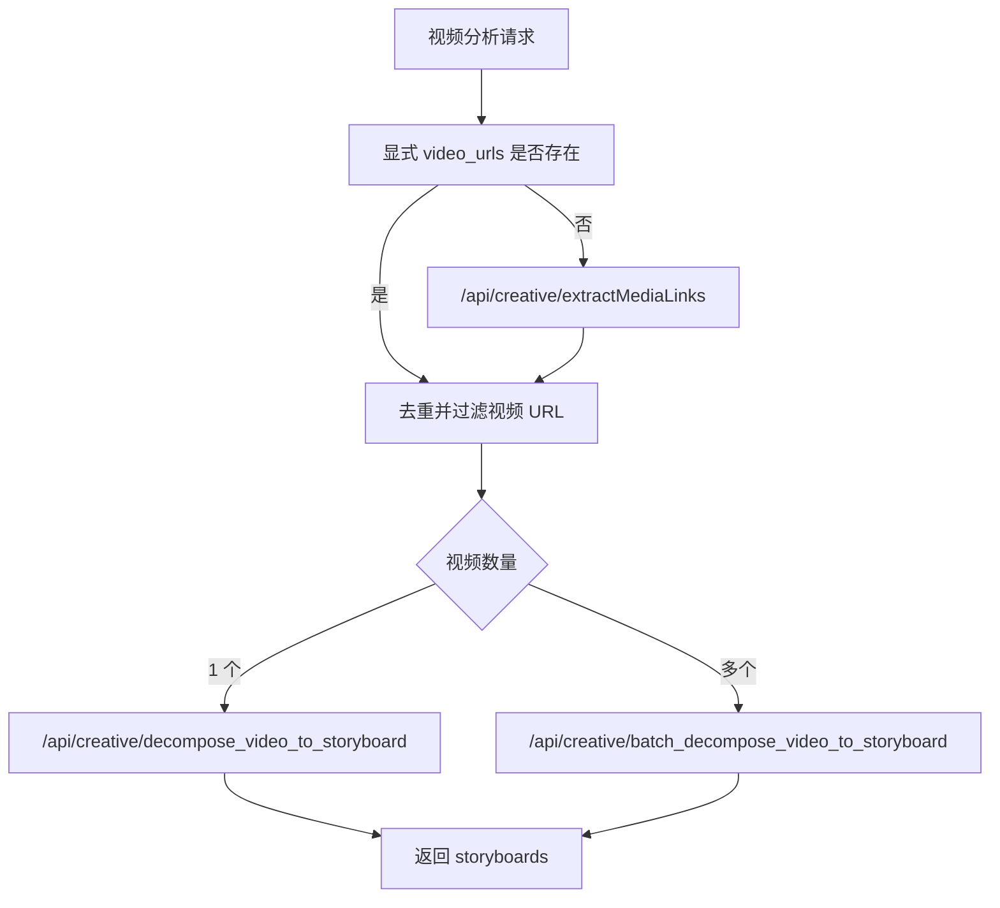
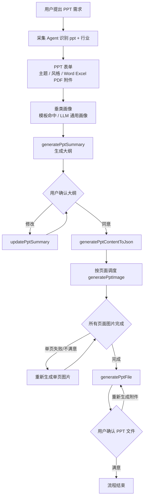
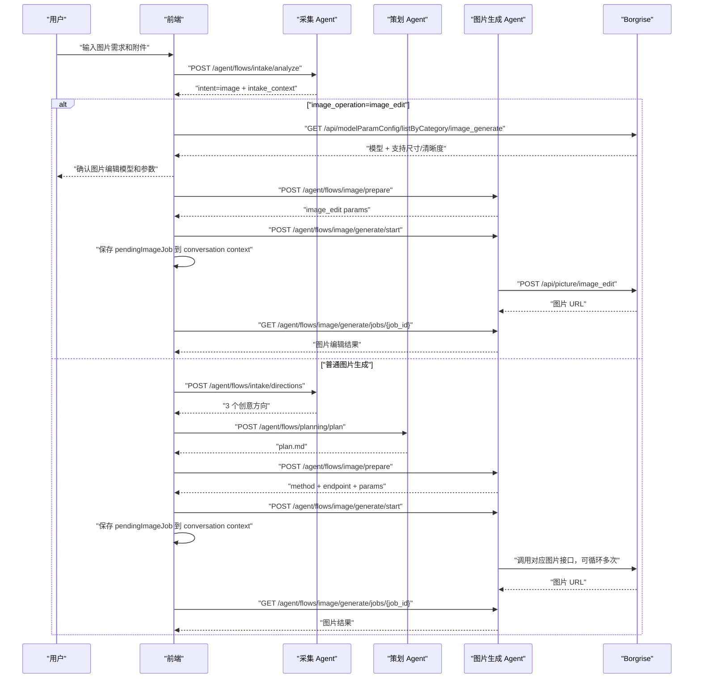
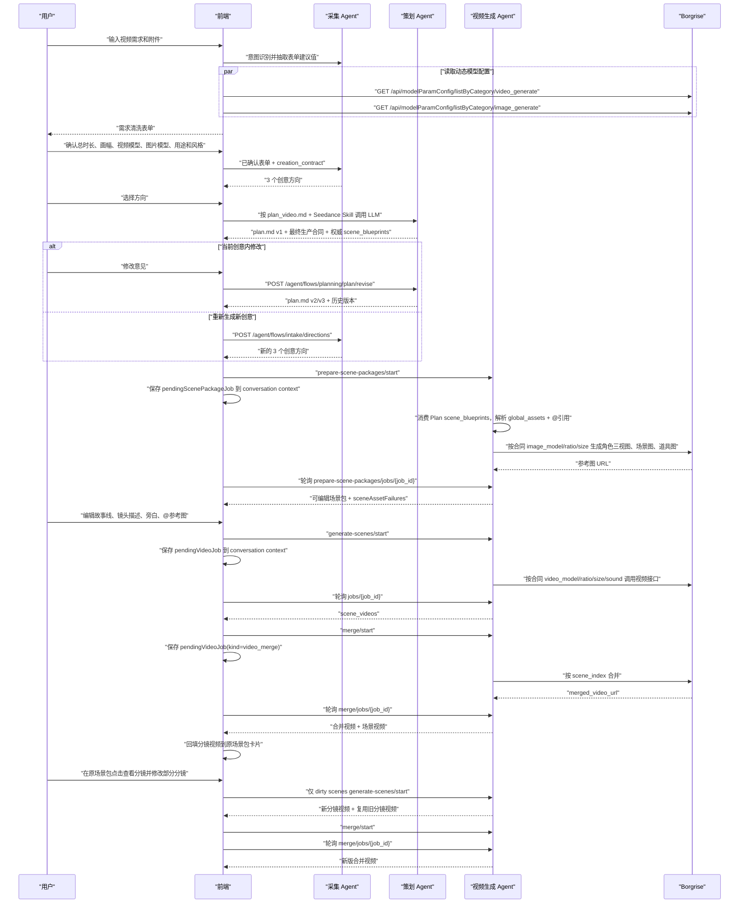
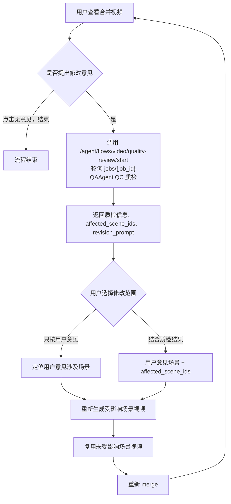

# PixelFlow Agent/Skill 最新流程设计

更新时间：2026-07-14
适用代码：当前 `pixelflow` 仓库最新前后端实现
维护要求：以后只要 Agent 流程、Skill 边界、content-app/Borgrise 接口合同、前端确认/重试逻辑发生变化，本文件必须同步修改。

## 1. 设计目标

PixelFlow 不是一个自由闲聊 Agent，而是一个围绕“电商图片/视频/视频分析/PPT制作”的阶段化 Agent 工作台。它需要同时满足：

- 用户用自然语言和附件发起需求。
- 采集阶段用 LLM 理解意图、主体、行业、数量、素材含义。
- 所有需要用户确认的节点都能落到前端对话里，并且能保存和恢复。
- 图片、视频、视频分析、PPT制作最终都通过 content-app/Borgrise 能力落地。
- 用户/品牌长期偏好和 Agent 经验沉淀通过 PowerMem HTTP sidecar 作为语义记忆被读取和记录。
- 额度不足、业务失败、网络异常要可解释；额度不足后用户充值回来仍能从当前对话继续。
- 新增 Python 接口必须以 `/agent` 开头，前端直接上传附件到 content-app `/api/upload`。

## 2. 总体架构



分层类比：

| 层 | 位置 | Java 类比 | 职责 |
| --- | --- | --- | --- |
| Web 前端 | `web/src/pages/WorkspacePage.tsx` | 页面 + 前端 Service 编排 | 对话、表单、确认、分镜编辑、轮询 |
| Gateway Controller | `backend/app/gateway/routers/` | Spring Controller | HTTP 入参/出参、鉴权、状态码 |
| PixelFlow Domain | `backend/pixelflow/` | Domain Service + DTO | 意图、表单、plan、生成参数、场景包 |
| Skill Protocol | `backend/pixelflow/skills/base.py` | Java interface | 第三方能力稳定接口 |
| Skill Impl | `backend/pixelflow/skills/borgrise/` | Feign/HTTP Client | content-app/Borgrise 调用、轮询、错误归一 |
| Store | `backend/pixelflow/tasks/` | Repository/DAO | 任务、会话、消息、资产、上下文 |
| Semantic Memory | `backend/pixelflow/memory/` + `app/gateway/pixelflow_memory.py` | 独立 Memory Client / Service | PowerMem 检索与写入，失败开放 |
| DeerFlow Harness | `backend/packages/harness/deerflow/` | 平台基础设施 | thread/run、checkpointer、sandbox、skills |

## 3. 当前前端主流程



## 4. Agent 职责

| Agent | Controller / Service | 输入 | 输出 | 备注 |
| --- | --- | --- | --- | --- |
| 采集 Agent | `pixelflow_intake.py`、`intake/llm.py`、`intake/forms.py` | 用户提示词、附件 materials、历史上下文 | intent、表单建议值、行业类型、数量、创意方向 | LLM 用 `deepseek-v4-pro`；视频会抽取总时长、画幅、视频模型、图片模型、用途和风格，但必须经用户表单确认后才能进入创意方向 |
| 策划 Agent | `pixelflow_planning.py`、`creative/plan_markdown.py`、`creative/plan_llm.py`、`creative/scene_blueprint.py` | 表单、创意方向、行业画像、素材、intake_context、创作合同 | plan.md、权威 `scene_blueprints`、模板路径、版本历史、最终生产合同、一致性问题 | 视频 Plan 同时加载 Seedance Skill，由 LLM 自主完成总分总结构、镜头调度和精确时长分配；失败时按叙事职能加权兜底 |
| 人工审核 Agent | `WorkspacePage.tsx` | plan.md、图片结果、视频结果、用户反馈 | 同意、修改模式、回退版本、重试指令 | “当前创意内修改”只生成下一版 Plan；只有明确选择“重新生成新创意”才返回 3 个创意方向；历史版本可回退 |
| 图片生成 Agent | `pixelflow_image.py`、`generate/image_prepare.py` | plan.md、表单、素材、修改意见、数量 | 图片生成参数、图片结果 | 根据语义选择四类图片接口 |
| 视频生成 Agent | `pixelflow_video.py`、`generate/scene_packages.py`、`generate/seedance_prompt.py` | 当前版本 plan.md、`scene_blueprints`、最终生产合同、素材、场景编辑结果 | 场景包、参考图、场景视频、合并视频 | 场景包直接消费 Plan 蓝图且只解析全局资产与 @引用，不得另写一套故事；主流程仍是多场景片段生成后合并 |
| 视频分析 Agent | `pixelflow_video.py` | 文本和素材中的视频链接 | 单视频或多视频 storyboard | 先抽取媒体链接，再判断单个/批量 |
| PPT制作 Agent | `pixelflow_ppt.py`、`intake/forms.py`、`skills/borgrise/run_generation.py` | PPT主题、风格、Word/Excel/PDF 附件、行业画像 | PPT大纲、页面JSON、页面图片、PPT文件 | 每一步是 content-app 异步任务，Python 后端 job 轮询 |
| 对话恢复 Agent | `pixelflow_conversations.py`、`tasks/store.py` | conversation_id、user_id | 对话详情、消息、上下文 | 防止切换对话时异步结果串到当前页 |
| 语义记忆 Service | `pixelflow/memory/service.py`、`app/gateway/pixelflow_memory.py` | 用户 ID、业务查询、阶段摘要 | PowerMem 记忆检索和写入 | 所有新增 Agent/流程都必须复用这一层，不直接拼 PowerMem HTTP |

## 5. Skill 清单

### 5.1 采集类 Skill

| Skill | 代码位置 | 作用 | 失败策略 |
| --- | --- | --- | --- |
| IntentRecognitionSkill | `backend/pixelflow/intake/llm.py` | 识别 `image` / `video` / `ppt` / `video_analysis`，抽取主体、目标、行业、数量；视频额外抽取时长、画幅、视频模型、图片模型、用途和风格 | LLM 失败时用关键词 fallback，并保留表单人工确认 |
| FormSchemaSkill | `backend/pixelflow/intake/forms.py` | 返回图片/视频/PPT表单 schema | 本地纯逻辑 |
| FormValidationSkill | `backend/pixelflow/intake/forms.py` | 检查必填字段，最多 3 轮 | 超 3 轮终止并友好提示 |
| IndustryProfileSkill | `backend/pixelflow/intake/industry_profile.py` | 命中垂类模板或用 LLM 生成行业创作画像 | LLM 失败时通用电商兜底 |
| CreativeDirectionSkill | `backend/pixelflow/intake/llm.py` | 生成 3 个可进入 plan.md 的创意方向 | LLM 失败时本地兜底方向 |

垂类模板路径：

```text
backend/skills/public/borgrise-creative-assistant-v2/templates/industry_profile.md
```

### 5.2 策划类 Skill

| Skill | 代码位置 | 作用 |
| --- | --- | --- |
| PlanTemplateFillSkill | `backend/pixelflow/creative/plan_markdown.py`、`creative/plan_llm.py` | 读取图片/视频独立模板；视频同时加载 Seedance Skill，让 LLM 生成 plan.md 与结构化分镜蓝图 |
| PlanSceneBlueprintSkill | `backend/pixelflow/creative/scene_blueprint.py`、`generate/seedance_prompt.py` | 规范化分镜叙事职能、连续时间线、故事线、镜头描述、旁白、转场和资产需求；LLM 不可用时按叙事职能加权兜底 |
| PlanConsistencyCheckSkill | `backend/pixelflow/creative/plan_markdown.py`、`creative/contract.py`、`creative/scene_blueprint.py` | 校验用户确认字段、模型能力、场景图片规格、每镜 4-15 秒、秒级镜头描述、总分总结构及精确总时长 |
| PlanRevisionSkill | `backend/pixelflow/creative/plan_markdown.py`、`creative/plan_llm.py` | 在当前创意内修订 Plan，生成新版本并保留历史 |
| PlanRestoreSkill | `backend/pixelflow/creative/plan_markdown.py` | 直接激活所选历史版本，不追加重复版本；恢复对应合同与分镜时长快照 |
| PlanManualEditSkill | `backend/pixelflow/creative/plan_markdown.py`、`web/src/components/canvas/PlanMarkdownEditor.tsx` | 在右侧画布直接编辑完整 Markdown；不调用 LLM，校验后原样发布为下一 Plan 版本并保留权威合同快照 |

plan.md 模板路径：

```text
backend/skills/public/borgrise-creative-assistant-v2/templates/plan_video.md
backend/skills/public/borgrise-creative-assistant-v2/templates/plan_image.md
```

模板只是章节结构和信息密度范例。策划 Agent 必须结合当前表单、选中创意、行业画像、附件、语义记忆和创作合同重新生成内容，禁止把模板中的示例人物、产品或卖点复制到其他任务。语义记忆只影响内部决策，禁止在 plan.md 中展示“长期记忆约束”、PowerMem、Skill/Agent 日志或记忆原文。前端统一把两类结果显示为 `plan.md`。

### 5.3 图片类 Skill

| Skill | 代码位置 | content-app/Borgrise 接口 | 作用 |
| --- | --- | --- | --- |
| ImageEndpointDecisionSkill | `backend/pixelflow/generate/image_prepare.py` | 无 | 根据素材和语义选择图片接口 |
| ImagePromptBuildSkill | `backend/pixelflow/generate/image_prepare.py` | 无 | 组装图片 prompt、ratio、数量、素材 URL |
| ImageModelConfigLookupSkill | `web/src/lib/api.ts` | `/api/modelParamConfig/listByCategory/image_generate` | 图片编辑前查询可选模型、尺寸和清晰度 |
| ImageGenerationJobSkill | `pixelflow_image.py` | `/agent/flows/image/generate/start` + `/jobs/{job_id}` | 图片生成可恢复 job，内部复用下列图片 Skill |
| ImageAssetEditJobSkill | `pixelflow_image.py` | `/agent/flows/image/edit-asset/start` + `/jobs/{job_id}` | 视频场景包全局素材图片编辑可恢复 job |
| ImageAssetFusionJobSkill | `pixelflow_image.py` | `/agent/flows/image/fuse-asset/start` + `/jobs/{job_id}` | 视频场景包全局素材图片融合可恢复 job；前端仅在用户上传素材中存在有效图片格式时调用 |
| TextToImageSkill | `backend/pixelflow/skills/borgrise/run_generation.py` | `/api/picture/text_to_image` | 文生图 |
| ReferenceImageSkill | `backend/pixelflow/skills/borgrise/run_generation.py` | `/api/picture/multi_reference_image_generation` | 参考图生成组图 |
| ImageEditSkill | `backend/pixelflow/skills/borgrise/run_generation.py` | `/api/picture/image_edit` | 图片编辑 |
| MultiImageFusionSkill | `backend/pixelflow/skills/borgrise/run_generation.py` | `/api/picture/multi_image_fusion` | 多图融合成一张 |

图片数量规则：

- 默认 1 张。
- 用户明确说“3 张/4 张/多张”等时，采集阶段写入 `requested_output_count`。
- 生成阶段通过 `params.num_images` 或 `params.max_images` 循环调用，最多 10 张。

图片尺寸规则：

- 前端只展示 `1:1`、`16:9`、`9:16`、`自动适配`。
- `自动适配` 在 `image_prepare.py` 里根据用途和目标映射到供应商支持比例。

### 5.4 视频类 Skill

| Skill | 代码位置 | content-app/Borgrise 接口 | 作用 |
| --- | --- | --- | --- |
| VideoModelConfigLookupSkill | `web/src/lib/api.ts`、`GenParamsDialog.tsx` | `/api/modelParamConfig/listByCategory/video_generate` | 查询启用视频模型及 `aspectRatioList/sizeList/onSoundList/videoDurationList/modelGenerateTypeList/uploadFileTypeList`；展示 content-app 返回的所有启用 Seedance，并把用户所选模型的完整实时能力固化到创作合同；系统推荐优先 `seedance-2.0` |
| SceneImageModelConfigLookupSkill | `web/src/lib/api.ts`、`GenParamsDialog.tsx` | `/api/modelParamConfig/listByCategory/image_generate` | 查询场景资产图片模型及其比例/清晰度能力；用户只选模型，能力范围随表单提交给 Plan Agent |
| ScenePackageSkill | `backend/pixelflow/generate/scene_packages.py` | LLM + 本地规则 | 生成可编辑场景包 |
| SeedanceShotPromptSkill | `backend/pixelflow/generate/seedance_prompt.py` + `backend/skills/public/borgrise-creative-assistant-v2/skills/seedance-prompt/SKILL.md` | 无 | 对 Seedance 全系列通用；按实际 `video_model` 生成秒级镜头描述，并保留 `@asset_id`、mentions 和最多 9 张参考图 |
| SceneAssetImageSkill | `pixelflow_video.py` + Image Skill | `/api/picture/text_to_image` | 生成人物三视图、场景图、道具图 |
| TextToVideoSkill | `run_generation.py` | `/api/video/text-to-video` | 文生视频 |
| ImageToVideoSkill | `run_generation.py` | `/api/video/image-to-video` | 首帧图生视频 |
| TwoImageToVideoSkill | `run_generation.py` | `/api/video/two-image-to-video` | 首尾帧生视频 |
| ReferenceModeVideoSkill | `run_generation.py` | `/api/video/reference-mode-video` | 全能参考模式生视频 |
| EditVideoSkill | `run_generation.py` | `/api/video/edit-video` | 编辑视频 |
| ExtendVideoSkill | `run_generation.py` | `/api/video/extend-video` | 延伸视频 |
| VideoMergeSkill | `run_generation.py` | `/api/video/merge` | 合并视频 |
| VideoQualityReviewSkill | `backend/pixelflow/qc/video_review.py` + `run_generation.py` | `/api/creative/video_quality_review` | QAAgent QC 质检：画面缺陷、商品清晰与露出、Prompt 跑偏、字幕正确性、Brief 一致性、黑屏/卡顿和约束合规 |

视频生成总规则：

- 视频粗略需求不能直接生成创意方向。必须先展示需求清洗表单并由用户确认全部必填字段。
- 视频表单保留产品信息、品类、目标人群、转化目标，并新增/明确：总时长、视频画幅、视频模型、图片模型、视频用途、视觉风格。
- `video_duration_sec` 预设为 30/60/90/180 秒；选择“自定义”后只能提交 4-300 的自然数。前端和 Python 后端都校验。
- 视频模型配置来自 `/api/modelParamConfig/listByCategory/video_generate`，前端展示 content-app 返回的所有启用 Seedance 模型；系统推荐默认解析为 `seedance-2.0`，界面仍展示实际推荐结果。2.0 只是推荐默认值，不是 `seedance-prompt` 的调用开关。
- `seedance-prompt` 对 Seedance 全系列通用；场景包 Prompt 显式携带用户确认的 `video_model`。前端把该模型实时画幅、清晰度、声音、单分镜时长和端点能力完整保存为 `video_model_capabilities`，新采集表单的快照不完整时后端阻止进入创意生成；只有恢复历史对话时兼容旧合同。后端只按合同能力选择参数和端点，不按 Seedance 型号名称猜测能力。
- 视频清晰度下拉只展示当前模型 `sizeList`。切换模型时，已选清晰度不受支持则优先选择 `1080p -> 720p -> 480p` 中当前模型可用的最高档；例如 `seedance-2.0-mini` 和 `seedance-2.0-fast` 当前只支持 `480p/720p`，不得继续携带 `1080p`，否则 content-app 价格配置无法命中。
- `skills/seedance-prompt/THIRD_PARTY_NOTICE.md` 保留两个输入来源、哈希和授权边界，具有来源审计价值，不能当作无用文件删除。
- 图片模型配置来自 `/api/modelParamConfig/listByCategory/image_generate`，默认 `gpt-image-2`。用户不选择图片比例和清晰度；前端把所选模型支持的比例/清晰度列表作为只读能力数据交给 Plan Agent。
- 表单确认值生成权威 `creation_contract`。优先级是“用户确认 > LLM 预填 > 系统默认”，后续创意、Plan、场景包、场景资产和视频生成不得重新猜测或覆盖。
- Plan LLM 只能在 `image_model_capabilities` 范围内选择 `scene_image_ratio` 和 `scene_image_size`。非法输出按确定性规则修正；最终值写入 plan.md 和生产合同，场景资产生成阶段直接使用，不再猜测。
- 主流程不因“文生视频/编辑视频/首帧图生视频”等入口类型而绕过场景包。
- 正常生成视频都先生成多组视频场景片段，再逐段生成视频，最后合并。
- 每段片段最少 4 秒，最多 15 秒。
- 所有片段的整数秒时长总和必须精确等于 `creation_contract.video_duration_sec`；300 秒可以产生超过旧上限 18 个的分镜。
- 场景资产图片必须使用生产合同中的 `image_model + scene_image_ratio + scene_image_size`；分镜视频必须使用 `video_model + video_ratio + video_size + video_sound`，禁止混用图片和视频模型。
- 生成场景视频前，前端允许用户编辑故事线、镜头描述、旁白和 @ 参考图。
- 镜头描述 `shot_description.text` 是一整段文本，时间范围统一使用秒级表达，例如 `0-10秒`、`10-15秒`；后端会归一化 LLM 返回的 `ms` 或 `00:00.000` 时间码，前端不展示毫秒。
- 场景视频 job 内部可以并发调度多个分镜，但所有会创建 content-app 计费生成任务的 POST 都必须经 `run_generation.py` 的进程内串行闸门提交：前一个创建接口返回 taskId 并完成 content-app 扣费确认后，才创建下一个图片或视频任务；`/api/task/{taskId}/status` 轮询不加锁，可以并行等待结果。整体阶段仍必须等所有分镜都成功、失败或额度暂停后，才进入汇总、重试或合并判断。
- 全部分镜成功时，合并视频仍严格按 `scene_index` 排序，不按接口完成顺序排序；前端调用 `/agent/flows/video/merge/start` 启动可恢复合并 job，再轮询 `/agent/flows/video/merge/jobs/{job_id}`。如果只有 1 个分镜，PixelFlow merge job 直接把该分镜视频作为最终视频返回，不调用 content-app `/api/video/merge`。多个分镜合并时，content-app `/api/video/merge` 是同步下载、ffmpeg 合并并上传的接口，不是 task 轮询接口；PixelFlow 用 Python job 包住该同步调用，并使用 `BORGRISE_VIDEO_MERGE_REQUEST_TIMEOUT` 控制合并读等待，默认 1 小时，避免浏览器、网关或 content-app 普通 30 秒读超时截断长视频合并。合并失败时 job 必须返回 `status=failed`，并保留 `result.error`、`result.message`、`result.raw.details` 中的 content-app 原始错误，前端据此展示“视频合并失败”。
- 单个分镜出现可恢复网络或服务异常时最多尝试 3 次；3 次仍失败才写入 `failed_scenes`。HTTP 4xx 参数校验、模型价格配置缺失和实时能力不匹配属于不可重试业务失败，只调用一次并保留 content-app 的 `status_code/data/details`。`failed_scenes` 必须带 `scene_id`、`scene_index`、`error`、`attempts`，前端用于展示具体哪个分镜失败以及失败原因。
- 多个分镜额度不足时，前端只展示一次额度不足提示；额度暂停的分镜也保留在 `failed_scenes` 中。用户充值后点击重试，只重新提交这些额度暂停分镜和普通异常分镜，已成功分镜复用旧视频 URL。
- 生成场景视频前，前端也允许用户点击 `global_assets` 中的角色、场景、道具图片进行预览，并引用到左侧输入框发送图片编辑指令。仅引用素材且没有有效上传图片时走 `/agent/flows/image/edit-asset`，后端复用 `ImageEditSkill` 调用 `/api/picture/image_edit`；如果同一条消息里存在有效上传图片素材，前端改走 `/agent/flows/image/fuse-asset`，后端调用 `MultiImageFusionSkill` 把引用素材图和上传图片融合成新图。进入 job 前前端会先展示图片编辑模型/比例/清晰度确认卡，默认模型 `gpt-image-2`，比例优先保持原素材比例。两条链路成功后只展示候选新图，必须用户点击确认后才替换原全局素材图片，并同步场景包 mentions 中同一 `asset_id` 的 `image_url`；点击重新编辑会基于当前候选图继续弹参数确认卡，不重新走 intake。
- 全局素材预览还支持删除素材。点击删除只会预填左侧固定删除文案和素材 chip，用户发送后由 `WorkspacePage` 在当前场景包 artifact 内原地清理该素材的结构化引用，并清空 `global_assets` 中该素材图片 URL 作为占位符，不推送新的 `video_scene_packages` 卡片。
- 前端对话可以保留多个历史 `video_scene_packages` 卡片，但只有最后一个卡片展示查看、确认生成或重新生成参考图操作；旧卡片不再暴露操作入口。
- 单个场景片段最多 9 张参考图。
- 视频 plan.md 同意后，前端调用 `/agent/flows/video/prepare-scene-packages/start` 启动 Python job，后端在同一个 job 内顺序完成“生成可编辑场景包”和“生成角色三视图、场景图、道具图”。前端拿到 `job_id` 后立即保存 `pendingScenePackageJob` / `pending_scene_package_job` 到 conversation context；用户切换历史对话、切到创作页、离开 iframe 或刷新后，只继续查询 `/agent/flows/video/prepare-scene-packages/jobs/{job_id}`，不重复启动。
- 场景包卡片上的继续/重新生成参考图调用 `/agent/flows/video/generate-scene-assets/start`，保存同一类 `pendingScenePackageJob`，恢复时只查询 `/agent/flows/video/generate-scene-assets/jobs/{job_id}`。job 404 或过期时只提示用户从最新 plan 或场景包卡片手动重试，避免重复计费。
- 场景包 job 状态使用 `stage=prepare_scene_packages | generate_scene_assets | completed`；参考图额度不足时状态为 `quota_paused`，result 保留 `videoScenePackages` 和 `sceneAssetFailures`，前端展示可继续的 `video_scene_packages` 卡片。
- `sceneAssetFailures` 是可恢复失败合同，不是简单计数。每条失败必须标明素材 ID/名称/类型、所属分镜、实际调用端点、图片模型/比例/清晰度、最终原因、供应商原始响应和尝试链；场景包卡片提供“查看失败原因”逐项展开。参考图接口失败后若回退文生图，两次失败都必须可见，并随 conversation context 持久化，刷新或切换对话后不能丢失。
- 场景视频生成、失败分镜重试和视频修改重生成启动后，前端必须把 Python job 的 `job_id`、原始请求、来源 artifact 和所属 `conversation_id` 写入 conversation context 的 `pendingVideoJob` / `pending_video_job`。用户离开再返回同一对话时，只允许继续轮询 `/agent/flows/video/generate-scenes/jobs/{job_id}`；如果 job 不存在或已过期，不自动重新启动，避免重复计费。

最终生产合同示例：

```json
{
  "version": 1,
  "intent": "video",
  "video_duration_sec": 180,
  "video_ratio": "9:16",
  "video_model_mode": "system_recommended",
  "video_model": "seedance-2.0",
  "video_model_capabilities": {
    "generation_types": ["文生视频", "首尾帧", "全能参考"],
    "upload_file_types": ["JPG", "PNG", "MP4"],
    "aspect_ratios": ["1:1", "3:4", "4:3", "16:9", "9:16", "21:9"],
    "sizes": ["480p", "720p", "1080p"],
    "sound_options": ["on", "off"],
    "durations_sec": [4, 5, 6, 7, 8, 9, 10, 11, 12, 13, 14, 15]
  },
  "video_size": "1080p",
  "video_sound": "on",
  "image_model": "gpt-image-2",
  "image_model_capabilities": {
    "aspect_ratios": ["1:1", "16:9", "9:16"],
    "sizes": ["1080p", "2K", "4K"]
  },
  "video_usage": "宣传片",
  "visual_style": "电影感写实",
  "scene_image_ratio": "9:16",
  "scene_image_size": "4K",
  "scene_image_spec_source": "plan_llm",
  "confirmed_by_user": true
}
```

### 5.5 视频分析类 Skill

| Skill | 代码位置 | content-app/Borgrise 接口 | 作用 |
| --- | --- | --- | --- |
| MediaLinkExtractionSkill | `run_generation.py` | `/api/creative/extractMediaLinks` | 从文本和 materials 中识别媒体链接 |
| VideoDecomposeSkill | `run_generation.py` | `/api/creative/decompose_video_to_storyboard` | 单视频拆解 storyboard |
| BatchVideoDecomposeSkill | `run_generation.py` | `/api/creative/batch_decompose_video_to_storyboard` | 多视频批量拆解 storyboard |

视频分析路由：



### 5.6 PPT类 Skill

| Skill | 代码位置 | content-app/Borgrise 接口 | 作用 |
| --- | --- | --- | --- |
| PptIntentRecognitionSkill | `backend/pixelflow/intake/llm.py` | LLM | 识别 PPT 制作意图、主题、行业、风格线索 |
| PptFormSchemaSkill | `backend/pixelflow/intake/forms.py` | 无 | 返回 PPT 主题、PPT 风格、附件表单 |
| PptAttachmentValidationSkill | `backend/pixelflow/intake/forms.py`、`pixelflow_ppt.py` | 无 | 仅允许 Word、Excel、PDF 附件 |
| PptIndustryProfileSkill | `backend/pixelflow/intake/industry_profile.py` | LLM/模板 | 先命中垂类模板，未命中则调用 `deepseek-v4-pro` 生成行业画像 |
| SmartPptSummarySkill | `backend/pixelflow/skills/borgrise/run_generation.py` | `/api/picture/smart-ppt/generatePptSummary` | 生成 PPT 大纲 |
| SmartPptUpdateSummarySkill | `run_generation.py` | `/api/picture/smart-ppt/updatePptSummary` | 根据用户意见更新 PPT 大纲 |
| SmartPptContentJsonSkill | `run_generation.py` | `/api/picture/smart-ppt/generatePptContentToJson` | 大纲转 PPT 页面 JSON |
| SmartPptImageSkill | `run_generation.py` | `/api/picture/smart-ppt/generatePptImage` | 按页面 JSON 生成单页图片 |
| SmartPptFileSkill | `run_generation.py` | `/api/picture/smart-ppt/generatePptFile` | 根据页面图片生成 PPT 文件 |

PPT 流程：



PPT 异步规则：

- content-app 每一步都返回 `taskId`，PixelFlow 通过 `/api/task/{taskId}/status` 轮询。
- Python 网关对前端暴露 `/agent/flows/ppt/*/start` 和 `/agent/flows/ppt/jobs/{job_id}`，前端轮询 Python job，避免浏览器请求长时间阻塞。
- PPT 页面图片生成时后端会先返回全部页面的 `running` 状态，之后每完成一页就更新 job result；前端在同一张 PPT 页面图片卡片中逐页回显，文案展示为动态“图片生成中...”。多页图片可以在 Python job 内并发调度，但 content-app 生成任务创建 POST 由 `run_generation.py` 串行提交，轮询结果可并行等待。
- PPT 页面图片处于 `running` 时不展示重新生成按钮；已生成或失败后才允许单页重试。单页重试必须原位更新该页小格子，不能追加新的整组 PPT 图片卡片；只要存在 running 或 failed 页面，“开始生成PPT附件”按钮必须隐藏。
- PPT 轮询超时默认 2 小时：`BORGRISE_PPT_POLL_TIMEOUT=7200`。
- content-app 返回额度不足时，job 状态为 `quota_paused`，前端提示充值后回到同一对话继续。

### 5.7 PowerMem 语义记忆 Service

PowerMem 采用 HTTP Server sidecar 模式，PixelFlow 不引入 PowerMem Python SDK 到业务流程里，而是通过统一的 `PowerMemService` 调用 PowerMem REST API。

| 组件 | 位置 | 职责 |
| --- | --- | --- |
| `PowerMemService` | `backend/pixelflow/memory/service.py` | 封装 `POST /api/v1/memories`、`POST /api/v1/memories/search`、`GET /api/v1/system/health`、`X-API-Key` |
| Memory context helpers | `backend/pixelflow/memory/context.py` | 把检索结果压缩成 `semantic_memory` 上下文和短文本 |
| Gateway helper | `backend/app/gateway/pixelflow_memory.py` | 从 `app.state` 取服务、解析当前用户、后台写入阶段摘要 |
| Runtime singleton | `backend/app/gateway/app.py` | 启动时创建 `app.state.pixelflow_power_mem_service`，关闭时释放 HTTP client |

记忆分类：

| category | 记录内容 | 典型 memory_type |
| --- | --- | --- |
| `preference` | 用户明确偏好、默认参数、负向规则、Brief 修订反馈 | `preference` |
| `brand` | 采集阶段识别出的产品/品牌主体、创作目标、行业上下文 | `brand` |
| `skill` | 后续可人工或自动沉淀的 Skill 使用经验 | `skill` |
| `experience` | Agent 阶段完成/失败摘要、选择的接口、失败类型、生成数量 | `experience` |

读取点：

| 阶段 | 读取方式 | 使用位置 |
| --- | --- | --- |
| 采集意图识别 | 用用户提示词、附件、抽取字段检索 `preference/brand/skill` | 写入 `intake_context.semantic_memory` 和 `values.semantic_memory_context` |
| 创意方向 | 用表单、行业画像、素材检索 `preference/brand/skill/experience` | 写入 `product_creative_profile.semantic_memory`，进入创意方向 LLM prompt |
| plan.md | 用表单、创意方向、行业画像、素材检索 | 仅在 LLM 内部上下文中影响策划，不把记忆标签、原文或运行日志写入 plan.md |
| 图片 prepare | 用表单、plan、素材、修改意见检索 | 图片 prompt 增加“长期记忆约束”，参与比例/上下文判断 |
| 视频场景包 | 用表单、plan、素材、场景上下文检索 | 记忆只进入场景包 LLM 内部上下文，不改写已审核 plan.md；场景包消费权威蓝图 |
| PPT 大纲 | 用 PPT 主题、风格、附件检索 | SmartPPT 大纲 topic 追加长期记忆约束 |
| 旧 LangGraph 任务流 | 创建任务时检索 | 写入初始 state 的 `user_preferences.semantic_memory` |

写入点：

| 阶段 | 写入内容 |
| --- | --- |
| 用户偏好 API | `PUT /agent/users/{user_id}/preferences` 和 `/feedback` 写入 `preference`，默认 `infer=True` |
| 旧 Brief 修订 | 用户 feedback 写入 `preference`，默认 `infer=True`；结构化偏好仍写原业务 Store |
| 采集/创意方向/plan.md | 写入阶段完成摘要到 `experience`，采集出的产品/行业上下文写入 `brand` |
| 图片 | prepare、同步生成、异步生成、全局素材图片编辑完成/失败写入 `experience` |
| 视频 | 视频分析、场景包、参考图、场景视频、直接视频、合并、质检完成/失败写入 `experience` |
| PPT | 大纲、更新大纲、页面 JSON、页面图片、单页重生、PPT 文件完成/失败写入 `experience` |
| 旧 LangGraph 任务流 | 创建、run 完成、run 失败写入 `experience` |

图片、视频、PPT 等 Skill 调用类阶段通过 `record_power_mem_background()` 先写 `experience`，再自动双写一条 `skill` 记忆，方便后续 Agent 检索可复用的接口选择、失败类型和参数经验。

当前 `infer=True` 写入只用于用户偏好类：结构化偏好更新、偏好反馈、旧 Brief 修订反馈。以后新增流程或修改现有流程时，凡是捕捉到用户长期偏好、默认生成规则、负向要求、品牌口吻偏好、风格偏好、跨对话复用的个人选择，都必须写入 `category=preference`，并走默认 `infer=True`；是否需要调用 PowerMem 由实现该需求的 Agent 主动判断。

约束：

- PowerMem 失败开放：不可用、超时或 5xx 时记录 warning，主流程继续。
- `powermem_timeout_seconds` 只用于 search/health 同步读请求，默认 3 秒；record 写入走 `powermem_record_timeout_seconds`，默认 60 秒，并由 `PowerMemService` 追踪其后台任务生命周期。
- PixelFlow 进程内所有 PowerMem search、record、health HTTP 请求共用同一请求闸门，避免 OceanBase `OB_SESSION_ENTRY_EXIST`。
- search/health 的锁等待和 HTTP 共用短总预算；多 category search 共享整次公开调用预算，超时返回已收集的部分结果并停止后续分类；record 使用独立长预算。
- 只有幂等的 search/health 在 5xx 响应中精确识别到 `OB_SESSION_ENTRY_EXIST` 时最多尝试 3 次；401/403 等非 5xx 和 record 不自动重试。
- 服务关闭会先拒绝新请求，取消并等待受管后台任务，再等待活动请求退出闸门并关闭自有 HTTP client；外部注入 client 的所有权仍属于调用方。
- fail-open 与后台异常日志只保留操作、异常类型和 HTTP status 等安全元数据，不输出 provider body、用户内容、异常字符串或完整 traceback。
- 该闸门不跨进程；多 worker、多容器或多副本部署仍需要 PowerMem 服务端正确管理数据库 Session。
- 网关侧 `record_power_mem()` / `record_power_mem_background()` 默认按 category 决定 infer：`preference` 默认 `infer=True`，用于用户中文偏好的服务端抽取和向量化；`brand`、`experience`、`skill` 默认 `infer=False`，避免阶段摘要被重复 LLM 抽取。调用方显式传 `infer=True/False` 时以显式值为准。
- `preference` 且 `infer=True` 写入时，如果 PowerMem 返回 `success=true` 但 `data=[]`，说明服务端没有创建 memory，可能是 LLM 抽取失败、额度不足被吞成空结果或未抽出 facts；`PowerMemService.record()` 会自动用同一内容再写一次 `infer=False`，metadata 标记 `infer_fallback=true` 和 `infer_fallback_reason=empty_infer_result`，保证偏好至少可以直接入库检索。
- 不写 content-app `Authorization`、用户密码、供应商密钥、完整异常堆栈、本地部署目录。
- PowerMem 的 `agent_id` 固定为 `pixelflow`，具体来源 Agent 放到 metadata 的 `source_agent`，让用户长期偏好可以跨 Agent 共享。
- `pixelflow_user_preferences` 仍是结构化业务偏好表；PowerMem 负责语义检索和跨流程经验复用，不替代业务 Store。
- 后续新增或修改 Agent/流程时，必须复用 `PowerMemService`：进入关键决策前先检索相关记忆，阶段完成/失败后写业务摘要，不允许在路由里直接拼 PowerMem HTTP 调用。

## 6. 视频场景包数据合同

场景包返回结构由 `prepare_video_scene_packages_with_llm()` 归一：

```json
{
  "global_assets": {
    "characters": [
      {
        "asset_id": "character-presenter",
        "name": "主讲人",
        "description": "人物角色描述",
        "three_view_prompt": "同一个人物的正面、侧面、背面三视图",
        "three_view_images": []
      }
    ],
    "scenes": [
      {
        "asset_id": "scene-opening",
        "name": "开场场景",
        "description": "场景描述",
        "image_prompt": "场景图生成提示词",
        "images": []
      }
    ],
    "props": [
      {
        "asset_id": "prop-product",
        "name": "产品或道具",
        "description": "道具描述",
        "image_prompt": "道具图生成提示词",
        "images": []
      }
    ],
    "visual_style": {
      "asset_id": "style-main",
      "name": "真实摄影电商广告",
      "description": "整片统一视觉风格",
      "prompt": "视觉约束"
    }
  },
  "scene_packages": [
    {
      "scene_id": "scene-1",
      "scene_index": 1,
      "title": "场景标题",
      "duration_ms": 10000,
      "storyline": "故事线",
      "shot_description": {
        "text": "0-10秒: 地点:@scene-opening 中,角色:@character-presenter 展示道具:@prop-product。",
        "mentions": [
          {
            "asset_id": "character-presenter",
            "type": "character",
            "name": "主讲人",
            "image_url": "https://..."
          }
        ]
      },
      "reference_asset_ids": ["character-presenter", "scene-opening", "prop-product"],
      "prompt": "分镜片段创作提示词",
      "narration": "旁白"
    }
  ]
}
```

强约束：

- `characters` 只能放人物角色。
- 每个 `character` 必须有 `three_view_prompt`，生成的是同一个人物的正面、侧面、背面三视图。
- 产品、商品、包装、工具、球、书包、床垫等非人物主体放到 `props`。
- `shot_description.text` 是一整段文本，不能拆成多个 UI 字段。
- `shot_description.mentions` 是前端 @ 选择后提交的图片引用集合。生成视频请求会合并分镜已有 `image_urls`、mentions 中的生成引用，以及 `reference_asset_ids` 对应的全局人物/场景/道具素材；任一 mention 已有图片时也不能跳过其余全局素材。提交前会把镜头文本和提示词中的 `@asset_id` 统一替换为对应素材名称，参考图仍按稳定顺序去重并最多保留 9 张。
- `visual_style` 是文字约束，不作为图片 mention。

## 7. 图片流程



接口选择逻辑：

| 条件 | method |
| --- | --- |
| 没有图片素材，且用户是从零生成 | `text_to_image` |
| 有图片素材，用户没有明确编辑/融合 | `multi_reference_image_generation` |
| 用户说修改、编辑、换背景、修图等 | `image_edit` |
| 用户说融合、合成一张、多图融合等 | `multi_image_fusion` |

补充规则：

- 如果采集 Agent 在第一步识别到 `image_operation=image_edit`，前端直接进入图片编辑小分支：不再弹普通图片表单、不生成创意方向、不生成 plan.md。
- 如果识别到图片编辑但没有原图，前端提示用户上传需要编辑的图片，并把 `pendingImageEditRequest` 写入对话 context；用户从同一对话上传图片后继续调用 `/api/picture/image_edit`。
- 如果已有原图，前端先调用 content-app `/api/modelParamConfig/listByCategory/image_generate` 查询图片模型配置，并展示“模型/尺寸/清晰度”确认卡；默认选 `gpt-image-2`。用户确认的模型、尺寸和清晰度会写入对话 context 的 `imageEditConfirmedSelections`，切换对话或刷新后重新进入该对话时仍按用户确认过的参数展示。
- 采集 Agent 会从用户 prompt 抽取图片编辑尺寸 `image_size` 和清晰度 `image_quality`。如果用户明确指定但所选模型不支持，前端提示不兼容原因并自动落到当前模型可用参数；用户可以重新选择该模型支持的尺寸和清晰度后继续提交。如果未指定，则根据所选模型自动选择一组可用尺寸和清晰度。图片编辑模型、尺寸和清晰度的可选项以 content-app `/api/modelParamConfig/listByCategory/image_generate` 实时响应为准；Python 侧只做通用清晰度格式校验和缺省值兜底，不再用硬编码模型白名单拦截用户已确认的参数。content-app 请求体中 `size` 表示比例、`imageSize` 表示清晰度，网关需要保持二者分离。
- 图片编辑成功后，前端展示“满意，结束 / 重新生成”；60 秒未操作时默认满意并结束当前图片编辑流程。图片编辑失败后，前端“重新生成图片”先重新打开模型/尺寸/清晰度确认卡，允许用户修正参数后再调用 `/api/picture/image_edit`。
- 图片编辑的生成数量仍使用 `requested_output_count` / `image_count`，默认 1 张，最多 10 张。
- 图片 plan.md 同意、图片修改重生成、直接图片编辑确认后，前端调用 `/agent/flows/image/generate/start` 启动 Python 内存 job，并把 `pendingImageJob` / `pending_image_job` 写入 conversation context。恢复同一对话时只查询 `/agent/flows/image/generate/jobs/{job_id}`，不重复调用 `/start`；job 404 或过期时只提示手动重试，避免重复计费。
- 视频场景包全局素材图片更新由前端分流：没有有效上传图片时调用 `/agent/flows/image/edit-asset/start`；用户上传素材中存在有效图片格式时调用 `/agent/flows/image/fuse-asset/start`。启动前先复用图片编辑参数确认卡，默认模型 `gpt-image-2`，尺寸默认保持原素材比例，清晰度按模型可用项选择。两者都保存 `pendingImageJob`，恢复时只查询对应的 `/edit-asset/jobs/{job_id}` 或 `/fuse-asset/jobs/{job_id}`。job 完成后先生成 `image_result.sceneGlobalAssetEditReview` 候选图卡片，不自动替换；用户确认后才替换 `global_assets` 与同 `asset_id` 的 mentions 图片 URL，且该确认不做 60 秒自动同意。
- `pendingImageJob.kind` 为 `image_generation`、`image_regeneration`、`direct_image_edit`、`scene_global_asset_edit` 或 `scene_global_asset_fusion`；`job_api` 为 `generate`、`edit_asset` 或 `fuse_asset`；字段包含 `job_id`、`conversation_id`、`source_message_id`、`started_at`、`request`、`artifact`。

## 8. 视频流程



Plan 审核与版本规则：

- 用户点击“继续修改”后必须先选择“在当前创意基础上扩展/修改”或“放弃当前创意，重新生成新创意”，默认前者。
- 当前创意内修改只调用 `/agent/flows/planning/plan/revise`，不得返回创意方向列表。
- 重新生成新创意才调用 `/agent/flows/intake/directions` 返回新的 3 个方向。
- 初始 Plan 是 v1；每次修订创建新版本，回退只直接激活所选历史版本并保持 `plan_history` 不变，不追加重复版本。
- 回退后再次“继续修改”时，以历史最大版本号加一创建新版本，例如 v2 回退到 v1 后修订生成 v3，同时保留 v2。
- 新版本历史条目保存 `creation_contract`、`scene_durations_sec` 与 `scene_blueprints` 快照。回退时恢复所选版本的快照；旧对话缺少蓝图时才使用兼容兜底。
- 视频历史时长快照只接受非 `bool` 的整数，每段 4-15 秒且总和必须等于该历史版本合同的 `video_duration_sec`；任一字段非法时整组沿用当前权威分镜时长。图片显式空快照继续合法。
- 前端从当前对话最后一条已保存的 Plan artifact 派生激活版本、合同、分镜时长与权威蓝图，并统一由 `makeSnapshot()` 写入 conversation context，避免自动保存覆盖回退结果或恢复后重新切镜。
- Plan 消息以 `conversation_id + client_message_id` 幂等保存；同一对话在网络结果未知后重试只返回既有消息，且必须先确认消息落库再更新 context。
- 图片和视频分别使用 `templates/plan_image.md` 与 `templates/plan_video.md`，前端展示名称都叫 `plan.md`。
- 后续生成只能读取当前激活 Plan 版本及其 `creation_contract`。

场景视频接口选择（`video_model_capabilities.generation_types` 有值时为权威能力；空值代表旧合同 unknown）：

| 条件 | mode |
| --- | --- |
| `scene.generation_mode` 已指定，且实时能力与素材均满足 | 使用指定 mode |
| 显式 mode 不在实时能力中，或缺少首帧/首尾帧/参考视频 | 返回不可重试的能力不匹配，不静默改变编辑、延伸或首尾帧语义 |
| 自动场景有参考素材，且实时能力包含“全能参考” | `reference_mode_video` |
| 自动场景不支持“全能参考”，但实时能力包含“文生视频” | `text_to_video`；继续使用同一 Seedance Skill 生成的完整镜头提示词 |
| 自动场景只有“首尾帧”等不兼容能力 | 返回不可重试的能力不匹配；角色/场景/道具资产不能冒充首尾帧 |
| 旧合同没有能力快照 | 保持 legacy 首次选择；供应商明确返回 `task_type` 不兼容时，仅自动改试一次 `text_to_video`，不再重复无效 r2v |

`image_to_video` 必须有首帧，`two_image_to_video` 必须有用户明确提供的首帧和尾帧，`reference_mode_video` 必须至少有参考图或参考视频，`edit_video/extend_video` 必须有参考视频；素材不足时直接返回能力错误，不再偷偷改走 `reference_mode_video`。调用前还会校验提示词、最多 9 张参考图、最多 3 个参考视频/音频及模型实时单分镜时长。

五类 content-app 请求体合同：

| 接口 | 请求体字段 |
| --- | --- |
| `/api/video/text-to-video` | `prompt/model/ratio/size/duration/videoCount/sound` |
| `/api/video/image-to-video` | `image_url/prompt/duration/ratio/model/size/sound/videoCount` |
| `/api/video/two-image-to-video` | `first_frame_image_url/last_frame_image_url/prompt/ratio/duration/model/size/videoCount/sound` |
| `/api/video/reference-mode-video` | `prompt/imageUrls/videoUrls/audioUrls/duration/ratio/sound/model/size/videoCount` |
| `/api/video/edit-video` | `prompt/refImage/refVideo/model/duration/size/ratio/videoCount/sound` |

这些 DTO 不再夹带 content-app 未声明的旧字段。`duration` 必须使用当前分镜真实的 4-15 秒整数，不能把 4 秒提升为 5 秒，也不能把 15 秒截成 10 秒。

最终视频生成后的原场景包分镜修改：

- `video_result` 卡片只展示“无意见，结束 / 提出修改意见”，不再提供“查看分镜”；视频结果不做 60 秒自动确认，只有用户点击“无意见，结束”后才标记流程结束，之后不再允许从同一结果卡提出修改意见。
- 场景视频和合并视频生成完成后，前端把 `generatedSceneVideos` 和 `mergedVideo` 回填到原 `video_scene_packages` 卡片。
- 用户点击原场景包卡片里的“查看分镜”复用 `StoryboardPanel`，但右侧镜头预览优先播放 `generatedSceneVideos.scene_videos` 中对应分镜视频；没有视频时才展示参考图。
- 用户修改故事线、镜头描述、旁白或 @参考图时，前端把对应 `scene_id` 写入 `videoScenePackageEditedSceneIds`。
- 再次点击“确认并生成视频”时，只把 `videoScenePackageEditedSceneIds` 中的分镜提交到 `/agent/flows/video/generate-scenes/start`；生成完成后用新分镜视频覆盖旧分镜视频，未修改分镜直接复用旧视频，再调用 `/agent/flows/video/merge/start` 生成新版最终视频，并通过 `/agent/flows/video/merge/jobs/{job_id}` 恢复轮询，再次回填原场景包卡片。
- 如果上一批场景视频存在 `failed_scenes`，再次点击“确认并生成视频”时只提交失败或额度暂停分镜；生成成功的旧分镜视频继续复用，失败分镜补齐后再按 `scene_index` 合并完整视频。

## 9. 视频修改循环



要求：

- 只重生受影响场景，未受影响场景直接复用。
- 合并仍按 `scene_index` 排序。
- 新旧场景视频和最新合并视频都要返回前端。
- `/agent/flows/video/quality-review/start` + `/agent/flows/video/quality-review/jobs/{job_id}` 是前端视频 QC 主入口；同步 `/agent/flows/video/quality-review` 仅保留兼容，前端所有修改意见后的质检都应走异步 job，避免浏览器或网关长连接超时。
- QC 结论只来自 `VideoQualityReviewSkill -> content-app /api/creative/video_quality_review`，不再执行本地 deterministic QC、semantic QC、ffmpeg/ffprobe 检查或二次视频拆解。
- content-app 在调用模型前会对长视频生成完整时序的低码率质检预览再转 base64，避免 300 秒级成片超过模型网关请求体限制；如果 content-app 返回失败或模型网关错误，PixelFlow QC job 必须返回 `status=failed` 并保留 `result.error`、`result.message`、`result.raw.details`，前端展示“视频质检失败”。
- 如果 QAAgent QC 失败，应允许用户只按自己的修改意见继续。

## 10. 失败、重试与额度不足

### 10.1 普通失败

- content-app/Borgrise 业务失败：直接返回前端 `ok=false` 和具体 `message/error`。
- 异常或网络失败：在 Borgrise Client 层按配置重试，默认 `max_retries=3`。
- `/api/task/{taskId}/status` 状态轮询遇到可恢复网络错误时，除单次请求重试外，还会继续状态轮询最多 3 次；401、402、额度不足和非重试业务错误不进入恢复轮询。
- 场景视频部分失败：返回 `failed_scenes`，前端展示失败原因，并允许用户回到上一步重新生成当前阶段。
- 场景资产图部分失败：返回 `failed_assets`，前端允许重试资产图生成。缺少生图提示词、content-app 调用失败、生成结果无 URL 都要逐图保留素材名称、所属分镜、模型参数、接口、尝试链和可读原因；场景包卡片提供“查看失败原因”展开项，不只显示失败数量。
- 图片、视频、PPT 的表单弹窗如果被用户点击右上角 `X` 关闭，视为取消当前流程；前端清空 pending 表单上下文并将会话阶段记录为 `form_cancelled`。
- 当前对话有阶段正在生成或处理时，所有 artifact 操作按钮都禁用，避免切换对话或返回旧卡片后重复触发。阶段结束后只允许最新可操作 artifact 继续；失败或额度暂停时只保留当前可恢复 artifact 的重试入口。

### 10.2 额度不足

识别位置：

- `backend/pixelflow/skills/base.py` 的 `is_quota_insufficient()`。
- 前端 `WorkspacePage.tsx` 和 `StoryboardPanel.tsx` 也会识别 `quota_insufficient` 和相关文案。

识别条件：

- HTTP 402。
- 返回体含 `quota_insufficient=true`。
- 文案包含“额度不足、余额不足、没有有效的额度、剩余额度、充值、insufficient quota、payment required”等。

处理策略：

1. 立即停止当前阶段后续调用。
2. 返回 `quota_insufficient=true` 和可恢复提示。
3. 保存当前 conversation context 和 artifact。
4. 用户充值后回到同一对话，仍可以点击当前阶段或上一步按钮继续。

## 11. 对话与上下文恢复

对话隔离是前端流程正确性的关键。

| 数据 | 存储位置 | 用途 |
| --- | --- | --- |
| 对话列表 | `pixelflow_conversations` | 最近对话、分页、当前流程阶段 |
| 对话消息 | `pixelflow_conversation_messages` | 用户消息、助手消息、artifact |
| 会话上下文 | `conversation.context` | 恢复表单、plan、场景包、失败点、额度暂停点 |
| 旧任务上下文 | `/agent/flows/session/context` | 兼容旧任务流 |

规则：

- 新建对话必须创建新的 `conversation_id`。
- 用户关闭窗口再进入默认是新对话页面。
- 点击历史对话时恢复该对话最后流程状态。
- 异步回调必须带原始 `conversation_id`，不能因为用户切换页面就写到当前可见对话。
- 新需求入口的用户消息保存使用 `/agent/conversations/{conversation_id}/messages/start` + `/agent/conversations/{conversation_id}/messages/jobs/{job_id}`，前端保存 `pendingMessageJob` / `pending_message_job`。消息保存 job 完成后再启动采集意图识别；返回历史对话、离开 iframe 或刷新后只继续查询已有 job，不重复追加同一条用户消息。`/messages` 同步接口仅保留兼容旧调用。
- 采集意图识别使用 `/agent/flows/intake/analyze/start` + `/agent/flows/intake/analyze/jobs/{job_id}`，前端保存 `pendingIntakeJob` / `pending_intake_job`。恢复时只轮询已有 job，不重复调用 `/start`；job 404 或过期时只提示用户重新发送需求，不自动重启。`/intake/analyze` 同步接口仅保留兼容旧调用。
- 采集/表单/创意方向阶段使用 `conversation.context.flowDraft` 做轻量 checkpoint：`form_pending` 恢复表单和已抽取字段，`directions_ready` 恢复 3 个创意方向卡片，`form_cancelled` 不再继续流程。
- `directions_ready` 恢复出的方向卡只用于展示和手动选择，不做自动选择；如果同一对话中已经存在后续 plan、图片、视频或 PPT artifact，应清空方向 checkpoint，避免切换对话后重复推进。
- 创意方向卡片提供“重新生成”入口：如果用户对 3 个方向都不满意，前端复用 `/agent/flows/intake/directions/start` 启动新的方向 job，并把上一轮方向摘要写入 `product_creative_profile.previous_creative_directions`，提示采集 Agent 避开旧方向；job completed 后即使返回内容和上一轮一致，也要追加新的方向确认卡，避免任务 completed 但前端没有新方案确认。旧方向卡片保留为历史预览，不再允许继续选择。
- 创意方向生成使用 `/agent/flows/intake/directions/start` + `/agent/flows/intake/directions/jobs/{job_id}`，前端保存 `pendingDirectionJob` / `pending_direction_job`；返回历史对话或 iframe 恢复时只轮询已有 job，不重复调用 `/start`，job 404 或过期时只提示从表单手动继续。
- 如果 context 中存在 `pendingMessageJob` / `pending_message_job`，进入历史对话后前端优先恢复并轮询已有消息保存 job；完成后按 job 中的 continuation 启动或恢复采集 job。
- 如果 context 中存在 `pendingIntakeJob` / `pending_intake_job`，进入历史对话后前端继续查询已有采集意图识别 job，不重新调用 `/start`。
- 如果 context 中存在 `pendingScenePackageJob` / `pending_scene_package_job`，进入历史对话后前端静默继续查询已有场景包/参考图 job，不重复追加“已恢复上次场景包生成任务”这类进度消息；如果用户再次切走该对话，前端停止轮询但保留 pending job，等用户回来再查询已有 job。完成后补齐 `video_scene_packages` 卡片，额度不足时保留可继续卡片，恢复失败或 404 只提示用户手动重试，不自动重新生成。
- 如果 context 中存在 `pendingVideoJob` / `pending_video_job`，进入历史对话后前端继续查询已有视频 job；恢复失败或 404 只提示用户手动重试，不自动重新生成。
- 如果 context 中存在 `pendingImageJob` / `pending_image_job`，进入历史对话后前端继续查询已有图片生成或全局素材编辑 job；恢复失败或 404 只提示用户手动重试，不自动重新启动，避免重复计费。
- 最近对话默认展示最新 5 条，下拉按 cursor 再取 5 条。
- 对话列表当前按创建时间倒序，不按最后更新时间倒序。

## 12. 鉴权与上传

鉴权：

- 前端所有 `/agent` 请求都带 content-app `Authorization`。
- FastAPI 只从 JWT payload 读取 `sub` 作为用户名，并调用 content-app `/api/auth/verify` 实时校验。
- Skill 调用 content-app/Borgrise 计费接口时必须透传同一个 `Authorization`。
- 不允许写死 token、用户名、密码。

上传：

- 前端上传附件直接调用 content-app `/api/upload`。
- 上传返回的 URL、文件名、类型会进入 `materials`。
- 如果后续步骤要调用 LLM、图片编辑或视频编辑，必须把用户输入和 `materials` 一起提交给后端，让 Agent 理解素材语义。
- PPT 表单附件只允许 Word、Excel、PDF；图片、视频、音频附件不能作为 SmartPPT 大纲输入文件。

## 13. 配置

主配置：

| 文件 | 说明 |
| --- | --- |
| `backend/config.dev.yml` | 开发环境，默认端口 8001，Swagger 开启 |
| `backend/config.prod.yml` | 生产环境，接口文档默认关闭 |

关键配置：

| 配置 | 说明 |
| --- | --- |
| `models[0].name=deepseek-v4-pro` | 当前采集、行业画像、创意方向、场景包使用的大模型 |
| `pixelflow.media_skill=borgrise` | 图片/视频/视频分析供应商 |
| `pixelflow.semantic_memory_enabled=true` | 启用 PowerMem 语义记忆 |
| `pixelflow.semantic_memory_provider=powermem` | 当前语义记忆 Provider |
| `pixelflow.powermem_base_url` | PowerMem HTTP 地址；dev 为 `https://test-video.borgrise.com/powermem`，prod 为 `http://127.0.0.1:18848` |
| `pixelflow.powermem_api_key` | 调用 PowerMem 的 `X-API-Key`，必须与 PowerMem 服务端 API key 一致 |
| `pixelflow.powermem_timeout_seconds=3` | search/health 同步读请求超时 |
| `pixelflow.powermem_record_timeout_seconds=60` | record 写入专用超时；写入由后台任务执行，不阻塞主流程，覆盖 preference `infer=true` 的服务端抽取耗时 |
| `pixelflow.powermem_search_limit=5` | 默认检索记忆条数 |
| `pixelflow.powermem_write_enabled=true` | 是否允许写入 PowerMem，排查时可临时关闭只读 |
| `pixelflow.powermem_fail_open=true` | PowerMem 不可用时主流程继续 |
| `borgrise.base_url` | content-app/Borgrise API 根地址 |
| `borgrise.video_poll_timeout=3600` | 视频轮询默认 1 小时 |
| `borgrise.video_merge_request_timeout=3600` | 视频合并同步接口读等待默认 1 小时 |
| `borgrise.image_poll_timeout=600` | 图片轮询默认 10 分钟 |
| `borgrise.video_analysis_poll_timeout=900` | 视频分析轮询默认 15 分钟 |
| `BORGRISE_PPT_POLL_TIMEOUT=7200` | SmartPPT 每一步轮询默认 2 小时 |
| `borgrise.max_retries=3` | 异常重试次数 |
| `BORGRISE_STATUS_POLL_ERROR_RECOVERY_ATTEMPTS=3` | `/api/task/{taskId}/status` 可恢复网络错误后的额外状态轮询次数 |

## 14. 文件更新要求

改动类型和必须同步检查的文件：

| 改动 | 必查文件 |
| --- | --- |
| intent/表单/创意方向 | `intake/llm.py`、`intake/forms.py`、`WorkspacePage.tsx` |
| 垂类画像 | `intake/industry_profile.py`、`templates/industry_profile.md` |
| plan.md | `creative/plan_markdown.py`、`creative/plan_llm.py`、`creative/contract.py`、`creative/duration.py`、`templates/plan_video.md`、`templates/plan_image.md` |
| 图片接口 | `generate/image_prepare.py`、`pixelflow_image.py`、`run_generation.py`、`api.ts` |
| 视频场景包 | `generate/scene_packages.py`、`StoryboardPanel.tsx`、`SceneMentionEditor.tsx`、`scenePackages.ts` |
| 视频接口 | `pixelflow_video.py`、`run_generation.py`、`api.ts` |
| PPT接口 | `pixelflow_ppt.py`、`run_generation.py`、`api.ts`、`GenParamsDialog.tsx`、`MessageBubble.tsx` |
| 语义记忆/PowerMem | `pixelflow/memory/service.py`、`app/gateway/pixelflow_memory.py`、`config.dev.yml`、`config.prod.yml` |
| 对话隔离 | `pixelflow_conversations.py`、`tasks/store.py`、`WorkspacePage.tsx` |
| 鉴权/额度 | `content_app_auth.py`、`content_app_auth_context.py`、`skills/base.py`、`run_generation.py` |
| 文档 | `README.md`、`AGENTS.md`、`CONTENT_APP_API_CALLS.md`、本文件 |

### 14.1 分镜全局素材替换

视频场景包的全局素材预览弹窗支持直接从 content-app 资产库替换素材。该能力会替换当前场景包的 `global_assets` 和所有引用同一 `asset_id` 的 `shot_description.mentions`，保留原场景包 `asset_id`、原素材名称和分镜文本里的 `@` 标识，不写入 `videoScenePackageEditedSceneIds`；替换完成后推送一张新的 `video_scene_packages` 场景包卡片，作为后续确认和生成视频的可操作卡片。

- 角色素材 `characters` 可替换为数字人素材或图片素材；场景 `scenes` 和道具 `props` 只能替换为图片素材。
- 数字人素材前端直连 `/api/asset/character-assets`，支持 `xnszr`、`zrszr`、`ipsc` 三类；展示图取 `refrenceUrl` 的首个图片 URL，模型引用写入 `generation_reference_url=asset://thirdAssetId`。
- 图片素材前端直连 `/api/asset/assets`，固定查询 `assetType=image`、`assetSource=all`；展示图和模型引用都使用图片 URL。
- 场景视频 payload 收集参考图时优先使用 `generation_reference_url`，没有该字段才兜底展示图 URL，避免数字人素材同时把 `asset://thirdAssetId` 和展示图 URL 传给模型。

## 15. 推荐验证清单

本地 content_frontend + PixelFlow 联调启动链路：

```bash
cd backend
make dev

cd web
corepack pnpm dev:test -- --host 0.0.0.0 --port 5273

cd ../../content_frontend
yarn test -- --host 0.0.0.0 --port 5174
```

其中 `web/.env.test` 将 PixelFlow 前端 `/agent` 代理到本地后端 `http://127.0.0.1:8001`；content_frontend 的 test 环境通过 `VITE_PIXELFLOW_AGENT_URL` 嵌入 `http://localhost:5273/agentfrontend/`。

文档或纯前端展示变更：

```bash
git diff --check
```

后端采集/策划变更：

```bash
cd backend
uv run pytest tests/test_intake_llm.py tests/test_intake_forms.py tests/test_industry_profile.py tests/test_creative_plan_markdown.py -q
uv run ruff check backend/app/gateway/routers/pixelflow_intake.py backend/pixelflow/intake backend/pixelflow/creative
```

后端图片/视频变更：

```bash
cd backend
uv run pytest tests/test_image_prepare.py tests/test_pixelflow_image_router.py tests/test_video_scene_packages.py tests/test_pixelflow_video_router.py -q
uv run ruff check backend/app/gateway/routers/pixelflow_image.py backend/app/gateway/routers/pixelflow_video.py backend/pixelflow/generate backend/pixelflow/skills
```

前端分镜/对话变更：

```bash
cd web
corepack pnpm test:scene-packages
corepack pnpm test:scene-mentions
corepack pnpm test:conversation-routing
corepack pnpm build
```

真实流程回归建议：

- 图片：单张文生图、多张文生图、图片编辑、参考图生成、多图融合。
- 视频分析：单视频拆解、多视频批量拆解。
- 视频生成：文生视频、首帧图生视频、首尾帧图生视频、全能参考视频、编辑视频、延伸视频，以及场景包全局素材引用后图片编辑并替换原素材。
- 每个流程都从“新对话 + 用户输入 + 附件”开始，验证对话隔离、失败重试、额度不足暂停恢复。

## 16. 当前实现边界

- v2 前端主流程由 `WorkspacePage.tsx` 编排，后端提供分段接口，不是完全由后端 LangGraph 自动推进。
- 旧 `/agent/flows` LangGraph 任务流仍保留，主要用于任务 API、SSE、资产和旧流程兼容。
- 直接视频生成接口 `/agent/flows/video/generate-direct/start` 存在，但业务主流程仍要求先走 plan.md 和视频场景包。
- `ScenePackageSkill` 会先尝试 LLM，失败后用规则版兜底，保证流程可继续。
- `content-app/Borgrise` 的真实接口参数应以同级 `content-app` Controller 和当前 `run_generation.py` 为准；发现 PixelFlow 需要但 content-app 不存在的接口，应先在 content-app 新增或向用户确认业务逻辑。
