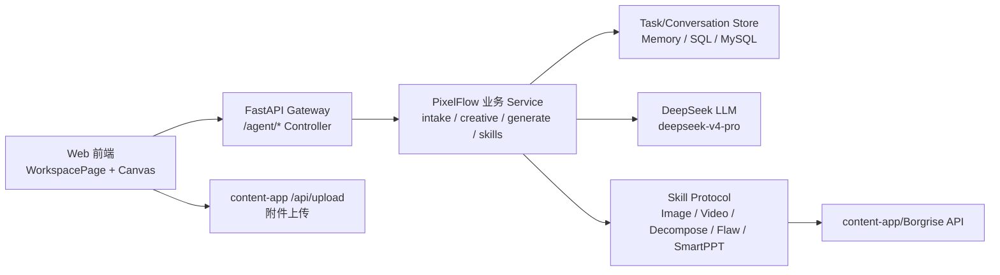
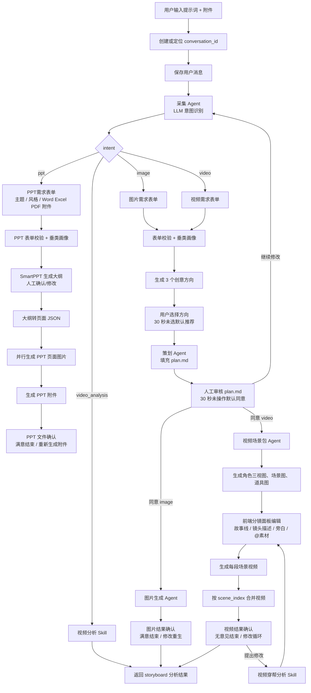
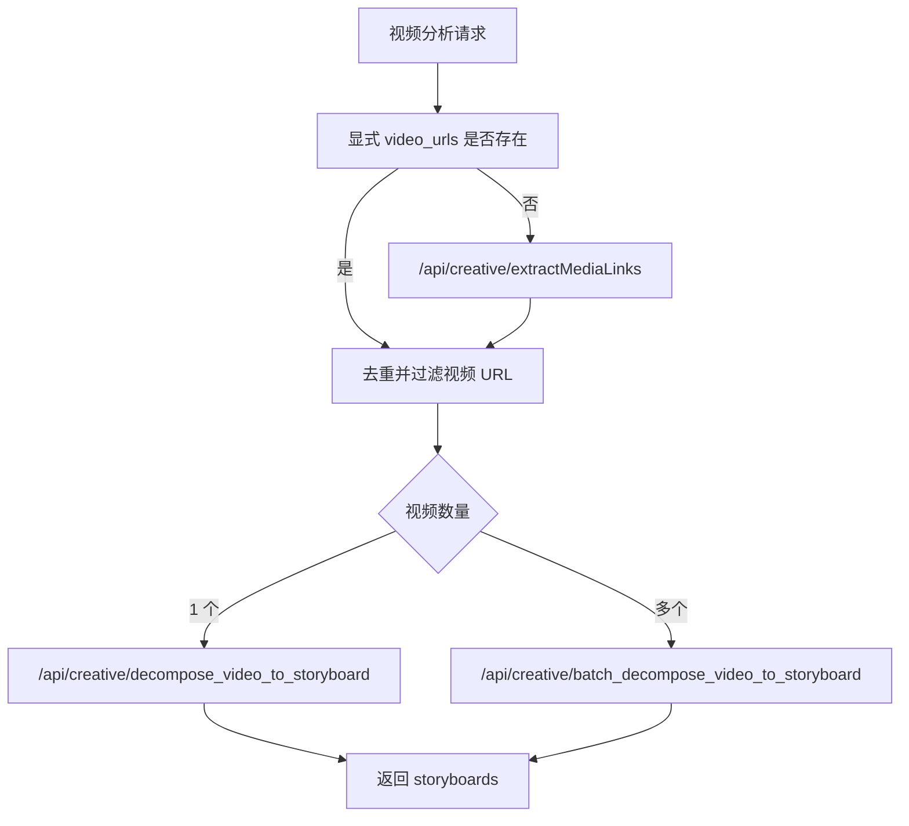
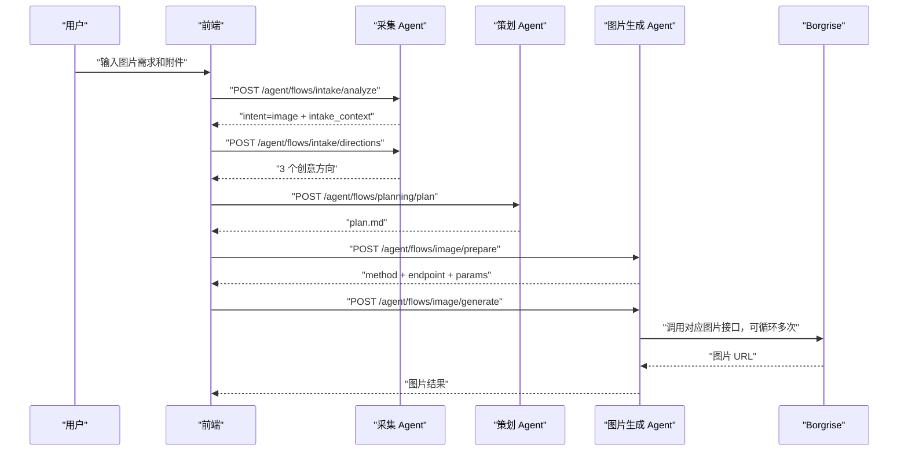
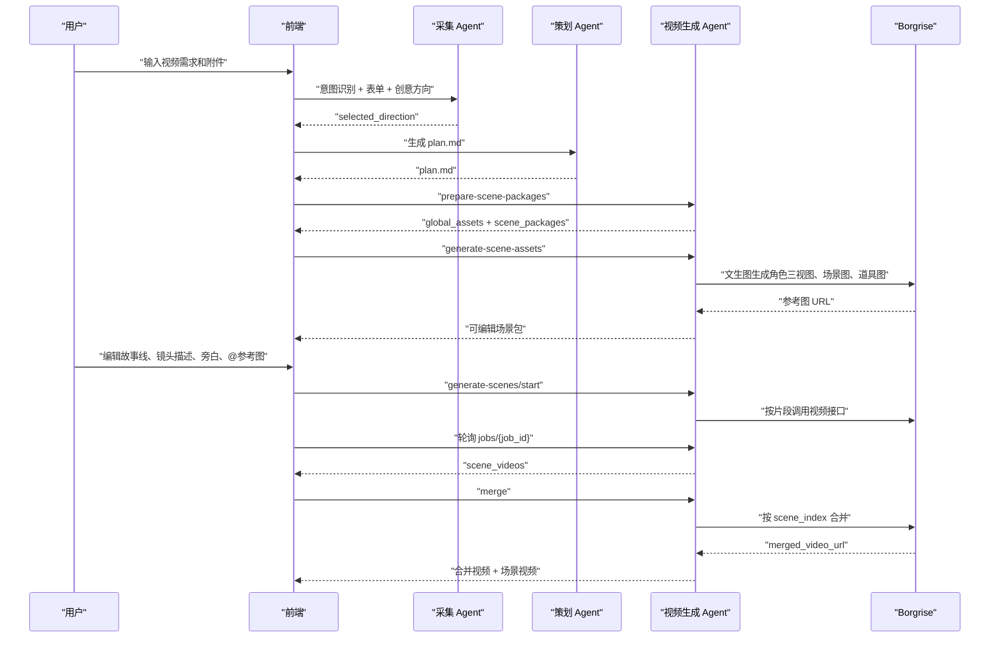
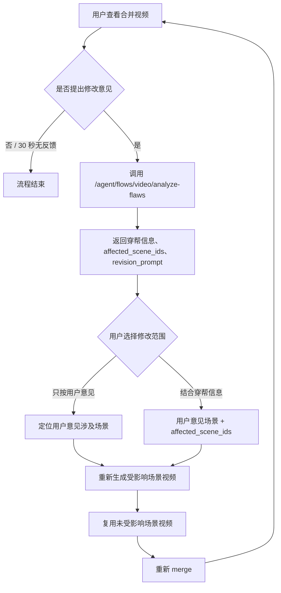

# PixelFlow Agent/Skill 最新流程设计

更新时间：2026-06-30
适用代码：当前 `pixelflow` 仓库最新前后端实现
维护要求：以后只要 Agent 流程、Skill 边界、content-app/Borgrise 接口合同、前端确认/重试逻辑发生变化，本文件必须同步修改。

## 1. 设计目标

PixelFlow 不是一个自由闲聊 Agent，而是一个围绕“电商图片/视频/视频分析/PPT制作”的阶段化 Agent 工作台。它需要同时满足：

- 用户用自然语言和附件发起需求。
- 采集阶段用 LLM 理解意图、主体、行业、数量、素材含义。
- 所有需要用户确认的节点都能落到前端对话里，并且能保存和恢复。
- 图片、视频、视频分析、PPT制作最终都通过 content-app/Borgrise 能力落地。
- 额度不足、业务失败、网络异常要可解释；额度不足后用户充值回来仍能从当前对话继续。
- 新增 Python 接口必须以 `/agent` 开头，前端直接上传附件到 content-app `/api/upload`。

## 2. 总体架构



分层类比：

| 层 | 位置 | Java 类比 | 职责 |
| --- | --- | --- | --- |
| Web 前端 | `web/src/pages/WorkspacePage.tsx` | 页面 + 前端 Service 编排 | 对话、表单、确认、分镜编辑、轮询 |
| Gateway Controller | `backend/app/gateway/routers/` | Spring Controller | HTTP 入参/出参、鉴权、状态码 |
| PixelFlow Domain | `backend/pixelflow/` | Domain Service + DTO | 意图、表单、plan、生成参数、场景包 |
| Skill Protocol | `backend/pixelflow/skills/base.py` | Java interface | 第三方能力稳定接口 |
| Skill Impl | `backend/pixelflow/skills/borgrise/` | Feign/HTTP Client | content-app/Borgrise 调用、轮询、错误归一 |
| Store | `backend/pixelflow/tasks/` | Repository/DAO | 任务、会话、消息、资产、上下文 |
| DeerFlow Harness | `backend/packages/harness/deerflow/` | 平台基础设施 | thread/run、checkpointer、sandbox、skills |

## 3. 当前前端主流程



## 4. Agent 职责

| Agent | Controller / Service | 输入 | 输出 | 备注 |
| --- | --- | --- | --- | --- |
| 采集 Agent | `pixelflow_intake.py`、`intake/llm.py`、`intake/forms.py` | 用户提示词、附件 materials、历史上下文 | intent、表单值、行业类型、数量、创意方向 | LLM 用 `deepseek-v4-pro`，失败时有规则 fallback |
| 策划 Agent | `pixelflow_planning.py`、`creative/plan_markdown.py` | 表单、创意方向、行业画像、素材、intake_context | plan.md、模板路径、一致性问题 | 读取项目内 plan.md 模板，不直接调用 LLM |
| 人工审核 Agent | `WorkspacePage.tsx` | plan.md、图片结果、视频结果、用户反馈 | 同意、修改意见、重试指令 | 前端负责超时默认和对话持久化 |
| 图片生成 Agent | `pixelflow_image.py`、`generate/image_prepare.py` | plan.md、表单、素材、修改意见、数量 | 图片生成参数、图片结果 | 根据语义选择四类图片接口 |
| 视频生成 Agent | `pixelflow_video.py`、`generate/scene_packages.py` | plan.md、表单、创意方向、素材、场景编辑结果 | 场景包、参考图、场景视频、合并视频 | 主流程是多场景片段生成后合并 |
| 视频分析 Agent | `pixelflow_video.py` | 文本和素材中的视频链接 | 单视频或多视频 storyboard | 先抽取媒体链接，再判断单个/批量 |
| PPT制作 Agent | `pixelflow_ppt.py`、`intake/forms.py`、`skills/borgrise/run_generation.py` | PPT主题、风格、Word/Excel/PDF 附件、行业画像 | PPT大纲、页面JSON、页面图片、PPT文件 | 每一步是 content-app 异步任务，Python 后端 job 轮询 |
| 对话恢复 Agent | `pixelflow_conversations.py`、`tasks/store.py` | conversation_id、user_id | 对话详情、消息、上下文 | 防止切换对话时异步结果串到当前页 |

## 5. Skill 清单

### 5.1 采集类 Skill

| Skill | 代码位置 | 作用 | 失败策略 |
| --- | --- | --- | --- |
| IntentRecognitionSkill | `backend/pixelflow/intake/llm.py` | 识别 `image` / `video` / `ppt` / `video_analysis`，抽取主体、目标、行业、数量 | LLM 失败时用关键词 fallback |
| FormSchemaSkill | `backend/pixelflow/intake/forms.py` | 返回图片/视频/PPT表单 schema | 本地纯逻辑 |
| FormValidationSkill | `backend/pixelflow/intake/forms.py` | 检查必填字段，最多 3 轮 | 超 3 轮终止并友好提示 |
| IndustryProfileSkill | `backend/pixelflow/intake/industry_profile.py` | 命中垂类模板或用 LLM 生成行业创作画像 | LLM 失败时通用电商兜底 |
| CreativeDirectionSkill | `backend/pixelflow/intake/llm.py` | 生成 3 个可进入 plan.md 的创意方向 | LLM 失败时本地兜底方向 |

垂类模板路径：

```text
backend/skills/public/borgrise-creative-assistant-v2/templates/industry_profile.md
```

### 5.2 策划类 Skill

| Skill | 代码位置 | 作用 |
| --- | --- | --- |
| PlanTemplateFillSkill | `backend/pixelflow/creative/plan_markdown.py` | 读取模板并填充 plan.md |
| PlanConsistencyCheckSkill | `backend/pixelflow/creative/plan_markdown.py` | 检查 selected_direction 和表单关键字段是否缺失 |

plan.md 模板路径：

```text
backend/skills/public/borgrise-creative-assistant-v2/templates/plan.md
```

### 5.3 图片类 Skill

| Skill | 代码位置 | content-app/Borgrise 接口 | 作用 |
| --- | --- | --- | --- |
| ImageEndpointDecisionSkill | `backend/pixelflow/generate/image_prepare.py` | 无 | 根据素材和语义选择图片接口 |
| ImagePromptBuildSkill | `backend/pixelflow/generate/image_prepare.py` | 无 | 组装图片 prompt、ratio、数量、素材 URL |
| TextToImageSkill | `backend/pixelflow/skills/borgrise/run_generation.py` | `/api/picture/text_to_image` | 文生图 |
| ReferenceImageSkill | `backend/pixelflow/skills/borgrise/run_generation.py` | `/api/picture/multi_reference_image_generation` | 参考图生成组图 |
| ImageEditSkill | `backend/pixelflow/skills/borgrise/run_generation.py` | `/api/picture/image_edit` | 图片编辑 |
| MultiImageFusionSkill | `backend/pixelflow/skills/borgrise/run_generation.py` | `/api/picture/multi_image_fusion` | 多图融合成一张 |

图片数量规则：

- 默认 1 张。
- 用户明确说“3 张/4 张/多张”等时，采集阶段写入 `requested_output_count`。
- 生成阶段通过 `params.num_images` 或 `params.max_images` 循环调用，最多 10 张。

图片尺寸规则：

- 前端只展示 `1:1`、`16:9`、`9:16`、`自动适配`。
- `自动适配` 在 `image_prepare.py` 里根据用途和目标映射到供应商支持比例。

### 5.4 视频类 Skill

| Skill | 代码位置 | content-app/Borgrise 接口 | 作用 |
| --- | --- | --- | --- |
| ScenePackageSkill | `backend/pixelflow/generate/scene_packages.py` | LLM + 本地规则 | 生成可编辑场景包 |
| SceneAssetImageSkill | `pixelflow_video.py` + Image Skill | `/api/picture/text_to_image` | 生成人物三视图、场景图、道具图 |
| TextToVideoSkill | `run_generation.py` | `/api/video/text-to-video` | 文生视频 |
| ImageToVideoSkill | `run_generation.py` | `/api/video/image-to-video` | 首帧图生视频 |
| TwoImageToVideoSkill | `run_generation.py` | `/api/video/two-image-to-video` | 首尾帧生视频 |
| ReferenceModeVideoSkill | `run_generation.py` | `/api/video/reference-mode-video` | 全能参考模式生视频 |
| EditVideoSkill | `run_generation.py` | `/api/video/edit-video` | 编辑视频 |
| ExtendVideoSkill | `run_generation.py` | `/api/video/extend-video` | 延伸视频 |
| VideoMergeSkill | `run_generation.py` | `/api/video/merge` | 合并视频 |
| VideoFlawAnalysisSkill | `run_generation.py` | `/api/creative/analyze_video_flaws` | 穿帮分析 |

视频生成总规则：

- 主流程不因“文生视频/编辑视频/首帧图生视频”等入口类型而绕过场景包。
- 正常生成视频都先生成多组视频场景片段，再逐段生成视频，最后合并。
- 每段片段最少 4 秒，最多 15 秒。
- 生成场景视频前，前端允许用户编辑故事线、镜头描述、旁白和 @ 参考图。
- 生成场景视频前，前端也允许用户点击 `global_assets` 中的角色、场景、道具图片进行预览，并引用到左侧输入框发送图片编辑指令。该流程走 `/agent/flows/image/edit-asset`，后端复用 `ImageEditSkill` 调用 `/api/picture/image_edit`，成功后直接替换原全局素材图片，并同步场景包 mentions 中同一 `asset_id` 的 `image_url`。如果用户在该图片编辑结果卡片点击“重新生成”，下一条输入继续作为同一全局素材的图片编辑 prompt 处理，不重新走 intake。
- 前端对话可以保留多个历史 `video_scene_packages` 卡片，但只有最后一个卡片展示查看、确认生成或重新生成参考图操作；旧卡片不再暴露操作入口。
- 单个场景片段最多 9 张参考图。

### 5.5 视频分析类 Skill

| Skill | 代码位置 | content-app/Borgrise 接口 | 作用 |
| --- | --- | --- | --- |
| MediaLinkExtractionSkill | `run_generation.py` | `/api/creative/extractMediaLinks` | 从文本和 materials 中识别媒体链接 |
| VideoDecomposeSkill | `run_generation.py` | `/api/creative/decompose_video_to_storyboard` | 单视频拆解 storyboard |
| BatchVideoDecomposeSkill | `run_generation.py` | `/api/creative/batch_decompose_video_to_storyboard` | 多视频批量拆解 storyboard |

视频分析路由：



### 5.6 PPT类 Skill

| Skill | 代码位置 | content-app/Borgrise 接口 | 作用 |
| --- | --- | --- | --- |
| PptIntentRecognitionSkill | `backend/pixelflow/intake/llm.py` | LLM | 识别 PPT 制作意图、主题、行业、风格线索 |
| PptFormSchemaSkill | `backend/pixelflow/intake/forms.py` | 无 | 返回 PPT 主题、PPT 风格、附件表单 |
| PptAttachmentValidationSkill | `backend/pixelflow/intake/forms.py`、`pixelflow_ppt.py` | 无 | 仅允许 Word、Excel、PDF 附件 |
| PptIndustryProfileSkill | `backend/pixelflow/intake/industry_profile.py` | LLM/模板 | 先命中垂类模板，未命中则调用 `deepseek-v4-pro` 生成行业画像 |
| SmartPptSummarySkill | `backend/pixelflow/skills/borgrise/run_generation.py` | `/api/picture/smart-ppt/generatePptSummary` | 生成 PPT 大纲 |
| SmartPptUpdateSummarySkill | `run_generation.py` | `/api/picture/smart-ppt/updatePptSummary` | 根据用户意见更新 PPT 大纲 |
| SmartPptContentJsonSkill | `run_generation.py` | `/api/picture/smart-ppt/generatePptContentToJson` | 大纲转 PPT 页面 JSON |
| SmartPptImageSkill | `run_generation.py` | `/api/picture/smart-ppt/generatePptImage` | 按页面 JSON 生成单页图片 |
| SmartPptFileSkill | `run_generation.py` | `/api/picture/smart-ppt/generatePptFile` | 根据页面图片生成 PPT 文件 |

PPT 流程：


PPT 异步规则：

- content-app 每一步都返回 `taskId`，PixelFlow 通过 `/api/task/{taskId}/status` 轮询。
- Python 网关对前端暴露 `/agent/flows/ppt/*/start` 和 `/agent/flows/ppt/jobs/{job_id}`，前端轮询 Python job，避免浏览器请求长时间阻塞。
- PPT 页面图片生成时后端会先返回全部页面的 `running` 状态，之后每完成一页就更新 job result；前端在同一张 PPT 页面图片卡片中逐页回显，文案展示为动态“图片生成中...”。
- PPT 页面图片处于 `running` 时不展示重新生成按钮；已生成或失败后才允许单页重试。单页重试必须原位更新该页小格子，不能追加新的整组 PPT 图片卡片；只要存在 running 或 failed 页面，“开始生成PPT附件”按钮必须隐藏。
- PPT 轮询超时默认 2 小时：`BORGRISE_PPT_POLL_TIMEOUT=7200`。
- content-app 返回额度不足时，job 状态为 `quota_paused`，前端提示充值后回到同一对话继续。

## 6. 视频场景包数据合同

场景包返回结构由 `prepare_video_scene_packages_with_llm()` 归一：

```json
{
  "global_assets": {
    "characters": [
      {
        "asset_id": "character-presenter",
        "name": "主讲人",
        "description": "人物角色描述",
        "three_view_prompt": "同一个人物的正面、侧面、背面三视图",
        "three_view_images": []
      }
    ],
    "scenes": [
      {
        "asset_id": "scene-opening",
        "name": "开场场景",
        "description": "场景描述",
        "image_prompt": "场景图生成提示词",
        "images": []
      }
    ],
    "props": [
      {
        "asset_id": "prop-product",
        "name": "产品或道具",
        "description": "道具描述",
        "image_prompt": "道具图生成提示词",
        "images": []
      }
    ],
    "visual_style": {
      "asset_id": "style-main",
      "name": "真实摄影电商广告",
      "description": "整片统一视觉风格",
      "prompt": "视觉约束"
    }
  },
  "scene_packages": [
    {
      "scene_id": "scene-1",
      "scene_index": 1,
      "title": "场景标题",
      "duration_ms": 10000,
      "storyline": "故事线",
      "shot_description": {
        "text": "0-10秒: 地点:@scene-opening 中,角色:@character-presenter 展示道具:@prop-product。",
        "mentions": [
          {
            "asset_id": "character-presenter",
            "type": "character",
            "name": "主讲人",
            "image_url": "https://..."
          }
        ]
      },
      "reference_asset_ids": ["character-presenter", "scene-opening", "prop-product"],
      "prompt": "分镜片段创作提示词",
      "narration": "旁白"
    }
  ]
}
```

强约束：

- `characters` 只能放人物角色。
- 每个 `character` 必须有 `three_view_prompt`，生成的是同一个人物的正面、侧面、背面三视图。
- 产品、商品、包装、工具、球、书包、床垫等非人物主体放到 `props`。
- `shot_description.text` 是一整段文本，不能拆成多个 UI 字段。
- `shot_description.mentions` 是前端 @ 选择后提交的图片引用集合，后端生成视频时提取其中的 URL。
- `visual_style` 是文字约束，不作为图片 mention。

## 7. 图片流程



接口选择逻辑：

| 条件 | method |
| --- | --- |
| 没有图片素材，且用户是从零生成 | `text_to_image` |
| 有图片素材，用户没有明确编辑/融合 | `multi_reference_image_generation` |
| 用户说修改、编辑、换背景、修图等 | `image_edit` |
| 用户说融合、合成一张、多图融合等 | `multi_image_fusion` |

## 8. 视频流程



场景视频接口选择：

| 条件 | mode |
| --- | --- |
| `scene.generation_mode` 已指定 | 使用指定 mode |
| 有视频素材且文本包含“延伸/续写/extend” | `extend_video` |
| 有视频素材且文本包含“编辑/修改/调整/edit” | `edit_video` |
| 有视频、图片或音频参考 | `reference_mode_video` |
| 无参考素材 | `text_to_video` |

如果 mode 是 `image_to_video` 但图片不足，或 `two_image_to_video` 但图片少于 2 张，后端会降级到 `reference_mode_video`。

## 9. 视频修改循环



要求：

- 只重生受影响场景，未受影响场景直接复用。
- 合并仍按 `scene_index` 排序。
- 新旧场景视频和最新合并视频都要返回前端。
- 如果穿帮分析失败，应允许用户只按自己的修改意见继续。

## 10. 失败、重试与额度不足

### 10.1 普通失败

- content-app/Borgrise 业务失败：直接返回前端 `ok=false` 和具体 `message/error`。
- 异常或网络失败：在 Borgrise Client 层按配置重试，默认 `max_retries=3`。
- 场景视频部分失败：返回 `failed_scenes`，前端展示失败原因，并允许用户回到上一步重新生成当前阶段。
- 场景资产图部分失败：返回 `failed_assets`，前端允许重试资产图生成。
- 图片、视频、PPT 的表单弹窗如果被用户点击右上角 `X` 关闭，视为取消当前流程；前端清空 pending 表单上下文并将会话阶段记录为 `form_cancelled`。
- 当前对话有阶段正在生成或处理时，所有 artifact 操作按钮都禁用，避免切换对话或返回旧卡片后重复触发。阶段结束后只允许最新可操作 artifact 继续；失败或额度暂停时只保留当前可恢复 artifact 的重试入口。

### 10.2 额度不足

识别位置：

- `backend/pixelflow/skills/base.py` 的 `is_quota_insufficient()`。
- 前端 `WorkspacePage.tsx` 和 `StoryboardPanel.tsx` 也会识别 `quota_insufficient` 和相关文案。

识别条件：

- HTTP 402。
- 返回体含 `quota_insufficient=true`。
- 文案包含“额度不足、余额不足、没有有效的额度、剩余额度、充值、insufficient quota、payment required”等。

处理策略：

1. 立即停止当前阶段后续调用。
2. 返回 `quota_insufficient=true` 和可恢复提示。
3. 保存当前 conversation context 和 artifact。
4. 用户充值后回到同一对话，仍可以点击当前阶段或上一步按钮继续。

## 11. 对话与上下文恢复

对话隔离是前端流程正确性的关键。

| 数据 | 存储位置 | 用途 |
| --- | --- | --- |
| 对话列表 | `pixelflow_conversations` | 最近对话、分页、当前流程阶段 |
| 对话消息 | `pixelflow_conversation_messages` | 用户消息、助手消息、artifact |
| 会话上下文 | `conversation.context` | 恢复表单、plan、场景包、失败点、额度暂停点 |
| 旧任务上下文 | `/agent/flows/session/context` | 兼容旧任务流 |

规则：

- 新建对话必须创建新的 `conversation_id`。
- 用户关闭窗口再进入默认是新对话页面。
- 点击历史对话时恢复该对话最后流程状态。
- 异步回调必须带原始 `conversation_id`，不能因为用户切换页面就写到当前可见对话。
- 最近对话默认展示最新 5 条，下拉按 cursor 再取 5 条。
- 对话列表当前按创建时间倒序，不按最后更新时间倒序。

## 12. 鉴权与上传

鉴权：

- 前端所有 `/agent` 请求都带 content-app `Authorization`。
- FastAPI 只从 JWT payload 读取 `sub` 作为用户名，并调用 content-app `/api/auth/verify` 实时校验。
- Skill 调用 content-app/Borgrise 计费接口时必须透传同一个 `Authorization`。
- 不允许写死 token、用户名、密码。

上传：

- 前端上传附件直接调用 content-app `/api/upload`。
- 上传返回的 URL、文件名、类型会进入 `materials`。
- 如果后续步骤要调用 LLM、图片编辑或视频编辑，必须把用户输入和 `materials` 一起提交给后端，让 Agent 理解素材语义。
- PPT 表单附件只允许 Word、Excel、PDF；图片、视频、音频附件不能作为 SmartPPT 大纲输入文件。

## 13. 配置

主配置：

| 文件 | 说明 |
| --- | --- |
| `backend/config.dev.yml` | 开发环境，默认端口 8001，Swagger 开启 |
| `backend/config.prod.yml` | 生产环境，接口文档默认关闭 |

关键配置：

| 配置 | 说明 |
| --- | --- |
| `models[0].name=deepseek-v4-pro` | 当前采集、行业画像、创意方向、场景包使用的大模型 |
| `pixelflow.media_skill=borgrise` | 图片/视频/视频分析供应商 |
| `borgrise.base_url` | content-app/Borgrise API 根地址 |
| `borgrise.video_poll_timeout=3600` | 视频轮询默认 1 小时 |
| `borgrise.image_poll_timeout=600` | 图片轮询默认 10 分钟 |
| `borgrise.video_analysis_poll_timeout=900` | 视频分析轮询默认 15 分钟 |
| `BORGRISE_PPT_POLL_TIMEOUT=7200` | SmartPPT 每一步轮询默认 2 小时 |
| `borgrise.max_retries=3` | 异常重试次数 |

## 14. 文件更新要求

改动类型和必须同步检查的文件：

| 改动 | 必查文件 |
| --- | --- |
| intent/表单/创意方向 | `intake/llm.py`、`intake/forms.py`、`WorkspacePage.tsx` |
| 垂类画像 | `intake/industry_profile.py`、`templates/industry_profile.md` |
| plan.md | `creative/plan_markdown.py`、`templates/plan.md` |
| 图片接口 | `generate/image_prepare.py`、`pixelflow_image.py`、`run_generation.py`、`api.ts` |
| 视频场景包 | `generate/scene_packages.py`、`StoryboardPanel.tsx`、`SceneMentionEditor.tsx`、`scenePackages.ts` |
| 视频接口 | `pixelflow_video.py`、`run_generation.py`、`api.ts` |
| PPT接口 | `pixelflow_ppt.py`、`run_generation.py`、`api.ts`、`GenParamsDialog.tsx`、`MessageBubble.tsx` |
| 对话隔离 | `pixelflow_conversations.py`、`tasks/store.py`、`WorkspacePage.tsx` |
| 鉴权/额度 | `content_app_auth.py`、`content_app_auth_context.py`、`skills/base.py`、`run_generation.py` |
| 文档 | `README.md`、`AGENTS.md`、`CONTENT_APP_API_CALLS.md`、本文件 |

## 15. 推荐验证清单

文档或纯前端展示变更：

```bash
git diff --check
```

后端采集/策划变更：

```bash
cd backend
uv run pytest tests/test_intake_llm.py tests/test_intake_forms.py tests/test_industry_profile.py tests/test_creative_plan_markdown.py -q
uv run ruff check backend/app/gateway/routers/pixelflow_intake.py backend/pixelflow/intake backend/pixelflow/creative
```

后端图片/视频变更：

```bash
cd backend
uv run pytest tests/test_image_prepare.py tests/test_pixelflow_image_router.py tests/test_video_scene_packages.py tests/test_pixelflow_video_router.py -q
uv run ruff check backend/app/gateway/routers/pixelflow_image.py backend/app/gateway/routers/pixelflow_video.py backend/pixelflow/generate backend/pixelflow/skills
```

前端分镜/对话变更：

```bash
cd web
corepack pnpm test:scene-packages
corepack pnpm test:scene-mentions
corepack pnpm test:conversation-routing
corepack pnpm build
```

真实流程回归建议：

- 图片：单张文生图、多张文生图、图片编辑、参考图生成、多图融合。
- 视频分析：单视频拆解、多视频批量拆解。
- 视频生成：文生视频、首帧图生视频、首尾帧图生视频、全能参考视频、编辑视频、延伸视频，以及场景包全局素材引用后图片编辑并替换原素材。
- 每个流程都从“新对话 + 用户输入 + 附件”开始，验证对话隔离、失败重试、额度不足暂停恢复。

## 16. 当前实现边界

- v2 前端主流程由 `WorkspacePage.tsx` 编排，后端提供分段接口，不是完全由后端 LangGraph 自动推进。
- 旧 `/agent/flows` LangGraph 任务流仍保留，主要用于任务 API、SSE、资产和旧流程兼容。
- 直接视频生成接口 `/agent/flows/video/generate-direct/start` 存在，但业务主流程仍要求先走 plan.md 和视频场景包。
- `ScenePackageSkill` 会先尝试 LLM，失败后用规则版兜底，保证流程可继续。
- `content-app/Borgrise` 的真实接口参数应以同级 `content-app` Controller 和当前 `run_generation.py` 为准；发现 PixelFlow 需要但 content-app 不存在的接口，应先在 content-app 新增或向用户确认业务逻辑。
