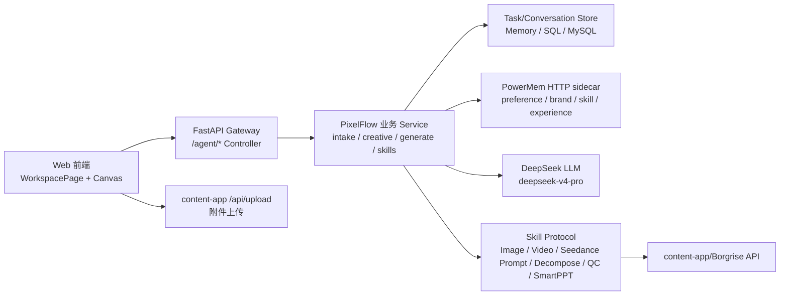
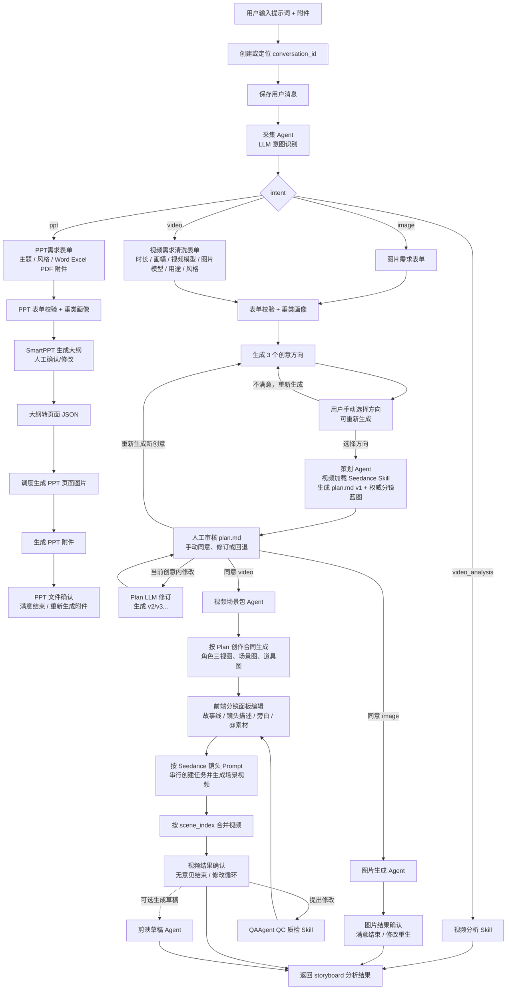
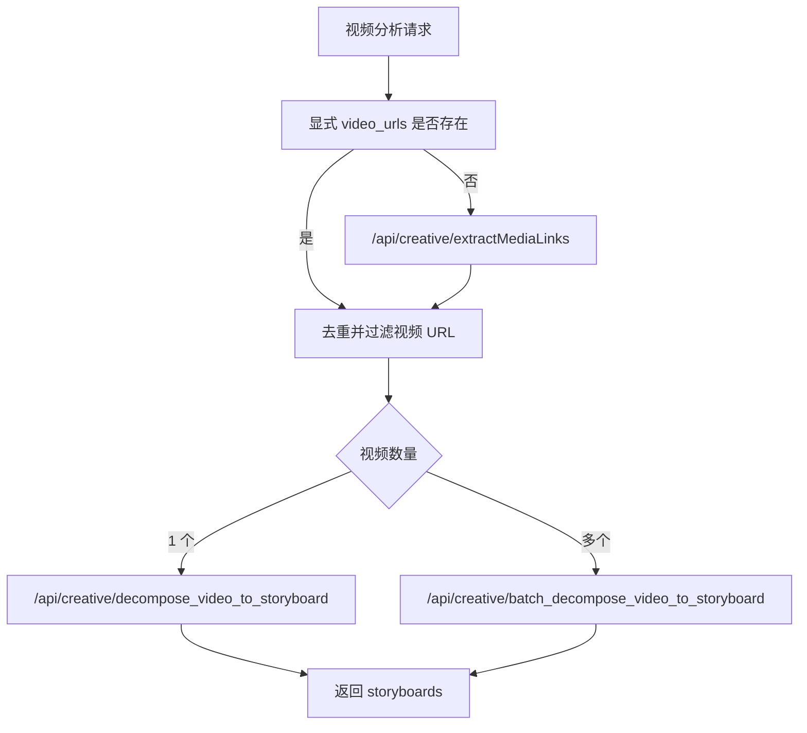
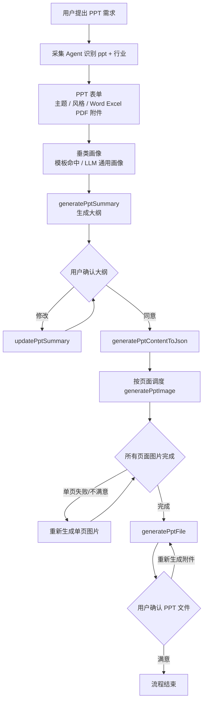
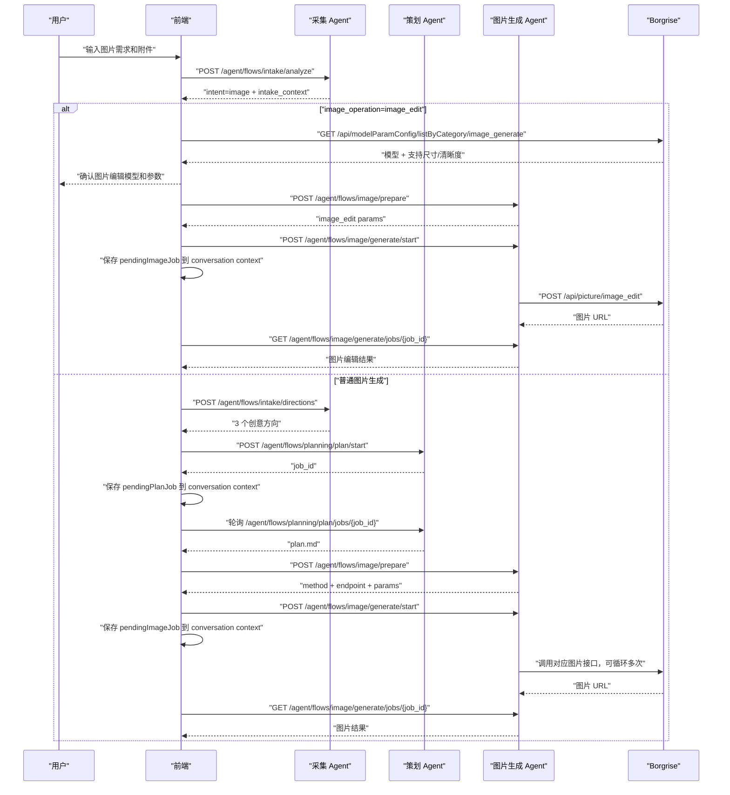
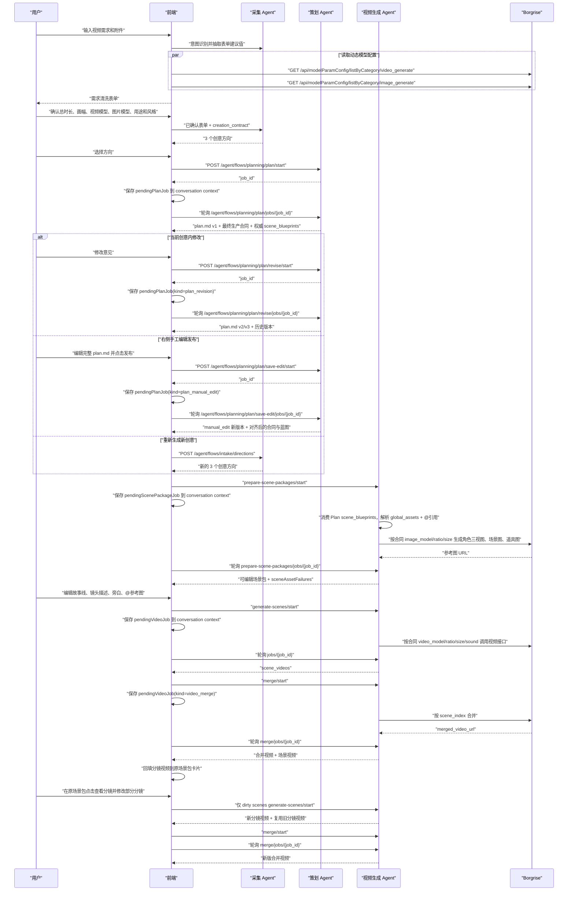
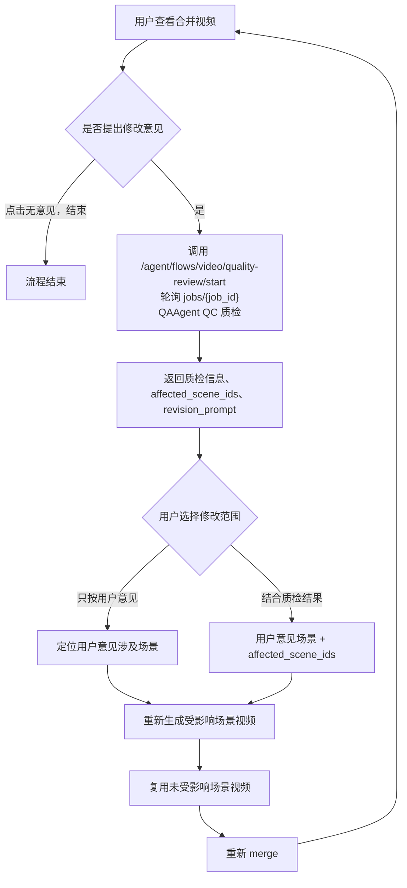

# PixelFlow Agent/Skill 最新流程设计

更新时间：2026-07-24
适用代码：当前 `pixelflow` 仓库最新前后端实现
维护要求：以后只要 Agent 流程、Skill 边界、content-app/Borgrise 接口合同、前端确认/重试逻辑发生变化，本文件必须同步修改。

## 1. 设计目标

PixelFlow 不是一个自由闲聊 Agent，而是一个围绕“电商图片/视频/视频分析/PPT制作”的阶段化 Agent 工作台。它需要同时满足：

- 用户用自然语言和附件发起需求。
- 采集阶段用 LLM 理解意图、主体、行业、数量、素材含义。
- 所有需要用户确认的节点都能落到前端对话里，并且能保存和恢复。
- 图片、视频、视频分析、PPT制作最终都通过 content-app/Borgrise 能力落地。
- 用户/品牌长期偏好和 Agent 经验沉淀通过 PowerMem HTTP sidecar 作为语义记忆被读取和记录。
- 额度不足、业务失败、网络异常要可解释；额度不足后用户充值回来仍能从当前对话继续。
- 新增 Python 接口必须以 `/agent` 开头，前端直接上传附件到 content-app `/api/upload`。

## 2. 总体架构



分层类比：

| 层 | 位置 | Java 类比 | 职责 |
| --- | --- | --- | --- |
| Web 前端 | `web/src/pages/WorkspacePage.tsx` | 页面 + 前端 Service 编排 | 对话、表单、确认、分镜编辑、轮询 |
| Gateway Controller | `backend/app/gateway/routers/` | Spring Controller | HTTP 入参/出参、鉴权、状态码 |
| PixelFlow Domain | `backend/pixelflow/` | Domain Service + DTO | 意图、表单、plan、生成参数、场景包 |
| Skill Protocol | `backend/pixelflow/skills/base.py` | Java interface | 第三方能力稳定接口 |
| Skill Impl | `backend/pixelflow/skills/borgrise/` | Feign/HTTP Client | content-app/Borgrise 调用、轮询、错误归一 |
| Store | `backend/pixelflow/tasks/` | Repository/DAO | 任务、会话、消息、资产、上下文 |
| Semantic Memory | `backend/pixelflow/memory/` + `app/gateway/pixelflow_memory.py` | 独立 Memory Client / Service | PowerMem 检索与写入，失败开放 |
| DeerFlow Harness | `backend/packages/harness/deerflow/` | 平台基础设施 | thread/run、checkpointer、sandbox、skills |

## 3. 当前前端主流程



### 3.1 图片、视频、PPT 任务看板

前端在 Composer 后方展示当前主流程的业务任务看板。看板从输入框左上圆角结束位置开始排列并限制最大宽度，输入框保持前景层级；默认折叠，只显示“当前步骤 + 状态”，折叠态由输入框覆盖看板底边和下方圆角。用户展开后才显示全部步骤和任务数量，内容向上滑出、关闭时向下收回。切换对话或重新进入页面时恢复默认折叠，折叠偏好不写入 PowerMem。

响应式边界固定为：小于 `xl`（1280px）断点时隐藏 244px 历史侧栏，让对话、任务看板和 Composer 使用完整视口宽度；Plan 编辑器、分镜编辑器和通用结果画布作为全屏层展示，关闭画布后回到完整对话。`xl` 及以上恢复历史侧栏和左右画布分栏。手机、平板和桌面端都不得产生水平溢出。

| intent | 看板步骤 |
| --- | --- |
| `video` | 需求收集 -> 创意规划 -> 创作规划 -> 执行规划 -> 素材生成 -> 视频生成 -> 导出交付 |
| `ppt` | 需求收集 -> 内容规划 -> 大纲规划 -> 页面生成 -> PPT生成 -> 导出交付 |
| `image` | 需求收集 -> 创意规划 -> 执行规划 -> 图片生成 -> 导出交付 |

- `workflowProgress` 随 conversation context 保存 intent、根用户消息、`last_phase` 和场景包实时 stage；历史对话没有该字段时由已有 phase、pending job 和 artifact 兼容推导。
- 视频场景包 job 的 `stage=prepare_scene_packages` 对应“执行规划”，`stage=generate_scene_assets` 对应“素材生成”；场景包确认和全局素材修改也停留在“素材生成”。
- 直接图片编辑不经过创意方向和 plan.md，因此“创意规划、执行规划”显示“已跳过”。失败、额度不足、表单取消分别显示“需处理、已暂停、已取消”，重试或修订回到受影响步骤。
- 最终结果生成后“导出交付”显示“待下载”。图片任意最终图、合并成品视频或最终 PPT 文件的明确下载点击会把 `deliveryDownloadedAt/deliveryDownloadedUrl` PATCH 回对应消息 artifact；预览、分镜视频和 PPT 页面图不算交付。新结果消息不会继承旧结果的下载记录。
- `video_analysis`、未知意图和意图尚未识别时不展示看板。看板只显示业务摘要，不显示内部 phase、job ID、供应商参数或原始 prompt。

## 4. Agent 职责

| Agent | Controller / Service | 输入 | 输出 | 备注 |
| --- | --- | --- | --- | --- |
| 采集 Agent | `pixelflow_intake.py`、`intake/llm.py`、`intake/forms.py` | 用户提示词、附件 materials、历史上下文 | intent、表单建议值、行业类型、数量、创意方向 | LLM 用 `deepseek-v4-pro`；视频会抽取总时长、画幅、视频模型、图片模型、用途和风格，但必须经用户表单确认后才能进入创意方向 |
| 策划 Agent | `pixelflow_planning.py`、`creative/plan_markdown.py`、`creative/plan_llm.py`、`creative/scene_blueprint.py`、`creative/seedance_plan.py` | 表单、创意方向、行业画像、素材、intake_context、创作合同 | plan.md、权威 `scene_blueprints`、模板路径、版本历史、最终生产合同、一致性问题 | 视频先生成总分总结构、镜头调度、精确时长和资产清单；稳定 `asset_id` 后调用 Seedance Skill 专门写作全部分镜，严格校验后再发布 |
| 人工审核 Agent | `WorkspacePage.tsx` | plan.md、图片结果、视频结果、用户反馈 | 同意、修改模式、回退版本、重试指令 | “当前创意内修改”只生成下一版 Plan；只有明确选择“重新生成新创意”才返回 3 个创意方向；历史版本可回退 |
| 图片生成 Agent | `pixelflow_image.py`、`generate/image_prepare.py` | plan.md、表单、素材、修改意见、数量 | 图片生成参数、图片结果 | 根据语义选择四类图片接口 |
| 视频生成 Agent | `agent_workflows/video/planning.py`、`agent_workflows/video/scene_packages.py`、`agent_workflows/video/video_generation.py`、`agent_workflows/video/postproduction.py`、`agent_workflows/video/delivery.py`、`pixelflow_video.py` | 当前版本 plan.md、`scene_blueprints`、最终生产合同、素材、场景编辑结果 | Plan、场景包、分镜视频、合并/QC、剪映历史与下载投影的权威快照 | M11.1–M11.5 已形成完整候选 Application Service 链；尚未注册 Supervisor handler，生产仍走原 v2 |
| 视频分析 Agent | `pixelflow_video.py` | 文本和素材中的视频链接 | 单视频或多视频 storyboard | 先抽取媒体链接，再判断单个/批量 |
| 剪映草稿 Agent | `pixelflow_jianying_draft.py`、`jianying_draft/service.py`、`jianying_draft/http_skill.py` | 来源对话、当前版本全部成功的有序分镜视频、`storyboard_version_id` | 草稿异步 job、第三方任务编号、TOS ZIP 下载地址或公开失败结果 | Router 类比 Spring Controller；Service 管理输入校验、幂等、状态机和 30 分钟超时；HTTP Skill 创建/轮询第三方任务、下载校验第三方 ZIP 并通过 content-app 原样上传 |
| PPT制作 Agent | `pixelflow_ppt.py`、`intake/forms.py`、`skills/borgrise/run_generation.py` | PPT主题、风格、Word/Excel/PDF 附件、行业画像 | PPT大纲、页面JSON、页面图片、PPT文件 | 每一步是 content-app 异步任务，Python 后端 job 轮询 |
| 对话恢复 Agent | `pixelflow_conversations.py`、`tasks/store.py` | conversation_id、user_id | 对话详情、消息、上下文 | 防止切换对话时异步结果串到当前页 |
| 语义记忆 Service | `pixelflow/memory/service.py`、`app/gateway/pixelflow_memory.py` | 用户 ID、业务查询、阶段摘要 | PowerMem 记忆检索和写入 | 所有新增 Agent/流程都必须复用这一层，不直接拼 PowerMem HTTP |

### 4.1 M11.1 视频前置规划 Workflow Adapter 候选

`backend/pixelflow/agent_workflows/video/planning.py` 新增确定性的
`VideoPlanningWorkflowService`，类比 Java 的视频领域 Application Service。它不调用
LLM、content-app 或 PowerMem，而是消费现有采集/策划 Service 已完成记忆读取和业务处理后
返回的 `FormValidationResult`、三个创意方向与 `PlanMarkdownResult`，只负责执行以下合法转换：

```text
intake
  +-> form_cancelled（关闭需求表单后的取消终态）
  +-> direction_generation
  -> direction_review（必须恰好三个方向并等待显式选择；可显式返回重新生成）
  -> plan_generation
  -> plan_review（等待人工审核）
```

每次转换同时递增 `stage_version` 和 `context_version`，拒绝阶段越权、无时区或倒退时间。
通用 `WorkflowRecord.creation_contract_snapshot` 只投影当前创作合同；完整 Plan Markdown、
`scene_blueprints`、`asset_manifest` 和全版本历史保留在 `VideoPlanAuthoritySnapshot` 业务通道，
通过规范 JSON 与 SHA-256 内容校验生成稳定逻辑 Artifact 引用，不进入可被摘要改写的消息通道。
所有输入、属性读取结果和通用投影都与内部快照隔离，调用方后续修改嵌套字典或数组不能污染权威数据。

采集确认要求 `confirmed_by_user=true`，且不能提前写入只属于 Plan 的场景图规格。首版 Plan
必须逐字段继承采集阶段已确认的时长、画幅、视频/图片模型及其能力等基础合同；仅允许补充
`scene_image_ratio/scene_image_size/scene_image_spec_source` 三项完整场景图规格，并校验比例与尺寸
属于图片模型的已确认能力。发布快照前再次验证 `VideoCreationContract`、总时长精确相等、每镜 4–15 秒、连续时间线、
蓝图时长数组、资产清单与蓝图资产并集，以及当前版本与同版本历史完全一致。初版只能是唯一
`v1`。当前载荷和每个历史版本都必须保留用户确认状态，场景图规格必须三项齐全且受图片模型能力约束。
修订失败保持原版本，成功修订只能在未改写历史前缀的前提下追加下一个连续版本；在 Adapter
尚未提供重新确认模型能力的入口前，合同版本、意图、模型选择模式、视频/图片模型及两份能力快照
均不得漂移。历史恢复
只能切换到既有版本，不能新增或重写历史。现有恢复 Service 仅清理正文首尾空白时，快照重新绑定
历史原文；其他内容差异继续 fail-closed。

### 4.2 M11.2 视频场景包与全局资产图候选

`backend/pixelflow/agent_workflows/video/scene_packages.py` 新增
`VideoScenePackageWorkflowService`，类比只允许消费已审核 DTO 的 Java Application Service。
入口不信任直接构造或恢复的快照，会重新校验当前 Plan、完整连续历史、用户确认合同、分镜蓝图、
资产并集和内容校验和，然后确定性进入：

```text
plan_review（等待人工审核）
  -> plan_approved（显式同意动作已持久化）
  -> generate_scene_assets
  -> scene_package_review（必须人工确认，无倒计时）
```

`VideoScenePackageAuthoritySnapshot` 用规范 JSON 和 SHA-256 冻结来源 Plan 版本/校验和、输入素材图片 URL、
精确总时长、创作合同、四类全局资产和场景包。蓝图 `scene_id/scene_index`、标题、时长、故事线、镜头正文、旁白、
转场和确定性执行提示词必须逐项继承；`@asset_id` 仅允许由同一机械函数绑定，正文后追加故事、供应商
额外字段或提示词改写都会失败关闭。执行提示词显式携带合同 `video_model`；素材图片必须逐镜完整继承
输入 HTTPS URL 集合。四类全局 ID 唯一，单镜最多 9 个引用，每个角色/场景/道具只
接受一个 HTTPS 图片 URL，并按 `asset_id` 回填 mentions；同一资产跨镜复用但不重复创建资产记录。

M11.2 没有注册 Supervisor handler，也没有接入供应商或付费 API。分镜 Operation、部分失败、
额度暂停、重试和单镜修改由 M11.3 的独立 Service 承接；merge/QC 属于 M11.4，剪映投影属于 M11.5。

### 4.3 M11.3 可恢复分镜生成、部分失败与单镜修改候选

`backend/pixelflow/agent_workflows/video/video_generation.py` 新增
`VideoSceneGenerationWorkflowService`。它类比 Java 的 Application Service：只消费 M11.2 人工确认后的
权威场景包，为每个分镜通过 `OperationPort` 领取独立 Operation，首次必须覆盖全部分镜；刷新只查询原
`job_id`，丢失时失败关闭，禁止用调用方传入的旧视频或场景子集绕过首次生成。pending 请求在每次恢复、
Runtime 投影和结果回写前，都会从当前权威场景、合同及 pending scene ID 机械重建；模型、比例、清晰度、
声音、真实整数秒时长、Prompt、参考 URL、mode 及业务幂等键任一漂移都会失败关闭。

`VideoSceneAtomicOperationPort` 是 M11 对 M00 `OperationPort` 的视频专用 fail-closed 扩展合同。成功或失败
终态必须原子绑定 `stage_version + Operation 身份 + provider_job_id + status + result_hash`；真实 M06
适配尚未提供该原子能力时不得执行终态回写。当前状态会持久化每镜 terminal claim，并在恢复时重新计算
成功的 `task_id/video_url/mode/endpoint/raw` 或失败的 `error/attempts/retryable/quota/raw` 摘要，防止把
不可重试 4xx 篡改成新的计费重试，也防止并发 success/failure 或不同成功 URL 互相覆盖。

额度不足使用统一 `is_quota_insufficient()` 识别 HTTP 402 和业务文案。首个额度失败立即阻止后续
Provider start：只有可证明为 `CREATED` 且没有 `provider_job_id` 的兄弟 Operation 才会原子冻结为
`quota_not_started`；已经 `POLLING` 或绑定 Provider ID 的兄弟继续查询原 job，绝不创建第二个任务。
批量冻结中途崩溃后，同一输入会校验既有 result hash 并幂等补完。充值后的重试只领取 retryable 或
quota-paused 分镜，已成功视频保持复用；HTTP 4xx、价格配置和能力不匹配必须先修改输入或分镜。

单镜修改只允许故事线、镜头描述、旁白和引用资产，分镜身份、顺序、时长、转场及其他供应商字段保持
不可变。修改后的秒级连续时间线、`@asset_id`、mentions 和最多 9 张参考图重新校验，Prompt 由同一机械
函数重建；系统分别保存“已授权编辑谱系”和“待重生成 dirty 集合”，成功后只清除 dirty 标记，仍保留
权威编辑谱系。实时 `generation_types` 非空时必须作为权威能力，未知或不兼容值失败关闭；每镜时长还必须
属于实时 `durations_sec`，空能力快照才按旧合同 unknown 处理。

M11.3 仍未注册 Supervisor handler，也未接入真实 content-app、LLM、PowerMem 或付费供应商，因此当前
v2、R1 `assist` 与生产 `off` 行为不变。后续接线必须复用 PowerMem helper、持久化 Operation 和统一
`ContextBudgetPolicyProvider`，不得把 PowerMem HTTP、模型窗口常量或底层 128K 兼容值写入本 Service。

### 4.4 M11.4 可恢复合并、QAAgent QC 与人工结束候选

`backend/pixelflow/agent_workflows/video/postproduction.py` 新增
`VideoPostProductionWorkflowService`。它只消费 M11.3 已进入人工审核、全部分镜成功且没有 pending、失败或
dirty 分镜的权威状态。合并请求始终按 `scene_index` 排序；单分镜仍领取并原子完成 Operation，但直接复用
该分镜 HTTPS 视频，不调用供应商 merge。多分镜调用现有 `VideoGenerationSkill.merge_videos` 合同，只传
`video_urls/duration/size/model`，不得把内部场景摘要扩散为供应商 DTO 字段。

合并成功后直接进入 `video_review`。用户可以显式确认结束，也可以提出修改后启动唯一的
`VideoQualityReviewSkill`；视频没有超时自动结束，下载或后续剪映动作也不代替人工确认。用户首次提出修改时
必须提供意见，该意见经清洗后冻结，重试不得改写。QAAgent QC 只通过现有
`merged_video_url/scene_videos/scene_packages/brief/materials/user_feedback/ratio/size` 合同调用 content-app，
不执行本地二次质检。merge 成功后不得直接修改分镜绕过 QC；QC 成功后保留报告、问题、受影响分镜和修订提示，
QC 自身失败时，用户仍可只按自己的意见选择当前版本分镜。两种路径最终都复用 M11.3 的单镜白名单修改与
dirty 重生，回交前先提升来源状态版本，保证 `stage_version/context_version` 严格单调；未修改分镜视频继续复用，
新版本再重新领取独立 merge Operation。

merge 与 QC 各自持有可恢复 Operation，刷新只查询原 `job_id`，丢失时失败关闭。供应商外调前必须通过
`VideoPostProductionAtomicOperationPort` 的两阶段协议原子取得唯一启动权：第一阶段只在 `CREATED` 上绑定
30 秒外调前租约，进程在外调标记前崩溃时可由过期租约安全接管；第二阶段原子标记 `POLLING` 后才允许调用
供应商，此后即使进程崩溃也不得自动接管或二次计费。重复调用遇终态时从可信 Repository 恢复完整业务载荷，
遇仍在运行的 Operation 时只返回原引用。成功或失败终态还必须由同一 Port 原子持久化 Operation 身份、
供应商任务 ID、status、stage version、result type、result hash 和安全载荷，并提供按 `job_id` 查询的权威终态。
checkpoint 同时保存投影 claim，在恢复、修改和结束决策边界必须回查 Repository，再校验 stage version、attempt、
幂等键、结果摘要及合并视频/分镜载荷；Operation 幂等键还包含机械重建请求的 SHA-256，因而 QC pending 和
终态都绑定首次冻结的 `user_feedback`，不能在领取后改写。即使调用方整体重算 checkpoint 的 SHA-256，也
不能伪造可结束状态。
M06 尚未提供真实适配时不得用普通 `save` 降级。HTTP 402 或额度文案会暂停当前阶段，只有用户明确重试才领取
下一 attempt。供应商原始结果递归清除 Authorization、Bearer、token、API key 等凭据和 URL 查询参数；
Runtime 投影只公开稳定的场景包、分镜视频、合并视频和 QC Artifact 引用。

M11.4 仍未注册 Supervisor handler，也未接入真实 content-app、PowerMem 或付费供应商。当前测试只使用
本地 fake 验证 Operation、Skill 参数和修改循环；生产 v2、R1 `assist` 和 Feature Flag 行为保持不变。

### 4.5 M11.5 剪映版本、历史入口与下载投影候选

`backend/pixelflow/agent_workflows/video/delivery.py` 新增
`VideoDeliveryWorkflowService`，只消费 M11.4 已合并、没有 pending 后处理 Operation，且处于
`video_review/awaiting_user` 或用户明确结束后的权威状态。它从当前版本全部成功分镜机械构建
`JianyingDraftRequest`，按 `scene_index` 排序并复用既有 FNV-1a
`compute_storyboard_version_id()`；合并视频只作为最终下载目标，绝不进入剪映 scenes。

剪映生成沿用 M11.4 的两阶段原子启动合同。capability 不可用或查询失败时不创建空 Operation；可用时
`conversation_id + storyboard_version_id` 对应的请求摘要、显式 `retry_failed`、attempt 和幂等键会冻结在
pending envelope。刷新只查询原 `job_id`，终态必须从可信 Repository 恢复并交叉验证 Operation identity、
stage version、请求摘要、分镜数量、来源分镜 Artifact 和公开结果 DTO；嵌套的 M11.3 分镜终态也必须通过
`get_scene_operation_terminal_claim` 逐项回查完整 job/result hash，不能用本地自洽 checkpoint 派生新的
`storyboard_version_id`。Skill 总等待沿用既有 1800 秒上限，超时原子落为可显式重试的 `timeout`。
运行中及未过期成功结果幂等复用；`failed/timeout` 只有用户显式重试才创建下一 attempt。失败结果会移除
下载 URL、文件名和 Provider 内部 ID，只保留经过敏感信息过滤的公开消息；未配置状态不伪造成已创建任务。

新分镜版本继续保留旧 `jianyingDraftRecords` 历史入口，但清除旧合并视频的最终下载证据。剪映 ZIP 下载
只在对应历史记录写 `draftDownloadedAt/draftDownloadedUrl`，不会完成任务看板“导出交付”；只有当前
`video_artifact_ref` 对应的合并成品视频被明确下载，才投影
`deliveryDownloadedAt/deliveryDownloadedUrl`。同一合并视频在人工结束后保留草稿历史与下载证据，
新合并版本不得继承旧证据。

该候选复用现有 `JianyingDraftSkill` DTO 和剪映 Router/Service 的输入、版本与公开终态语义，但没有改写
现有 Router、进程内 job registry 或第三方/content-app 调用合同，也未注册 Supervisor handler。M12.5/M13
后续接线负责把 Runtime Artifact 映射到消息与对话上下文；当前生产 v2、R1 `assist`、Feature Flag、
PowerMem 调用和真实供应商路径均保持不变。

## 5. Skill 清单

### 5.1 采集类 Skill

| Skill | 代码位置 | 作用 | 失败策略 |
| --- | --- | --- | --- |
| IntentRecognitionSkill | `backend/pixelflow/intake/llm.py` | 识别 `image` / `video` / `ppt` / `video_analysis`，抽取主体、目标、行业、数量；视频额外抽取时长、画幅、视频模型、图片模型、用途和风格 | LLM 失败时用关键词 fallback，并保留表单人工确认 |
| FormSchemaSkill | `backend/pixelflow/intake/forms.py` | 返回图片/视频/PPT表单 schema | 本地纯逻辑 |
| FormValidationSkill | `backend/pixelflow/intake/forms.py` | 检查必填字段，最多 3 轮 | 超 3 轮终止并友好提示 |
| IndustryProfileSkill | `backend/pixelflow/intake/industry_profile.py` | 命中垂类模板或用 LLM 生成行业创作画像 | LLM 失败时通用电商兜底 |
| CreativeDirectionSkill | `backend/pixelflow/intake/llm.py` | 生成 3 个可进入 plan.md 的创意方向 | LLM 失败时本地兜底方向 |

垂类模板路径：

```text
backend/skills/public/borgrise-creative-assistant-v2/templates/industry_profile.md
```

### 5.2 策划类 Skill

| Skill | 代码位置 | 作用 |
| --- | --- | --- |
| PlanTemplateFillSkill | `backend/pixelflow/creative/plan_markdown.py`、`creative/plan_llm.py` | 读取图片/视频独立模板；视频第一阶段生成 plan.md 结构、精确时间线、资产需求与完整资产清单 |
| SeedancePlanAuthoringSkill | `backend/pixelflow/creative/seedance_plan.py`、`creative/plan_llm.py` + `backend/skills/public/borgrise-creative-assistant-v2/skills/seedance-prompt/SKILL.md` | 在稳定资产 ID 后一次写作全部分镜；初始生成、Agent 修订和手工编辑重新对齐共用；只允许改叙事字段，模型、时间线、卖点、目标和资产合同不可变 |
| PlanSceneBlueprintSkill | `backend/pixelflow/creative/scene_blueprint.py`、`generate/seedance_prompt.py` | 规范化分镜叙事职能、连续时间线、故事线、镜头描述、旁白、转场和资产需求；LLM 不可用或镜头描述二次校验仍不完整时，按叙事职能使用八维增强规则兜底；资产需求只允许人物、物理场景和有形道具 |
| PlanConsistencyCheckSkill | `backend/pixelflow/creative/plan_markdown.py`、`creative/contract.py`、`creative/scene_blueprint.py` | 校验用户确认字段、模型能力、场景图片规格、每镜 4-15 秒、秒级镜头描述、总分总结构、精确总时长、八维镜头完整度，以及资产需求语义；资产不合法时只让 LLM 定向修复 `asset_requirements`，不得修改故事和时长 |
| PlanRevisionSkill | `backend/pixelflow/creative/revision_contract.py`、`creative/plan_markdown.py`、`creative/plan_llm.py` | 先合并白名单 `creation_contract_patch`，再结合当前 Plan、表单、垂类补充、附件、采集上下文和 PowerMem 重写 Plan；生成新版本并保留历史 |
| PlanRestoreSkill | `backend/pixelflow/creative/plan_markdown.py` | 直接激活所选历史版本，不追加重复版本；恢复对应合同与分镜时长快照 |
| PlanManualEditSkill | `backend/pixelflow/creative/plan_markdown.py`、`web/src/components/canvas/PlanMarkdownEditor.tsx` | 在右侧画布编辑完整 Markdown 后复用 Plan 修订 LLM，对齐权威合同、分镜蓝图和镜头完整度；全部校验通过才发布下一版本 |

plan.md 模板路径：

```text
backend/skills/public/borgrise-creative-assistant-v2/templates/plan_video.md
backend/skills/public/borgrise-creative-assistant-v2/templates/plan_image.md
```

模板只是章节结构和信息密度范例。策划 Agent 必须结合当前表单、选中创意、行业画像、附件、语义记忆和创作合同重新生成内容，禁止把模板中的示例人物、产品或卖点复制到其他任务。语义记忆只影响内部决策，禁止在 plan.md 中展示“长期记忆约束”、PowerMem、Skill/Agent 日志或记忆原文。前端统一把两类结果显示为 `plan.md`。

### 5.3 图片类 Skill

| Skill | 代码位置 | content-app/Borgrise 接口 | 作用 |
| --- | --- | --- | --- |
| ImageEndpointDecisionSkill | `backend/pixelflow/generate/image_prepare.py` | 无 | 根据素材和语义选择图片接口 |
| ImagePromptBuildSkill | `backend/pixelflow/generate/image_prepare.py` | 无 | 组装图片 prompt、ratio、数量、素材 URL |
| ImageModelConfigLookupSkill | `web/src/lib/api.ts` | `/api/modelParamConfig/listByCategory/image_generate` | 图片编辑前查询可选模型、尺寸和清晰度 |
| ImageGenerationJobSkill | `pixelflow_image.py` | `/agent/flows/image/generate/start` + `/jobs/{job_id}` | 图片生成可恢复 job，内部复用下列图片 Skill |
| ImageAssetEditJobSkill | `pixelflow_image.py` | `/agent/flows/image/edit-asset/start` + `/jobs/{job_id}` | 视频场景包全局素材图片编辑可恢复 job |
| ImageAssetFusionJobSkill | `pixelflow_image.py` | `/agent/flows/image/fuse-asset/start` + `/jobs/{job_id}` | 视频场景包全局素材图片融合可恢复 job；前端仅在用户上传素材中存在有效图片格式时调用 |
| TextToImageSkill | `backend/pixelflow/skills/borgrise/run_generation.py` | `/api/picture/text_to_image` | 文生图 |
| ReferenceImageSkill | `backend/pixelflow/skills/borgrise/run_generation.py` | `/api/picture/multi_reference_image_generation` | 参考图生成组图 |
| ImageEditSkill | `backend/pixelflow/skills/borgrise/run_generation.py` | `/api/picture/image_edit` | 图片编辑 |
| MultiImageFusionSkill | `backend/pixelflow/skills/borgrise/run_generation.py` | `/api/picture/multi_image_fusion` | 多图融合成一张 |

图片数量规则：

- 默认 1 张。
- 用户明确说“3 张/4 张/多张”等时，采集阶段写入 `requested_output_count`。
- 生成阶段通过 `params.num_images` 或 `params.max_images` 循环调用，最多 10 张。

图片尺寸规则：

- 前端只展示 `1:1`、`16:9`、`9:16`、`自动适配`。
- `自动适配` 在 `image_prepare.py` 里根据用途和目标映射到供应商支持比例。

### 5.4 视频类 Skill

| Skill | 代码位置 | content-app/Borgrise 接口 | 作用 |
| --- | --- | --- | --- |
| VideoModelConfigLookupSkill | `web/src/lib/api.ts`、`GenParamsDialog.tsx` | `/api/modelParamConfig/listByCategory/video_generate` | 查询启用视频模型及 `aspectRatioList/sizeList/onSoundList/videoDurationList/modelGenerateTypeList/uploadFileTypeList`；展示 content-app 返回的所有启用 Seedance，并把用户所选模型的完整实时能力固化到创作合同；系统推荐优先 `seedance-2.0` |
| SceneImageModelConfigLookupSkill | `web/src/lib/api.ts`、`GenParamsDialog.tsx` | `/api/modelParamConfig/listByCategory/image_generate` | 查询场景资产图片模型及其比例/清晰度能力；用户只选模型，能力范围随表单提交给 Plan Agent |
| ScenePackageSkill | `backend/pixelflow/generate/scene_packages.py` | LLM + 本地规则 | 生成可编辑场景包 |
| SeedanceShotPromptSkill | `backend/pixelflow/generate/seedance_prompt.py` + `backend/skills/public/borgrise-creative-assistant-v2/skills/seedance-prompt/SKILL.md` | 无 | 对 Seedance 全系列通用；按实际 `video_model` 生成秒级镜头描述，并保留 `@asset_id`、mentions 和最多 9 张参考图 |
| SceneAssetImageSkill | `pixelflow_video.py` + Image Skill | `/api/picture/text_to_image` | 生成人物三视图、场景图、道具图 |
| TextToVideoSkill | `run_generation.py` | `/api/video/text-to-video` | 文生视频 |
| ImageToVideoSkill | `run_generation.py` | `/api/video/image-to-video` | 首帧图生视频 |
| TwoImageToVideoSkill | `run_generation.py` | `/api/video/two-image-to-video` | 首尾帧生视频 |
| ReferenceModeVideoSkill | `run_generation.py` | `/api/video/reference-mode-video` | 全能参考模式生视频 |
| EditVideoSkill | `run_generation.py` | `/api/video/edit-video` | 编辑视频 |
| ExtendVideoSkill | `run_generation.py` | `/api/video/extend-video` | 延伸视频 |
| VideoMergeSkill | `run_generation.py` | `/api/video/merge` | 合并视频 |
| VideoQualityReviewSkill | `backend/pixelflow/qc/video_review.py` + `run_generation.py` | `/api/creative/video_quality_review` | QAAgent QC 质检：画面缺陷、商品清晰与露出、Prompt 跑偏、字幕正确性、Brief 一致性、黑屏/卡顿和约束合规 |

视频生成总规则：

- 视频粗略需求不能直接生成创意方向。必须先展示需求清洗表单并由用户确认全部必填字段。
- 视频表单保留产品信息、品类、目标人群、转化目标，并新增/明确：总时长、视频画幅、视频模型、图片模型、视频用途、视觉风格。
- `video_duration_sec` 预设为 30/60/90/180 秒；选择“自定义”后只能提交 4-300 的自然数。前端和 Python 后端都校验。
- 视频模型配置来自 `/api/modelParamConfig/listByCategory/video_generate`，前端展示 content-app 返回的所有启用 Seedance 模型；系统推荐默认解析为 `seedance-2.0`，界面仍展示实际推荐结果。2.0 只是推荐默认值，不是 `seedance-prompt` 的调用开关。
- `seedance-prompt` 对 Seedance 全系列通用；场景包 Prompt 显式携带用户确认的 `video_model`。前端把该模型实时画幅、清晰度、声音、单分镜时长和端点能力完整保存为 `video_model_capabilities`，新采集表单的快照不完整时后端阻止进入创意生成；只有恢复历史对话时兼容旧合同。后端只按合同能力选择参数和端点，不按 Seedance 型号名称猜测能力。
- 视频清晰度下拉只展示当前模型 `sizeList`。切换模型时，已选清晰度不受支持则优先选择 `1080p -> 720p -> 480p` 中当前模型可用的最高档；例如 `seedance-2.0-mini` 和 `seedance-2.0-fast` 当前只支持 `480p/720p`，不得继续携带 `1080p`，否则 content-app 价格配置无法命中。
- `skills/seedance-prompt/THIRD_PARTY_NOTICE.md` 保留两个输入来源、哈希和授权边界，具有来源审计价值，不能当作无用文件删除。
- 图片模型配置来自 `/api/modelParamConfig/listByCategory/image_generate`，默认 `gpt-image-2`。用户不选择图片比例和清晰度；前端把所选模型支持的比例/清晰度列表作为只读能力数据交给 Plan Agent。
- 表单确认值生成权威 `creation_contract`。优先级是“用户确认 > LLM 预填 > 系统默认”，后续创意、Plan、场景包、场景资产和视频生成不得重新猜测或覆盖。
- Plan LLM 只能在 `image_model_capabilities` 范围内选择 `scene_image_ratio` 和 `scene_image_size`。非法输出按确定性规则修正；最终值写入 plan.md 和生产合同，场景资产生成阶段直接使用，不再猜测。
- 视频 Plan 第一阶段负责结构、精确时间线、故事职责、资产需求和 `asset_manifest`，全局清单规范化产生稳定 `asset_id` 后，第二阶段把用户确认的 `video_model`、完整创作合同、当前 Plan、全部蓝图、稳定资产、原始要求、附件以及修订上下文交给 Seedance Plan Authoring Skill。该 Skill 对 content-app 实时启用的所有 Seedance 系列模型通用，不得改写模型；实时能力与规则冲突时保留 PixelFlow 合同，由调用层提示参数不兼容。
- Seedance 专用阶段对 LLM 使用内部 `shot_segments[{start_sec,end_sec,text}]` 结构，校验后再渲染为前端和场景包兼容的 `shot_description` 字符串。秒段数量按内容决定；每段使用独立整数秒范围，动作阶段、景别、运镜、说话者、声音或叙事重点变化时必须换段。多段必须连续覆盖当前镜 4-15 秒时长并禁止 ms、毫秒、小数；每段都显式包含地点、主体、动作、景别、运镜、光影、声音和收束。引用只允许本镜声明的 `@character-*`、`@scene-*`、`@prop-*`，每次说明用途且最多 9 张。后端深拷贝原蓝图，只合并叙事字段，再校验时间线、段落、资产并集和引用；任何部分失败都整批拒绝，携带精确错误重试一次。初始 Plan、Agent 修订与手工编辑重新对齐均执行同一路径，最终确认 Plan 仍是场景包唯一权威输入。
- 每镜 9 张参考图预算在 Plan 初稿和 Plan 修订发布前执行双层控制：LLM 策划提示先要求每镜 `characters + scenes + props` 去重后不超过 9；后端再逐镜硬校验。候选超限时必须重新规划完整分镜，可拆镜或重排 4-15 秒整数时长、动作、对白和资产；重排前后三类具体资产名称并集必须完全一致，禁止通过数组截断、漏掉或删除全局资产凑数。重排仍超限或资产并集变化时 Plan 失败，前端不展示候选 Plan，场景包的 9 图校验只保留为纵深防线。
- 如果 Plan LLM 的时间范围或镜头格式异常，后端只重建对应时间线和多秒段镜头描述，保留其具体标题、故事线、对白、角色、场景和道具；若具体语义本身不可恢复则 Plan 失败，不再用“目标用户”“真实使用场景”“产品”等泛化内容替换整份蓝图。
- 场景包恢复历史 Plan 时对旧的全局镜头时间段做兼容换算，只把时间码平移为当前分镜的 `0-N秒`，不改写故事线、旁白、资产或其他权威字段；新 Plan 候选不走兼容分支。
- 主流程不因“文生视频/编辑视频/首帧图生视频”等入口类型而绕过场景包。
- 正常生成视频都先生成多组视频场景片段，再逐段生成视频，最后合并。
- 每段片段最少 4 秒，最多 15 秒。
- 所有片段的整数秒时长总和必须精确等于 `creation_contract.video_duration_sec`；300 秒可以产生超过旧上限 18 个的分镜。
- 场景资产图片必须使用生产合同中的 `image_model + scene_image_ratio + scene_image_size`；分镜视频必须使用 `video_model + video_ratio + video_size + video_sound`，禁止混用图片和视频模型。
- 生成场景视频前，前端允许用户编辑故事线、镜头描述、旁白和 @ 参考图。
- 镜头描述 `shot_description.text` 是一个字符串，可包含一个或多个按内容决定的中文段落；每段以当前分镜内部的秒级范围开头，例如 `0-4秒`、`4-10秒`，多段连续覆盖整镜。后端会归一化历史场景包中的 `ms` 或 `00:00.000` 时间码，前端不展示毫秒。
- 场景视频 job 内部可以并发调度多个分镜，但所有会创建 content-app 计费生成任务的 POST 都必须经 `run_generation.py` 的进程内串行闸门提交：前一个创建接口返回 taskId 并完成 content-app 扣费确认后，才创建下一个图片或视频任务；`/api/task/{taskId}/status` 轮询不加锁，可以并行等待结果。整体阶段仍必须等所有分镜都成功、失败或额度暂停后，才进入汇总、重试或合并判断。
- 全部分镜成功时，合并视频仍严格按 `scene_index` 排序，不按接口完成顺序排序；前端调用 `/agent/flows/video/merge/start` 启动可恢复合并 job，再轮询 `/agent/flows/video/merge/jobs/{job_id}`。如果只有 1 个分镜，PixelFlow merge job 直接把该分镜视频作为最终视频返回，不调用 content-app `/api/video/merge`。多个分镜合并时，content-app `/api/video/merge` 是同步下载、ffmpeg 合并并上传的接口，不是 task 轮询接口；PixelFlow 用 Python job 包住该同步调用，并使用 `BORGRISE_VIDEO_MERGE_REQUEST_TIMEOUT` 控制合并读等待，默认 1 小时，避免浏览器、网关或 content-app 普通 30 秒读超时截断长视频合并。合并失败时 job 必须返回 `status=failed`，并保留 `result.error`、`result.message`、`result.raw.details` 中的 content-app 原始错误，前端据此展示“视频合并失败”。
- 单个分镜出现可恢复网络或服务异常时最多尝试 3 次；3 次仍失败才写入 `failed_scenes`。HTTP 4xx 参数校验、模型价格配置缺失和实时能力不匹配属于不可重试业务失败，只调用一次并保留 content-app 的 `status_code/data/details`。`failed_scenes` 必须带 `scene_id`、`scene_index`、`error`、`attempts`，前端用于展示具体哪个分镜失败以及失败原因。
- 多个分镜额度不足时，前端只展示一次额度不足提示；额度暂停的分镜也保留在 `failed_scenes` 中。用户充值后点击重试，只重新提交这些额度暂停分镜和普通异常分镜，已成功分镜复用旧视频 URL。
- 生成场景视频前，前端允许用户点击 `global_assets` 中的角色、场景、道具图片进行预览，并引用到左侧输入框发送图片编辑指令。仅引用素材且没有有效上传图片时走 `/agent/flows/image/edit-asset/start`；存在有效上传图片时走 `/agent/flows/image/fuse-asset/start`。两条链路成功后只展示候选新图，必须用户点击确认才进入 `/agent/flows/video/update-scene-package-asset/start`。该 job 先通过 content-app `/api/creative/analyze_image` 异步分析新图中的人物、物品、场景和视觉特征，再让 LLM 以精确旧文本替换清单的形式，只改受影响分镜中旧素材的 `@` 引用及外貌、外观、特征、特点描述；时间范围、故事结构、其他角色/场景/道具、旁白和无关文本均不得变化。后端会校验每个精确补丁；首轮若破坏时间结构、目标引用或其他素材引用，只允许把校验原因回传 LLM 定向修复一次，第二轮仍不合法则安全失败。成功后同步 `global_assets`、mentions 和分镜 `image_urls`，先持久化权威消息，再展示最新场景包卡片；切换对话或刷新只恢复已有 job。
- `StoryboardPanel` 在角色、场景、道具三行末尾固定展示“添加素材”。添加入口复用素材替换弹层和 content-app 素材库 Client，但使用独立的添加文案；新增素材使用 `character-manual-*`、`scene-manual-*` 或 `prop-manual-*` ID，名称在三类素材中自动追加序号去重，并只原地追加到当前场景包 `global_assets` 与 conversation context，不修改当前 Plan 的 `asset_manifest`、蓝图或任何镜头引用。用户之后必须在目标镜头描述中手动通过 `@` 选择，新素材才会进入该镜头 `mentions/reference_asset_ids`、标记该镜头已修改并参与首次生成或局部二次生成。
- 全局素材预览还支持删除素材。点击删除会预填左侧固定删除文案和素材 chip，用户发送后复用 `/agent/flows/video/update-scene-package-asset/start`；删除操作不调用图片分析，只让 LLM 精确删除目标素材 `@` 引用及其直接相关描述。后端验证其他引用、时间范围和无关文本未被改写后，从 `global_assets` 对应分组彻底移除目标记录并清理结构化引用，不能留下“待生成”空壳。历史空壳素材仍可打开详情并直接删除；删除操作不依赖原图片 URL，引用、替换和下载则继续要求存在有效图片。最终结果先持久化权威消息，再展示最新场景包卡片。
- 素材替换与删除都会返回 `affected_scene_ids` 并合入前端 dirty scene 集合。场景视频已经生成或合并后仍复用同一链路；再次确认生成时只重生成受影响分镜，其余分镜视频保持不变，然后按原顺序重新合并。
- 前端对话可以保留多个历史 `video_scene_packages` 卡片，但只有最后一个卡片展示查看、确认生成或重新生成参考图操作；旧卡片不再暴露操作入口。
- 单个场景片段最多 9 张参考图。
- 视频 plan.md 同意后，前端调用 `/agent/flows/video/prepare-scene-packages/start` 启动 Python job，后端在同一个 job 内顺序完成“生成可编辑场景包”和“生成角色三视图、场景图、道具图”。前端拿到 `job_id` 后立即保存 `pendingScenePackageJob` / `pending_scene_package_job` 到 conversation context；用户切换历史对话、切到创作页、离开 iframe 或刷新后，只继续查询 `/agent/flows/video/prepare-scene-packages/jobs/{job_id}`，不重复启动。
- 场景包卡片上的继续/重新生成参考图调用 `/agent/flows/video/generate-scene-assets/start`，保存同一类 `pendingScenePackageJob`，恢复时只查询 `/agent/flows/video/generate-scene-assets/jobs/{job_id}`。job 404 或过期时只提示用户从最新 plan 或场景包卡片手动重试，避免重复计费。
- 场景包 job 状态使用 `stage=prepare_scene_packages | generate_scene_assets | completed`；参考图额度不足时状态为 `quota_paused`，result 保留 `videoScenePackages` 和 `sceneAssetFailures`，前端展示可继续的 `video_scene_packages` 卡片。
- `sceneAssetFailures` 是可恢复失败合同，不是简单计数。每条失败必须标明素材 ID/名称/类型、所属分镜、实际调用端点、图片模型/比例/清晰度、最终原因、供应商原始响应和尝试链；场景包卡片提供“查看失败原因”逐项展开。参考图接口失败后若回退文生图，两次失败都必须可见，并随 conversation context 持久化，刷新或切换对话后不能丢失。
- 场景视频生成、失败分镜重试和视频修改重生成启动后，前端必须把 Python job 的 `job_id`、原始请求、来源 artifact 和所属 `conversation_id` 写入 conversation context 的 `pendingVideoJob` / `pending_video_job`。用户离开再返回同一对话时，只允许继续轮询 `/agent/flows/video/generate-scenes/jobs/{job_id}`；如果 job 不存在或已过期，不自动重新启动，避免重复计费。

最终生产合同示例：

```json
{
  "version": 1,
  "intent": "video",
  "video_duration_sec": 180,
  "video_ratio": "9:16",
  "video_model_mode": "system_recommended",
  "video_model": "seedance-2.0",
  "video_model_capabilities": {
    "generation_types": ["文生视频", "首尾帧", "全能参考"],
    "upload_file_types": ["JPG", "PNG", "MP4"],
    "aspect_ratios": ["1:1", "3:4", "4:3", "16:9", "9:16", "21:9"],
    "sizes": ["480p", "720p", "1080p"],
    "sound_options": ["on", "off"],
    "durations_sec": [4, 5, 6, 7, 8, 9, 10, 11, 12, 13, 14, 15]
  },
  "video_size": "1080p",
  "video_sound": "on",
  "image_model": "gpt-image-2",
  "image_model_capabilities": {
    "aspect_ratios": ["1:1", "16:9", "9:16"],
    "sizes": ["1080p", "2K", "4K"]
  },
  "video_usage": "宣传片",
  "visual_style": "电影感写实",
  "scene_image_ratio": "9:16",
  "scene_image_size": "4K",
  "scene_image_spec_source": "plan_llm",
  "confirmed_by_user": true
}
```

### 5.5 剪映草稿 Skill

| 组件 | 代码位置 | Java 类比 | 作用 |
| --- | --- | --- | --- |
| 剪映草稿 Router | `backend/app/gateway/routers/pixelflow_jianying_draft.py` | Spring Controller | 暴露 capability、start、job 查询；校验用户对来源 conversation 的归属，避免跨对话读取或启动任务 |
| JianyingDraftService | `backend/pixelflow/jianying_draft/service.py` | 业务 Service | 校验分镜、用 `(conversation_id, storyboard_version_id)` 幂等复用任务、管理后台状态机、30 分钟超时、重试和有限容量 |
| JianyingDraftSkill | `backend/pixelflow/jianying_draft/skill.py` | 第三方 Client interface | 隔离 Provider 可用性与草稿生成调用，主流程和前端不依赖第三方字段 |
| HttpJianyingDraftSkill | `backend/pixelflow/jianying_draft/http_skill.py` | 第三方 Client 实现 | 创建并轮询第三方任务，下载、限制体积并校验第三方 ZIP，通过 content-app 原样上传 TOS |
| UnavailableJianyingDraftSkill | `backend/pixelflow/jianying_draft/skill.py` | 未配置 Client 实现 | 仅在域名或 token 缺失时返回“剪映草稿服务待接入” |

接口固定为：

| 方法 | 路径 | 说明 |
| --- | --- | --- |
| GET | `/agent/flows/video/jianying-draft/capability` | 返回 `available/reason/poll_interval_seconds`，供前端决定按钮状态和轮询间隔 |
| POST | `/agent/flows/video/jianying-draft/start` | 使用当前版本全部成功、按 `scene_index` 排序且 URL 为 HTTPS 的分镜视频启动或复用 job；Provider 未配置时返回 `not_configured`，不创建空任务 |
| GET | `/agent/flows/video/jianying-draft/jobs/{job_id}` | 校验来源 conversation 归属后查询状态；首次读取 `succeeded/failed/timeout/not_configured` 终态时按 job ID claim 幂等写经验摘要 |

`JianyingDraftResult` 是 PixelFlow typed DTO，仅含 `status`、`job_id`、`provider_task_id`、`conversation_id`、`storyboard_version_id`、`download_url`、`file_name`、`expire_at`、`message`。不向前端暴露无限制的 `raw`、Provider 原始响应或内部异常；失败只返回可公开消息。

真实 Provider 使用两个接口：`POST /api/jianying/draft/tasks` 按 `scene_index` 顺序提交 `[{videoUrl, videoOrder}]`，`videoOrder` 从 1 递增；合并视频不能作为输入。`POST /api/jianying/draft/tasks/result` 按第三方 task ID 轮询，业务码 `20201/20202` 继续等待，`200` 的 `data` 是一个 ZIP HTTPS URL，真实服务也可能使用单元素数组包装该 URL，其他终态转为公开失败结果。PixelFlow 校验公网 HTTPS、200 MiB 上限、ZIP 格式和非空内容，不解压也不重新打包，再复用 content-app `/api/upload` 上传到 TOS。第三方 token 只发送给创建/查询接口，绝不发送给 ZIP CDN 或 content-app。配置不完整时才回退 unavailable 实现。

### 5.6 视频分析类 Skill

| Skill | 代码位置 | content-app/Borgrise 接口 | 作用 |
| --- | --- | --- | --- |
| MediaLinkExtractionSkill | `run_generation.py` | `/api/creative/extractMediaLinks` | 从文本和 materials 中识别媒体链接 |
| VideoDecomposeSkill | `run_generation.py` | `/api/creative/decompose_video_to_storyboard` | 单视频拆解 storyboard |
| BatchVideoDecomposeSkill | `run_generation.py` | `/api/creative/batch_decompose_video_to_storyboard` | 多视频批量拆解 storyboard |

视频分析路由：



### 5.7 PPT类 Skill

| Skill | 代码位置 | content-app/Borgrise 接口 | 作用 |
| --- | --- | --- | --- |
| PptIntentRecognitionSkill | `backend/pixelflow/intake/llm.py` | LLM | 识别 PPT 制作意图、主题、行业、风格线索 |
| PptFormSchemaSkill | `backend/pixelflow/intake/forms.py` | 无 | 返回 PPT 主题、PPT 风格、附件表单 |
| PptAttachmentValidationSkill | `backend/pixelflow/intake/forms.py`、`pixelflow_ppt.py` | 无 | 仅允许 Word、Excel、PDF 附件 |
| PptIndustryProfileSkill | `backend/pixelflow/intake/industry_profile.py` | LLM/模板 | 先命中垂类模板，未命中则调用 `deepseek-v4-pro` 生成行业画像 |
| SmartPptSummarySkill | `backend/pixelflow/skills/borgrise/run_generation.py` | `/api/picture/smart-ppt/generatePptSummary` | 生成 PPT 大纲 |
| SmartPptUpdateSummarySkill | `run_generation.py` | `/api/picture/smart-ppt/updatePptSummary` | 根据用户意见更新 PPT 大纲 |
| SmartPptContentJsonSkill | `run_generation.py` | `/api/picture/smart-ppt/generatePptContentToJson` | 大纲转 PPT 页面 JSON |
| SmartPptImageSkill | `run_generation.py` | `/api/picture/smart-ppt/generatePptImage` | 按页面 JSON 生成单页图片 |
| SmartPptFileSkill | `run_generation.py` | `/api/picture/smart-ppt/generatePptFile` | 根据页面图片生成 PPT 文件 |

PPT 流程：



PPT 异步规则：

- content-app 每一步都返回 `taskId`，PixelFlow 通过 `/api/task/{taskId}/status` 轮询。
- Python 网关对前端暴露 `/agent/flows/ppt/*/start` 和 `/agent/flows/ppt/jobs/{job_id}`，前端轮询 Python job，避免浏览器请求长时间阻塞。
- PPT 页面图片生成时后端会先返回全部页面的 `running` 状态，之后每完成一页就更新 job result；前端在同一张 PPT 页面图片卡片中逐页回显，文案展示为动态“图片生成中...”。多页图片可以在 Python job 内并发调度，但 content-app 生成任务创建 POST 由 `run_generation.py` 串行提交，轮询结果可并行等待。
- PPT 页面图片处于 `running` 时不展示重新生成按钮；已生成或失败后才允许单页重试。单页重试必须原位更新该页小格子，不能追加新的整组 PPT 图片卡片；只要存在 running 或 failed 页面，“开始生成PPT附件”按钮必须隐藏。
- `generatePptContentToJson` 发送前，如果确认的大纲使用 `## P1`、`## P2` 等显式页标题，页内 `###` 子标题会降级为加粗普通内容，避免 SmartPPT 把页内小节误拆成额外页面；显式页数以大纲为准。
- PPT 轮询超时默认 2 小时：`BORGRISE_PPT_POLL_TIMEOUT=7200`。
- content-app 返回额度不足时，job 状态为 `quota_paused`，前端提示充值后回到同一对话继续。

### 5.8 PowerMem 语义记忆 Service

PowerMem 采用 HTTP Server sidecar 模式，PixelFlow 不引入 PowerMem Python SDK 到业务流程里，而是通过统一的 `PowerMemService` 调用 PowerMem REST API。

| 组件 | 位置 | 职责 |
| --- | --- | --- |
| `PowerMemService` | `backend/pixelflow/memory/service.py` | 封装 `POST /api/v1/memories`、`POST /api/v1/memories/search`、`GET /api/v1/system/health`、`X-API-Key` |
| Memory context helpers | `backend/pixelflow/memory/context.py` | 把检索结果压缩成 `semantic_memory` 上下文和短文本 |
| Gateway helper | `backend/app/gateway/pixelflow_memory.py` | 从 `app.state` 取服务、解析当前用户、后台写入阶段摘要 |
| Runtime singleton | `backend/app/gateway/app.py` | 启动时创建 `app.state.pixelflow_power_mem_service`，关闭时释放 HTTP client |

记忆分类：

| category | 记录内容 | 典型 memory_type |
| --- | --- | --- |
| `preference` | 用户明确偏好、默认参数、负向规则、Brief 修订反馈 | `preference` |
| `brand` | 采集阶段识别出的产品/品牌主体、创作目标、行业上下文 | `brand` |
| `skill` | 后续可人工或自动沉淀的 Skill 使用经验 | `skill` |
| `experience` | Agent 阶段完成/失败摘要、选择的接口、失败类型、生成数量 | `experience` |

读取点：

| 阶段 | 读取方式 | 使用位置 |
| --- | --- | --- |
| 采集意图识别 | 用用户提示词、附件、抽取字段检索 `preference/brand/skill` | 写入 `intake_context.semantic_memory` 和 `values.semantic_memory_context` |
| 创意方向 | 用表单、行业画像、素材检索 `preference/brand/skill/experience` | 写入 `product_creative_profile.semantic_memory`，进入创意方向 LLM prompt |
| plan.md | 用表单、创意方向、行业画像、素材检索 | 仅在 LLM 内部上下文中影响策划，不把记忆标签、原文或运行日志写入 plan.md |
| 图片 prepare | 用表单、plan、素材、修改意见检索 | 图片 prompt 增加“长期记忆约束”，参与比例/上下文判断 |
| 视频场景包 | 用表单、plan、素材、场景上下文检索 | 记忆只进入场景包 LLM 内部上下文，不改写已审核 plan.md；场景包消费权威蓝图 |
| PPT 大纲 | 用 PPT 主题、风格、附件检索 | SmartPPT 大纲 topic 追加长期记忆约束 |
| 旧 LangGraph 任务流 | 创建任务时检索 | 写入初始 state 的 `user_preferences.semantic_memory` |

写入点：

| 阶段 | 写入内容 |
| --- | --- |
| 用户偏好 API | `PUT /agent/users/{user_id}/preferences` 和 `/feedback` 写入 `preference`，默认 `infer=True` |
| 旧 Brief 修订 | 用户 feedback 写入 `preference`，默认 `infer=True`；结构化偏好仍写原业务 Store |
| 采集/创意方向/plan.md | 写入阶段完成摘要到 `experience`，采集出的产品/行业上下文写入 `brand` |
| 图片 | prepare、同步生成、异步生成、全局素材图片编辑完成/失败写入 `experience` |
| 视频 | 视频分析、场景包、参考图、场景视频、直接视频、合并、质检完成/失败写入 `experience` |
| PPT | 大纲、更新大纲、页面 JSON、页面图片、单页重生、PPT 文件完成/失败写入 `experience` |
| 旧 LangGraph 任务流 | 创建、run 完成、run 失败写入 `experience` |

图片、视频、PPT 等 Skill 调用类阶段通过 `record_power_mem_background()` 先写 `experience`，再自动双写一条 `skill` 记忆，方便后续 Agent 检索可复用的接口选择、失败类型和参数经验。

当前 `infer=True` 写入只用于用户偏好类：结构化偏好更新、偏好反馈、旧 Brief 修订反馈。以后新增流程或修改现有流程时，凡是捕捉到用户长期偏好、默认生成规则、负向要求、品牌口吻偏好、风格偏好、跨对话复用的个人选择，都必须写入 `category=preference`，并走默认 `infer=True`；是否需要调用 PowerMem 由实现该需求的 Agent 主动判断。

约束：

- PowerMem 失败开放：不可用、超时或 5xx 时记录 warning，主流程继续。
- `powermem_timeout_seconds` 只用于 search/health 同步读请求，默认 3 秒；record 写入走 `powermem_record_timeout_seconds`，默认 60 秒，并由 `PowerMemService` 追踪其后台任务生命周期。
- PixelFlow 进程内所有 PowerMem search、record、health HTTP 请求共用同一请求闸门，避免 OceanBase `OB_SESSION_ENTRY_EXIST`。
- search/health 的锁等待和 HTTP 共用短总预算；多 category search 共享整次公开调用预算，超时返回已收集的部分结果并停止后续分类；record 使用独立长预算。
- 只有幂等的 search/health 在 5xx 响应中精确识别到 `OB_SESSION_ENTRY_EXIST` 时最多尝试 3 次；401/403 等非 5xx 和 record 不自动重试。
- 服务关闭会先拒绝新请求，取消并等待受管后台任务，再等待活动请求退出闸门并关闭自有 HTTP client；外部注入 client 的所有权仍属于调用方。
- fail-open 与后台异常日志只保留操作、异常类型和 HTTP status 等安全元数据，不输出 provider body、用户内容、异常字符串或完整 traceback。
- 该闸门不跨进程；多 worker、多容器或多副本部署仍需要 PowerMem 服务端正确管理数据库 Session。
- 网关侧 `record_power_mem()` / `record_power_mem_background()` 默认按 category 决定 infer：`preference` 默认 `infer=True`，用于用户中文偏好的服务端抽取和向量化；`brand`、`experience`、`skill` 默认 `infer=False`，避免阶段摘要被重复 LLM 抽取。调用方显式传 `infer=True/False` 时以显式值为准。
- `preference` 且 `infer=True` 写入时，如果 PowerMem 返回 `success=true` 但 `data=[]`，说明服务端没有创建 memory，可能是 LLM 抽取失败、额度不足被吞成空结果或未抽出 facts；`PowerMemService.record()` 会自动用同一内容再写一次 `infer=False`，metadata 标记 `infer_fallback=true` 和 `infer_fallback_reason=empty_infer_result`，保证偏好至少可以直接入库检索。
- 不写 content-app `Authorization`、用户密码、供应商密钥、完整异常堆栈、本地部署目录。
- PowerMem 的 `agent_id` 固定为 `pixelflow`，具体来源 Agent 放到 metadata 的 `source_agent`，让用户长期偏好可以跨 Agent 共享。
- `pixelflow_user_preferences` 仍是结构化业务偏好表；PowerMem 负责语义检索和跨流程经验复用，不替代业务 Store。
- 后续新增或修改 Agent/流程时，必须复用 `PowerMemService`：进入关键决策前先检索相关记忆，阶段完成/失败后写业务摘要，不允许在路由里直接拼 PowerMem HTTP 调用。

## 6. 视频场景包数据合同

最终视频 Plan 同时发布 `scene_blueprints` 和 `asset_manifest`。`asset_manifest.characters` 每项包含后端生成的稳定 `asset_id`、最终 `name`、`description`、`three_view_prompt`；`scenes/props` 每项包含 `asset_id/name/description/image_prompt`。后端按类别校验三类清单与所有蓝图 `asset_requirements` 的名称并集完全相等，并拒绝跨类别重名、空说明、空提示词、缺少或多出的资产。Plan Markdown 第四章由该结构固定渲染为“全局资产清单”，而不是信任 LLM 自由文本。

初次生成、LLM 修订、右侧编辑器手工发布和历史回退都保存同版本的 `asset_manifest` 深拷贝。前端把它写入 Plan artifact、active Plan 快照、conversation context 和 pending 场景包请求。存在权威蓝图时，`/prepare-scene-packages` 缺少清单返回 422，要求先重新生成或修订旧 Plan。

场景包返回结构由 `prepare_video_scene_packages_with_llm()` 归一；当权威蓝图和清单存在时，该函数不再调用场景包 LLM，而是机械转换：

```json
{
  "global_assets": {
    "characters": [
      {
        "asset_id": "character-presenter",
        "name": "主讲人",
        "description": "人物角色描述",
        "three_view_prompt": "同一个人物的正面、侧面、背面三视图",
        "three_view_images": []
      }
    ],
    "scenes": [
      {
        "asset_id": "scene-opening",
        "name": "开场场景",
        "description": "场景描述",
        "image_prompt": "场景图生成提示词",
        "images": []
      }
    ],
    "props": [
      {
        "asset_id": "prop-product",
        "name": "产品或道具",
        "description": "道具描述",
        "image_prompt": "道具图生成提示词",
        "images": []
      }
    ],
    "visual_style": {
      "asset_id": "style-main",
      "name": "真实摄影电商广告",
      "description": "整片统一视觉风格",
      "prompt": "视觉约束"
    }
  },
  "scene_packages": [
    {
      "scene_id": "scene-1",
      "scene_index": 1,
      "title": "场景标题",
      "duration_ms": 10000,
      "storyline": "故事线",
      "shot_description": {
        "text": "0-10秒: 地点:@scene-opening 中,角色:@character-presenter 展示道具:@prop-product。",
        "mentions": [
          {
            "asset_id": "character-presenter",
            "type": "character",
            "name": "主讲人",
            "image_url": "https://..."
          }
        ]
      },
      "reference_asset_ids": ["character-presenter", "scene-opening", "prop-product"],
      "prompt": "分镜片段创作提示词",
      "narration": "旁白"
    }
  ]
}
```

强约束：

- `characters` 只能放人物角色。
- 每个 `character` 必须有 `three_view_prompt`，生成的是同一个人物的正面、侧面、背面三视图。
- 产品、商品、包装、工具、球、书包、床垫等非人物主体放到 `props`。
- `characters/scenes/props` 的个数、顺序、名称、说明和生图提示词必须逐项等于最终 Plan 清单；实际供应商提示词合并正式名称、`description` 和 `three_view_prompt/image_prompt`，保证文字说明中的外观约束不会被遗漏；同一资产跨分镜只保留一个全局记录、创建一个图片任务并绑定一个图片 URL。供应商意外返回多张时只保留第一张。
- `shot_description.text` 仍是一个字符串字段，不拆成多个 UI 字段；字符串内部可以保留按内容生成的多段秒级中文描述。
- `shot_description.mentions` 是前端 @ 选择后提交的图片引用集合。其 `name` 和编辑器 `@名称` 始终以全局 Plan 清单名称覆盖旧缓存名称。生成视频请求会合并分镜已有 `image_urls`、mentions 中的生成引用，以及 `reference_asset_ids` 对应的全局人物/场景/道具素材；任一 mention 已有图片时也不能跳过其余全局素材。提交前会把镜头文本和提示词中的 `@asset_id` 统一替换为对应素材名称，参考图仍按稳定顺序去重并最多保留 9 张。
- `visual_style` 是文字约束，不作为图片 mention。

## 7. 图片流程



接口选择逻辑：

| 条件 | method |
| --- | --- |
| 没有图片素材，且用户是从零生成 | `text_to_image` |
| 有图片素材，用户没有明确编辑/融合 | `multi_reference_image_generation` |
| 用户说修改、编辑、换背景、修图等 | `image_edit` |
| 用户说融合、合成一张、多图融合等 | `multi_image_fusion` |

补充规则：

- 如果采集 Agent 在第一步识别到 `image_operation=image_edit`，前端直接进入图片编辑小分支：不再弹普通图片表单、不生成创意方向、不生成 plan.md。
- 如果识别到图片编辑但没有原图，前端提示用户上传需要编辑的图片，并把 `pendingImageEditRequest` 写入对话 context；用户从同一对话上传图片后继续调用 `/api/picture/image_edit`。
- 如果已有原图，前端先调用 content-app `/api/modelParamConfig/listByCategory/image_generate` 查询图片模型配置，并展示“模型/尺寸/清晰度”确认卡；默认选 `gpt-image-2`。用户确认的模型、尺寸和清晰度会写入对话 context 的 `imageEditConfirmedSelections`，切换对话或刷新后重新进入该对话时仍按用户确认过的参数展示。
- 采集 Agent 会从用户 prompt 抽取图片编辑尺寸 `image_size` 和清晰度 `image_quality`。如果用户明确指定但所选模型不支持，前端提示不兼容原因并自动落到当前模型可用参数；用户可以重新选择该模型支持的尺寸和清晰度后继续提交。如果未指定，则根据所选模型自动选择一组可用尺寸和清晰度。图片编辑模型、尺寸和清晰度的可选项以 content-app `/api/modelParamConfig/listByCategory/image_generate` 实时响应为准；Python 侧只做通用清晰度格式校验和缺省值兜底，不再用硬编码模型白名单拦截用户已确认的参数。content-app 请求体中 `size` 表示比例、`imageSize` 表示清晰度，网关需要保持二者分离。
- 图片编辑成功后，前端展示“满意，结束 / 重新生成”；60 秒未操作时默认满意并结束当前图片编辑流程。图片编辑失败后，前端“重新生成图片”先重新打开模型/尺寸/清晰度确认卡，允许用户修正参数后再调用 `/api/picture/image_edit`。
- 图片编辑的生成数量仍使用 `requested_output_count` / `image_count`，默认 1 张，最多 10 张。
- 图片 plan.md 同意、图片修改重生成、直接图片编辑确认后，前端调用 `/agent/flows/image/generate/start` 启动 Python 内存 job，并把 `pendingImageJob` / `pending_image_job` 写入 conversation context。恢复同一对话时只查询 `/agent/flows/image/generate/jobs/{job_id}`，不重复调用 `/start`；job 404 或过期时只提示手动重试，避免重复计费。
- 视频场景包全局素材图片更新由前端分流：没有有效上传图片时调用 `/agent/flows/image/edit-asset/start`；用户上传素材中存在有效图片格式时调用 `/agent/flows/image/fuse-asset/start`。启动前先复用图片编辑参数确认卡，默认模型 `gpt-image-2`，尺寸默认保持原素材比例，清晰度按模型可用项选择。两者都保存 `pendingImageJob`，恢复时只查询对应的 `/edit-asset/jobs/{job_id}` 或 `/fuse-asset/jobs/{job_id}`。job 成功后先生成 `image_result.sceneGlobalAssetEditReview` 候选图卡片，不自动替换；用户确认后再启动 `/agent/flows/video/update-scene-package-asset/start`，图片分析和语义补丁全部成功后才原子更新 `global_assets`、mentions 和分镜图片 URL，且该确认不做 60 秒自动同意。job 失败后生成的 `image_result` 卡片保存可恢复 `imageEditRequest`；点击“重新生成图片”先重新查询实时模型配置并展示参数确认卡，用户确认后才启动新的编辑或融合 job。
- `pendingImageJob.kind` 为 `image_generation`、`image_regeneration`、`direct_image_edit`、`scene_global_asset_edit` 或 `scene_global_asset_fusion`；`job_api` 为 `generate`、`edit_asset` 或 `fuse_asset`；字段包含 `job_id`、`conversation_id`、`source_message_id`、`started_at`、`request`、`artifact`。

## 8. 视频流程



Plan 审核与版本规则：

- 用户点击“继续修改”后必须先选择“在当前创意基础上扩展/修改”或“放弃当前创意，重新生成新创意”，默认前者。
- Plan 卡片点击“Agent 修改”后立即隐藏当前卡片的“编辑”入口；等待修改意见、选择修改方式或执行 Agent 修订期间都保持隐藏，刷新恢复待处理上下文后仍保持一致。取消修改方式选择时恢复当前卡片的“编辑”入口，新 Plan 版本继续提供自己的“编辑”入口，已被后续产物替代的历史 Plan 不再展示该入口。
- 初次 Plan 生成使用 `/agent/flows/planning/plan/start` + `/agent/flows/planning/plan/jobs/{job_id}`；当前创意内修订使用 `/agent/flows/planning/plan/revise/start` + `/agent/flows/planning/plan/revise/jobs/{job_id}`；右侧手工编辑发布使用 `/agent/flows/planning/plan/save-edit/start` + `/agent/flows/planning/plan/save-edit/jobs/{job_id}`。前端必须把三类任务都写入 `pendingPlanJob` / `pending_plan_job`，恢复时只轮询已有 job，不得因刷新、离开、切换对话或再次点击发布重新提交生成请求；同步 `/plan`、`/plan/revise` 与 `/plan/save-edit` 仅保留兼容旧调用。
- Plan 专用模型 Client 的单次请求边界固定为 600 秒并关闭传输层透明重试；生成和修订 job 的总预算固定为 1200 秒，查询快照额外返回 `stage`、`started_at` 和 `updated_at`。初始模型请求超时时发布 `error=null` 的确定性可审核合同；Seedance 专用写作超时时停止第二次慢调用，在保留故事线、对白和资产合同后确定性重建连续秒段与稳定资产绑定；修订总预算耗尽时保留当前版本并返回固定失败摘要。
- 前端不得再用固定 10 分钟轮询时长推断 Plan 失败。`/plan/start`、`/plan/revise/start` 或 `/plan/save-edit/start` 返回后，先按对话把不含 Authorization 的 `pendingPlanJob` 临时副本写入当前标签页 `sessionStorage`，再更新 conversation context；首次 context 写入失败不能释放动作锁或重新调用 `/start`，必须继续查询原 `job_id`、按最长 30 秒的有限退避重试持久化，并在刷新时优先使用服务端句柄、缺失时才使用标签页副本。句柄 PUT 在页面隐藏时暂停、恢复可见后继续，重试窗口不超过 job 启动后的 25 分钟。修订 job 恢复时必须把 `pendingPlanRevisionChoice` / `pending_plan_revision_choice` 覆盖为 `null`；即使旧弹窗发生迟到确认，或者手工编辑器发生再次发布，处理器也必须先检查同一对话的现存 Plan job 并只恢复原任务。服务端写入成功、Plan 已物化或进入明确终态后立即清除副本。临时网络失败、请求取消、页面隐藏、刷新或切换对话都必须保留原句柄；只有后端明确完成、失败、完成但缺结果的协议终态或 404 才清理。该恢复规则只修复既有 `frontend_v2` 视频链路，不安装 live Graph Handler、不扩大 `primary_execution_intents`，R1 Turn/Snapshot/SSE/压缩/队列与 v2 业务接力边界保持不变。
- 当前创意内修改不得返回创意方向列表；job 完成后再保存 plan artifact，消息保存失败时继续复用已有 Plan 结果和消息 job。
- 右侧编辑器提交完整稿时调用 `/agent/flows/planning/plan/save-edit/start`，并按返回的 `job_id` 查询 `/agent/flows/planning/plan/save-edit/jobs/{job_id}`；同步 `/plan/save-edit` 只保留兼容旧调用。后台任务不能直接保存 Markdown：它必须先确定性计算当前稿与编辑稿的差异，只允许差异中真正涉及的合同字段进入白名单，再复用 Plan 修订 LLM 把完整稿重新对齐 `creation_contract` 与视频 `scene_blueprints`。全部校验通过后才发布 `manual_edit` 新版本并重新进入人工审核，失败或总预算超时则保留当前权威版本。
- 修订先把用户意见解析为白名单合同补丁：相对时长按当前合同增减，自然语言中的明确总时长按绝对值覆盖；未提及字段保持不变。视频/图片模型变更必须返回需求表单重新取得并确认实时能力快照，不能把旧模型能力沿用到新模型。
- 候选合同、分镜时间线或镜头描述八维完整度校验失败时只把原因反馈给 LLM 重试 1 次；再次失败不创建新版本，保留当前 Plan、合同、蓝图和历史，由前端显示真实失败原因。
- 修订值优先级固定为“用户意见中的明确值 > LLM `creation_contract_patch` > 当前版本合同”；用户未提及字段不得变化。
- 用户意见解析只接受明确指向合同字段的修改。单分镜时长、画面中的数量，以及“不要改/保持不变”等否定式表达不得误改总时长、图片数量、风格或模型。
- 候选合同与蓝图校验失败时，系统把具体校验原因回传给 Plan LLM 修正 1 次；第二次仍失败时返回错误并完整保留当前 Plan、版本历史、合同与蓝图，不新增版本。
- 视频合同发生变化后必须重新校验分镜蓝图，每镜 4-15 秒且总和精确等于新版 `video_duration_sec`；图片合同发生变化后，最终目标、类型、用途、风格、尺寸和数量直接覆盖初始表单与采集上下文并进入图片 prepare。
- 图片最终合同在 PowerMem 检索和 content-app 调用前校验：文本字段必须为非空字符串、数量为 1-10、比例精确匹配支持值；历史空合同 `{}` 按缺失合同兼容。
- 重新生成新创意才调用 `/agent/flows/intake/directions` 返回新的 3 个方向。
- 初始 Plan 是 v1；每次修订创建新版本，回退只直接激活所选历史版本并保持 `plan_history` 不变，不追加重复版本。
- 回退后再次“继续修改”时，以历史最大版本号加一创建新版本，例如 v2 回退到 v1 后修订生成 v3，同时保留 v2。
- 新版本历史条目保存 `creation_contract`、`scene_durations_sec`、`scene_blueprints` 与 `asset_manifest` 快照。回退时恢复所选版本的快照；新场景包流程不接受缺少清单的历史视频 Plan。
- 视频历史时长快照只接受非 `bool` 的整数，每段 4-15 秒且总和必须等于该历史版本合同的 `video_duration_sec`；任一字段非法时整组沿用当前权威分镜时长。图片显式空快照继续合法。
- 前端从当前对话最后一条已保存的 Plan artifact 派生激活版本、合同、分镜时长与权威蓝图，并统一由 `makeSnapshot()` 写入 conversation context，避免自动保存覆盖回退结果或恢复后重新切镜。
- Plan 消息以 `conversation_id + client_message_id` 幂等保存；同一对话在网络结果未知后重试只返回既有消息，且必须先确认消息落库再更新 context。
- 图片和视频分别使用 `templates/plan_image.md` 与 `templates/plan_video.md`，前端展示名称都叫 `plan.md`。
- 后续生成只能读取当前激活 Plan 版本及其 `creation_contract`。视频场景包逐项消费该版本 `scene_blueprints[].asset_requirements + asset_manifest` 并重建 `@asset_id`/mentions，不使用第二次 LLM 或自由 prompt 改写最终资产。`asset_requirements` 只允许可生图实体，时间段、钩子/收束、段落编号、运镜、声音、风格规格和 `@图片N/@视频N` 均非法；初次生成和 Agent 修订会调用定向 LLM 修正资产数组，发布前再校验清单并集，失败时不创建参考图任务。
- 场景包的 `characters/scenes/props/visual_style` 四类全局 ID 必须唯一；规范化前先保护已有 `@asset_id`，避免二次替换。任一分镜引用超过 9 张时返回包含分镜标识和引用数量的错误，不允许截断后继续生成。
- M11.2 的权威快照还锁定场景包允许字段集合和确定性执行提示词；恢复到 `generate_scene_assets` 时必须重新建立 Plan 校验和、版本、合同、蓝图、资产图与快照内容之间的完整校验链。每项生成资产必须恰好提供一个 HTTPS URL，回填只允许增加同 `asset_id` mention 的 `image_url`，不得改写正式名称、说明、生图提示词或镜头正文。

场景视频接口选择（`video_model_capabilities.generation_types` 有值时为权威能力；空值代表旧合同 unknown）：

| 条件 | mode |
| --- | --- |
| `scene.generation_mode` 已指定，且实时能力与素材均满足 | 使用指定 mode |
| 显式 mode 不在实时能力中，或缺少首帧/首尾帧/参考视频 | 返回不可重试的能力不匹配，不静默改变编辑、延伸或首尾帧语义 |
| 自动场景有参考素材，且实时能力包含“全能参考” | `reference_mode_video` |
| 自动场景不支持“全能参考”，但实时能力包含“文生视频” | `text_to_video`；继续使用同一 Seedance Skill 生成的完整镜头提示词 |
| 自动场景只有“首尾帧”等不兼容能力 | 返回不可重试的能力不匹配；角色/场景/道具资产不能冒充首尾帧 |
| 旧合同没有能力快照 | 保持 legacy 首次选择；供应商明确返回 `task_type` 不兼容时，仅自动改试一次 `text_to_video`，不再重复无效 r2v |

`image_to_video` 必须有首帧，`two_image_to_video` 必须有用户明确提供的首帧和尾帧，`reference_mode_video` 必须至少有参考图或参考视频，`edit_video/extend_video` 必须有参考视频；素材不足时直接返回能力错误，不再偷偷改走 `reference_mode_video`。调用前还会校验提示词、最多 9 张参考图、最多 3 个参考视频/音频及模型实时单分镜时长。

五类 content-app 请求体合同：

| 接口 | 请求体字段 |
| --- | --- |
| `/api/video/text-to-video` | `prompt/model/ratio/size/duration/videoCount/sound` |
| `/api/video/image-to-video` | `image_url/prompt/duration/ratio/model/size/sound/videoCount` |
| `/api/video/two-image-to-video` | `first_frame_image_url/last_frame_image_url/prompt/ratio/duration/model/size/videoCount/sound` |
| `/api/video/reference-mode-video` | `prompt/imageUrls/videoUrls/audioUrls/duration/ratio/sound/model/size/videoCount` |
| `/api/video/edit-video` | `prompt/refImage/refVideo/model/duration/size/ratio/videoCount/sound` |

这些 DTO 不再夹带 content-app 未声明的旧字段。`duration` 必须使用当前分镜真实的 4-15 秒整数，不能把 4 秒提升为 5 秒，也不能把 15 秒截成 10 秒。

最终视频生成后的原场景包分镜修改：

- 未结束的 `video_result` 卡片固定展示“无意见，结束 / 生成剪映草稿 / 提出修改意见”三个按钮，不再提供“查看分镜”；草稿运行中锁定三个按钮。视频结果不做 60 秒自动确认，只有用户点击“无意见，结束”后才标记流程结束，之后不再允许从同一结果卡提出修改意见。
- 场景视频和合并视频生成完成后，前端把 `generatedSceneVideos` 和 `mergedVideo` 回填到原 `video_scene_packages` 卡片。
- 用户点击原场景包卡片里的“查看分镜”复用 `StoryboardPanel`，但右侧镜头预览优先播放 `generatedSceneVideos.scene_videos` 中对应分镜视频；没有视频时才展示参考图。
- 用户修改故事线、镜头描述、旁白或 @参考图时，前端把对应 `scene_id` 写入 `videoScenePackageEditedSceneIds`。
- 再次点击“确认并生成视频”时，只把 `videoScenePackageEditedSceneIds` 中的分镜提交到 `/agent/flows/video/generate-scenes/start`；生成完成后用新分镜视频覆盖旧分镜视频，未修改分镜直接复用旧视频，再调用 `/agent/flows/video/merge/start` 生成新版最终视频，并通过 `/agent/flows/video/merge/jobs/{job_id}` 恢复轮询，再次回填原场景包卡片。
- 如果上一批场景视频存在 `failed_scenes`，再次点击“确认并生成视频”时只提交失败或额度暂停分镜；生成成功的旧分镜视频继续复用，失败分镜补齐后再按 `scene_index` 合并完整视频。

### 8.1 剪映草稿确认、恢复与扩展边界

- 最终视频未结束时，结果卡片固定展示“无意见，结束”“生成剪映草稿”“提出修改意见”三个操作。草稿生成期间三个视频操作都锁定，但对话输入不锁定；成功后不自动下载。
- 用户点击“无意见，结束”后，视频流程保持结束，但当前版本的草稿下载历史或重新生成入口仍保留。草稿生成或下载不等于接受视频，也不会改变视频结束状态。
- `storyboard_version_id` 由当前有效分镜的 `scene_id/scene_index/task_id/video_url` 规范化排序后，按 UTF-8 无空白 JSON 计算 FNV-1a 64 位摘要。草稿输入中的每个 `video_url` 必须是 HTTPS；任一分镜视频、task、顺序或成员变化都会得到新版本；合并视频 URL 不参与版本，也不能作为草稿输入。
- 同一 `conversation_id + storyboard_version_id` 的 `queued/running` 和未过期 `succeeded` job 必须复用。`failed/timeout` 只有用户明确 `retry_failed=true` 才创建替代 job；过期成功结果允许重新生成。历史结果不会被当前新版本复用。
- 前端按 capability 的 `poll_interval_seconds`（默认 2 秒）轮询，客户端和服务端最长 30 分钟。`pendingJianyingDraftJob`、按版本的 `jianyingDraftRecords` 和恢复错误使用 `/agent/conversations/{conversation_id}/jianying-draft-context` 原子 PATCH 写回来源对话；切换对话、刷新或离开后只继续查询原 job，不重新调用 `/start`。job 404/过期时只提示用户从视频结果卡手动重试。
- 草稿结果消息使用 `job_id` 构造稳定消息 ID，重复轮询不会追加重复的成功/失败卡片。下载链接只允许成功结果中的 HTTPS 地址，点击后才开始下载。
- Provider 成功后必须返回且只返回一个 ZIP URL；PixelFlow 同时兼容纯字符串和真实服务的单元素数组包装，多个 URL 直接失败。ZIP 必须立即流式下载，限制为 200 MiB，校验为非空 ZIP 后原样上传，不解压、不重新打包。上传在工作线程中完成；即使外层 job 被取消，也必须等待不可中断的上传线程结束后再清理临时目录，避免上传读取到已删除文件或产生无法恢复的孤儿结果。最终通过当前用户 Authorization 调用 content-app `/api/upload` 上传 TOS；上传失败返回草稿 job 失败，不得重新创建已成功完成的第三方任务。第三方失败文案只允许公开安全业务原因，包含 URL、token、Authorization、API key、secret、密钥或凭据时统一降级为通用错误。
- 路由在 `GET /agent/flows/video/jianying-draft/jobs/{job_id}` 首次读取到 `succeeded`、`failed`、`timeout` 或 `not_configured` 终态时，才通过 claim 调用 `record_power_mem_background()` 仅记录 `category=experience`、`memory_type=experience`、`infer=False` 的安全摘要，`source_agent=jianying_draft_agent`；停止轮询不会自行写入。摘要不得包含 Authorization、第三方密钥、完整下载 URL 查询参数、ZIP 内容或异常堆栈。
- 当前 Gateway 启动器未配置 `workers`，部署形态是单 Uvicorn worker；`JianyingDraftService` 的 job registry、幂等索引与后台 task 均为进程内状态。未来多 worker、多容器或多副本部署前，必须替换为共享、持久化 job store，否则 job 查询、幂等和终态去重都会失效。

## 9. 视频修改循环



要求：

- 只重生受影响场景，未受影响场景直接复用。
- 合并仍按 `scene_index` 排序。
- 新旧场景视频和最新合并视频都要返回前端。
- `/agent/flows/video/quality-review/start` + `/agent/flows/video/quality-review/jobs/{job_id}` 是前端视频 QC 主入口；同步 `/agent/flows/video/quality-review` 仅保留兼容，前端所有修改意见后的质检都应走异步 job，避免浏览器或网关长连接超时。
- QC 结论只来自 `VideoQualityReviewSkill -> content-app /api/creative/video_quality_review`，不再执行本地 deterministic QC、semantic QC、ffmpeg/ffprobe 检查或二次视频拆解。
- content-app 在调用模型前会对长视频生成完整时序的低码率质检预览再转 base64，避免 300 秒级成片超过模型网关请求体限制；如果 content-app 返回失败或模型网关错误，PixelFlow QC job 必须返回 `status=failed` 并保留 `result.error`、`result.message`、`result.raw.details`，前端展示“视频质检失败”。
- 如果 QAAgent QC 失败，应允许用户只按自己的修改意见继续。

## 10. 失败、重试与额度不足

### 10.1 普通失败

- content-app/Borgrise 业务失败：直接返回前端 `ok=false` 和具体 `message/error`。
- 异常或网络失败：在 Borgrise Client 层按配置重试，默认 `max_retries=3`。
- `/api/task/{taskId}/status` 状态轮询遇到可恢复网络错误时，除单次请求重试外，还会继续状态轮询最多 3 次；401、402、额度不足和非重试业务错误不进入恢复轮询。
- 场景视频部分失败：返回 `failed_scenes`，前端展示失败原因，并允许用户回到上一步重新生成当前阶段。
- 场景资产图部分失败：返回 `failed_assets`，前端允许重试资产图生成。缺少生图提示词、content-app 调用失败、生成结果无 URL 都要逐图保留素材名称、所属分镜、模型参数、接口、尝试链和可读原因；场景包卡片提供“查看失败原因”展开项，不只显示失败数量。
- 图片、视频、PPT 的表单弹窗如果被用户点击右上角 `X` 关闭，视为取消当前流程；前端清空 pending 表单上下文并将会话阶段记录为 `form_cancelled`。
- 当前对话有阶段正在生成或处理时，所有 artifact 操作按钮都禁用，避免切换对话或返回旧卡片后重复触发。阶段结束后只允许最新可操作 artifact 继续；失败或额度暂停时只保留当前可恢复 artifact 的重试入口。

### 10.2 额度不足

识别位置：

- `backend/pixelflow/skills/base.py` 的 `is_quota_insufficient()`。
- 前端 `WorkspacePage.tsx` 和 `StoryboardPanel.tsx` 也会识别 `quota_insufficient` 和相关文案。

识别条件：

- HTTP 402。
- 返回体含 `quota_insufficient=true`。
- 文案包含“额度不足、余额不足、没有有效的额度、剩余额度、充值、insufficient quota、payment required”等。

处理策略：

1. 立即停止当前阶段后续调用。
2. 返回 `quota_insufficient=true` 和可恢复提示。
3. 保存当前 conversation context 和 artifact。
4. 用户充值后回到同一对话，仍可以点击当前阶段或上一步按钮继续。

## 11. 对话与上下文恢复

对话隔离是前端流程正确性的关键。

| 数据 | 存储位置 | 用途 |
| --- | --- | --- |
| 对话列表 | `pixelflow_conversations` | 最近对话、分页、当前流程阶段 |
| 对话消息 | `pixelflow_conversation_messages` | 用户消息、助手消息、artifact |
| 会话上下文 | `conversation.context` | 恢复表单、plan、场景包、失败点、额度暂停点 |
| 旧任务上下文 | `/agent/flows/session/context` | 兼容旧任务流 |

规则：

- 新建对话必须创建新的 `conversation_id`。
- 用户关闭窗口再进入默认是新对话页面。
- 点击历史对话时恢复该对话最后流程状态。
- 异步回调必须带原始 `conversation_id`，不能因为用户切换页面就写到当前可见对话。
- 新需求入口的用户消息保存使用 `/agent/conversations/{conversation_id}/messages/start` + `/agent/conversations/{conversation_id}/messages/jobs/{job_id}`，前端保存 `pendingMessageJob` / `pending_message_job`。消息保存 job 完成后再启动采集意图识别；返回历史对话、离开 iframe 或刷新后只继续查询已有 job，不重复追加同一条用户消息。`/messages` 同步接口仅保留兼容旧调用。
- 采集意图识别使用 `/agent/flows/intake/analyze/start` + `/agent/flows/intake/analyze/jobs/{job_id}`，前端保存 `pendingIntakeJob` / `pending_intake_job`。恢复时只轮询已有 job，不重复调用 `/start`；job 404 或过期时只提示用户重新发送需求，不自动重启。`/intake/analyze` 同步接口仅保留兼容旧调用。
- 采集/表单/创意方向阶段使用 `conversation.context.flowDraft` 做轻量 checkpoint：`form_pending` 恢复表单和已抽取字段，`directions_ready` 恢复 3 个创意方向卡片，`form_cancelled` 不再继续流程。
- `directions_ready` 恢复出的方向卡只用于展示和手动选择，不做自动选择；如果同一对话中已经存在后续 plan、图片、视频或 PPT artifact，应清空方向 checkpoint，避免切换对话后重复推进。
- 创意方向卡片提供“重新生成”入口：如果用户对 3 个方向都不满意，前端复用 `/agent/flows/intake/directions/start` 启动新的方向 job，并把上一轮方向摘要写入 `product_creative_profile.previous_creative_directions`，提示采集 Agent 避开旧方向；job completed 后即使返回内容和上一轮一致，也要追加新的方向确认卡，避免任务 completed 但前端没有新方案确认。旧方向卡片保留为历史预览，不再允许继续选择。
- 创意方向生成使用 `/agent/flows/intake/directions/start` + `/agent/flows/intake/directions/jobs/{job_id}`，前端保存 `pendingDirectionJob` / `pending_direction_job`；返回历史对话或 iframe 恢复时只轮询已有 job，不重复调用 `/start`，job 404 或过期时只提示从表单手动继续。
- 如果 context 中存在 `pendingMessageJob` / `pending_message_job`，进入历史对话后前端优先恢复并轮询已有消息保存 job；完成后按 job 中的 continuation 启动或恢复采集 job。
- 如果 context 中存在 `pendingIntakeJob` / `pending_intake_job`，进入历史对话后前端继续查询已有采集意图识别 job，不重新调用 `/start`。
- 如果 context 中存在 `pendingScenePackageJob` / `pending_scene_package_job`，进入历史对话后前端静默继续查询已有场景包、参考图或全局素材语义修订 job，不重复追加“已恢复上次场景包生成任务”这类进度消息；如果用户再次切走该对话，前端停止轮询但保留 pending job，等用户回来再查询已有 job。对话快照先恢复 Ref、再提交 React 可见状态，因此素材替换、重新引用或删除任务还必须在状态提交后执行一次幂等接力，避免首次定时器早于对话切换完成而永久停止。完成后的 `video_scene_packages` 终态卡片必须再通过可恢复消息 job 持久化；若用户恰好在终态保存期间切走或刷新，context 保留该消息 job，返回对话后继续保存同一条终态消息，不得只剩“处理中”提示。场景包 pending Ref 只有在终态 context 成功落库后才能清空，避免消息或画布自动保存用旧 `running` 阶段覆盖已经完成的任务。额度不足时保留可继续卡片，恢复失败或 404 只提示用户手动重试，不自动重新生成。
- 如果 context 中存在 `pendingVideoJob` / `pending_video_job`，进入历史对话后前端继续查询已有视频 job；恢复失败或 404 只提示用户手动重试，不自动重新生成。
- 如果 context 中存在 `pendingImageJob` / `pending_image_job`，进入历史对话后前端继续查询已有图片生成或全局素材编辑 job；恢复失败或 404 只提示用户手动重试，不自动重新启动，避免重复计费。
- 最近对话默认展示最新 5 条，下拉按 cursor 再取 5 条。
- 对话列表当前按创建时间倒序，不按最后更新时间倒序。
- 服务端 Python `datetime` 可能返回 6 位微秒和 UTC 偏移；前端恢复历史消息时必须先把微秒收敛到浏览器稳定支持的毫秒精度，再按浏览器本地时区展示为 `YYYY-MM-DD HH:mm:ss`。不得直接显示原始 ISO，也不得把 UTC 时间当成本地时间。
- “上下文整理完成”只在本次运行的压缩完成时间不早于本次 Run 更新时间时展示。历史压缩快照不得在素材替换、重新引用、删除或其他后续业务运行中重复显示；业务操作本身不会为了展示该提示而主动触发压缩。

## 12. 鉴权与上传

鉴权：

- 前端所有 `/agent` 请求都带 content-app `Authorization`。
- FastAPI 只从 JWT payload 读取 `sub` 作为用户名，并调用 content-app `/api/auth/verify` 实时校验。
- Skill 调用 content-app/Borgrise 计费接口时必须透传同一个 `Authorization`。
- 不允许写死 token、用户名、密码。

上传：

- 前端上传附件直接调用 content-app `/api/upload`。输入框支持文件选择，并支持从剪贴板粘贴或拖拽加入图片素材；三种入口复用同一上传 Client。
- 上传返回的 URL、文件名、类型会进入 `materials`。
- 如果后续步骤要调用 LLM、图片编辑或视频编辑，必须把用户输入和 `materials` 一起提交给后端，让 Agent 理解素材语义。
- PPT 表单附件只允许 Word、Excel、PDF，前端按单个文件最大 20MB、全部附件累计最大 100MB 校验；图片、视频、音频附件不能作为 SmartPPT 大纲输入文件。

## 13. 配置

主配置：

| 文件 | 说明 |
| --- | --- |
| `backend/config.dev.yml` | 开发环境，默认端口 8001，Swagger 开启 |
| `backend/config.prod.yml` | 生产环境，接口文档默认关闭 |

关键配置：

| 配置 | 说明 |
| --- | --- |
| `models[0].name=deepseek-v4-pro` | 当前采集、行业画像、创意方向、场景包使用的大模型 |
| `pixelflow.media_skill=borgrise` | 图片/视频/视频分析供应商 |
| `pixelflow.semantic_memory_enabled=true` | 启用 PowerMem 语义记忆 |
| `pixelflow.semantic_memory_provider=powermem` | 当前语义记忆 Provider |
| `pixelflow.powermem_base_url` | PowerMem HTTP 地址；dev 为 `https://test-video.borgrise.com/powermem`，prod 为 `http://127.0.0.1:18848` |
| `pixelflow.powermem_api_key` | 调用 PowerMem 的 `X-API-Key`，必须与 PowerMem 服务端 API key 一致 |
| `pixelflow.powermem_timeout_seconds=3` | search/health 同步读请求超时 |
| `pixelflow.powermem_record_timeout_seconds=60` | record 写入专用超时；写入由后台任务执行，不阻塞主流程，覆盖 preference `infer=true` 的服务端抽取耗时 |
| `pixelflow.powermem_search_limit=5` | 默认检索记忆条数 |
| `pixelflow.powermem_write_enabled=true` | 是否允许写入 PowerMem，排查时可临时关闭只读 |
| `pixelflow.powermem_fail_open=true` | PowerMem 不可用时主流程继续 |
| `borgrise.base_url` | content-app/Borgrise API 根地址 |
| `borgrise.video_poll_timeout=3600` | 视频轮询默认 1 小时 |
| `borgrise.video_merge_request_timeout=3600` | 视频合并同步接口读等待默认 1 小时 |
| `borgrise.image_poll_timeout=600` | 图片轮询默认 10 分钟 |
| `borgrise.video_analysis_poll_timeout=900` | 视频分析轮询默认 15 分钟 |
| `BORGRISE_PPT_POLL_TIMEOUT=7200` | SmartPPT 每一步轮询默认 2 小时 |
| `borgrise.max_retries=3` | 异常重试次数 |
| `BORGRISE_STATUS_POLL_ERROR_RECOVERY_ATTEMPTS=3` | `/api/task/{taskId}/status` 可恢复网络错误后的额外状态轮询次数 |
| `PIXELFLOW_AGENT_RUNTIME_MODE=off` | Agent Runtime 运行模式；M00 默认关闭，仅建立启动配置合同，不接管现有业务 |
| `PIXELFLOW_AGENT_RUNTIME_ENABLED_INTENTS=[]` | Agent Runtime 可接管 intent 列表；M00 默认空数组，只允许 `video/image/ppt/video_analysis` |
| `PIXELFLOW_AGENT_RUNTIME_NEW_CONVERSATION_ROLLOUT_PERCENT=0` | 新对话接管比例；M00 默认 0，只接受 0–100 的十进制整数 |
| `PIXELFLOW_AGENT_RUNTIME_CONTEXT_COMPACTION_ENABLED=false` | 是否启用新 Runtime 上下文压缩；M00 默认关闭，不启动压缩流程 |
| `PIXELFLOW_AGENT_RUNTIME_CONTEXT_EFFECTIVE_K=896` | 全部当前和未来 Agent/节点的统一有效窗口；`K=1024 tokens`，即 917,504 tokens |
| `PIXELFLOW_AGENT_RUNTIME_CONTEXT_OUTPUT_RESERVE_K=32` | 全部 Agent 统一输出预留 32K，即 32,768 tokens |
| `PIXELFLOW_AGENT_RUNTIME_CONTEXT_SAFETY_RESERVE_K=32` | 全部 Agent 统一安全预留 32K，即 32,768 tokens；可用输入因此为 851,968 tokens |
| `PIXELFLOW_AGENT_RUNTIME_CONTEXT_REQUIRE_VERIFIED_MODEL_PROFILE=true` | 实际 Runtime 缺少有效验证档案时 fail-closed，不使用 128K 兼容兜底 |
| `PIXELFLOW_AGENT_RUNTIME_COMPACTION_RETRY_BACKOFF_SECONDS=30` | 压缩失败后持久化 30 秒重试边界，读取接口到期前不重复唤醒 |
| `models[].context_profile.max_context_tokens=1000000` | 当前 DeepSeek V4 Pro 已确认的物理上下文窗口；统一有效窗口还保留 82,496 tokens 余量 |

M13.1/R1 测试环境冻结为 `assist / [] / 100 / true`；生产配置显式保存
`off / [] / 0 / false`。dev/prod 都保存相同的 896K/32K/32K 预算结构、30 秒退避和
DeepSeek V4 Pro 1,000,000 tokens 已验证档案，避免未来 R2–R4 启用或新增节点时
回落旧常量。配置修改后必须重启，统一影响新进程；历史对话和运行中任务不迁移。
生产启用仍必须取得独立发布批准。

配置可读性是硬性要求：以后新增或修改配置文件时，每个新增或修改的叶子配置项都必须有紧邻的详细中文注释，至少说明用途和运行影响；适用时还要说明类型、单位、默认值、取值范围、是否需要重启、影响新对话还是运行中任务、回滚方式和敏感值获取方式。JSON 等不支持注释的格式必须通过 schema `description` 或同目录中文说明逐键建立映射，不能省略。注释中不得出现真实 token、密钥或账号。

## 14. 文件更新要求

改动类型和必须同步检查的文件：

| 改动 | 必查文件 |
| --- | --- |
| intent/表单/创意方向 | `intake/llm.py`、`intake/forms.py`、`WorkspacePage.tsx` |
| 垂类画像 | `intake/industry_profile.py`、`templates/industry_profile.md` |
| plan.md | `creative/plan_markdown.py`、`creative/plan_llm.py`、`creative/contract.py`、`creative/duration.py`、`templates/plan_video.md`、`templates/plan_image.md` |
| 图片接口 | `generate/image_prepare.py`、`pixelflow_image.py`、`run_generation.py`、`api.ts` |
| 视频场景包 | `generate/scene_packages.py`、`StoryboardPanel.tsx`、`SceneMentionEditor.tsx`、`scenePackages.ts` |
| 视频接口 | `pixelflow_video.py`、`run_generation.py`、`api.ts` |
| PPT接口 | `pixelflow_ppt.py`、`run_generation.py`、`api.ts`、`GenParamsDialog.tsx`、`MessageBubble.tsx` |
| 语义记忆/PowerMem | `pixelflow/memory/service.py`、`app/gateway/pixelflow_memory.py`、`config.dev.yml`、`config.prod.yml` |
| 对话隔离 | `pixelflow_conversations.py`、`tasks/store.py`、`WorkspacePage.tsx` |
| 鉴权/额度 | `content_app_auth.py`、`content_app_auth_context.py`、`skills/base.py`、`run_generation.py` |
| 文档 | `README.md`、`AGENTS.md`、`CONTENT_APP_API_CALLS.md`、本文件 |

所有后续开发还必须遵守根目录 `AGENTS.md` 的中文工程交付规范：commit/PR/合并/状态/测试/交接记录使用中文；新增或修改的人工代码注释使用中文；配置逐项提供中文说明。代码标识符和第三方协议字段继续使用语言和合同规定的英文，不做中文化改名。

### 14.1 分镜全局素材添加与替换

视频场景包的素材选择弹层通过 `operation=add|replace` 同时服务添加和替换，并保留两条互不混用的本地图片入口。原“本地上传”只调用 content-app `/api/upload` 得到临时图片 URL，上传成功后展示图片预览和文件名，必须由用户二次确认才执行当前操作；图片素材列表第一张“上传到资产库”则先调用 `/api/projects`，再用 `/api/upload` 和 `/api/asset/create` 创建长期图片资产，最后重新查询 `/api/asset/assets` 第一页。创建响应 `data.id` 只用于本次弹层定位“刚刚上传”和同步回查；取消时已创建资产继续保留。

替换模式不再由前端直接改 URL。用户确认新图后，前端保存 `pendingScenePackageJob.kind=scene_asset_revision` 并调用 `/agent/flows/video/update-scene-package-asset/start`；后端分析新图并通过 `deepseek-v4-pro` 生成逐镜精确替换清单，校验清单只命中受影响分镜、每段旧文本恰好出现一次、时间范围不变、无关 `@` 引用集合不变，再更新 `global_assets`、mentions 和镜头正文。删除模式使用同一 job 但不调用图片分析，只删除目标素材及直接相关描述。添加模式仍只追加带 `manual_added=true/asset_origin=manual_addition` 的新全局素材，不自动修改镜头；当用户随后在 `SceneMentionEditor` 中选择该素材时，现有编辑链路才写入 mention、参考 ID 和 dirty scene。角色素材使用 `three_view_images`，场景/道具使用 `images`；数字人生成引用保存为 `asset://thirdAssetId`，普通图片保存 HTTPS URL。

- 角色素材 `characters` 可替换为数字人素材或图片素材；场景 `scenes` 和道具 `props` 只能替换为图片素材。
- 数字人素材前端直连 `/api/asset/character-assets`，支持 `xnszr`、`zrszr`、`ipsc` 三类；展示图取 `refrenceUrl` 的首个图片 URL，模型引用写入 `generation_reference_url=asset://thirdAssetId`。
- 图片素材前端直连 `/api/asset/assets`，固定查询 `assetType=image`、`assetSource=all`；展示图和模型引用都使用图片 URL。
- `uploadAttachment()` 默认仍使用 `fetch`；只有传入 `onProgress` 的资产库上传入口在 Client 内部使用 `XMLHttpRequest.upload.onprogress` 上报真实上传进度，业务组件不能把自定义回调直接传给原生 `fetch` 假设浏览器会触发。
- 场景视频 payload 收集参考图时优先使用 `generation_reference_url`，没有该字段才兜底展示图 URL，避免数字人素材同时把 `asset://thirdAssetId` 和展示图 URL 传给模型。

## 15. 推荐验证清单

本地 content_frontend + PixelFlow 联调启动链路：

```bash
cd backend
make dev

cd web
corepack pnpm dev:test -- --host 0.0.0.0 --port 5273

cd ../../content_frontend
yarn test -- --host 0.0.0.0 --port 5174
```

其中 `web/.env.test` 将 PixelFlow 前端 `/agent` 代理到本地后端 `http://127.0.0.1:8001`；content_frontend 的 test 环境通过 `VITE_PIXELFLOW_AGENT_URL` 嵌入 `http://localhost:5273/agentfrontend/`。

文档或纯前端展示变更：

```bash
git diff --check
```

后端采集/策划变更：

```bash
cd backend
uv run pytest tests/test_intake_llm.py tests/test_intake_forms.py tests/test_industry_profile.py tests/test_creative_plan_markdown.py -q
uv run ruff check backend/app/gateway/routers/pixelflow_intake.py backend/pixelflow/intake backend/pixelflow/creative
```

后端图片/视频变更：

```bash
cd backend
uv run pytest tests/test_image_prepare.py tests/test_pixelflow_image_router.py tests/test_video_scene_packages.py tests/test_pixelflow_video_router.py -q
uv run ruff check backend/app/gateway/routers/pixelflow_image.py backend/app/gateway/routers/pixelflow_video.py backend/pixelflow/generate backend/pixelflow/skills
```

前端分镜/对话变更：

```bash
cd web
corepack pnpm test:scene-packages
corepack pnpm test:scene-mentions
corepack pnpm test:conversation-routing
corepack pnpm build
```

真实流程回归建议：

- 图片：单张文生图、多张文生图、图片编辑、参考图生成、多图融合。
- 视频分析：单视频拆解、多视频批量拆解。
- 视频生成：文生视频、首帧图生视频、首尾帧图生视频、全能参考视频、编辑视频、延伸视频，以及场景包全局素材引用后图片编辑并替换原素材。
- 每个流程都从“新对话 + 用户输入 + 附件”开始，验证对话隔离、失败重试、额度不足暂停恢复。

## 16. 当前实现边界

- v2 前端主流程由 `WorkspacePage.tsx` 编排，后端提供分段接口，不是完全由后端 LangGraph 自动推进。
- 旧 `/agent/flows` LangGraph 任务流仍保留，主要用于任务 API、SSE、资产和旧流程兼容。
- 直接视频生成接口 `/agent/flows/video/generate-direct/start` 存在，但业务主流程仍要求先走 plan.md 和视频场景包。
- `ScenePackageSkill` 会先尝试 LLM，失败后用规则版兜底，保证流程可继续。
- `content-app/Borgrise` 的真实接口参数应以同级 `content-app` Controller 和当前 `run_generation.py` 为准；发现 PixelFlow 需要但 content-app 不存在的接口，应先在 content-app 新增或向用户确认业务逻辑。

## 17. 已确认但尚未实现的完整 Agent 化改造

当前团队已经确认“会话级 Supervisor + LangGraph 独立 Workflow Graph + 现有 v2 Service/Skill Adapter + 全局 Context Runtime”的单一目标架构。R1 已完成单槽集成和人工生产发布：生产为 `assist / enabled_intents=[] / 100% / context_compaction=true`，新对话使用统一 Turn、Snapshot、SSE、压缩队列和 Notice，但现有阶段工作流继续拥有业务推进权。M13.2/R2 已通过阶段单槽进入 Agent，dev profile 声明为 `primary / enabled_intents=[video] / 100% / true`；这个配置只代表允许接管的上限，不能单独证明业务执行链已安装。创建 Controller 接收保守的首轮 intent 提示后，`AgentRuntimeService` 还必须同时命中进程启动时注册的 `primary_execution_intents`，才允许把新对话冻结为 `supervisor_v1`。当前 Gateway 尚未装配视频 live Graph Handler，因此传入空集合，视频新对话安全保持 `frontend_v2`，但仍完整经过 R1 Turn、Snapshot/SSE、压缩和输入队列，再由既有 v2 视频 Service 推进。该提示不是 Supervisor 的权威业务分类，历史对话与运行中任务不迁移。

R2 候选新增 `SupervisorReplayRuntime`，相当于会话回放编排 Service：`off/assist` 在 Graph Handler 前执行 kill switch，未启用 intent 返回 delegated，`shadow` 只形成冻结 `ActionDecision`、标准命令 DTO 和统一预算报告，禁止进入 Workflow Handler、Operation 或 PowerMem record；只有 `primary` 才调用 M02/M05 图内核。视频 `WorkflowCommand` 明确携带 `user_id/turn_id/current_input/materials/reply_to_message_id/artifact_refs`，并在 Handler 边界深拷贝附件。非付费 mock E2E 使用 M11 `VideoPlanningWorkflowService` 和 M06 `OperationStartCoordinator` fake，验证刷新/进程重建后的供应商 start 增量为 0，不调用真实 Provider、LLM、content-app 或 PowerMem。该回放能力已进入 Agent，但尚未形成 Gateway 可消费 live Turn 的完整生产 handler，不能把 mock Handler 的存在当成 `primary(video)` 已可发布。

M13.2/R2 测试环境人工验收进一步冻结组合运行合同：`frontend_v2 + primary/assist` 允许 R1 统一会话消息投影与 v2 业务 runner 同时挂载，但只有真实 `supervisor_v1` owner 才能用 Supervisor Workflow 投影任务看板；空 Workflow 不得清空 v2 的 `workflowProgress`。前端必须只信任服务端保留命名空间中的 `primary_execution_ready`；历史误分配会话缺少该证据时停止从 inputQueue 重建，先按会话稳定消息 ID 持久化一次安全说明，再写 `agent_runtime_unavailable_notice_version=1` 并一次清空全部 pending。即使本地 pending 已空但服务端仍有孤儿 input，或进程在提示与 marker 写入之间退出，刷新也只补齐同一恢复事务，不得重复消息或 Conversation `PUT`。分镜故事、全局素材删除和视频最终确认都以消息 Artifact 为权威 DTO，必须先 `PATCH` 权威消息，再保存 Conversation Snapshot 并提示成功；存在物化消息时旧 context 只能作为缺失字段兜底，不能覆盖后续编辑。QAAgent QC 没有返回 `target_scene_ids/affected_scene_ids` 时仍默认失败关闭；只有用户意见明确包含“修改/修复/重生成第 N 个分镜（或第 N 段）”时，才允许把对应 scene ID 作为严格兜底作用域，模糊意见以及“不要/不用/无需/不/别修改第 N 个分镜”等否定表达不得触发重生成。若当前意见仍未定位到具体分镜，前端必须重新挂载并持久化同一 `pendingVideoRevision`，用户补充明确分镜后继续对原成品做 QAAgent QC 和定向重生成，不能误走新的需求识别。

M05 Supervisor 已通过最终单槽集成进入 Agent：图路由把 M05.3 `DecisionValidator` 接到 M02 图内核入口，校验请求必须与当前 Turn、会话版本和 Workflow 投影一致；`answer_only` 只追加具备本 Turn 稳定消息 ID 的助手回答，`clarify` 打开可定向恢复的 clarification interrupt，其余业务命令才进入目标 Workflow dispatcher。`start_workflow` 在校验通过后按 conversation 与决策幂等键派生稳定的新 Workflow ID，分类决策本身仍保持无目标；任何校验失败、低置信度降级或投影漂移都不能调用业务处理器。M05.5 的 51 条中文离线黄金集达到 action 98.04%、target 95.45%、歧义追问 95.24%、计费误执行 0；这些结果只证明 M05 模块代码和非付费门禁已进入 Agent，不代表 M13.2/R2 已完成，也不授权生产切换到 `primary(video)`。

M06.1 在独立模块分支建立持久化 External Job 的首段领域合同：operation 幂等身份固定为 `workflow_id + stage + stage_version + attempt`，生成带版本的固定长度哈希键；供应商 JSON 请求经过稳定排序和 UTF-8 编码后只保存 `sha256`，Authorization、token 和原始请求体不进入 operation 表。相同 start 的顺序重试或并发竞争回读同一内部 job，相同身份被不同摘要复用时 fail-closed。状态表允许 `created` 进入 `polling` 或终态、`polling` 进入终态、同状态幂等重放，并禁止终态重开。

M06.2 继续为 `polling` operation 增加持久化轮询租约。Memory 与 SQL Repository 共享同一合同，SQL 在事务内锁定 operation 行，SQLite 额外使用 `BEGIN IMMEDIATE` 覆盖两个独立 Engine/worker 的竞争；领取同时匹配当前用户、对话和内部 job，仅允许 `provider_job_id` 已落库、`next_poll_at <= now` 且没有有效租约的任务。有效租约内同 worker 重领只回读原值，heartbeat 只能严格延长当前未过期租约；一次轮询结束后，持有者原子写入未来 `next_poll_at` 并清空 lease。租约在 `lease_expires_at == now` 的边界允许新 worker 接管，旧 worker 随即不能再 heartbeat 或排期。

M06.3 在 Operation 与现有 v2 start/status Service 之间增加 `ProviderJobAdapter` 防腐层。start 显式透传本次 Authorization 与 operation 幂等键，但 Adapter 实例和稳定结果都不保存凭据；status 只查询调用方给出的原 provider job ID，并拒绝响应 ID 错配。现有 `ok/job_id/status/result/error/message` DTO 被统一为 `polling/succeeded/failed/paused_quota/timeout`，真实 `quota_paused` 别名也进入可恢复暂停；直接异常属性或 httpx response 中的 HTTP 402、额度标记和额度文案优先进入可恢复暂停，内置及 httpx 超时归一为 timeout。Adapter 递归剔除现有 DTO 中明确的 `raw/raw_response/provider_response/response_body` 字段，再对剩余 JSON 执行敏感键、凭据字符串和 URL 安全校验；稳定 Snapshot 固定五态与 reason/message 对应关系，业务结果递归冻结并在序列化前再次校验。未知状态、缺失或冲突 job ID、非法或疑似凭据形态的 job ID、其余敏感结果、带认证信息/查询串/fragment 的完整 HTTP(S) URL 及非法 JSON 一律 fail-closed，业务失败和未分类异常不回显供应商原文。M06.1–M06.3 增量仍只在模块分支，尚未进入 Agent 长期分支；Operation 终态落库、完成事件、workflow resume、终态 claim、crash window 和重启恢复仍由 M06.4–M06.5 实现。

M06.4 把 Provider 的 `succeeded/failed/timeout` 安全终态与 `external_job.state_changed` 完成事件作为一个事务提交：Memory Repository 同时持有 Operation/Event 写锁，SQL Repository 在同一个事务中锁定 Operation 与会话尾事件，任一冲突都不能留下“终态无事件”或“事件存在但 Operation 未终态”的半状态。事件 ID、cursor 和 run ID 只从内部 job ID 稳定派生；重复观察相同终态回读同一事件，不同终态、provider job ID 错配、无效轮询租约或事件身份碰撞均 fail-closed。Operation 与完成事件的返回快照、事件 payload 和嵌套结果全部深度只读，但仍能稳定序列化为普通 JSON。`OperationCompletionDispatcher` 按完成事件 ID 领取定向投递租约；通用 Outbox worker 若遇到队首完成事件必须停止，不能过滤该事件并越过 sequence 领取后续事件。Dispatcher 把原 workflow namespace、完成事件和 `idempotency_key=event_id` 交给 Workflow Graph Resume Port，并在 Graph 返回后按实际完成时间确认仍有效的投递租约。进程在 Provider 成功后、Graph checkpoint 前退出时由新 worker 继续原事件；Graph checkpoint 已落盘但 Outbox 尚未确认，或者 Graph 执行期间租约已经过期时，也只按同一 ID 重放并由 Workflow 去重，绝不重新调用供应商 start。`polling/paused_quota` 不进入该终态通道；M06.1–M06.4 增量仍只在模块分支，shutdown/restart 扫描、job 404/expired 和人工恢复留给 M06.5。

M06.5 在模块分支补齐可关闭、可重启的 Operation Runtime。`OperationStartCoordinator` 先创建或回读稳定 Operation，再用数据库 start lease 保证并发请求只有胜者调用现有 Provider `start`；Authorization 与原请求只存在于该次 Client 调用，Repository 和 SQLite 只保存请求摘要、幂等键和 provider job ID。start 阶段 HTTP 402 释放尚未绑定 provider job 的租约并返回固定 `OperationStartQuotaPausedError`，用户充值后可显式重试同一 Operation；未知或不确定 start 结果保留租约，避免无幂等保护的自动重复启动。`OperationRecoveryRuntime` 按稳定顺序扫描到期轮询与未确认完成事件，每个候选通过用户、对话和数据库租约领取后只执行 `status(provider_job_id)`；关闭只取消本进程循环，未完成租约保留到过期，由重启进程继续原 job。单个 Provider、Repository 或 Graph 异常不能终止整批或后台循环；慢 status 返回后重新读取时钟，租约已过期的 worker 不能排期、暂停或提交终态。SQL 完成扫描在数据库中联结 Event 与 Operation，先过滤 job/status 一致的有效终态，再按 outbox ID 稳定排序并应用 `scan_limit`，既不被无效队首饿死，也不全量物化积压。

status 阶段 HTTP 402 或 `quota_paused` 保留原 Operation/provider job ID 并清除自动轮询时间，只有显式人工动作可以重新安排原 job 查询，绝不再调用 `start`。Provider status HTTP 404 只依据状态码映射固定 `provider_job_expired` 安全快照，作为 `expired` 终态与唯一完成事件原子落库；人工恢复只能返回 `new_attempt_required`，不能把原终态改回 `created/polling`。M06 最终权威门禁固定覆盖 operation、lease、Provider Adapter、completion/recovery、Outbox、Repository/migration、Graph/Gateway 旧流程和 flag-off 边界、Pester 与 Ruff，已通过 Final 单槽集成进入 Agent 长期分支；当前自动化仍为 `automation_local_ready`，生产继续保持 R1 `assist`，M12.5/M13.2 的 Workflow 接线和 R2 发布仍须分别通过后续门禁与人工批准。

R1 修复后，`ContextBudgetPolicyProvider` 是所有当前和未来 Agent 节点的唯一预算来源：有效窗口 896K、输出预留 32K、安全预留 32K，`K=1024 tokens`；DeepSeek V4 Pro 的物理档案为 1,000,000 tokens。新增或修改 Agent/流程只提供用于审计的节点名，不得定义另一套窗口。实际 Runtime 严格校验档案，128K 只保留为底层兼容测试。Plan 修订恢复请求等大型恢复快照继续保存在 Conversation Store，但不重复进入模型 Prompt。

R1 Turn 登记在同一 Repository 事务内完成幂等检查、上下文 CAS、可见用户消息、Turn 和首批 Outbox 事件；冲突请求不能留下半成品。自动压缩从本次登记得到的稳定 `message_id` 精确保护当前输入的文本、materials、reply 和 artifact refs，不依赖同秒消息的排序猜测。旧 v2 只有在该 Turn 进入 `accepted/processing` 后才用同一个客户端 UUID 启动既有可恢复消息 job；后端只接受当前用户、当前对话、稳定消息 ID 和 job registry 全部匹配的 job 作为接力证据，并在保存 pending context 的同一 Conversation Store 临界区写入服务端 `legacy_handoff` marker。Runtime 随后幂等完成当前 Turn、领取下一条并补齐 `input.state_changed` 事件；任一步中断时 marker 保留，下一次 Snapshot 按 marker 继续补偿，客户端伪造 context 不能提前完成 Turn。刷新或断线只恢复 conversation context、Snapshot、SSE cursor 与原 job，前端不会把 `queued` 输入重新提交。

目标方案采用四阶段上线：

| 批次 | 累计目标 | 业务可见成果 |
| --- | ---: | --- |
| R1 | 第 4 个工作日 | 自动上下文压缩开始/完成提示、压缩期输入排队、刷新恢复和原任务继续；现有阶段工作流仍保留推进权 |
| R2 | 第 9 个工作日 | 新视频对话使用会话 Supervisor，支持继续、修改、重生成、重试、新建、切换、取消和追问 |
| R3 | 第 13 个工作日 | 图片/图片编辑、PPT、视频分析接入同一 Supervisor 和 Context Runtime |
| R4 | 第 16–18 个工作日 | 五条主流程全量 E2E、Shadow、回滚和新对话全面接管验收 |

R1 的 conversation 压缩锁由永久数据库协调行和短事务租约实现，协调状态为 `idle`、`active` 或 `retry_required`，使用随机 fencing token 阻止过期 worker 收尾。普通 Turn 与压缩专用入口都先锁同一协调行；压缩执行期间输入由后端直接持久化为 `queued`，成功后原子切回 `idle` 并只把最早输入迁移为 `processing`。失败或暂停时保留全部排队输入，并原子持久化 `retry_not_before=失败时间+30秒`；Snapshot、SSE 和 Run 轮询在边界前只读状态、不创建恢复任务，边界到达后只唤醒一次，前端不重新发送。

60% 阶段真实调用 M03 `ContextPayloadExternalizer`：完整大型 tool/artifact 载荷按用户、对话、来源和内容 hash 幂等写入 `pixelflow_agent_context_payloads`，模型副本只保留稳定 `external_ref`、hash、原字节数和安全片段；SQL Store 支持跨进程恢复，Memory Store 仅用于本地开发。外置不会改写原消息，完整当前输入也绝不外置；72%/92% 的 `SummaryBuilder` 只接收脱水后的消息副本，token 重计量和实际摘要输入使用同一份数据，避免低估。85% 的 Workflow 层级摘要用 `stage_version + context_version` 作为覆盖证据，保存前重建整份有效 context；只有候选严格缩小时才持久化，未变版本在下一 Turn 不再重复计入，候选放大则保持原输入和未覆盖状态。

结构化摘要由增量 `SummaryBuilder` 生成，并在返回持久化边界前强制经过 `SummaryVerifier`。调用方必须给出本轮仍然有效的用户目标、已确认决定、关键业务事实、否定约束、Workflow 状态、未决问题、Artifact 证据引用和稳定 ID；关键业务事实至少覆盖商品/产品/品牌、颜色、材质、时长、比例/画幅、模型、数量、用途、风格、尺寸/分辨率、文案、声音、语言、受众和平台，稳定 ID 同时从正文及白名单 payload 字段提取。Verifier 使用精确匹配保证这些关键事实 100% 保留，同时复算摘要语义与消息覆盖范围的 `sha256` 内容 hash。已经解决或发生权威变更的事实必须由调用方从新一轮验证基线中显式移除，不能依赖模糊相似度或让摘要模型自行判断。Plan、创作合同、场景蓝图、资产清单、pending action/job 和 operation 始终留在业务权威通道，不由 Verifier 改写。

压缩 Runtime 在取得 conversation 租约后，把 `context.compression_started`、每个成功压缩动作对应的 `context.compression_progressed`、成功收尾的 `context.compression_completed` 和暂停/异常的 `context.compression_failed` 先写入 M01 Event Outbox；同一 conversation 继续使用单调 sequence 和不透明 cursor，并发抢占 sequence 时重新读取尾部后有限重试。事件 payload 只包含公开状态、动作、步骤、安全 reason code 和冻结提示文案，不包含摘要正文、token 数、内部 prompt、用户原文、异常字符串、Authorization、API key 或完整 URL。`already_running` 不重复写 started；进度事件写入失败按 fail-closed 进入 `retry_required`，不能被 92% 最小上下文 fallback 当作压缩成功吞掉。

开发固定采用“两人、多 Codex、模块之间并行、模块内部切片串行”：每个 Codex 任务只执行一个 1–3 小时切片，完成 TDD、测试、审核、状态记录、commit 和 push 后停止；下一切片必须由开发者手动启动。当前自动化状态为 `automation_local_ready`：合法阶段检查点、模块最终提交和 dev→agent 漂移检查由开发者按执行手册人工触发 M00 交付的仓库单槽脚本；只有未来实际部署并验收远端 CI 后，才能改为无人值守触发并标记 `automation_active`。生产运行模式、`enabled_intents`、Feature Flag、真实付费冒烟和最终 Agent→dev 收口仍需人工明确批准。当前无真实外部用户，各阶段获批后均覆盖全部新对话100%：R1为`assist`，R2仅`video`进入`primary`，R3/R4四类intent进入`primary`；不实现随机百分比灰度或用户白名单。

完整事实源位于：

- `docs/agentization/architecture-design.md`
- `docs/agentization/phased-rollout-plan.md`
- `docs/agentization/work-breakdown.md`
- `docs/agentization/branch-and-codex-runbook.md`
- `docs/agentization/test-matrix.md`
- `docs/agentization/status/BOARD.md`
