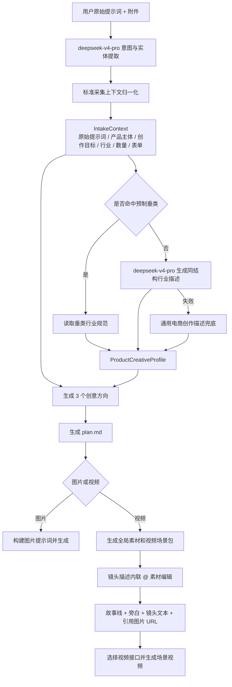

# PixelFlow 采集语义、行业回退与分镜内联引用设计

## 1. 目标

本设计解决三个相互关联的问题：

1. 用户输入“帮我生成书包的宣传图”时，采集结果不能退化成只有“宣传”或“宣传图”，后续创意方向、`plan.md` 和生成提示词必须持续保留“书包”这个产品主体。
2. 产品行业命中现有垂类 Skill 时使用项目内行业规范；未命中时由 `deepseek-v4-pro` 动态生成同结构的产品创作描述，不能因为缺少预制垂类而丢失业务语义。
3. 视频分镜的镜头描述改为一个可编辑文本区域，用户在光标处输入 `@` 直接选择全局出场角色、场景和道具；引用的图片名称和 URL 随镜头描述一起提交，不再保留独立的“参考素材”选择区。

本次改造保持现有主流程不变：

```text
采集需求
  -> 补齐表单
  -> 生成 3 个创意方向
  -> 填充并审核 plan.md
  -> 生成图片或视频场景包
  -> 用户确认
  -> 调用 Borgrise/content-app 生成
  -> 图片结果或场景视频合并结果
```

## 2. 根因结论

### 2.1 图片目标丢失

当前 LLM 能理解“书包宣传图”，但结构化输出可能变成：

```json
{
  "image_goal": "宣传图",
  "image_usage": "宣传"
}
```

前端看到 `image_goal` 已有值后，不再使用原始提示词作为兜底。后续创意方向、`plan.md` 和图片生成参数又主要读取 `image_goal`，导致“书包”在链路中丢失。

因此不能继续把 `image_goal` 同时当作“产品主体”和“创作目的”。两者必须拆开，并保留不可覆盖的原始提示词。

### 2.2 垂类行业规范未真正进入运行时

项目已有行业规范模板，但当前运行链路没有稳定完成以下动作：

```text
行业识别
  -> 命中预制行业规范
  -> 生成 product_creative_profile
  -> 持续传入创意方向、plan.md 和生成阶段
```

对于未命中的行业，也缺少结构一致的 LLM 回退，导致创意方向容易变成通用宣传文案。

### 2.3 镜头文本与图片引用是两个来源

当前镜头描述是纯文本，图片引用则由独立的 `reference_asset_ids` 区域维护。用户看到的 `@名称` 与真正提交给视频接口的图片 URL 没有形成一个原子数据结构，容易出现：

- 文本里有 `@书包`，实际没有提交书包图片。
- 用户删除文本中的 `@书包`，旧图片仍在参考集合中。
- 用户选择图片后，镜头描述里看不到引用出现的位置。

## 3. 总体架构

采用“标准采集上下文 + 行业描述解析器 + 内联素材引用”方案。

从 Java 分层角度看：

| 单元 | Java 类比 | 职责 |
| --- | --- | --- |
| Intake LLM | LLM Client | 从原始提示词提取意图、产品主体、行业、数量和表单候选值 |
| Intake Context Normalizer | Domain Service | 修正过于宽泛的目标，构建标准采集上下文 |
| Industry Profile Resolver | Strategy Service | 已知行业读取本地垂类模板，未知行业调用 LLM，失败时使用通用兜底 |
| Creative Direction Service | 领域 Service | 使用完整采集上下文生成 3 个创意方向 |
| Plan Builder | 模板 Service | 把创意方向、表单和产品创作描述写入 `plan.md` |
| Scene Mention Editor | React 业务组件 | 在镜头描述光标处选择、插入、删除并预览素材引用 |
| Scene DTO Normalizer | DTO Converter | 将内联引用转换为视频生成需要的文本和图片 URL |
| Borgrise Skill | 第三方 Client | 接收最终提示词和参考图集合，调用 content-app 接口 |



## 4. 标准采集上下文

### 4.1 数据合同

新增并贯穿采集、策划和生成阶段的标准上下文：

```json
{
  "source_prompt": "帮我生成书包的宣传图",
  "intent": "image_generation",
  "product_subject": "书包",
  "creation_goal": "书包宣传图",
  "industry_type": "服饰鞋包",
  "requested_output_count": 1,
  "form_values": {
    "image_goal": "书包宣传图",
    "image_type": "商品广告图",
    "image_usage": "广告投放",
    "image_style": "真实摄影",
    "image_size": "auto"
  },
  "product_creative_profile": {}
}
```

字段规则：

| 字段 | 规则 |
| --- | --- |
| `source_prompt` | 保存用户原始输入，进入流程后不可被 LLM 的短文本覆盖 |
| `product_subject` | 产品、人物、活动或内容主体，例如“书包” |
| `creation_goal` | 主体和用途组合后的完整目标，例如“书包宣传图” |
| `industry_type` | 归一化行业名称；允许 `general`，不允许为空 |
| `requested_output_count` | 默认 `1`；用户明确要求多张时保存明确数量 |
| `form_values.image_goal` | 必须是完整目标，不允许只有“宣传”“海报”“展示”等宽泛词 |
| `product_creative_profile` | 行业创作描述，进入创意方向、计划和生成阶段 |

### 4.2 语义完整性规则

`image_goal` 或视频产品信息满足以下任一情况时，视为不完整：

- 只包含“宣传”“宣传图”“海报”“广告”“展示”“推广”等用途词。
- 不包含已识别的 `product_subject`。
- 与 `source_prompt` 中的明确主体冲突。

归一化优先级：

1. 用户在表单中手动修改后的明确目标。
2. LLM 提取的 `product_subject + creation_goal`。
3. 从 `source_prompt` 重建的完整目标。

示例：

| 原始输入 | LLM 短结果 | 归一化结果 |
| --- | --- | --- |
| 帮我生成书包的宣传图 | 宣传图 | 书包宣传图 |
| 生成 3 张台球海报 | 海报 | 台球海报，数量 3 |
| 做一个宠物饮水机产品视频 | 产品视频 | 宠物饮水机产品视频 |

### 4.3 上下文传递

以下阶段必须接收同一份标准采集上下文，不能各自重新从短字段猜测目标：

```text
意图识别
  -> 表单自动填充
  -> 创意方向生成
  -> plan.md 填充
  -> 图片生成准备
  -> 视频场景包生成
  -> 用户修改后重新生成
```

用户后续提出修改意见时，只更新对应字段；`source_prompt`、`product_subject` 和历史附件继续保留，除非用户明确要求更换主体。

## 5. 行业创作描述解析

### 5.1 已知垂类

优先读取项目 Skill 目录中的行业规范：

```text
backend/skills/public/borgrise-creative-assistant-v2/templates/industry_profile.md
```

行业别名需要归一化，例如：

```text
书包 / 双肩包 / 箱包 -> 服饰鞋包
手机 / 耳机 / 智能硬件 -> 数码 3C
洗衣液 / 清洁剂 -> 家清日用
```

已知行业的 LLM 只负责分类和补充当前产品细节，不重新发明行业规范。

### 5.2 未知垂类

未命中预制垂类时，调用当前项目配置的 `deepseek-v4-pro` 生成与预制 Skill 相同结构的 `product_creative_profile`。

最低字段：

```json
{
  "industry_type": "文具教育",
  "product_subject": "儿童书包",
  "selling_points": [],
  "target_audience": [],
  "visual_anchor_keywords": [],
  "scene_recommendations": [],
  "composition_guidance": [],
  "risk_constraints": [],
  "core_message": ""
}
```

LLM 生成规则：

- 只能补充创作描述，不能更改用户明确的主体、数量和用途。
- 必须基于 `source_prompt`、表单值和附件摘要。
- 结果必须经过结构校验和空值补齐。
- 动态结果只属于当前会话和当前任务，不反写预制行业模板。

### 5.3 回退顺序

```text
预制垂类规范
  -> 未命中则 deepseek-v4-pro 动态行业描述
  -> LLM 调用失败则通用电商创作描述
```

通用兜底仍必须包含 `product_subject` 和 `creation_goal`，不能返回与主体无关的通用宣传方向。

## 6. 创意方向、计划和生成合同

### 6.1 创意方向

生成三个创意方向时，每个方向都必须：

- 明确写出 `product_subject`。
- 对齐 `creation_goal` 和表单用途。
- 使用 `product_creative_profile` 的卖点、受众、视觉锚点和风险约束。
- 与用户附件内容不冲突。
- 多图需求保持 `requested_output_count`，不能在此阶段退回 1 张。

### 6.2 plan.md

`plan.md` 必须保留以下信息：

- 原始需求摘要。
- 产品主体和完整创作目标。
- 行业类型和行业创作描述。
- 用户选择的创意方向。
- 图片数量或视频总时长。
- 用户附件及其用途。

### 6.3 图片生成

图片提示词的必选输入为：

```text
source_prompt
+ product_subject
+ creation_goal
+ 用户表单
+ product_creative_profile
+ 选中的创意方向
+ plan.md
+ 用户附件
```

多图数量以 `requested_output_count` 为准；供应商单次只返回一张时，按次数调用并汇总全部结果。

## 7. 视频分镜内联 @ 引用

### 7.1 交互目标

镜头描述保持为一段连续文本，不拆成独立的时间、地点、角色、景别输入框。

用户在镜头描述光标位置输入 `@` 后：

1. 在光标附近弹出素材下拉框。
2. 候选项包含全局出场角色、场景和道具。
3. 每项展示缩略图、名称和类型。
4. 选择后在光标处插入带名称的内联引用。
5. 鼠标悬停引用时显示图片预览。
6. 删除引用文本时同步删除对应图片引用。
7. 每个视频场景片段最多引用 9 张不同图片。

视觉风格是整片统一的文本配置，不作为图片候选项。

### 7.2 场景数据合同

镜头描述由文本和引用集合共同组成：

```json
{
  "shot_description": {
    "text": "0-5秒：地点:@办公室走廊 中，角色:@赵总监 摔下照片，道具:@产品书包 位于画面右侧。",
    "mentions": [
      {
        "asset_id": "scene-office-hallway",
        "name": "办公室走廊",
        "type": "scene",
        "image_url": "https://example.com/office-hallway.png"
      },
      {
        "asset_id": "character-director-zhao",
        "name": "赵总监",
        "type": "character",
        "image_url": "https://example.com/director-zhao.png"
      },
      {
        "asset_id": "prop-backpack",
        "name": "产品书包",
        "type": "prop",
        "image_url": "https://example.com/backpack.png"
      }
    ]
  }
}
```

约束：

- `asset_id` 是会话内稳定标识。
- `name` 用于文本显示和用户区分。
- `type` 只允许 `character`、`scene`、`prop`。
- `image_url` 是提交给视频生成接口的真实参考图地址。
- 同一 `asset_id` 在一个场景中只计一次。
- `mentions` 数量超过 9 时前端阻止继续选择，后端再次校验并返回明确错误。

### 7.3 编辑器实现边界

镜头描述区域需要支持富文本式内联 token，因此不能继续使用普通 `<textarea>` 加独立选择区。编辑器只实现本需求所需能力：

- 普通文本输入和粘贴。
- 光标位置 `@` 候选。
- 内联引用 token。
- token 删除。
- 悬停图片预览。
- 文本与结构化 `mentions` 的稳定序列化。

不增加粗体、标题、颜色等通用富文本功能。

### 7.4 视频生成请求

前端提交每个场景时包含：

```text
故事线
+ 旁白
+ shot_description.text
+ shot_description.mentions
```

后端转换规则：

```text
故事线 + 旁白 + 镜头描述文本 -> 视频生成 prompt
mentions[].image_url 去重后 -> 视频接口参考图集合
```

视频接口选择逻辑保持现状：LLM 根据场景内容、附件和引用判断文生视频、首帧图生视频、首尾帧生视频、全能参考、视频编辑或延伸视频；没有可靠判断时由现有确定性规则兜底。

### 7.5 旧数据兼容

历史场景可能只有：

```json
{
  "reference_asset_ids": ["character-a", "scene-b"]
}
```

恢复历史会话时允许将旧字段转换为 `mentions`。新保存的数据以 `shot_description.mentions` 为准，不再在页面展示独立“参考素材”区域。

## 8. 错误处理

| 场景 | 处理 |
| --- | --- |
| LLM 返回宽泛目标 | 语义完整性归一化，补回 `product_subject` |
| LLM 未识别行业 | 使用 `general` 并进入动态行业描述 |
| 动态行业描述失败 | 使用通用电商创作描述，不阻断流程 |
| 行业描述缺字段 | 结构校验后补默认空集合或核心信息 |
| 内联引用超过 9 张 | 前端禁止继续选择，后端返回业务校验错误 |
| 引用图片 URL 为空 | 不提交该引用，并在场景确认时提示用户重新生成或替换素材 |
| 历史 `reference_asset_ids` 无法解析 | 保留镜头文本，提示缺失的历史参考素材 |
| Borgrise 额度不足 | 立即停止当前操作，保存可恢复状态并返回前端充值提示 |
| Borgrise 业务失败 | 原样归一化业务原因并停止当前步骤 |
| Borgrise 异常 | 按现有重试规则重试，耗尽后保留恢复点 |

所有前端或第三方调用的 Python 新接口继续使用 `/agent` 前缀；调用 content-app 的 `/api/...` 路径属于后端向外部 Client 发起的请求，不受此前缀限制。

## 9. 验收标准

### 9.1 采集与图片

1. 输入“帮我生成书包的宣传图”后：
   - `product_subject` 为“书包”。
   - 图片表单第一项为“书包宣传图”或语义等价完整表达。
   - 三个创意方向都围绕书包。
   - `plan.md` 和最终图片提示词仍包含书包。
   - 最终图片能清晰看出书包，而不是无关宣传画面。
2. 输入未知垂类产品时：
   - 系统调用 `deepseek-v4-pro` 生成结构化产品创作描述。
   - LLM 失败时使用通用兜底并保持产品主体。
3. 输入“帮我生成 3 张书包宣传图”时：
   - `requested_output_count` 为 3。
   - 最终返回 3 张图片。

### 9.2 视频分镜

1. 页面不再显示独立“参考素材”区域。
2. 在镜头描述中输入 `@`，光标附近出现角色、场景、道具候选。
3. 候选项显示名称和缩略图，选择后形成内联引用。
4. 引用悬停能预览图片。
5. 每场景最多选择 9 张不同图片。
6. 提交后，后端收到镜头文本及所有引用图片 URL。
7. Borgrise 视频接口使用这些 URL 作为参考图集合。
8. 历史会话中的旧引用仍可恢复。

### 9.3 回归与真实验证

自动化验证至少覆盖：

- 采集目标语义完整性。
- 已知行业模板解析。
- 未知行业 LLM 回退和失败兜底。
- 创意方向、`plan.md`、图片生成参数中的主体贯穿。
- 内联引用序列化、删除、去重和 9 张限制。
- 旧 `reference_asset_ids` 迁移。
- 视频 prompt 和图片 URL 组装。

真实流程从前端采集需求开始，至少完成：

- 单张图片：最小输入和复杂输入各一条。
- 多张图片：明确数量的最小输入和复杂输入各一条。
- 图片编辑、参考图生成、多图融合。
- 文生视频、首帧图生视频、首尾帧生视频、全能参考视频、视频编辑、延伸视频。
- 每条视频流程走到场景视频生成和最终合并。
- 对生成图片和视频抽帧进行人工视觉检查，确认产物与原始产品主体和创作目标一致。

真实调用使用请求入口的 `Authorization` 临时透传，不写入代码、配置、测试快照或文档。

## 10. 非目标

本次不做以下扩展：

- 不新增一套平行 Agent 状态机。
- 不改变图片和视频的整体确认、修改、合并主流程。
- 不把动态生成的未知行业描述自动写回预制垂类模板。
- 不建设完整通用富文本编辑器。
- 不改变 content-app 现有图片、视频接口的请求和响应合同，除非真实联调确认接口本身缺少必要能力。
