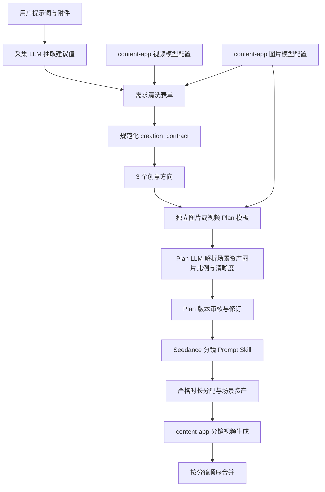

# PixelFlow 创作合同、双 Plan 模板与 Seedance 分镜 Skill 设计

## 1. 目标

本次改造解决视频需求参数在采集、创意、Plan、分镜、场景资产和视频生成之间丢失的问题，并同步完善图片/视频 Plan 修订流程。

完成后必须满足：

- 粗略视频需求必须先经过需求清洗表单，必填字段完整后才允许生成创意方向。
- 用户确认的总时长、画幅、视频模型、图片模型、视频用途和视觉风格成为后续流程的权威创作合同。
- 视频 Plan、场景包和全部分镜时长总和严格等于用户确认的总时长。
- 每个分镜时长为 4-15 秒，时间描述只使用秒。
- 用户确认的视频画幅贯穿全部视频生成接口；Plan LLM 从所选图片模型能力范围内规划场景资产图片比例和清晰度，视频模型只负责分镜视频，图片模型只负责角色、场景和道具图片。
- 图片和视频分别使用独立 Plan 模板，LLM 按当前上下文生成具体内容。
- Plan 修改默认只修订当前创意，只有用户明确选择时才重新生成 3 个创意方向。
- Plan 每次修改产生新版本并保留历史，支持回退。
- 视频分镜镜头描述使用项目内 Seedance Prompt Skill 生成，同时保留 `@asset_id` 和图片 URL mentions。

## 2. 根因

当前视频表单只有产品、品类、人群和转化目标四项。总时长、画幅、视频模型、图片模型、用途和视觉风格没有形成经过用户确认的结构化字段，因此后续逻辑只能从提示词、创意方向或本地默认值推测。当前 Plan 生成器使用单一模板和确定性拼接，场景包又独立推导时长，导致以下问题：

- 用户选择 180 秒后仍可能生成 30 秒 Plan。
- 用户选择 9:16 后，分镜视频仍可能使用其他比例，场景资产图片也没有经过 Plan 明确规划和记录。
- 视频模型和图片模型职责混在一起，不能稳定透传到对应的 content-app 接口。
- Plan 修改意见总是回到创意方向，无法区分局部修订和彻底换创意。
- 分镜提示词没有完整吸收 Seedance 2.0 的时间戳、多模态引用和镜头语言规则。

## 3. 总体架构

采用“创作合同贯穿全流程”方案。前端表单提交后生成规范化 `creation_contract`，后端在每个阶段读取并校验同一组权威字段。



前端只负责展示、收集和持久化用户选择；Python 网关负责规范化、校验、编排和供应商 DTO 映射；content-app 仍负责模型配置、实际生成和异步任务状态。

## 4. 视频需求清洗表单

### 4.1 字段

保留现有字段并新增以下字段：

| 字段 | 类型 | 必填 | 默认值 | 规则 |
| --- | --- | --- | --- | --- |
| `product_info` | 文本 | 是 | LLM 抽取 | 产品或创作主体 |
| `product_category` | 文本 | 是 | LLM 抽取 | 产品品类或内容行业 |
| `target_audience` | 文本 | 是 | LLM 抽取 | 目标人群 |
| `conversion_goal` | 单选 | 是 | `引流直播间` | 保持现有选项 |
| `video_duration_sec` | 预设单选加自定义整数 | 是 | `30` | 预设 30/60/90/180；自定义 4-300 |
| `video_ratio` | 下拉单选 | 是 | `9:16` | 取当前视频模型支持的比例 |
| `video_model_mode` | 下拉单选 | 是 | `system_recommended` | 视频模型使用系统推荐或手动选择 |
| `video_model` | 字符串 | 是 | `seedance-2.0` | 保存解析后的真实视频模型名 |
| `image_model` | 下拉单选 | 是 | `gpt-image-2` | 角色三视图、场景图和道具图使用的图片模型 |
| `video_usage` | 文本或单选 | 是 | `宣传片` | 如品牌宣传、产品介绍、活动预热 |
| `visual_style` | 文本/标签 | 否 | LLM 抽取 | 如电影光影、科技感、写实 |

### 4.2 自定义时长交互

- 时长控件展示 `30 秒`、`60 秒`、`90 秒`、`180 秒`、`自定义`。
- 选择“自定义”后显示数字输入框。
- 输入框只接受自然数。
- 有效范围是 4-300，前端越界、空值或非整数时禁用提交并展示校验提示。
- 提交时不传“自定义”字符串，只传输入框解析后的整数 `video_duration_sec`。
- Python 后端再次执行整数和 4-300 范围校验，不能信任前端。

### 4.3 动态视频模型与画幅

前端通过 content-app `GET /api/modelParamConfig/listByCategory/video_generate` 获取启用视频模型：

- 仅保留 `modelType` 大小写不敏感包含 `seedance` 的配置。
- 模型下拉第一项为“系统推荐模型”。
- 系统推荐优先选择 `seedance-2.0`；若接口没有该模型，则选择同时支持目标画幅和 4-15 秒片段时长的第一个 Seedance 模型。
- 选择系统推荐后，界面必须明确展示解析后的实际模型。
- 手动切换视频模型后，画幅下拉只展示该视频模型 `paramConfig.aspectRatioList` 中 PixelFlow 支持的比例；当前画幅失效时优先切换到 `9:16`，否则使用第一个可用比例。
- API 异常时允许使用最小兜底配置 `seedance-2.0 / 9:16 / 1080p / 4-15 秒`，并向用户提示配置读取失败。

表单标签必须显示为“视频模型”，不能再使用含混的“目标模型”或“模型”。

### 4.4 动态图片模型

前端同时通过 content-app `GET /api/modelParamConfig/listByCategory/image_generate` 获取启用图片模型：

- 图片模型下拉展示接口返回的全部启用图片模型，不做 Seedance 过滤。
- 默认选择 `gpt-image-2`；若接口没有该模型，则选择第一个启用图片模型。
- 如果采集 LLM 从用户原始需求中识别到明确图片模型，按 `modelType` 大小写不敏感精确匹配后预选。
- LLM 提取到的模型不存在时，保留提示信息并落到默认模型，用户仍可在下拉框中修改。
- 用户手动选择拥有最高优先级，提交后保存真实 `modelType` 到 `image_model`。
- 前端同时保存所选模型的 `paramConfig.aspectRatioList` 和 `paramConfig.sizeList`，作为只读能力数据提交给后端 Agent。
- 图片模型负责视频场景包中的角色三视图、场景图和道具图，不参与分镜视频生成。
- 图片模型 API 异常时使用最小兜底配置 `gpt-image-2 / 1:1、16:9、9:16 / 1080p、2K、4K`，并向用户提示配置读取失败。

表单标签必须显示为“图片模型”，避免和“视频模型”混淆。

### 4.5 图片比例与清晰度由 Plan LLM 决策

视频需求表单不展示图片比例和图片清晰度，也不要求用户选择。前端只把图片模型及其能力范围传给后端：

```json
{
  "image_model": "gpt-image-2",
  "image_model_capabilities": {
    "aspect_ratios": ["1:1", "16:9", "9:16"],
    "sizes": ["1080p", "2K", "4K"]
  }
}
```

生成视频 `plan.md` 时，Plan LLM 必须结合视频主题、构图、视觉风格、分镜用途、视频画幅和 `plan_video.md` 模板，在能力范围内选择：

- `scene_image_ratio`：角色三视图、场景图和道具图使用的图片比例。
- `scene_image_size`：角色三视图、场景图和道具图使用的图片清晰度。

约束：

- `scene_image_ratio` 必须属于 `image_model_capabilities.aspect_ratios`。
- `scene_image_size` 必须属于 `image_model_capabilities.sizes`。
- 当视频画幅也被图片模型支持时，LLM 应优先选择和 `video_ratio` 一致的图片比例，减少参考图用于视频生成时的裁切。
- 当内容确实需要其他构图，或图片模型不支持视频画幅时，LLM 可以选择该图片模型支持的其他比例，但最终视频仍严格使用用户选择的 `video_ratio`。
- LLM 输出不在合法范围内时，后端拒绝该值并使用确定性兜底：比例优先使用受支持的 `video_ratio`，否则使用第一个可用比例；清晰度优先 `4K`，其次 `2K`、`1080p`，最后使用第一个可用值。
- Plan 响应必须返回解析后的图片模型、比例、清晰度，并写入 `plan.md` 和最终创作合同。场景包和场景资产生成阶段不得再次猜测或更改。

### 4.6 LLM 预填优先级

采集 LLM 抽取：

- `video_duration_sec`
- `video_ratio`
- `video_model`
- `image_model`
- `video_usage`
- `visual_style`

最终优先级是：用户表单确认值 > LLM 抽取值 > 系统默认值。用户确认后不允许后续阶段重新猜测并覆盖。

## 5. 创作合同

表单提交后先构造“已确认输入合同”。其中图片模型能力来自 content-app 配置，不是用户手填：

```json
{
  "version": 1,
  "intent": "video",
  "video_duration_sec": 180,
  "video_ratio": "9:16",
  "video_model_mode": "system_recommended",
  "video_model": "seedance-2.0",
  "video_size": "1080p",
  "video_sound": "on",
  "image_model": "gpt-image-2",
  "image_model_capabilities": {
    "aspect_ratios": ["1:1", "16:9", "9:16"],
    "sizes": ["1080p", "2K", "4K"]
  },
  "video_usage": "宣传片",
  "visual_style": "电影感写实",
  "confirmed_by_user": true
}
```

Plan LLM 完成后形成“最终生产合同”，在上述字段基础上增加：

```json
{
  "scene_image_ratio": "9:16",
  "scene_image_size": "4K",
  "scene_image_spec_source": "plan_llm"
}
```

合同同时进入：

- 创意方向 LLM 输入和每个方向的 `data.creation_contract`。
- Plan 生成与 Plan 修订请求。
- conversation context 和可恢复 job artifact。
- 视频场景包准备请求。
- 场景资产图片比例。
- 场景资产图片模型和清晰度。
- 每个分镜视频 job 的 `ratio/model/size/sound`。

创意方向阶段读取已确认输入合同；Plan 生成完成后的场景包、场景资产和视频生成阶段只读取最终生产合同。后续阶段若合同缺失或不合法，应返回明确校验错误，不能静默回落到 30 秒，也不能重新选择图片比例或清晰度。

## 6. 双 Plan 模板与 LLM 生成

删除旧 `templates/plan.md`，新增：

- `templates/plan_video.md`
- `templates/plan_image.md`

用户上传的文件是结构、章节、细节密度和表达方式的范例，不是固定业务文案。LLM 必须按当前表单、创意方向、行业画像、素材、语义记忆和创作合同重写全部业务内容，不能把苹果PRO、林晓、赵总监等示例实体泄漏到其他任务。

视频 Plan 必须包含：

- 选题方向、选题优势、视频规格、角色列表、镜头列表、背景音乐、钩子、产品露出和转化收口。
- 视频规格中的时长、画幅、视频模型、图片模型、用途和视觉风格与创作合同完全一致。
- 新增场景资产图片规格，明确记录图片模型、图片比例和图片清晰度；比例和清晰度必须由 Plan LLM 从该图片模型的能力范围内选择。
- 镜头列表使用后端预先生成的严格分段清单。
- 每个镜头包含编号、起止秒、时长、画面、文案/台词/旁白和音效。

图片 Plan 必须使用图片模板的章节与表达方式，并继承图片数量、类型、用途、风格和尺寸。

LLM 返回后执行一致性校验。若 LLM 失败、输出缺章节或违反硬约束，则使用同结构的确定性兜底 Plan，并在响应中记录 `llm_used=false` 和错误原因。

前端展示名称仍为 `plan.md`。

## 7. Plan 修订、版本与回退

用户点击“继续修改”后先输入意见，系统进入 Plan 修订模式选择：

1. `extend_current`：在当前创意基础上扩展/修改，默认选中。
2. `regenerate_directions`：放弃当前创意，重新生成新创意。

规则：

- `extend_current` 只调用 Plan 修订接口，输入当前 Plan、修改意见、创作合同和历史版本，输出下一版本，不得返回创意方向列表。
- `extend_current` 仍需把所选图片模型能力传给 Plan LLM；若内容变化影响场景资产规格，LLM 可以在同一能力范围内重新选择图片比例和清晰度，并写入新版本生产合同。
- `regenerate_directions` 才调用创意方向生成接口，返回新的 3 个方向。
- 初始 Plan 是 v1，每次修订产生 v2、v3。
- artifact 和 conversation context 保存当前版本及完整 `plan_history`。
- 每个 Plan 版本同时保存当时解析出的最终生产合同，包含图片模型、图片比例和图片清晰度。
- 回退不覆盖历史。回退 v2 到 v1 时生成一个内容源为 v1 的新版本 v3，并记录 `restored_from_version=1`。
- 后续图片或视频生成只能读取当前激活版本。

## 8. SeedanceShotPromptSkill

将上传压缩包中的核心 `SKILL.md` 放到现有 Borgrise Creative Assistant Skill 目录，并保留来源和 MIT 许可证信息。新增运行时适配层 `SeedanceShotPromptSkill`，负责把该 Skill 的规则应用到每个场景包镜头描述。

输入：

- 当前激活 Plan 及其最终生产合同。
- 当前分镜的起止秒和精确时长。
- 当前故事线、旁白、视觉风格。
- 全局角色、场景、道具。
- 当前分镜可用的参考素材和最多 9 个 asset id。
- 创作合同中的视频模型、图片模型与画幅。

输出：

- 一整段 `shot_description.text`。
- `shot_description.mentions`。
- `reference_asset_ids`。
- 组装后的 Seedance `prompt`。

硬约束：

- 中文自然语言。
- 时间戳只使用秒，并覆盖当前分镜的完整时长。
- 包含主体、动作、环境/光影、景别、运镜、风格、台词/旁白和音效中的适用内容。
- 文本中使用 PixelFlow 的 `@asset_id`；适配层再把它们映射为 mentions 图片 URL。
- 最多 9 张参考图。
- 不拆成多个前端字段。
- LLM 输出必须经过现有规范化和引用校验，失败时使用 Seedance 规则版提示词兜底。

## 9. 严格时长分配

新增唯一的整数秒分配器，Plan 和场景包共同使用：

- 输入总时长为 4-300 秒。
- 每段最少 4 秒，最多 15 秒。
- 优先片段长度约 10 秒。
- 片段数必须位于 `ceil(total/15)` 与 `floor(total/4)` 的可行区间。
- 返回的所有整数秒之和必须精确等于总时长。
- 300 秒允许生成超过旧上限 18 的场景数量。
- 转成 `duration_ms` 只在 API DTO 边界进行。

Plan 生成后和场景包生成后都执行：

```text
sum(scene.duration_sec) == creation_contract.video_duration_sec
4 <= scene.duration_sec <= 15
```

任一条件失败就阻止后续生成并返回具体错误。

## 10. content-app 视频接口 DTO

PixelFlow 的 Borgrise wrapper 必须按 content-app 当前 DTO 精确构造请求体：

- `/api/video/text-to-video`：`prompt/model/ratio/size/duration/videoCount/sound`
- `/api/video/image-to-video`：`image_url/prompt/duration/ratio/model/size/sound/videoCount`
- `/api/video/two-image-to-video`：`first_frame_image_url/last_frame_image_url/prompt/ratio/duration/model/size/videoCount/sound`
- `/api/video/reference-mode-video`：`prompt/imageUrls/videoUrls/audioUrls/duration/ratio/sound/model/size/videoCount`
- `/api/video/edit-video`：`prompt/refImage/refVideo/model/duration/size/ratio/videoCount/sound`

删除未被 DTO 接收的旧字段。所有场景视频调用使用合同中的实际视频模型、画幅、视频清晰度和声音设置；`duration` 使用该分镜真实的 4-15 秒整数，不再把 4 秒改成 5 秒或把 15 秒改成 10 秒。图片模型绝不能误传给视频生成接口。

模式选择沿用现有规则：纯文本、首帧、首尾帧、全能参考、视频编辑和延伸视频按素材与显式 `generation_mode` 选择，其他流程不变。

## 11. 场景资产图片模型、比例与清晰度

角色三视图、场景图和道具图生成请求必须继承 Plan LLM 已解析并写入最终生产合同的以下字段：

- `creation_contract.scene_image_ratio` 作为图片比例。
- `creation_contract.image_model` 作为 content-app 图片生成模型。
- `creation_contract.scene_image_size` 作为图片清晰度。

所选图片模型必须来自 `/api/modelParamConfig/listByCategory/image_generate`，其支持的比例和清晰度列表随表单一并传入 Plan Agent。后端 Plan Agent 和场景资产 Skill 都要校验解析值属于对应能力列表；不合法时按 4.5 节兜底，且在 Plan 元数据记录修正原因。场景资产阶段不能悄悄使用其他比例、清晰度或模型。生成后的图片 URL 继续进入现有全局资产与 `@mention` 体系。

## 12. 错误处理与恢复

- content-app 视频模型配置读取失败：展示提示，使用 Seedance 最小兜底配置。
- content-app 图片模型配置读取失败：展示提示，使用 `gpt-image-2` 最小兜底配置。
- 表单不完整或时长非法：不允许生成创意方向。
- Plan LLM 失败：使用确定性 Plan 兜底并保留错误元数据；图片比例和清晰度仍必须从所选图片模型能力列表中选出。
- Seedance 镜头 LLM 失败：使用规则版镜头提示词兜底。
- content-app 业务失败、额度不足和异常重试规则保持现有实现。
- 所有异步 job 必须继续绑定原始 `conversation_id`，切换对话后不得串流程或重复启动。

## 13. 验证策略

### 自动化

- 后端表单 schema、必填校验、自定义 4-300 秒边界。
- LLM 抽取与 fallback 的时长、比例、视频模型、图片模型、用途、视觉风格。
- 动态视频模型过滤、视频系统推荐、图片模型默认/LLM 预选和图片模型能力透传测试。
- Plan LLM 在图片模型支持范围内选择图片比例/清晰度，以及非法输出的确定性兜底测试。
- 4、30、60、90、180、300 秒严格分段测试。
- 视频/图片模板选择、LLM Plan、版本修订和回退测试。
- Seedance 镜头 prompt、秒级时间戳、`@asset_id`、9 张限制测试。
- 五类 content-app 视频请求体映射测试，以及场景资产图片模型/比例/清晰度透传测试。
- 前端主流程合同测试和 TypeScript 构建。

### 真实流程

- 使用用户提供的 content-app token 完成一条图片生成流程，从采集、创意、Plan 到最终图片。
- 完成一条视频生成流程，从需求清洗表单选择视频模型和图片模型、生成创意、Plan LLM 自动确定合法图片比例/清晰度、场景包、参考图、分镜视频到合并结果。
- 实际验证 Plan 局部修改不会重新生成方向，选择重新创意时才返回 3 个方向。
- 180 秒合同、画幅和分镜总和至少通过后端真实接口链路验证；若实际生成全部 180 秒会消耗大量额度，则运行一条较短真实成片，同时用自动化和路由集成测试覆盖 180 秒严格合同。
- 对最终图片和视频是否符合需求进行人工可见结果检查，并记录产物 URL、模型、画幅和总时长。

## 14. 文档同步

实现完成后同步更新：

- `README.md`
- `AGENTS.md`
- `docs/pixelflow-agent-skill-flow-latest-design.md`
- `CONTENT_APP_API_CALLS.md`

以后修改视频表单、创作合同、Plan 模板、Seedance Skill 或 content-app 视频 DTO 时，必须同步修改这些文档。
