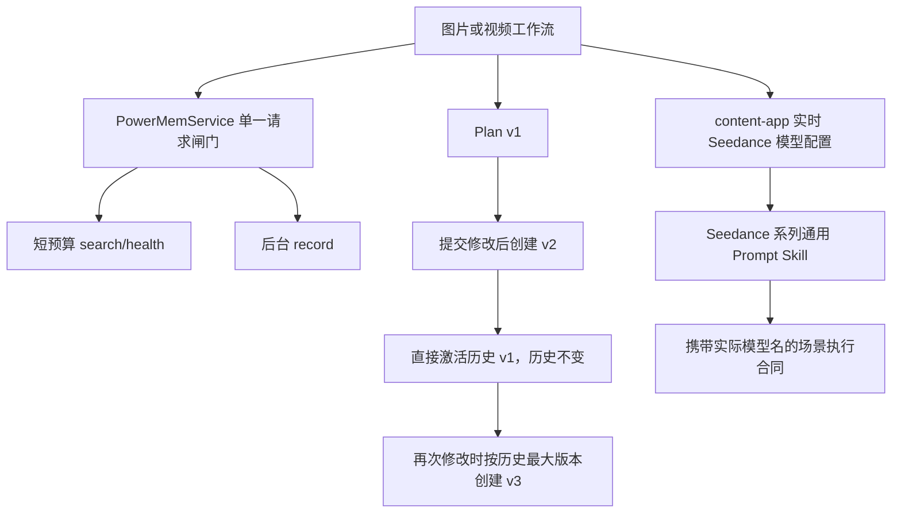

# PixelFlow PowerMem、Plan 回退与 Seedance Skill 可靠性改造设计

## 1. 背景与目标

本次改造同时处理三个已经确认的可靠性问题，并完成对应真实流程验收：

1. PowerMem 在 PixelFlow 主流程中再次出现 `OB_SESSION_ENTRY_EXIST(4661)`。
2. 图片和视频共用的 Plan 历史回退会复制旧内容并创建新版本，违反“直接切换到所选历史版本”的产品语义。
3. 当前 Seedance Prompt Skill 的文字和运行时适配器写死 Seedance 2.0，但前端和创作合同实际允许所有启用的 Seedance 系列模型。

完成后必须满足：

- 同一 PixelFlow 进程内，PowerMem 的 search、record、health 不向服务端发送重叠请求。
- search/health 即使被慢速后台 record 占用，也只在短总预算内等待并保持 fail-open。
- 图片和视频 Plan 回退均不新增版本、不调用 LLM、不删除历史。
- 回退后再次提交修改时，版本号按历史最大版本递增，不产生重复版本号。
- Seedance Prompt Skill 对所有实时启用的 Seedance 系列模型提供通用规则，不假设当前模型一定是 2.0。
- 模型专属能力由实时模型配置和实际接口合同决定，Skill 不擅自开启。
- `THIRD_PARTY_NOTICE.md` 保留并补全来源信息。
- 新增或修改的代码注释、用户提示、测试说明、文档和提交信息使用中文；类名、函数名、字段名等程序标识符继续遵循项目现有英文命名规范。
- 自动化验证和真实 content-app 图片、视频流程均通过后才能交付。

## 2. 已确认根因

### 2.1 PowerMem 并发回归

提交 `2c726bd` 曾在 `_request()` 外使用同一把锁串行化所有 PowerMem HTTP 请求，用来规避 OceanBase 会话并发冲突。提交 `ece4032` 为避免慢速 record 阻塞 search，将其拆成 `_search_lock` 和 `_record_lock`，同时移除了 `_request()` 的全局请求锁。

拆锁以后只能保证“search 与 search”及“record 与 record”互斥，不能保证“search 与 record”互斥。PixelFlow 又会通过 `asyncio.create_task()` 在后台执行 record，因此上一阶段的慢写入和下一阶段的同步检索会自然重叠，重新触发 `OB_SESSION_ENTRY_EXIST`。

### 2.2 Plan 回退语义原本就是追加版本

`restore_plan_version()` 当前查到历史版本后调用 `next_version()`，因此 `v2 -> 回退 v1` 会创建内容等于 v1 的 v3。前端提示语、后端测试、README、AGENTS 和最新设计文档都明确固化了这一行为。

图片和视频共用 `CreationIntent`、同一个 planning router、同一个 `restore_plan_version()` 和同一个前端 `handleRollbackPlan()`，所以两类流程同时受影响。

### 2.3 Seedance 运行时与文档语义不一致

前端以 `modelType` 包含 `seedance` 作为可用模型条件，`seedance-2.0` 只是系统优先默认值。后端创作合同也只校验模型名包含 `seedance`。

但当前 Skill、运行时章节抽取器和场景包系统提示都明确写成 Seedance 2.0，`build_seedance_shot_prompt()` 还没有 `video_model` 参数。这会把 2.0 的多模态、声音或平台参数假设错误地注入其他 Seedance 模型。

### 2.4 上传 ZIP 与来源说明

用户提供的 `BGEC-SD2-book-prompts-skill.zip` SHA-256 为：

```text
D1B24E9C412B95BBFB1D4CE3677EC36255E374B8A251784020FC6DE193078D94
```

该 ZIP 顶层没有 LICENSE 或 NOTICE。只有 `references/short-drama/` 子树包含 `0xsline` 的 MIT License；其余抖音、Arcads 等蒸馏资料没有随包提供可复用许可证。现有 `THIRD_PARTY_NOTICE.md` 则记录了当前 Skill 的上游仓库、归档提交和 MIT 声明，因此不能删除。

## 3. 总体设计



Java 类比：

- PowerMem 的请求闸门相当于一个保护非线程安全下游 Client 的进程内 `Semaphore(1)`。
- `plan_history` 相当于不可变版本表，`plan_version` 相当于当前激活版本指针。
- Plan restore 相当于 `activeVersion = selectedVersion`，不是新增一条 `PlanRevision`。
- Seedance Skill 相当于系列模型共享的策略接口；具体模型能力来自配置 DTO，不能写死在策略说明里。

## 4. PowerMem 请求模型

### 4.1 单一请求闸门

`PowerMemService` 使用两类锁：

- `_client_lock`：只保护 `httpx.AsyncClient` 的延迟初始化。
- `_request_lock`：保护所有实际 PowerMem HTTP 请求，包括 search、record、health。

删除 `_search_lock` 和 `_record_lock`。多分类 search 仍保持顺序查询和部分成功结果合并。

### 4.2 总超时预算

每次请求的超时预算同时覆盖“等待 `_request_lock`”和“执行 HTTP”：

- search/health 使用 `timeout_seconds`，默认 3 秒。
- record 使用 `record_timeout_seconds`，默认 60 秒。

如果 search/health 在预算内拿不到锁，直接进入现有 fail-open 路径并返回空记忆或不可用状态，不允许绕过锁向 PowerMem 发送并发请求。这样既不再触发本地交叉并发，也不会让用户请求被慢写入阻塞数十秒。

### 4.3 OB_SESSION_ENTRY_EXIST 定向重试

仅对幂等的 search 和 health 请求识别 `OB_SESSION_ENTRY_EXIST`，在同一总超时预算内最多尝试 3 次；第一次失败后等待 50ms，第二次失败后等待 100ms。record 不自动重试，避免服务端已经部分落库时重复写入。

重试只处理明确的 OceanBase 会话占用错误；401、403、其他业务错误和普通 5xx 继续沿用现有行为。

### 4.4 部署边界

该锁只覆盖单进程。当前默认 Uvicorn 单 worker 部署可以消除已复现的本地触发条件。若部署多个 worker、多个容器或多个 PixelFlow 副本，仍需要 PowerMem 服务端修复数据库 Session 生命周期，或引入跨进程协调设施。本次不新增 Redis/数据库分布式锁。

## 5. Plan 直接回退模型

### 5.1 行为语义

```text
初始：active=v1，history=[v1]
修改：active=v2，history=[v1,v2]
回退 v1：active=v1，history=[v1,v2]
再次修改：active=v3，history=[v1,v2,v3]
```

restore 必须：

- 查找并校验 `restore_version`。
- 返回该版本内容并把 `plan_version` 设置为 `restore_version`。
- 保持 `plan_history` 原样，不追加、不删除、不覆盖。
- 不调用 LLM、不记录新的 Plan 修订经验。
- 可在顶层保留 `restored_from_version=restore_version`，只用于表达本次用户动作，不写入新历史项。

### 5.2 下一版本号

`next_version()` 必须先规范化 history，再使用下式计算：

```text
max(self.plan_version, current_version, history 中最大 version, 1) + 1
```

这保证 active 从 v2 切回 v1 后，再修改时得到 v3，而不是重复 v2。

### 5.3 完整版本快照

新创建的 history entry 除 `version` 和 `plan_markdown` 外，还保存：

- `creation_contract`
- `scene_durations_sec`

直接回退时优先恢复所选 history entry 的完整快照。兼容已有历史数据：若旧 entry 没有这些字段，则保留请求中当前的已确认合同和分镜时长，不能重新猜测或改写用户确认字段。

该兼容策略不会迁移或重写已有 conversation 消息。

### 5.4 前端与持久化

前端回退成功后：

- 新卡片显示所选版本号，例如 v1，不显示虚构的 v3。
- 提示语改为“已切换到 plan.md vN，本次未创建新版本”。
- 更新 conversation context 中的 `plan_markdown`、`plan_version`、`plan_history`、`creation_contract`、`scene_durations_sec` 和 `restored_from_version`。
- 图片批准继续读取该 Plan 调用 image prepare。
- 视频批准继续读取该 Plan 和合同启动 scene-package job。

本次不引入独立 Plan 数据表，也不增加 `active_plan_version` 新字段；现有 `plan_version` 继续表示当前激活版本，以保持 API 向后兼容。

## 6. Seedance 系列通用 Skill

### 6.1 文件与元数据

在原路径重写 `skills/seedance-prompt/SKILL.md`，不创建第二套重名 Skill。frontmatter 只保留：

- `name: seedance-prompt`
- 以“Use when...”开头、覆盖 Seedance 系列模型和 PixelFlow 分镜场景的 description。

标题和正文使用“Seedance 系列”，不把通用策略描述成只适用于 Seedance 2.0。

### 6.2 通用规则与模型能力分离

所有 Seedance 系列模型共享：

- 明确主体、主要动作、环境、景别、运镜、光影、声音和叙事目标。
- 把抽象情绪翻译为可见的表情、姿态、构图、光线和节奏。
- 一个分镜只设置一个主要叙事目标和一个第一优先级。
- 一个参考素材只承担一个明确用途，人物、场景、道具职责分离。
- 多人物按主动作、反应角色、背景角色分层，避免平均堆叠细节。
- 对白放在对应镜头节奏内，声音块只放声线、环境音、动作音和配乐要求。
- 保持角色外观、产品、场景空间、光调和相邻镜头连续性。
- UGC 场景使用受控的不完美，例如自然皮肤纹理、真实居住痕迹、轻微手持感和自然停顿。
- 避免高密度动作清单、互相冲突的多运镜和反常规复杂物理动作。

模型专属能力，例如音画联合生成、视频/音频参考、编辑、延长、最大输入数和分辨率，只能在实时模型配置或供应商 API 明确支持时使用。Skill 不维护硬编码模型能力矩阵。

### 6.3 PixelFlow 强合同

无论选择哪一个 Seedance 系列模型，PixelFlow 当前主流程继续执行：

- 每个场景片段为 4-15 整数秒。
- 时间范围使用秒，不使用 ms、小数时间码或毫秒时间码。
- `shot_description.text` 是一整段中文。
- 最多 9 张图片参考；若供应商实时配置限制更低，以更低值为准。
- 只使用执行合同声明的 `@asset_id`。
- mentions 和 `reference_asset_ids` 必须一致并携带可生成 URL。
- characters 只放人物，产品、包装和工具放 props。
- 场景片段独立生成，最终按 `scene_index` 合并；不采用上传 Skill 中“首段后持续 extend”的长视频主流程。

### 6.4 运行时适配器

`build_seedance_shot_prompt()` 增加实际 `video_model` 参数，并在执行合同中明确当前模型。`scene_packages.py` 从用户确认的 `creation_contract/form_values.video_model` 传入模型名。

`load_seedance_guidance()` 改为抽取新的稳定通用章节，不再依赖“Seedance 2.0 核心能力”等版本专属标题。若章节缺失，仍快速失败并由测试发现。

LLM 场景包提示语改成“Seedance 系列通用指导”，同时保留当前实际模型名。

### 6.5 来源与版权处理

上传 ZIP 不直接覆盖、不整包导入，也不复制许可不明确的大段内容。只以重新组织、重新表述的方式吸收与 PixelFlow 电商分镜直接相关的通用方法。

`THIRD_PARTY_NOTICE.md` 改为中文并保留：

- 当前 Skill 上游 `songguoxs/seedance-prompt-skill`、归档 revision 和 MIT 声明。
- 本次用户提供 ZIP 的文件名和 SHA-256。
- 明确未导入 ZIP 的 short-drama 子树和其他参考原文，因此不把其许可证错误声明为本项目 Skill 的许可证。
- ByteDance Seed/火山引擎官方参考地址。

## 7. 测试驱动实施

### 7.1 PowerMem RED/GREEN

先新增会失败的测试：

- 慢 record 运行时启动 search，Fake transport 在出现重叠请求时返回 `OB_SESSION_ENTRY_EXIST`。
- 当前代码应观察到重叠并使测试失败。
- 修复后断言 `max_active_requests == 1`。
- search 等待总时长不超过配置预算，且未向服务端发送重叠请求。
- record 完成后的下一次 search 正常成功。
- search/health 的 OB 定向重试有效；record 不因该规则自动重试。

### 7.2 Plan RED/GREEN

图片和视频分别覆盖：

- v2 回退 v1 后 `plan_version == 1`。
- history 仍为 `[1,2]`，没有第三项。
- 回退不调用 Plan LLM。
- 从 active v1 再修改得到 v3，history 为 `[1,2,3]`。
- 新历史 entry 保存合同和分镜时长快照。
- 旧历史 entry 无快照时保持当前权威合同。
- 前端回退文案不再出现“保留为新版本”，并持久化完整 Plan context。

### 7.3 Skill RED/GREEN

按 `superpowers:writing-skills` 执行基线与前向测试：

- 不加载新 Skill，让独立 agent 为 `seedance-1.5-pro`、`seedance-2.0-mini` 和未来 Seedance 名称生成 PixelFlow 电商分镜，记录版本误判、引用、时长、声音或输出形态问题。
- 写入新 Skill 后，用相同场景再次测试。
- 断言 Skill 不拒绝非 2.0 Seedance 模型，不把当前模型改写为 2.0。
- 断言运行时 guidance、实际模型名、秒级时间范围、单段文本、最多 9 引用和 `@asset_id` 合同都存在。
- 运行 Skill 结构校验和相关 Python 测试。

## 8. 真实端到端验收

### 8.1 环境与安全

- 本地运行修改后的 FastAPI 和 React，而不是只调用未部署改动的远端 PixelFlow。
- content-app 和 PowerMem 使用 dev/test 配置。
- 用户提供的 Bearer token 只进入当前测试进程或浏览器会话，不写入文件、源码、配置、命令输出、测试快照或提交。
- 测试数据使用可识别的临时 conversation；不记录 token、供应商 key、原始大 prompt 或完整异常堆栈。

### 8.2 PowerMem 真实冒烟

- 用唯一测试标识启动一条后台 record，并在其执行期间发起 search。
- 验证 PixelFlow 日志不再出现 `OB_SESSION_ENTRY_EXIST`。
- 验证 search 在短预算内返回，主流程不被慢 record 长时间阻塞。
- 验证 record 最终成功或按 fail-open 给出明确、无敏感信息的诊断。

### 8.3 图片完整流程

使用 1 张输出的最小需求，真实执行：

```text
创建 conversation
-> 保存用户消息
-> intake job
-> 图片表单与校验
-> 3 个创意方向
-> Plan v1
-> 修改得到 v2
-> 直接回退 v1
-> 再修改得到 v3
-> image prepare
-> image generate job
-> 最终图片结果
```

### 8.4 视频完整流程

从 content-app 实时配置选择启用的 Seedance 模型和该模型支持的最短合法时长，优先构造单场景最小视频，真实执行：

```text
创建 conversation
-> 保存用户消息
-> intake job
-> 视频需求清洗表单与创作合同
-> 3 个创意方向
-> Plan v1
-> 修改得到 v2
-> 直接回退 v1
-> 再修改得到 v3
-> scene-package + 场景参考资产 job
-> 场景视频 job
-> 单场景直出或多场景按序 merge job
-> 最终视频结果
```

必须检查最终使用的实际视频模型、画幅、整数秒时长、参考图数量、场景顺序和产物 URL。

### 8.5 浏览器交互

在本地前端实际点击完成至少一次 Plan 修改、历史回退和继续修改，确认：

- 回退卡显示所选版本，不产生复制版本。
- 刷新或重新进入 conversation 后仍恢复同一个 active Plan。
- 图片和视频批准按钮读取 active Plan。
- 浏览器控制台和网络请求无本次改动引入的错误。

## 9. 文档同步

实现完成后同步更新：

- `README.md`
- `AGENTS.md`
- `docs/pixelflow-agent-skill-flow-latest-design.md`
- `CONTENT_APP_API_CALLS.md`

文档必须删除“Plan 回退创建新版本”和“Seedance 2.0 专属通用指导”等陈旧表述，并说明 PowerMem 单进程串行化与多实例边界。

## 10. 非目标

本次不做：

- 新建 Plan Repository、数据库表或服务端乐观锁。
- 引入 Redis/数据库分布式锁。
- 修改 content-app 或 PowerMem 服务端代码。
- 将上传 ZIP 的短剧全链路、命令系统和全部 references 导入 PixelFlow。
- 把 Seedance 2.0 的所有专属多模态能力强行降级为全家族能力。
- 重构 `WorkspacePage.tsx`、`run_generation.py` 或整个异步 job 架构。

## 11. 完成标准

只有同时满足以下条件才可声明完成：

- 每个新增回归测试都先在旧实现上按预期失败，再在新实现上通过。
- PowerMem、Plan、Seedance 定向测试全部通过。
- 相关后端回归测试、前端测试、TypeScript 构建通过。
- Skill 基线/前向测试通过。
- 本地浏览器实际回退交互通过。
- PowerMem 真实并发冒烟未出现 `OB_SESSION_ENTRY_EXIST`。
- 图片完整流程产出最终图片。
- 视频完整流程产出最终视频。
- token 和配置 key 未进入工作树、测试产物或提交。
- 文档与最终源码语义一致。
