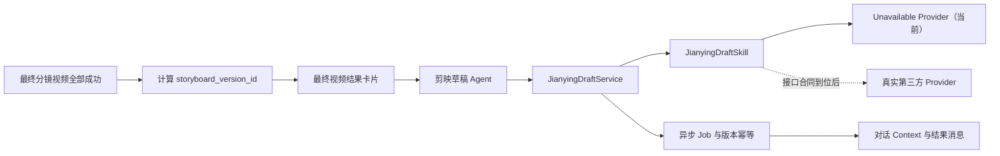

# PixelFlow 视频结果生成剪映草稿设计规格

## 1. 背景与目标

改造前，PixelFlow 视频主流程在全部分镜视频生成并合并成功后，只提供“无意见，结束”和“提出修改意见”。本次在最终视频确认阶段增加“生成剪映草稿”能力，让用户把当前版本的全部分镜视频转换为可在剪映专业版中继续编辑的草稿 ZIP。

本规格依据《Agent现有视频流程下载剪映草稿.docx》整理，并结合当前 PixelFlow 的异步 job、对话隔离、历史恢复和按钮锁定机制设计。

当前尚未取得真实剪映草稿第三方接口合同。本轮不虚构第三方 URL、鉴权、请求字段、响应字段或 ZIP 结构，而是完成稳定的 PixelFlow 内部流程和 Provider 适配边界。第三方接口到位后，只增加真实 Provider 映射和联调，不改写视频主流程。

## 2. 范围

### 2.1 本轮包含

- 最终视频结果卡片增加“生成剪映草稿”入口。
- 第三方能力未接入时，按钮展示但置灰，提示“剪映草稿服务待接入”。
- 定义 PixelFlow 内部剪映草稿 Agent、异步 job、状态 DTO 和 Skill 协议。
- 建立当前分镜版本标识、同版本幂等、旧版本隔离和对话状态恢复模型。
- 定义成功结果消息、下载、失败、重试、超时和地址过期行为。
- 使用 Fake Skill 验证成功、失败、超时和幂等流程。
- 更新 README、AGENTS 和最新 Agent 流程设计文档。

### 2.2 本轮不包含

- 不调用任何尚未提供的第三方接口。
- 不生成伪剪映草稿或普通占位 ZIP。
- 不实现剪映草稿在网页内预览或编辑。
- 不允许用户手工调整传入草稿服务的分镜顺序。
- 不为草稿自动添加转场、字幕、滤镜、音乐或裁剪规则。
- 不承诺剪映专业版真实打开验收；该验收在真实 Provider 接入后执行。

## 3. 核心原则

1. **当前视频版本是唯一输入**：只使用最终视频结果卡片中当前版本的成功分镜视频，不使用合并视频代替分镜列表。
2. **分镜独立可编辑**：Provider 必须把每个分镜作为独立片段按顺序放入主轨道。
3. **不传时间裁剪信息**：PixelFlow 内部只传分镜顺序和可访问的 HTTPS 视频地址，片段时长由未来 Provider 从视频文件读取。
4. **同版本幂等**：同一 `conversation_id + storyboard_version_id` 只允许存在一个有效生成任务。
5. **新版本不复用旧草稿**：任意分镜视频、顺序或成员发生变化都会形成新版本。
6. **任务归属不可变**：任务、消息和结果始终写回发起它们的原对话，切换对话不得串状态。
7. **下载不结束流程**：生成或下载剪映草稿不等于接受视频，也不自动结束 Agent 流程。
8. **Provider 差异隔离**：前端和视频主流程只依赖 PixelFlow 内部 DTO，不感知第三方字段。

## 4. 总体架构

Java 类比：

- `pixelflow_jianying_draft.py` 相当于 Controller。
- `JianyingDraftService` 相当于业务 Service，负责校验、幂等、状态转换和超时。
- `JianyingDraftSkill` 相当于第三方 Client 接口。
- `UnavailableJianyingDraftSkill` 和未来真实 Provider 相当于 Client 的不同实现。
- 前端 conversation context 相当于当前对话的持久化流程快照。

## 5. 后端组件

### 5.1 Router

新增独立路由模块，前缀固定为：

`/agent/flows/video/jianying-draft`

内部接口：

| 接口 | 作用 |
| --- | --- |
| `GET /capability` | 返回能力是否可用和不可用原因 |
| `POST /start` | 校验当前分镜版本并启动或复用任务 |
| `GET /jobs/{job_id}` | 查询异步任务状态和结果 |

当前 Provider 未配置时，`/capability` 返回 `available=false` 和用户可展示原因。前端据此禁用按钮，因此正常交互不会调用 `/start`。如果调用方绕过前端直接请求 `/start`，后端返回明确的 `not_configured` 业务状态，不创建空任务。

### 5.2 PixelFlow 内部请求合同

内部 DTO 表达 PixelFlow 业务含义，不等同于未来第三方字段：

- 对话标识。
- 当前视频任务标识。
- 当前分镜版本标识。
- 项目名称。
- 按顺序排列的当前有效分镜集合。
- 每个分镜只包含内部场景标识、顺序和服务端可访问的 HTTPS 视频地址。

第三方请求字段、鉴权和响应格式不在该 DTO 中泄漏，由真实 Provider 在接入时映射。

### 5.3 Skill 协议

`JianyingDraftSkill` 提供稳定能力：

- 查询 Provider 可用性。
- 启动草稿生成。

草稿 job 查询由 `JianyingDraftService` 的本地 registry 管理；当前 Protocol 不提供 Provider 侧任务查询或下载地址刷新能力。

统一返回 PixelFlow 结果：

- `status`
- `job_id`
- `provider_task_id`
- `conversation_id`
- `storyboard_version_id`
- `download_url`
- `file_name`
- `expire_at`
- `message`

`JianyingDraftResult` 只暴露上述 typed 字段，不提供无限制 `raw` 容器。Provider 原始响应与内部异常只可在服务端按安全日志规则处理，不能经 API 返回或展示给前端。

当前 `UnavailableJianyingDraftSkill` 只返回能力未配置，不进行 HTTP 请求。

### 5.4 Job 状态

内部状态统一为：

| 状态 | 含义 |
| --- | --- |
| `not_configured` | Provider 尚未接入 |
| `queued` | PixelFlow 已接收任务 |
| `running` | Provider 正在生成 |
| `succeeded` | 草稿 ZIP 已生成 |
| `failed` | 业务失败或重试耗尽 |
| `timeout` | 超过 30 分钟仍未完成 |

状态转换必须是单向的，终态任务不再回到 `running`。重试创建新 job，但继续使用同一个 `storyboard_version_id`，并把上一任务记录为被替代任务。

### 5.5 幂等与容量

- 幂等键：`conversation_id + storyboard_version_id`。
- 同一幂等键存在 `queued/running` 任务时，`/start` 返回原 job。
- 同一幂等键存在未过期的 `succeeded` 结果时，直接返回已有结果。
- 同一幂等键存在 `failed/timeout` 时，只有用户明确重试才创建新 job。
- Job 容量、清理策略和当前视频/PPT job 保持一致，避免无界增长。

## 6. 分镜版本模型

### 6.1 版本计算

`storyboard_version_id` 使用当前有效分镜的以下规范化数据计算稳定摘要：

- `scene_id`
- `scene_index`
- `video_url`
- 生成视频的 `task_id`

分镜先按 `scene_index` 升序排列，再序列化并计算摘要。相同输入始终得到相同版本 ID。

### 6.2 版本变化规则

以下任意变化都会产生新版本：

- 某个分镜重新生成并得到新视频地址或新任务标识。
- 分镜被新增或删除。
- 分镜顺序变化。
- 当前有效分镜集合变化。

旧版本草稿继续保留在历史消息中，但当前版本按钮不得复用旧版本下载地址。

### 6.3 历史兼容

旧对话中的视频结果没有显式版本 ID 时，前端在恢复消息后按同一规范计算版本。只要分镜数据不变，刷新前后版本保持稳定。

## 7. 前端交互

### 7.1 最终视频未结束

最终视频合并成功后，操作区为三个等宽按钮：

1. `无意见，结束`
2. `生成剪映草稿`
3. `提出修改意见`

按钮文字保持单行，移动端允许布局响应式换行，但单个按钮内文字不得换行或溢出。

### 7.2 Provider 未接入

- 草稿按钮始终可见但禁用。
- 悬停或聚焦提示：`剪映草稿服务待接入`。
- 不调用 `/start`。
- 不影响原有接受和修改逻辑。

### 7.3 Provider 启用后

按钮可用条件：

- 已进入最终合并视频确认阶段。
- 当前版本至少存在一个分镜视频。
- 当前版本全部分镜生成成功。
- 每个分镜都有后端可访问、非 Blob 且为 HTTPS 的视频地址。
- 当前没有草稿任务执行中。

不满足时按钮禁用，并优先显示可操作原因，如`请先完成全部分镜视频`。

### 7.4 生成中

- 按钮文案显示动态的`草稿生成中...`。
- 禁止重复点击。
- 当前结果卡片的“无意见，结束”“生成剪映草稿”“提出修改意见”三个按钮全部禁用。
- 前端每 2 秒查询 Python job，最长 30 分钟。
- 切换对话时轮询结果只写回原对话；返回原对话后继续显示任务状态。

### 7.5 生成成功

在原视频结果卡片之后追加独立结果消息：

- 标题：`剪映草稿已生成`
- 说明：`草稿已生成，可下载 ZIP 文件。下载后可在剪映专业版中继续编辑。`
- 操作：`下载剪映草稿`

成功后不自动下载。点击下载后提示`剪映草稿已开始下载`。结果消息保留在对话历史中，允许重复下载。

### 7.6 视频流程结束后

用户点击“无意见，结束”后：

- 原视频流程保持结束状态。
- 当前版本已有草稿时继续展示下载入口。
- 当前版本没有草稿且 Provider 可用时，仍展示可生成入口。
- Provider 未接入时，入口仍置灰并展示服务待接入提示。

## 8. 前端状态与对话持久化

`WorkspaceSnapshot` 增加：

- `pendingJianyingDraftJob` 与蛇形兼容字段。
- `jianyingDraftRecords`，按版本 ID 保存任务和下载结果。
- `jianying_draft_job_resume_error` 恢复错误。

当前 `storyboard_version_id` 按来源分镜即时重算，不作为独立快照字段持久化。

`ChatArtifact` 增加剪映草稿结果类型，保存：

- 来源视频消息 ID。
- 来源分镜版本 ID。
- job ID 和 Provider task ID。
- 状态、下载地址、文件名、过期时间和失败原因。

恢复规则：

- 对话加载时恢复 pending job；仍运行则继续轮询，不重复调用 `/start`。
- 已有成功结果则恢复下载卡片。
- job 404 或过期时，不自动重新创建；展示可重试状态。
- 所有引用都带 `conversation_id`，不得使用当前页面对话替代来源对话。

## 9. 校验规则

前后端都必须校验：

- 分镜集合不能为空。
- `scene_index` 必须是正整数且不能重复。
- 分镜必须按顺序规范化后提交。
- 每个分镜必须有 `scene_id` 和可访问的 HTTPS `video_url`。
- 不接受本地 Blob URL、分镜图片、封面图或合并视频 URL 代替分镜视频。
- 当前结果中有失败分镜、生成中分镜或缺失分镜时不得启动草稿任务。

前端校验用于及时反馈，后端校验是最终安全边界。

## 10. 失败、重试与下载地址

- 网络异常按项目既有重试策略最多重试 3 次。
- 明确的业务失败不做无意义自动重试。
- 失败和超时不影响已有分镜视频，不自动结束视频流程。
- 失败结果显示真实可公开原因，并提供重试当前草稿任务的入口。
- 下载失败不重新生成草稿，只保留结果并允许再次下载。
- 下载地址过期后的“刷新地址”或“重新生成”策略由未来第三方合同决定；在合同到位前只记录过期状态，不假设 Provider 能力。

## 11. PowerMem 与日志

- 路由在 `GET /jobs/{job_id}` 首次读取到 `succeeded`、`failed`、`timeout` 或 `not_configured` 终态时，以 claim 保证幂等后，异步记录 `category=experience`、`infer=False` 的业务摘要；停止轮询不会自行触发写入。
- `source_agent` 使用 `jianying_draft_agent`。
- 不记录用户 Authorization、第三方密钥、完整下载 URL 查询参数、ZIP 内容或完整异常堆栈。
- 日志至少包含安全的 job ID、对话 ID 摘要、版本 ID、分镜数量、状态和耗时。

## 12. 配置

新增剪映草稿能力配置，开发和生产默认关闭：

- `enabled=false`
- Provider 类型为 unavailable
- 轮询间隔 2 秒
- 总超时 30 分钟
- 网络重试 3 次

真实第三方接口到位后再增加 Provider 所需 URL、鉴权和专属参数；未提供的配置项不得提前写入代码或配置文件。

## 13. 测试方案

### 13.1 后端单元测试

- capability 在未配置时返回不可用。
- 未配置时 `/start` 不创建 job。
- 分镜排序和非法输入校验。
- 版本摘要稳定性和变化检测。
- 同版本 running/succeeded 幂等复用。
- failed/timeout 明确重试行为。
- Fake Skill 的 succeeded/failed/timeout 状态转换。
- job 结果只归属原 conversation。

### 13.2 前端测试

- 三按钮布局和文字不溢出。
- Provider 未接入时按钮可见、禁用并有提示。
- 分镜未完成时禁用原因正确。
- 生成中三个操作按钮被锁定。
- 成功后追加下载卡片且不自动下载。
- 同版本复用成功结果。
- 分镜变化后生成新版本且不复用旧草稿。
- 刷新、切换对话和返回原对话时正确恢复。
- 视频流程结束后仍保留生成或下载能力。

### 13.3 本轮集成验证

- 使用 Fake Skill 走通内部异步状态机。
- 验证未配置状态下前端不发起生成请求。
- 运行相关 Python 测试、TypeScript 检查和前端构建。

### 13.4 第三方接口到位后的验收

- 按真实接口合同实现 Provider 映射和鉴权。
- 验证真实任务创建、轮询、失败重试和下载地址过期。
- 下载 ZIP，并在服务端支持的剪映专业版中打开。
- 验证片段数量、顺序、完整时长、独立可编辑性和原始音轨。
- 更新第三方接口调用清单和本规格中的 Provider 实现说明。

## 14. 验收标准

1. 最终视频结果卡片正确展示第三个草稿按钮。
2. 当前 Provider 未接入时，按钮置灰并提示“剪映草稿服务待接入”，不会创建任务。
3. 内部 API、Skill、job、版本和状态恢复边界完整可测试。
4. 同一对话、同一分镜版本不会重复生成草稿。
5. 分镜视频发生变化后不会复用旧草稿。
6. 任务和消息严格写回来源对话。
7. 视频流程结束后仍保留草稿入口。
8. 第三方接口资料到位后，只需实现真实 Provider，不需要修改视频结果业务流程。
